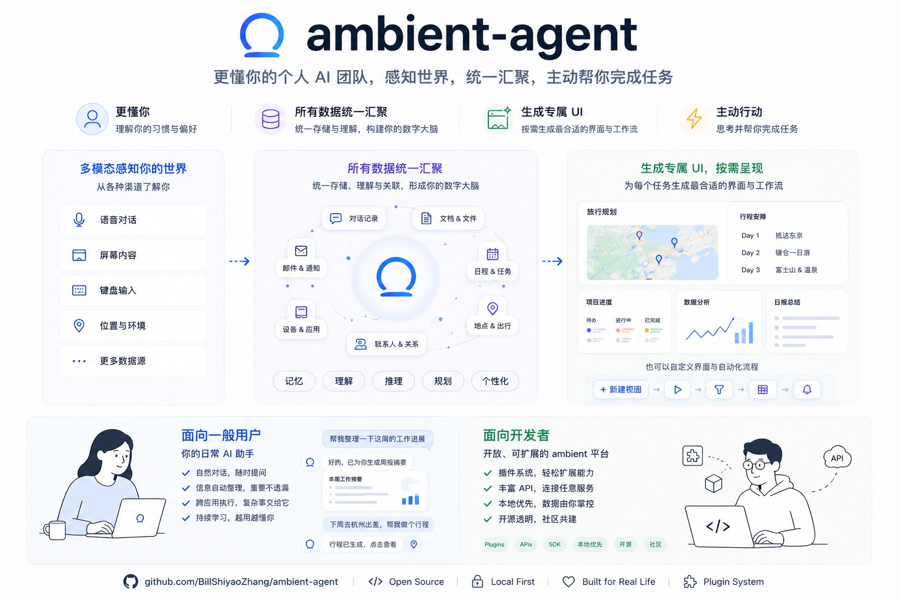
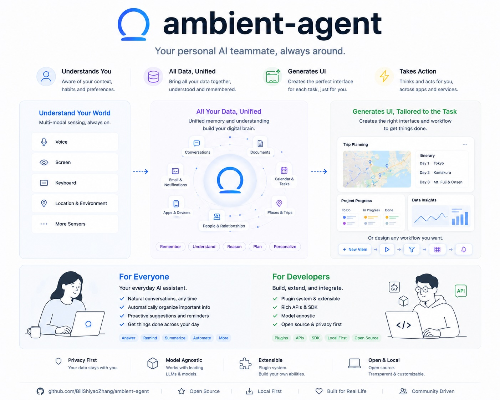

# Ambient Agent

[English](#english)



Ambient Agent 是一个开源、自托管、以应用工作区为核心的个人 AI 助理。它把对话、持久后台 Run、图数据和 React/HTM Widget 组织在同一个桌面式界面中。

## 核心能力

- 持久 Run：支持 checkpoint、用户确认、取消、重试、恢复和版本化事件流。
- App-first 工作区：应用中心、浮动/最大化/贴靠窗口、任务抽屉和浮层聊天。
- 动态 Widget：Manifest V2 + `controller.js`，先批准 schema 与 capability proposal，再 staging、校验并原子发布。
- Schema-first Graph：Widget 与 Agent 通过后端校验的 Graph API 共享 Task、Event、Note 及扩展数据。
- Provider Registry：在 UI 中配置本地或云端模型、默认/快速模型和会话覆盖。
- 可选 Coding Agent：可在前端按需安装、登录和选择 OpenCode（ACP）或 Codex，每个 Run 固定 Agent 与模型绑定并在隔离 staging 中生成代码。
- 最小能力授权：Widget 只获得 schema 对齐阶段批准的 Graph、Network、File 或 installed-capability grants，后端逐次执行默认拒绝 policy。
- 结构化 Agent 能力目录：按 Router、Converse、Schema、Coding、Verification 角色投影真实可用能力，避免 prompt 漂移。
- 后端权限与审计：Tool Gateway、MCP、Coding Agent、mutation interaction 和 LLM audit。

`SandboxWidget` 使用静态 verifier、最小 SDK membrane 与后端授权限制宿主 I/O；Controller 仍与宿主页同 realm 执行，因此这不是执行任意第三方 JavaScript 的通用强沙箱。

## 快速开始

```bash
cp .env.example .env
docker compose up --build
```

打开 `http://localhost:5173`，然后在“模型与 Provider”中添加连接、选择默认模型与 Coding Agent。`.env` 只保存 Coding Agent 等进程级参数；Provider 密钥保存在 Git 忽略的 `workspace/llm/secrets.json`。

如需使用 Codex，直接在“模型与 Provider”的 Coding Agent 卡片中点击“安装”，再通过设备码使用 ChatGPT 登录。CLI 与原生登录保存在专用 Docker volume 中，不需要宿主机 Bridge。

开发模式：

```bash
uv sync
npm --prefix frontend install
uv run uvicorn backend.main:app --reload --host 0.0.0.0 --port 8000
npm --prefix frontend run dev
```

完整说明见[中文文档](docs/guide/introduction.md)或 [English documentation](docs/en/guide/introduction.md)。

## 项目结构

```text
backend/          FastAPI、Agent durable workflow、Run、Graph、应用与集成
frontend/src/     React 工作区、应用中心、Widget 宿主和客户端服务
docs/             严格对应的中文与 docs/en/ 英文文档
scripts/          契约生成与 UML、文档、Widget 校验
tests/            Pytest 与 Vitest 测试
workspace/        本地运行数据（Git 忽略）
```

## 验证

```bash
uv run ruff check .
PYTHONPATH=. uv run pytest
uv run python scripts/verify_uml.py
uv run python scripts/verify_docs.py
npm --prefix frontend run lint
npm --prefix frontend run test
npm --prefix frontend run build
```

## English



Ambient Agent is an open-source, self-hosted personal AI assistant built around an app-first workspace. It combines chat, durable background Runs, graph data, and React/HTM Widgets in one desktop-style interface.

Key capabilities include durable Runs with confirmation and recovery, a windowed App Center workspace, staged Manifest V2 Widget publication, schema-first Graph data, user-approved least-authority Widget grants, a structured Agent capability catalog, UI-configured local or cloud LLM providers, selectable OpenCode/Codex coding backends, and backend enforcement for tools, MCP, mutations, and audit records.

`SandboxWidget` combines static verification, a least-authority SDK membrane, and backend I/O authorization. Controllers still execute in the host page realm, so this is not a general strong sandbox for arbitrary third-party JavaScript.

Start with:

```bash
cp .env.example .env
docker compose up --build
```

Open `http://localhost:5173`, add a connection in “Models & Providers,” and select a default model. See the [English documentation](docs/en/guide/introduction.md) for architecture, development, and security details.

OpenCode and Codex are available as Widget coding backends. Coding-agent CLIs are installed on demand into a managed Docker volume. Codex uses its own device-code ChatGPT login/subscription and never receives the Ambient Agent provider key or model binding; OpenCode can inherit the Ambient primary model or use a dedicated binding from the shared Provider Registry.

## License

[MIT](LICENSE)
