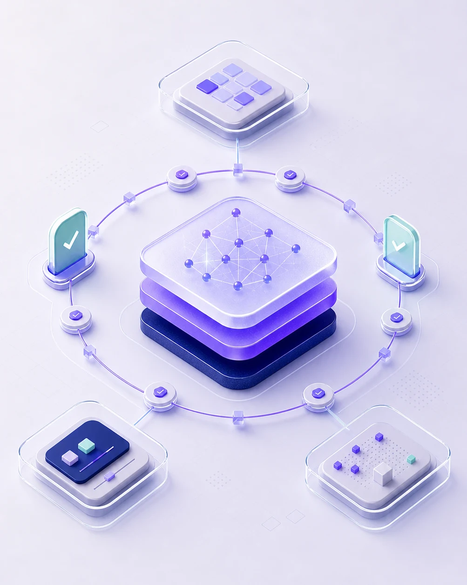
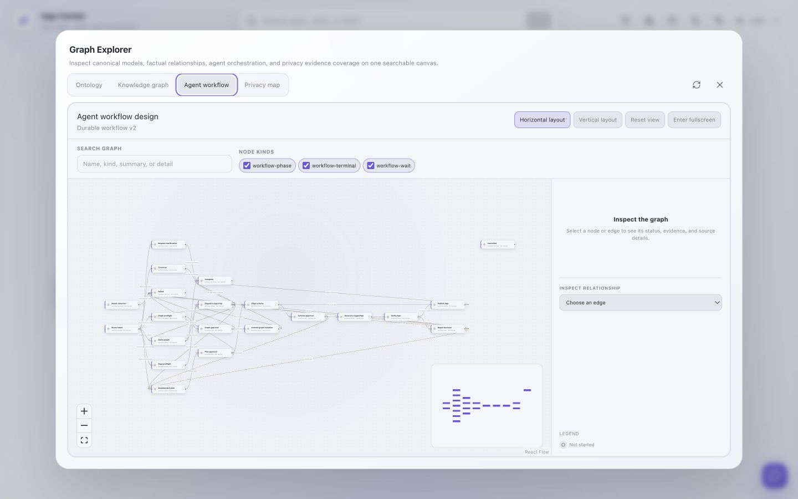

# Ambient Agent v0.1.0 Launch Kit

> 发布口径：公开 Alpha；面向单用户、可信本机的自托管部署。
>
> 核心受众：希望 AI 工作可恢复、可审批、可检查，并愿意自行选择模型与运行环境的开发者和高级个人用户。
>
> 项目地址：<https://github.com/BillShiyaoZhang/ambient-agent>

## 一句话定位 / One-line positioning

**中文**

Ambient Agent 是一个开源、自托管的个人 AI 工作区：它把需要持续运行的任务变成可恢复、可审批、可观察的 Run，并让基于 schema-first Graph 的任务专属 App 只在审批与验证后原子发布。

**English**

Ambient Agent is an open-source, self-hosted personal AI workspace that turns long-running work into recoverable, approval-aware, observable Runs and atomically publishes task-specific apps backed by a schema-first graph only after approval and verification.

**传播短句 / Tagline**

> 让 AI 工作活过一次对话。<br>
> AI work should outlive the chat.

## 中文宣发文案

### 短版

聊天不该是任务的终点。Ambient Agent v0.1.0 把请求变成可恢复的持久 Run，用 schema-first Graph 保存结构化上下文，并在用户批准权限、独立校验代码后原子发布任务专属 App。它开源、自托管，可连接兼容的本地或云端模型，Widget 生成可选 OpenCode 或 Codex。

### 中版

大多数 AI 助手把工作留在一条不断滚动的消息流里。Ambient Agent v0.1.0 把一次请求保存成真正的 Run：它有 checkpoint、用户确认、取消、重试和重启恢复；遇到无法确认的外部副作用，系统会停在 `needs_attention`，而不是把未知结果包装成成功或安全失败。

数据也不是散落在提示词里的“记忆”。Agent 与 Widget 通过经过本体和类型校验的 schema-first Graph 共享上下文。需要新界面时，Ambient Agent 先让用户确认计划、Schema 与最小能力范围，再在隔离 staging 中生成、校验，并原子发布任务专属 App；失败草稿不会覆盖已经发布的版本。

任务中心展示 Run 历史与执行图，图谱探索器覆盖 Ontology、Knowledge Graph、durable workflow 和隐私数据地图，Audit Log 则保留模型调用证据。模型由你选择：在 Provider Registry 中连接兼容的本地或云端 Provider，使用镜像内置的 OpenCode，或按需安装并登录 Codex。

v0.1.0 是面向单用户、可信本机的公开 Alpha。它不是一个“无条件自治”的黑盒，而是一套让 AI 工作更耐久、更可理解、也更容易约束的工作区。

### 长版

#### AI 助手真正困难的部分，发生在你按下发送之后

一次问答可以留在聊天窗口里，但真正的工作往往要等待、重试、请求确认，甚至跨过浏览器刷新和进程重启。Ambient Agent v0.1.0 的起点不是再做一个聊天框，而是把 AI 工作当作需要保存和检查的系统状态。

每个后台任务都成为一个持久 Run。Run、step、interaction、事件与 checkpoint 写入工作区；任务可以取消、重试，也能在服务重启后重新领取。执行中的外部副作用如果无法被可靠确认，系统不会假装一切正常，而是进入 `needs_attention`，把判断权交还给用户。任务中心既展示历史和结果，也能把 durable workflow 投影成执行图，让等待、成功、失败和返工路径都能被检查。

Ambient Agent 同样把数据契约放在生成之前。Agent 和 Widget 不靠彼此猜测 JSON，而是通过 schema-first Graph 共享经过本体与属性类型校验的上下文。Ontology、Knowledge Graph、Schema proposal 都有可视化入口；创建新实体、复用既有实体以及 Graph 读写范围，会在发布 App 之前对齐。

任务专属 App 也不是一段由模型直接塞进页面执行的代码。创建或修改 Widget 时，流程会先请求用户批准计划，再批准 Schema 与 capability contract。Coding Agent 只能在隔离 staging 中工作；Manifest、Controller、Schema 使用和能力范围经过独立校验后，已验证目录才会被原子提升。失败、取消或拒绝不会覆盖最后一个已发布 App，失败草稿可以在原 staging 上继续修复。

运行时遵循最小能力原则。Widget 只会得到获批的 Graph、Network、File 或 installed-capability grants，后端对每次操作重新授权。默认的 Controller 运行在独立 `widget-frame` 服务提供的 opaque-origin iframe 中，通过一次性 ticket 和 MessageChannel 与可信 Host 建立连接；这是一层浏览器隔离，不被宣传成 VM 级沙箱。

可观察性也不止一份日志。除了 Run 执行图，Ambient Agent 提供 LLM Audit Log 与隐私数据地图。数据地图明确区分 `observed`、`declared` 和 `unknown`：已经看到的流、Manifest 声明的潜在流，以及保留窗口或插桩范围之外的盲区不会被混为一谈。它帮助用户提问“哪些类别的数据可能或已经流向哪里”，但不会冒充完整合规结论。

模型和 Coding Agent 由用户选择。Provider Registry 支持在界面中配置兼容的本地或云端连接、默认模型、快速模型和会话覆盖。OpenCode 随 Backend 镜像提供，可继承 Ambient 的模型绑定；Codex 可按需安装，并使用独立的原生设备码登录。每个 Run 会冻结自己的模型与 Coding Agent 选择，方便回看当时实际使用的执行环境。

Ambient Agent v0.1.0 仍是一个公开 Alpha，目标是单用户、可信本机部署；Backend 还没有账号认证和多用户隔离，不应直接暴露到局域网或公网。它想验证的不是“AI 可以毫无约束地替你做一切”，而是另一条更务实的路线：让 AI 工作能够持续，让数据有 Schema，让 App 在获得权限和通过验证之后再运行，也让用户始终看得见系统正在做什么。

如果你也在寻找一个不止于聊天、又不愿牺牲控制感的个人 AI 工作区，欢迎试用 v0.1.0、阅读实现，并告诉我们哪些工作值得成为下一条 durable workflow。

## English launch copy

### Short

Chat should not be the end of the task. Ambient Agent v0.1.0 turns requests into recoverable durable Runs, keeps structured context in a schema-first graph, and atomically publishes task-specific apps only after capability approval and independent verification. It is open source, self-hosted, connects to compatible local or cloud models, and supports OpenCode or Codex for Widget generation.

### Medium

Most AI assistants leave work inside a scrolling message stream. Ambient Agent v0.1.0 persists each request as a real Run, with checkpoints, user confirmation, cancellation, retry, and restart recovery. When an external effect cannot be reconciled safely, the Run stops at `needs_attention` instead of presenting an unknown outcome as success or a clean failure.

Context is not just memory hidden in a prompt. Agents and Widgets share ontology- and type-validated data through a schema-first graph. When a task needs a new interface, Ambient Agent asks the user to approve the plan, Schema, and least-authority capability contract before code is generated in staging, independently verified, and atomically published. A failed draft does not replace the last published app.

The Task Center exposes Run history and execution graphs. Graph Explorer covers the ontology, knowledge graph, durable workflow, and privacy data map, while the Audit Log preserves model-call evidence. Bring a compatible local or cloud provider, use the OpenCode backend included in the image, or install and sign in to Codex on demand.

v0.1.0 is a public alpha for one user on a trusted local machine. It is not an “unconditionally autonomous” black box; it is a workspace designed to make AI work more durable, legible, and governable.

### Long

#### The hard part of an AI assistant begins after you press Send

A one-off answer can live in a chat window. Real work often has to wait, retry, request approval, and survive a browser refresh or process restart. Ambient Agent v0.1.0 starts from a different premise: AI work is system state worth preserving and inspecting, not just text in a stream.

Every background task becomes a durable Run. Runs, steps, interactions, events, and checkpoints are stored in the workspace. Work can be cancelled, retried, and reclaimed after a service restart. If an in-flight external effect cannot be reconciled with confidence, Ambient Agent does not pretend that everything is fine; it moves the Run to `needs_attention` and gives the decision back to the user. The Task Center combines history and results with an execution graph that makes waits, failures, terminal states, and rework loops inspectable.

Ambient Agent also puts the data contract before generation. Agents and Widgets share context through a schema-first graph rather than guessing each other’s JSON. Ontology entities and property types are validated by the backend. The ontology, knowledge graph, and Schema proposal all have visual views, so new entities, reused entities, and Graph access can be understood before an app is published.

A task-specific app is not model output pasted directly into a trusted page. A Widget create or update flow first asks the user to approve the plan, then the Schema and capability contract. The Coding Agent works only in isolated staging. Independent checks compare the Manifest, Controller, Schema use, and requested authority; only the validated directory is atomically promoted. Failure, cancellation, or denial does not overwrite the last published app, and a retained failed draft can be repaired in place.

Runtime access follows least authority. A Widget receives only the approved Graph, network, file, or installed-capability grants, and the backend reauthorizes every operation. By default, Controller code runs in an opaque-origin iframe served by a separate `widget-frame` service and connects to the trusted Host through a one-time ticket and MessageChannel. This is meaningful browser isolation, but it is deliberately not described as a VM-grade sandbox.

Observability goes beyond a single log. Ambient Agent includes Run execution graphs, an LLM Audit Log, and a privacy data map. The map keeps `observed`, `declared`, and `unknown` distinct: evidence seen in the retained window, potential flows declared by Manifests, and blind spots outside retention or instrumentation. It helps answer which categories of data may have, or did, flow where without claiming to be a complete compliance verdict.

You bring the models and choose the coding backend. The Provider Registry configures compatible local or cloud connections, default and fast models, and per-session overrides. OpenCode ships in the Backend image and can inherit Ambient’s model binding. Codex can be installed on demand and uses its own native device-code login. Each Run freezes its selected model and Coding Agent, preserving the execution context used for that piece of work.

Ambient Agent v0.1.0 is still a public alpha for a single user on a trusted local machine. The Backend does not yet provide account authentication or multi-user isolation and should not be exposed directly to a LAN or the public Internet. The release is not a claim that AI can do everything without supervision. It is an exploration of a more practical path: make the work durable, make the data explicit, let apps earn their authority, and keep the execution visible.

If that is the kind of personal AI workspace you want to help shape, try v0.1.0, inspect the implementation, and tell us which workflows should become durable next.

## GitHub Release intro

### English

**Release title**

Ambient Agent v0.1.0 — durable AI work, governed task apps

**Release body**

v0.1.0 is the first public alpha of Ambient Agent, an open-source, self-hosted personal AI workspace for work that needs to outlive a chat.

What makes this release different:

- **Durable Runs:** persisted steps, checkpoints, interactions, versioned events, cancellation, retry, restart recovery, and an explicit `needs_attention` state for uncertain effects.
- **Schema-first graph data:** Agents and Widgets share ontology-validated context instead of exchanging ad hoc payloads.
- **Task-specific apps that earn trust:** users approve the plan, Schema, and capability contract before staging; independent verification runs before atomic publication.
- **Least-authority runtime access:** Widget grants are explicit and every operation is reauthorized by the Backend.
- **Execution and privacy visibility:** inspect Run execution graphs, Ontology/KG views, LLM audit records, and a privacy map that separates observed, declared, and unknown flows.
- **Bring your model and coding backend:** configure compatible local or cloud providers in the UI; use the bundled OpenCode integration or install and sign in to Codex.

Start with Docker Compose:

```bash
git clone https://github.com/BillShiyaoZhang/ambient-agent.git
cd ambient-agent
cp .env.example .env
docker compose up --build
```

Then open <http://localhost:5173> and add a connection under **Models & Providers**.

This is an alpha for a single user on a trusted local machine. Published ports bind to loopback by default, but the Backend does not yet have account authentication or multi-user isolation. Do not expose it directly to a LAN or the public Internet. Whether data stays local depends on the providers, tools, MCP servers, and Widget network grants you configure; the browser Widget sandbox is not a VM.

We would especially value feedback on durable recovery, Schema approval, App verification, execution visibility, provider setup, and the first-run experience.

### 中文

**Release 标题**

Ambient Agent v0.1.0：让 AI 工作耐久，让任务 App 获得授权后再运行

**Release 正文**

v0.1.0 是 Ambient Agent 的第一个公开 Alpha。它是一个开源、自托管的个人 AI 工作区，面向那些不能只停留在一次对话里的工作。

这个版本的关键能力：

- **持久 Run：** 保存 step、checkpoint、interaction 和版本化事件，支持取消、重试、重启恢复；无法确认的副作用进入 `needs_attention`。
- **Schema-first Graph：** Agent 与 Widget 通过经过本体校验的数据契约共享上下文，而不是交换临时 JSON。
- **经治理的任务 App：** 用户先批准计划、Schema 与能力范围，代码再进入 staging；独立校验通过后才原子发布。
- **最小能力运行时：** Widget grant 显式可见，Backend 对每次操作重新授权。
- **执行与隐私可见性：** 可检查 Run 执行图、Ontology/KG、LLM Audit Log，以及区分已观察、已声明和未知流的隐私数据地图。
- **自带模型与 Coding Agent：** 在界面连接兼容的本地或云端 Provider，选择镜像内置的 OpenCode，或按需安装并登录 Codex。

使用 Docker Compose 启动：

```bash
git clone https://github.com/BillShiyaoZhang/ambient-agent.git
cd ambient-agent
cp .env.example .env
docker compose up --build
```

打开 <http://localhost:5173>，在 **模型与 Provider** 中添加第一个连接。

请注意：这是面向单用户、可信本机的 Alpha。默认发布端口只绑定 loopback，但 Backend 尚无账号认证与多用户隔离，请勿直接暴露到局域网或公网。数据是否离开本机取决于所配置的 Provider、工具、MCP 与 Widget 网络权限；浏览器 Widget sandbox 也不是 VM。

我们尤其期待关于 Run 恢复、Schema 审批、App 校验、执行可视化、Provider 配置和首次使用体验的反馈。

## 社媒文案

### X

Ambient Agent v0.1.0 is live: open-source, self-hosted AI work that outlives chat. Durable Runs, schema-first graphs, approval-gated task apps, execution/privacy views, and OpenCode or Codex.
<https://github.com/BillShiyaoZhang/ambient-agent>

### LinkedIn

The interesting part of an AI assistant is not the chat bubble. It is what happens after you press Send.

Today I’m releasing Ambient Agent v0.1.0, the first public alpha of an open-source, self-hosted personal AI workspace.

Ambient Agent treats work as durable state:

- Runs persist checkpoints, user interactions, retries, and recovery state.
- Agents and Widgets share a schema-first knowledge graph.
- A task-specific app is staged, independently verified, and atomically published only after its Schema and capabilities are approved.
- Least-authority grants are enforced by the Backend on every operation.
- Execution graphs, an LLM Audit Log, and a privacy data map make both progress and blind spots visible.
- You can connect compatible local or cloud models and choose OpenCode or Codex for Widget generation.

This release is intentionally honest about its boundary: it is an alpha for one user on a trusted local machine, not a multi-user service or a fully autonomous black box.

If you care about AI systems that can keep working without hiding how they work, I’d love your feedback on the first-run experience, recovery model, and task-specific App workflow.

<https://github.com/BillShiyaoZhang/ambient-agent>

### 中文社区

**标题：我做了一个不只会聊天的个人 AI 工作区：Ambient Agent v0.1.0**

很多 AI 助手在 Demo 里很聪明，但一旦任务需要等待确认、重试、跨过浏览器刷新，或者真的生成一个可反复使用的界面，就又退回成一条消息流。

Ambient Agent 想试另一条路：把每次工作保存成 durable Run，把上下文放进有 Schema 的知识图谱；如果任务需要新界面，就先让用户确认数据结构与最小权限，再由 OpenCode 或 Codex 在 staging 里生成，经独立校验后原子发布成任务专属 App。

v0.1.0 里还可以直接看到 Run 的执行图、Ontology/KG、模型调用审计，以及区分“已观察 / 已声明 / 未知”的隐私数据地图。我很在意最后这一点：没有证据不应该被画成“没有数据流”，不确定的外部副作用也不应该被包装成成功。

它目前是面向单用户、可信本机的开源 Alpha，不是多用户 SaaS，也不承诺完全离线或无条件自治。你可以自己连接兼容的本地或云端模型，OpenCode 已包含在镜像中，Codex 可以按需安装并使用独立登录。

如果你也对“耐久、可审批、可观察”的个人 Agent 感兴趣，欢迎试用，也很想听听你最希望哪类任务不再被困在聊天框里：

<https://github.com/BillShiyaoZhang/ambient-agent>

## 标题备选

1. **Ambient Agent v0.1.0：让 AI 工作活过一次对话**<br>
   **Ambient Agent v0.1.0: AI Work That Outlives the Chat**
2. **先对齐 Schema 与权限，再让 AI 生成任务 App**<br>
   **Approve the Contract, Then Build the App**
3. **从消息流到持久 Run：一个可恢复、可检查的个人 AI 工作区**<br>
   **From Message Streams to Durable Runs**
4. **任务会恢复，App 要获批，执行看得见**<br>
   **Recoverable Runs, Governed Apps, Visible Execution**
5. **带着你的模型来：OpenCode、Codex 与 Schema-first Graph**<br>
   **Bring Your Models: OpenCode, Codex, and a Schema-first Graph**

## 配图 caption 与 alt text

### 1. 发布主视觉

资产：[ambient-agent-v0.1-hero.webp](docs/assets/ambient-agent-v0.1-hero.webp)（1672 × 941，横版）


**中文 caption**

Ambient Agent 把 durable Run 的检查点、schema-first Graph 与经批准的任务 App 连接在同一个工作区中。（概念主视觉）

**English caption**

Ambient Agent connects durable Run checkpoints, a schema-first graph, and approved task apps in one workspace. (Concept artwork.)

**中文 alt**

浅色紫蓝等距插画：中央知识图谱层连接左侧检查点流程和右侧三个任务应用面板。

**English alt**

Light violet isometric illustration with a central graph layer linking checkpoint nodes on the left to three task-app panels on the right.

### 2. 4:5 社媒主视觉

资产：[ambient-agent-v0.1-social.webp](docs/assets/ambient-agent-v0.1-social.webp)（1003 × 1254，约 4:5）



**中文 caption**

工作不是一次模型回复，而是一条可以检查、批准和恢复的路径。（概念主视觉）

**English caption**

Work is not a single model response. It is a path that can be inspected, approved, and recovered. (Concept artwork.)

**中文 alt**

浅色紫蓝竖版等距插画：中央图谱层被检查点环绕，并连接上方 App 网格与下方两个数据面板。

**English alt**

Vertical violet isometric illustration with a central graph layer encircled by checkpoints and linked to an app grid and two data panels.

### 3. 真实 Graph Explorer / Durable Workflow 截图

资产：[ambient-agent-v0.1-workflow-ui.png](docs/assets/ambient-agent-v0.1-workflow-ui.png)（1440 × 900，真实 release UI）



**中文 caption**

Durable workflow 不是藏在后台的实现细节：阶段、等待、分支和终态都能在同一张可搜索、可缩放的执行设计图里检查。

**English caption**

The durable workflow is not a hidden implementation detail: phases, waits, branches, and terminal states remain inspectable on one searchable, zoomable graph.

**中文 alt**

Ambient Agent 的 Graph Explorer 打开 Agent workflow 标签页，画布展示 Durable workflow v2 的阶段、等待节点、终态和有向连接，右侧是详情面板。

**English alt**

Ambient Agent Graph Explorer on the Agent workflow tab, showing Durable workflow v2 phases, wait nodes, terminal states, directed edges, and a details panel.

### 4. App Center 与首次配置

**建议画面**

使用干净的 v0.1.0 工作区，展示 App Center 空状态与“模型与 Provider”自动引导；不要放入真实密钥、Endpoint 或私人会话。

**中文 caption**

从空工作区开始：连接自己的 Provider，再让对话、后台 Run 与任务 App 进入同一个桌面式工作区。

**English caption**

Start from an empty workspace: connect your provider, then bring chat, background Runs, and task apps into one desktop-style space.

**中文 alt**

Ambient Agent 中文界面，App Center 显示空状态，并提供前往“模型与 Provider”的配置入口。

**English alt**

Ambient Agent workspace with an empty App Center and a prompt to configure Models & Providers.

### 5. Task Center 执行图

**建议画面**

选择一条无敏感内容的示例 Run，同时展示历史列表、当前状态、结果区域和 Execution graph。

**中文 caption**

Run 不只留下最终答案：checkpoint、等待、失败与返工路径都可以在任务中心检查。

**English caption**

A Run leaves more than a final answer: checkpoints, waits, failures, and rework paths remain inspectable in the Task Center.

**中文 alt**

任务中心左侧列出 Run 历史，右侧执行图用节点和有向边展示各阶段状态。

**English alt**

Task Center with Run history on the left and a directed execution graph showing workflow phase status on the right.

### 6. Graph Explorer 四场景

**建议画面**

使用四宫格或短视频依次展示 Ontology、Knowledge Graph、Durable Workflow 与 Privacy map；每个场景都保留标题和 legend。

**中文 caption**

一个图形工作台，四种可检查视角：数据契约、上下文事实、任务执行和隐私数据流。

**English caption**

One graph workbench, four inspectable views: data contracts, context facts, task execution, and privacy data flows.

**中文 alt**

四张 Ambient Agent 图视图并列，分别展示 Ontology、Knowledge Graph、durable workflow 和隐私数据地图。

**English alt**

Four Ambient Agent graph views shown together: ontology, knowledge graph, durable workflow, and privacy data map.

### 7. Audit Log 与隐私数据地图

**建议画面**

使用合成测试数据，确保 prompt、response、凭据和私人 record 不进入公开截图；地图需同时出现“已观察”“已声明”“未知”legend。

**中文 caption**

把证据、声明与盲区分开：隐私数据地图显示哪些类别的数据可能或已经流向哪里。

**English caption**

Separate evidence, declarations, and blind spots: the privacy data map shows where data categories may have, or did, flow.

**中文 alt**

隐私数据地图以不同状态的有向边连接本地数据类别与 Provider 或 capability，并标出已观察、已声明和未知。

**English alt**

Privacy data map linking local data categories to providers or capabilities with distinct observed, declared, and unknown edges.

### 8. Models & Providers / Coding Agents

**建议画面**

使用无凭据的测试 Provider，展示默认/快速模型选择，以及 OpenCode 已安装、Codex 可按需安装和登录的状态。

**中文 caption**

模型由你选择，Coding Agent 也由你选择：连接兼容 Provider，在 OpenCode 与 Codex 之间按 Run 固定执行环境。

**English caption**

Choose the models and the coding backend: connect a compatible provider and freeze OpenCode or Codex as part of each Run’s execution context.

**中文 alt**

模型与 Provider 对话框显示 Provider 配置、默认和快速模型，以及 OpenCode 和 Codex 两张 Coding Agent 卡片。

**English alt**

Models & Providers dialog showing provider settings, default and fast model selectors, and OpenCode and Codex coding-agent cards.

### 不应继续使用的旧图

不要把仓库根目录的 `ambient-agent.jpg` 或 `ambient-agent-en.jpg` 用于 v0.1.0 发布。它们展示或暗示了本版本没有实现的语音、屏幕感知、键盘感知、位置/环境传感器、邮件、日历、通知、自动提醒、跨应用主动执行、“所有数据统一汇聚”和完整个人画像等能力。发布主视觉应使用上面的 v0.1.0 资产，产品截图则必须来自实际 release build。

## 禁用表述清单

| 不要这样说 | 原因 | 可替换为 |
| --- | --- | --- |
| “全天候感知你”“always aware”“ambient sensing” | v0.1.0 没有语音、屏幕、键盘、位置或环境传感器采集链路。 | “在一个工作区中组织对话、Run、Graph 与任务 App。” |
| “主动替你完成一切”“fully autonomous”“zero supervision” | 有副作用的路径受 policy、interaction、审批和 `needs_attention` 约束。 | “让后台任务持续运行，并在需要时请求确认。” |
| “自动提醒”“自动整理邮件/日历”“跨应用执行” | 当前版本没有对应的产品化连接与自动触发承诺。 | 只描述已经安装并实际授权的 MCP、capability 或 task-specific App。 |
| “所有数据都在本地”“永不上传”“完全离线” | 云 Provider、MCP、工具和获批的 Widget 网络访问会产生外部通信。 | “自托管；数据流向取决于你配置的 Provider、工具和 grants。” |
| “隐私绝对安全”“零数据泄露”“合规已保证” | Audit 与数据地图有保留窗口、插桩范围和明确盲区。 | “提供 LLM 审计与区分 observed / declared / unknown 的隐私数据地图。” |
| “VM 级沙箱”“无法逃逸”“untrusted code is safe” | 默认 Widget 使用 opaque-origin 浏览器 iframe；浏览器 sandbox 不是 VM。 | “Controller 与 Host DOM/存储隔离，能力操作由 Backend 逐次授权。” |
| “任意模型”“支持所有模型”“model agnostic” | 只支持兼容的 Provider/模型；Agent 路径通常需要可靠的工具调用能力。 | “Bring your own compatible local or cloud model/provider.” |
| “Codex 使用 Ambient 的模型/API Key” | Codex 使用独立的原生登录与模型上下文。 | “Codex 按需安装并使用自己的设备码登录；OpenCode 可使用 Provider Registry 绑定。” |
| “AI 直接生成并运行任意 App”“instant production app” | App 需要计划、Schema/capability 审批、staging 和验证，生成也可能失败。 | “生成任务专属 App，并在审批和校验通过后发布。” |
| “系统绝不会丢任务”“exactly once” | Run 有耐久恢复与 fencing，但未知外部副作用会进入 `needs_attention`。 | “持久 checkpoint、重试与重启恢复；不确定效果会显式停下等待处理。” |
| “整个工作流原子执行” | 原子性适用于 step 提交、Schema transaction 和已验证 App 的目录提升，不适用于任意外部系统。 | “已验证 App 原子发布；Run 对外部效果保留显式恢复语义。” |
| “完整记录所有数据流”“完全可观察” | 数据地图只覆盖保留窗口和已插桩阶段。 | “显示已观察、已声明与未知流，并公开覆盖范围和盲区。” |
| “多用户协作”“多设备无缝同步”“team workspace” | v0.1.0 没有用户身份、设备配对、多用户隔离或冲突合并协议。 | “面向单用户、可信本机的个人 AI 工作区。” |
| “可安全暴露公网”“开箱即用的 SaaS” | Backend 没有账号认证；默认 Compose 仅通过 loopback 降低暴露面。 | “自托管在可信本机；不要直接暴露到 LAN 或公网。” |
| “生产就绪”“企业级稳定性” | `0.1.0` 的项目分类和发布目标是公开 Alpha。 | “第一个公开 Alpha，欢迎早期试用与反馈。” |
| “数字大脑”“完全理解你的习惯与偏好” | 当前 Graph 保存显式、经过 Schema 校验的上下文事实，不代表完整个人理解。 | “用 schema-first Graph 管理 Agent 与 Widget 共享的结构化上下文。” |

## 事实依据与发布校验

以下清单用于审稿，不需要整段复制到公开帖子。

| 宣发事实 | 代码与测试依据 |
| --- | --- |
| Run 持久化、checkpoint、interaction、取消、重试、lease fencing、重启恢复与 `needs_attention` | [`backend/run_service.py`](backend/run_service.py)、[`backend/agent/durable_workflow.py`](backend/agent/durable_workflow.py)、[`tests/backend/test_run_service.py`](tests/backend/test_run_service.py)、[`tests/backend/test_durable_crash_matrix.py`](tests/backend/test_durable_crash_matrix.py) |
| Schema-first Graph、本体与属性类型校验、Schema proposal 原子应用 | [`backend/ontology.py`](backend/ontology.py)、[`backend/graph_db.py`](backend/graph_db.py)、[`backend/schema_alignment.py`](backend/schema_alignment.py)、[`backend/schema_verification.py`](backend/schema_verification.py)、[`tests/backend/test_ontology.py`](tests/backend/test_ontology.py) |
| Widget 先审批 contract，再 staging、验证与原子 promotion；失败不覆盖 live App | [`backend/agent/durable_workflow.py`](backend/agent/durable_workflow.py)、[`backend/coding_agent_acp.py`](backend/coding_agent_acp.py)、[`backend/app_manifest.py`](backend/app_manifest.py)、[`tests/backend/test_rework_loops.py`](tests/backend/test_rework_loops.py) |
| 最小 grants、Backend 逐次授权、一次性 runtime ticket 与 opaque-origin iframe | [`backend/capabilities/policy.py`](backend/capabilities/policy.py)、[`backend/client_widget_runtime.py`](backend/client_widget_runtime.py)、[`frontend/src/components/IsolatedSandboxWidget.tsx`](frontend/src/components/IsolatedSandboxWidget.tsx)、[`tests/backend/test_capability_policy.py`](tests/backend/test_capability_policy.py) |
| Run 执行图、Ontology/KG、Privacy map、Audit Log | [`backend/graph_visualization.py`](backend/graph_visualization.py)、[`frontend/src/lib/graphScenes.ts`](frontend/src/lib/graphScenes.ts)、[`frontend/src/components/TaskDrawer.tsx`](frontend/src/components/TaskDrawer.tsx)、[`frontend/src/components/AuditLogPanel.tsx`](frontend/src/components/AuditLogPanel.tsx) |
| Provider Registry、默认/快速/会话模型、OpenCode shared binding、Codex 原生登录 | [`backend/llm_config.py`](backend/llm_config.py)、[`backend/coding_agent_runtime.py`](backend/coding_agent_runtime.py)、[`frontend/src/components/LLMSettings.tsx`](frontend/src/components/LLMSettings.tsx)、[`tests/backend/test_llm_config.py`](tests/backend/test_llm_config.py) |
| 单用户可信本机边界、Compose 端口 loopback、无账号认证 | [`docker-compose.yml`](docker-compose.yml)、[`backend/main.py`](backend/main.py) |

本次 v0.1.0 发布审计还在隔离 SQLite 工作区中实测了下列用户路径：

- App Center 首屏与空状态；
- 未配置 Provider 时的自动引导和聊天失败反馈；
- bundled Daily Planning Skill 的安装，以及 digest、license、provenance 详情；
- Graph Explorer 的 Ontology、Knowledge Graph、durable workflow、privacy map 四个场景；
- Task Center 历史、单 Run 详情与 Execution graph；
- Audit Log 与 Privacy data map；
- 中文/英文切换与移动端布局。

所有公开文案都应同时满足代码事实、自动化测试与上述实际界面检查；文档只能作为交叉验证来源，不能覆盖实现中已经暴露的边界。
