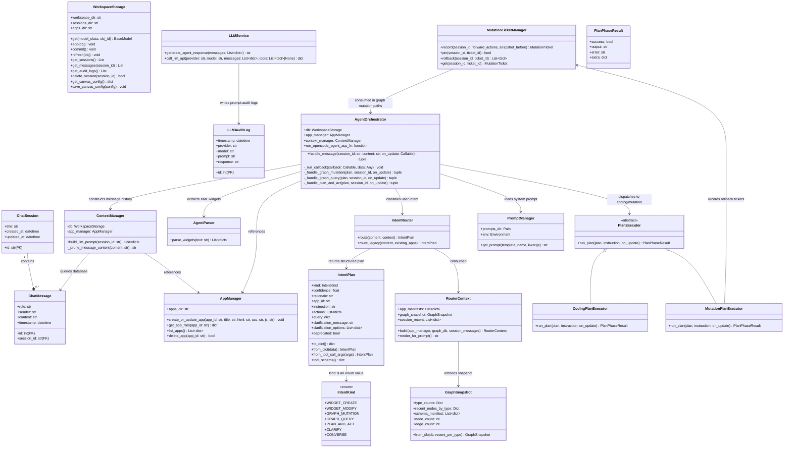

# Ambient Agent Backend UML & Architecture

本项目后端使用 FastAPI + SQLModel (SQLite) 构建，支持多端 WebSocket 实时同步，并集成了动态沙箱 Widget 管理和 LLM 传输审计。

## 1. 后端类图 (Class Diagram)

## 2. 核心模块说明

### 2.1 数据库实体层 (`models.py`)
*   **ChatSession**: 管理多端用户会话。
*   **ChatMessage**: 存储对话历史，支持 `user`, `agent`, `code`, `system` 等不同角色的消息归档。
*   **LLMAuditLog**: 记录发送给 LLM 接口的原始 Payload 与响应，供审计面板展示。

### 2.2 服务与逻辑控制层
*   **AppManager (`app_manager.py`)**: 管理动态生成的小程序（Widget）。负责 Widget 代码文件在磁盘的读写、数据状态存储及文件路径寻址。
*   **ContextManager (`context_manager.py`)**: 负责将数据库中的对话上下文整合为 LLM 兼容的 Prompt。此层会自动剔除冗余代码段并动态注入当前运行中应用的最新源码，在控制 Token 大小的同时给 LLM 提供充分的运行环境上下文。
*   **AgentParser (`agent_parser.py`)**: 负责用正则表达式和 XML 解析器解析 LLM 返回文本流中携带的 `<ambient-widget>` 语法块，提取 HTML、CSS 和 JS 内容。
*   **LLMService (`llm_service.py`)**: 提供统一的大模型请求接口（支持本地 Ollama 与 OpenAI/MiniMax 兼容接口），并自动将请求原始数据记录至 `LLMAuditLog` 审计数据库。
*   **RouterContext (`router_context.py`)**: 收集路由所需的轻量级上下文：已存在的 widgets、Graph 类型与节点摘要、近期对话。供 IntentRouter 在调用 LLM 时一并注入。
*   **GraphSnapshot**: RouterContext 嵌入的图状态摘要，用于让 LLM 意识到现有数据，避免重复创建。
*   **IntentPlan / IntentKind (`agent/intent_plan.py`)**: 用 `classify_intent` function-calling 协议引导 LLM 返回的结构化输出。是 `IntentRouter` 与 `AgentOrchestrator` 之间的契约。
*   **IntentRouter (`agent/router.py`)**: 根据消息内容与 RouterContext 产出 IntentPlan。优先用 LLM function-calling，失败时降级为正则+回退到 `converse`，同时收尾处会做 widget_modify 重名检测，必要时降级为 clarify。
*   **PlanExecutor / CodingPlanExecutor / MutationPlanExecutor (`agent/plan_executor.py`)**: 把"计划-审批-执行-校验"流水线抽象为策略类。`CodingPlanExecutor` 包装原有 widget 流；`MutationPlanExecutor` 在用户审批后批量执行 graph_mutation，并把每次调用登记为一个可撤销的 mutation ticket。
*   **MutationTicketManager (`mutation_tickets.py`)**: 为每次 graph_mutation 提供 60s 软默认 + 用户可星标为永久的撤销窗口。撤销逻辑使用 graph 数据库层新增的 `graph_mutation_history` 表。

### 2.3 实时多端同步层 (`main.py` WebSocket)
*   通过长连接管理不同的 Session 连接。
*   一端发送消息时，服务端接收并广播给同一 `session_id` 的所有客户端，实现多端画布、对话气泡的强实时一致性同步。
