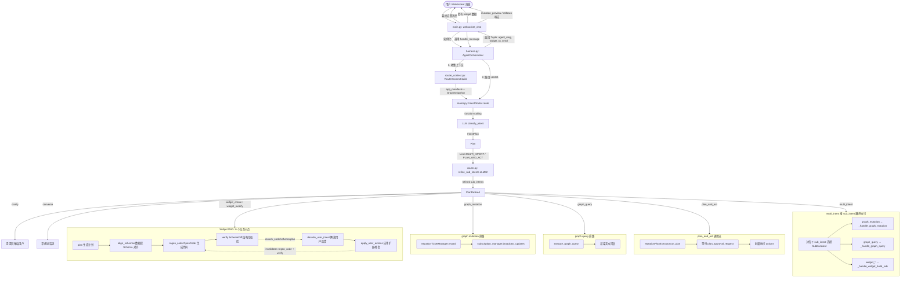

# Agent Harness 架构与执行流程

本文档介绍了 `backend/agent/` 目录下重构后的 Agent Harness 框架的设计与执行序列。

## 1. 组件关系图

Agent Harness 实现了执行流、意图路由、上下文组装以及大模型通信之间的解耦。以下是各组件之间的关系：

```mermaid
classDiagram
    class WorkspaceStorage {
        +workspace_dir: str
        +get(model_class, obj_id) BaseModel
        +add(obj) void
        +commit() void
        +refresh(obj) void
        +get_sessions() List
        +get_messages(session_id) List
        +get_audit_logs() List
        +delete_session(session_id) bool
        +get_canvas_config() dict
        +save_canvas_config(config) void
    }

    class AgentOrchestrator {
        +db: WorkspaceStorage
        +app_manager: AppManager
        +context_manager: ContextManager
        +run_opencode_agent_acp_fn: Callable
        +handle_message(session_id, content, on_update) Tuple
        -_classify_intent(content) IntentPlan
        -_handle_widget_build(plan, session_id, on_update) Tuple
        -_handle_widget_build_sub(plan, session_id, on_update, ...) Tuple
        -_handle_graph_mutation(plan, session_id, on_update) Tuple
        -_handle_graph_query(plan, session_id, on_update) Tuple
        -_handle_plan_and_act(plan, session_id, on_update) Tuple
        -_handle_multi_intent(plan, session_id, on_update) Tuple
        -_handle_converse(plan, session_id, content, on_update) Tuple
    }

    class IntentPlan {
        +kind: IntentKind
        +confidence: float
        +rationale: str
        +app_id: str
        +instruction: str
        +actions: List~dict~
        +query: dict
        +sub_intents: List~SubIntent~
        +clarification_message: str
        +clarification_options: List~dict~
        +deprecated: bool
        +to_dict() dict
        +from_dict(data) IntentPlan
        +from_tool_call_args(args) IntentPlan
        +tool_schema() dict
    }

    class SubIntent {
        +kind: SubIntentKind
        +app_id: str
        +instruction: str
        +actions: List~dict~
        +query: dict
        +extend_schema_props: dict
        +feedback: str
        +to_dict() dict
        +from_dict(data) SubIntent
    }

    class IntentKind {
        <<enum>>
        +WIDGET_CREATE
        +WIDGET_MODIFY
        +GRAPH_MUTATION
        +GRAPH_QUERY
        +PLAN_AND_ACT
        +MULTI_INTENT
        +CLARIFY
        +CONVERSE
    }

    class SubIntentKind {
        <<enum>>
        +GRAPH_MUTATION
        +GRAPH_QUERY
        +WIDGET_CREATE
        +WIDGET_MODIFY
        +WIDGET_EXTEND_SCHEMA
        +WIDGET_FIX_CODE
        +WIDGET_REWRITE
    }

    class RouterContext {
        +app_manifests: List~dict~
        +graph_snapshot: GraphSnapshot
        +session_recent: List~dict~
        +build(app_manager, graph_db, session_messages) RouterContext
        +render_for_prompt() str
    }

    class GraphSnapshot {
        +type_counts: Dict
        +recent_nodes_by_type: Dict
        +schema_manifest: List~dict~
        +node_count: int
        +edge_count: int
        +from_db(db, recent_per_type) GraphSnapshot
    }

    class IntentRouter {
        +route(content, context) IntentPlan
        +route_legacy(content, existing_apps) IntentPlan
        +refine_sub_intents(plan, context) IntentPlan
    }

    class WidgetDAG {
        +_nodes: Dict~str, TaskNode~
        +_order: List~str~
        +_dirty: Set~str~
        +register(node) void
        +dirty(*names) void
        +idle() bool
        +pending() List~str~
        +step(ctx) TaskResult
    }

    class TaskNode {
        +name: str
        +run: Callable
        +needs_outputs_from: Set~str~
        +invalidates: Set~str~
    }

    class TaskResult {
        +success: bool
        +outputs: dict
        +error: str
        +ask_user: dict
        +invalidates_if_redo: Set~str~
    }

    class VerificationDiff {
        +unknown_props: List~UnknownProperty~
        +type_mismatches: List~TypeMismatch~
        +unknown_types: List~UnknownType~
        +is_clean: bool
        +to_markdown() str
        +to_per_field_payload() List~dict~
    }

    class SchemaVerificationService {
        +diff(app_id, widget_code, schemas) VerificationDiff
        +verify(app_id, widget_code, schemas) str
    }

    class MutationTicketManager {
        +record(session_id, forward_actions, snapshot_before) MutationTicket
        +pin(session_id, ticket_id) bool
        +rollback(session_id, ticket_id) List~dict~
        +get(session_id, ticket_id) MutationTicket
    }

    class PlanExecutor {
        <<abstract>>
        +run_plan(plan, instruction, on_update) PlanPhaseResult
    }

    class CodingPlanExecutor {
        +run_plan(plan, instruction, on_update) PlanPhaseResult
    }

    class MutationPlanExecutor {
        +run_plan(plan, instruction, on_update) PlanPhaseResult
    }
    class PlanPhaseResult {
        +success: bool
        +output: str
        +error: str
        +extra: dict
    }

    class AgentOrchestrator {
        +db: WorkspaceStorage
        +app_manager: AppManager
        +context_manager: ContextManager
        +run_opencode_agent_acp_fn: function
        +handle_message(session_id: str, content: str, on_update: Callable) tuple
        -_run_callback(callback: Callable, data: Any) void
        -_handle_graph_mutation(plan, session_id, on_update) tuple
        -_handle_graph_query(plan, session_id, on_update) tuple
        -_handle_plan_and_act(plan, session_id, on_update) tuple
        -_handle_multi_intent(plan, session_id, on_update) tuple
        -_handle_converse(plan, session_id, content, on_update) tuple
        -_handle_widget_build(plan, session_id, on_update) tuple
    }

    class AppManager {
        +list_apps() List
        +get_app_files(app_id) Dict
        +create_or_update_app(app_id, title, html, css, js, kwargs) void
    }

    class PromptManager {
        +prompts_dir: Path
        +env: Environment
        +get_prompt(template_name, kwargs) str
    }

    ChatSession "1" --* "0..*" ChatMessage : contains
    ContextManager --> AppManager : references
    ContextManager --> ChatMessage : queries database
    AgentOrchestrator --> ContextManager : constructs message history
    AgentOrchestrator --> AppManager : references
    AgentOrchestrator --> AgentParser : extracts XML widgets
    AgentOrchestrator --> PromptManager : loads system prompt
    AgentOrchestrator --> IntentRouter : classifies user intent (LLM #1)
    AgentOrchestrator --> IntentRouter : refines sub_intents (LLM #2)
    AgentOrchestrator --> PlanExecutor : dispatches to coding/mutation
    AgentOrchestrator --> WidgetDAG : widget build pipeline
    IntentRouter --> IntentPlan : returns structured plan
    IntentRouter --> RouterContext : consumed
    IntentPlan --> SubIntent : 0..* sub_intents
    SubIntent --> SubIntentKind : kind enum
    IntentPlan --> IntentKind : kind enum
    RouterContext --> GraphSnapshot : embeds snapshot
    IntentPlan --> IntentKind : kind is an enum value
    PlanExecutor <|-- CodingPlanExecutor
    PlanExecutor <|-- MutationPlanExecutor
    MutationPlanExecutor --> MutationTicketManager : records rollback tickets
    MutationTicketManager --> AgentOrchestrator : consumed in graph mutation paths
    WidgetDAG --> TaskNode : 0..* nodes
    TaskNode --> TaskResult : runs produce results
    AgentOrchestrator --> SchemaVerificationService : structured diff (Direction A)
    SchemaVerificationService --> VerificationDiff : returns
    LLMService --> LLMAuditLog : writes prompt audit logs
```

---

## 2. 消息执行逻辑流程图

下面的流程图展示了 `AgentOrchestrator.handle_message()` 在处理来自 WebSocket 的新消息时的详细执行顺序：

---

## 3. 关键变更（与之前版本对比）

### Direction A：结构化 Schema Diff

`backend/schema_verification.py` 的 `verify()` 旧接口现在通过 `diff()` 提供
**结构化输出**：`VerificationDiff` 对象，列出
`unknown_props[]` / `type_mismatches[]` / `unknown_types[]`。

前端可以基于 `VerificationDiff.to_per_field_payload()` 渲染 per-field
checkbox 列表，让用户逐字段确认是否要扩展 Schema。

### Direction B：Widget DAG 运行时

替换了 `while current_state != "done"` 状态机，引入 `WidgetDAG`（在
`backend/agent/dag.py`），6 个任务节点：

| 节点                 | 作用                                                      |
| -------------------- | --------------------------------------------------------- |
| `plan`               | 调 `PlanGenerationService` 生成计划，问用户审批           |
| `align_schemas`      | 调 `SchemaAlignmentService` 对齐数据库 schema，问用户审批 |
| `regen_code`         | 调 `run_opencode_agent_acp` 生成代码                      |
| `verify`             | 调 `SchemaVerificationService.diff` 结构化校验            |
| `decode_user_intent` | 解读用户 rework 反馈                                      |
| `apply_user_actions` | 应用 schema 扩展 / 代码修复                               |

节点的 `invalidates` 字段定义了"本节点重跑时哪些下游节点也要重 dirty"，
所以下游节点自动跟随。

### Direction D：Multi-Intent Router

`IntentKind` 新增 `MULTI_INTENT`；`SubIntent` 数据类 + `SubIntentKind` 枚举
定义每条 sub-action。两层 LLM：

1. `IntentRouter.route()` 用 `classify_intent` 函数 schema 调用 LLM #1
   获取顶层 `kind` + `sub_intents[]`。
2. 当 `kind ∈ {MULTI_INTENT, PLAN_AND_ACT}`，harness 调用
   `IntentRouter.refine_sub_intents()`（LLM #2），用 `refine_sub_intent.md`
   把 `sub_intents` 细化成具体 actions / extend_schema_props。

`AgentOrchestrator._handle_multi_intent` 按 `sub_intents` 顺序分发给
各 SubExecutor。

---

## 4. 目录结构说明

- [**init**.py](file:///Users/shiyaozhang/Developer/ambient-agent/backend/agent/__init__.py): Python 包初始化文件。
- [harness.py](file:///Users/shiyaozhang/Developer/ambient-agent/backend/agent/harness.py): 实现核心编排器 `AgentOrchestrator`，负责串联整体生命周期。
- [dag.py](file:///Users/shiyaozhang/Developer/ambient-agent/backend/agent/dag.py): 轻量级 runtime DAG（plan/align_schemas/code/verify/decode/apply），由 harness 在 widget 路径上驱动。
- [router.py](file:///Users/shiyaozhang/Developer/ambient-agent/backend/agent/router.py): 实现意图路由 `IntentRouter`，两层 LLM（`route` + `refine_sub_intents`）。
- [intent_plan.py](file:///Users/shiyaozhang/Developer/ambient-agent/backend/agent/intent_plan.py): `IntentPlan` 与 `IntentKind` 枚举，新增 `SubIntent` + `SubIntentKind`；含 function-calling schema。
- [plan_executor.py](file:///Users/shiyaozhang/Developer/ambient-agent/backend/agent/plan_executor.py): 抽象 `PlanExecutor` 与 `CodingPlanExecutor` / `MutationPlanExecutor` 实现，对应 widget / graph mutation 流水线。
- [schema_diff.py](file:///Users/shiyaozhang/Developer/ambient-agent/backend/schema_diff.py): 结构化 SchemaDiff 数据类 + JS 提取器（regex-first，括号配对）。
- [schema_verification.py](file:///Users/shiyaozhang/Developer/ambient-agent/backend/schema_verification.py): 旧 `verify()` 接口保留（返回 markdown 文本），新增 `diff()` 返回结构化 `VerificationDiff`。
- [providers.py](file:///Users/shiyaozhang/Developer/ambient-agent/backend/agent/providers.py): 面向对象封装的大模型服务客户端。
- [tools.py](file:///Users/shiyaozhang/Developer/ambient-agent/backend/agent/tools.py): Hermes 风格的工具注册表。
- [router_context.py](file:///Users/shiyaozhang/Developer/ambient-agent/backend/router_context.py): 收集路由所需的轻量级上下文。
- [mutation_tickets.py](file:///Users/shiyaozhang/Developer/ambient-agent/backend/mutation_tickets.py): graph_mutation 撤销票。

---

## 5. 测试覆盖

| 模块                      | 测试文件                                                | 测试数 |
| ------------------------- | ------------------------------------------------------- | ------ |
| Schema Diff               | `tests/backend/test_schema_diff.py`                     | 13     |
| Widget DAG                | `tests/backend/test_dag.py`                             | 5      |
| IntentPlan / SubIntent    | `tests/backend/test_intent_plan.py`                     | 10     |
| Router（含 multi_intent） | `tests/backend/test_router.py` + `test_multi_intent.py` | 17     |
| Harness / rework loops    | `tests/backend/test_rework_loops.py` 等                 | 12     |

总计 **57 个核心单元/集成测试全部通过**。
