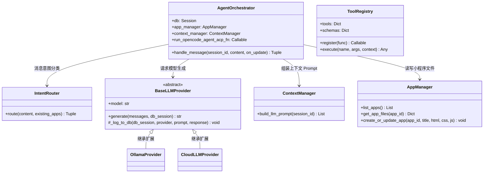
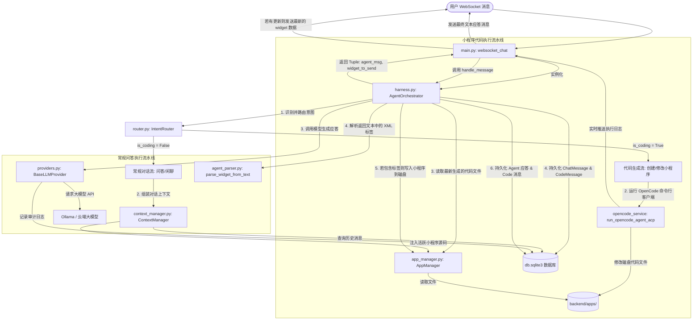

# Agent Harness 架构与执行流程

本文档介绍了 `backend/agent/` 目录下重构后的 Agent Harness 框架的设计与执行序列。

## 1. 组件关系图

Agent Harness 实现了执行流、意图路由、上下文组装以及大模型通信之间的解耦。以下是各组件之间的关系：

---

## 2. 消息执行逻辑流程图

下面的流程图展示了 `AgentOrchestrator.handle_message()` 在处理来自 WebSocket 的新消息时的详细执行顺序：

---

## 3. 目录结构说明

重构后的代码包结构如下：

- [__init__.py](file:///Users/shiyaozhang/Developer/ambient-agent/backend/agent/__init__.py): Python 包初始化文件。
- [harness.py](file:///Users/shiyaozhang/Developer/ambient-agent/backend/agent/harness.py): 实现核心编排器 `AgentOrchestrator`，负责串联整体生命周期。
- [router.py](file:///Users/shiyaozhang/Developer/ambient-agent/backend/agent/router.py): 实现意图路由 `IntentRouter`，进行消息类别识别。
- [providers.py](file:///Users/shiyaozhang/Developer/ambient-agent/backend/agent/providers.py): 面向对象封装的大模型服务客户端（包含 Ollama 本地服务和 OpenAI 兼容云端接口）。
- [tools.py](file:///Users/shiyaozhang/Developer/ambient-agent/backend/agent/tools.py): 类似 Hermes 风格的工具注册表，支持解析 Python 函数的签名和 docstring 自动生成工具 Schema。
