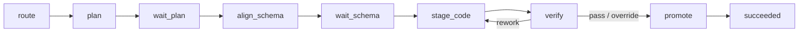

# Durable phase pipeline

> 该路径为旧文档链接保留。生产 harness 不再使用 WidgetDAG、SubExecutor 或 CodingPlanExecutor；唯一执行模型是 `RunCoordinator` 驱动的显式持久 phase reducer。

## 1. Phase 规则

`DurableAgentWorkflow` 每次只执行 `AgentRunState.phase` 指定的一步，并返回 `Continue`、`Wait`、`Succeeded`、`Failed` 或 `Cancelled`。`RunCoordinator` 用 `lease_owner + lease_epoch` 领取该步，`RunStore.commit_step()` 在同一 SQLite transaction 中提交 attempt、checkpoint、status 和 events。

等待用户时，workflow 先持久 interaction 再返回 `Wait`。`waiting_user` 释放 worker slot 但保留 session FIFO lane；resolve 通过 `run_version` 原子记录响应并重新入队。没有进程内审批 Future。

## 2. 副作用和恢复

- Graph mutation 先 preflight，再以单 transaction 提交，并按 `run_id + phase` 记录 effect ledger。
- Multi-intent 先整体 preflight，再顺序作为 saga 执行；只有完整 reverse data 的步骤才自动补偿。
- App 代码只写 per-Run staging。验证通过后记录 promotion marker 并原子替换 live App；recovery 不重复发布。
- 取消或失败时丢弃 staging。无法确认外部效果的 Run 进入 `needs_attention`，不报告假成功或假取消。

## 3. 安全执行

Converse 只暴露 phase 所需的最小 ToolSpec 集合。OpenCode 默认 strict，terminal 只允许 policy 中的精确 argv，不经 shell，并限制 cwd、环境、输出和进程组生命周期。policy 外请求 fail closed。
