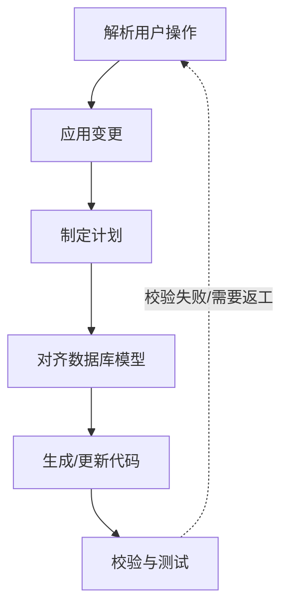

# DAG 任务流水线

在老版本中，卡片生成和变更的整个流程是通过在 `AgentOrchestrator.handle_message` 中使用一个冗长复杂的 `while current_state` 状态机来驱动的。

新版架构中，该状态机被重构为更具扩展性与声明式的 **WidgetDAG（有向无环图任务流水线）** 运行环境。它的执行链条更加清晰，并原生支持基于依赖关系的“回溯污染（Invalidation）”重新执行。

## 1. 任务流依赖与节点设计

WidgetDAG 默认包含以下 6 个核心任务节点，执行顺序如下：

每个节点都可以通过 `invalidates` 集合定义其依赖关系。例如：

- 如果 `plan` 节点被标记为脏并重新运行，它会自动污染并将下游的 `align_schemas`, `regen_code`, `verify` 全部重设为 **dirty（待执行）**。

## 2. 节点职责与说明

| 节点名称               | 核心职责                                                                                                   |
| :--------------------- | :--------------------------------------------------------------------------------------------------------- |
| **decode_user_intent** | 解析用户的自然语言反馈，理解用户是希望调整卡片 UI、拓展数据字段，还是重写核心逻辑。                        |
| **apply_user_actions** | 将用户明确的选择（如在 Schema 对齐界面勾选的新增字段）合并到当前的任务上下文状态中。                       |
| **plan**               | 调大模型生成 Widget 的修改/新建顶层策略方案（例如确定要关联哪些图数据库类型）。                            |
| **align_schemas**      | 对齐底层的 SQLite Schema 约束。如果涉及新的自定义属性类型，会在 `graph_schemas` 中做对应修改。             |
| **regen_code**         | 核心编译节点。负责生成、修改 Widget 源码，并写入到磁盘文件（`index.html`, `style.css`, `controller.js`）。 |
| **verify**             | 合规与安全校验。检查生成的 HTML 是否有脚本注入、JS 语法是否合法、以及字段是否与数据库对齐。                |

## 3. 异常回溯与用户交互

当一个节点运行失败或需要用户做二次审批时：

1.  节点会抛出 `TaskResult(success=False, ask_user=...)`，中断当前的 `WidgetDAG.step()` 轮询。
2.  `AgentOrchestrator` 将通过 WebSocket 向前端推送审批请求（如 `AppPermissionModal` 权限弹窗，或 `MutationPreview` 图变更修改预览）。
3.  用户在前端点击同意/拒绝后，前端把决定通过 WebSocket 送回后台。
4.  调度中心执行 `WidgetDAG.handle_user_response()` 填充响应数据，并将目标下游节点标记为 `dirty`，继续执行下一轮 DAG `step()`。
