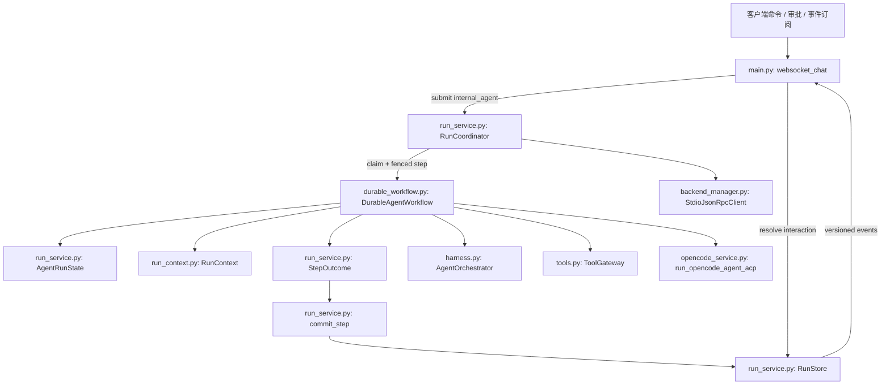
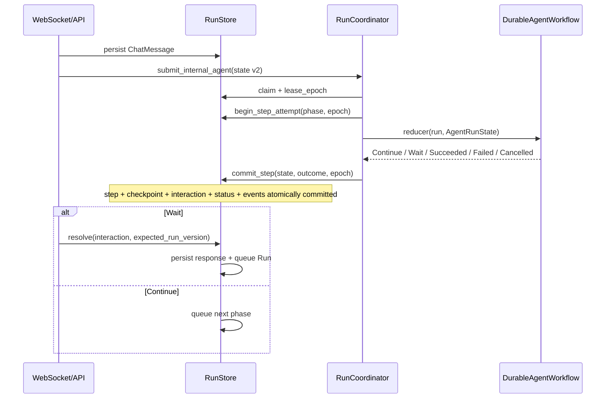
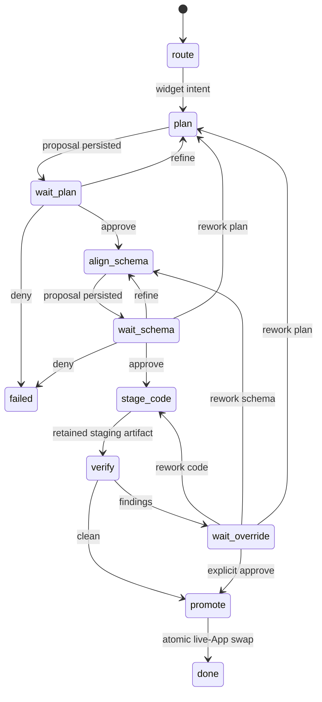
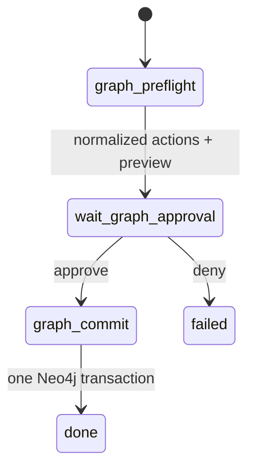

# Agent Harness：单一持久控制平面

Chat、Capability、MCP 和远端 Agent action 都由 `RunStore + RunCoordinator` 管理生命周期。WebSocket 只负责持久化输入、提交 Run、resolve interaction 和把持久事件投影给客户端；它不再创建或持有 agent 执行 task。

## 1. 组件边界

职责划分：

- `RunStore`：Run state、step attempt、checkpoint、interaction 和 versioned event 的事实源。
- `RunCoordinator`：排队、session FIFO lane、lease/heartbeat、orphan recovery、取消和 adapter 分派。
- `DurableAgentWorkflow`：版本 2 的 chat reducer；每次调用只推进一个 phase，并返回 typed `StepOutcome`。
- `RunContext`：每一步显式传递 run/session/step/attempt/trace 与冻结模型标识；LLM 和 Tool audit 不从占位 helper 猜测这些值。
- `AgentOrchestrator`：保留部分路由、Converse 和格式化 domain helper；不再拥有 `/ws/chat` 的运行生命周期。
- `ToolGateway`、MCP client 和 OpenCode ACP：分别强制本地模型工具、外部 JSON-RPC 和代码生成边界。

## 2. Reducer 协议

`AgentRunState` 保存 workflow type/version、session、phase、attempt、intent、模型快照、budget、artifact refs、workflow data、pending interaction、summary ref 和最后错误。所有字段必须可 JSON 序列化。

Outcome 语义：

- `Continue(next_phase)` 保存 checkpoint 后重新入队；
- `Wait(interaction definition)` 在同一 transaction 中创建 pending interaction 并释放 worker；
- `Succeeded` 保存 result 与 artifacts；
- `Failed` 根据 `retryable` 重排队或失败；未知副作用进入 `needs_attention`；
- `Cancelled` 只有确认没有未知副作用时才进入 `cancelled`。

所有 commit 必须匹配 `lease_owner + lease_epoch`。取消、恢复或重新领取后，旧 callback 会被 fencing 拒绝。

## 3. Version 2 workflow

### Widget create / modify

OpenCode 使用 `promote=False` 生成 `OpenCodeStagedResult`。`verify` 只读 staging；`promote` 再次验证 artifact、计算 hash、持久 promotion marker、提交已批准的 Schema，并原子替换 live App。recovery 先检查 marker，不重复发布；失败、返工和取消会丢弃 staging，旧 live App 保持不变。

### Graph mutation

preflight 不写数据库，并先确认每个 record 的 entity 已存在于唯一的 `ambient-context` 本体。commit 使用 `apply_actions_atomic()`，在一个 Neo4j transaction 中同时提交 context record/edge、rollback ticket、完整 reverse actions，并以 `run_id + phase` 写入 Graph effect ledger；worker 在 Graph transaction 提交后、Run checkpoint 前崩溃时，重试返回原结果而不会重复写。`/api/graph/mutate` 和 WebSocket rollback 也走这个 reducer，显式命令作为 durable approval interaction 记录。Multi-intent 先整体 preflight，再由 `multi_dispatch` 顺序作为 saga 推进；当前 phase 可重试时保留此前 effect 与 compensation，只有确定终止时才逆序补偿并把 cursor/results 回退到 saga 起点，避免报告已被撤销的结果。补偿不完整或效果未知时进入 `needs_attention`。

### Converse 与只读查询

- `converse` 使用 bounded tool loop：限制模型迭代、工具调用数、总 wall clock、单次 LLM timeout、assistant 输出大小及相同调用重复次数。
- 当前 Converse 只暴露 `READ` effect 工具和 `workspace:read` scope。
- `graph_query` 直接执行只读查询并产生最终 projection；`clarify` 持久化澄清回复后结束。

## 4. Tool 与 Context 边界

`ToolRegistry` 是注册 facade，`ToolGateway` 是模型请求本地工具的执行 enforcement point。`ToolSpec` 声明 input/output schema、effect、scope、approval、timeout、幂等要求、输出上限和敏感字段。Gateway 拒绝未知工具/参数、scope 越界、缺失审批或缺失幂等键；相同幂等键携带不同参数也会被拒绝。每次调用产生带 run/step/attempt/trace 和 duration 的 started/succeeded/failed/cancelled 事件，所有结果都做类型和大小检查。生产 registry 目前只注册 READ 工具；Graph/App 等写操作由带持久 effect ledger 的专用 workflow 执行，不依赖进程内 tool cache 或不可终止的工作线程。

Capability/MCP/ACP/HTTP adapter 由同一个 `RunCoordinator` effect boundary 执行，复用 lease fencing、持久审批、deadline、取消和 `needs_attention` 语义；协议专属的 schema/capability/进程 policy 仍由各 adapter 校验。HTTP Agent 另有总 wall-clock deadline、request/response/event 上限、有界 SSE decoder，并关闭环境代理继承。远端 effect 默认 manual recovery；manifest 的字符串声明不能替代远端幂等或 reconciliation 证明。它们不伪装成 Python tool，也不会绕过 durable Run 控制面。

`RunContext` 由 reducer 从当前持久 Run 与 checkpoint 构造，并显式传给路由、计划、Schema、校验和 Converse provider。`ContextManager` 按稳定顺序限制近期消息数、单消息字符数、artifact 字符数和总 prompt；窗口外消息形成 checkpoint 内的确定性摘要，并用 `context_summary_ref=sha256:…` 校验恢复内容。LLM audit 记录 prompt/model/tool-schema hash 和实际读取的 artifact hash。当前裁剪是字符预算，provider 返回的 token/cost 则进入 Run 总预算。Run 的 primary/fast 模型在提交时快照，恢复后不会因 UI 中途切换模型而漂移。

## 5. 事件、取消与保留期

Run event envelope 包含 `event_id`、`sequence`、`schema_version`、`stream_epoch`、Run/session/step/attempt/trace 标识、时间、duration、model usage、`redacted` 和 payload。payload 入库前按敏感键脱敏并做尺寸上限；终态 event 默认保留 30 天。前端以 `(stream_epoch, sequence)` 维护 replay cursor，以 `event_id` 去重。

同一 session 的 `waiting_user` Run 释放 worker slot但保留 FIFO lane。resolve 使用 `run_version` 拒绝重复或迟到响应。Running 取消会取消 scheduler task，并向 tool/MCP/ACP 子调用传播；未知外部副作用不会被标成安全取消。

`needs_attention` 不能直接改成 cancelled；`POST /api/runs/{id}/reconcile` 必须持久记录 `confirmed_not_committed`、`compensated` 或 `confirmed_committed` 后才能关闭人工审查。Promise 兼容调用把 `projection_type + call_id` 放入 Run correlation，并把 call ID 纳入 idempotency identity，重连后可由 durable Run/event 重建响应关联。

Plan、Schema、verification 和 MCP/Agent permission 都使用 Run interaction，不使用全局 Future。OpenCode ACP 只执行 strict policy 中的精确 argv；policy 外请求直接拒绝，不挂起 worker 等待进程内审批。

## 6. 确定性评测

`RunStoreTraceAdapter` 从真实 Run、step attempt、canonical event 和 LLM audit 生成 `EvaluationTrace`，并从未知 effect、policy violation 和未批准 effectful tool 等持久信号推导 unsafe trajectory。CI 的 scripted fake 场景走生产 `RunCoordinator + DurableAgentWorkflow`；指标同时包含 outcome/trajectory、成功率、unsafe action rate、tool calls、tokens、cost、latency 与恢复率。真实模型场景仍要求至少三次重复，且与确定性门禁分开运行。
