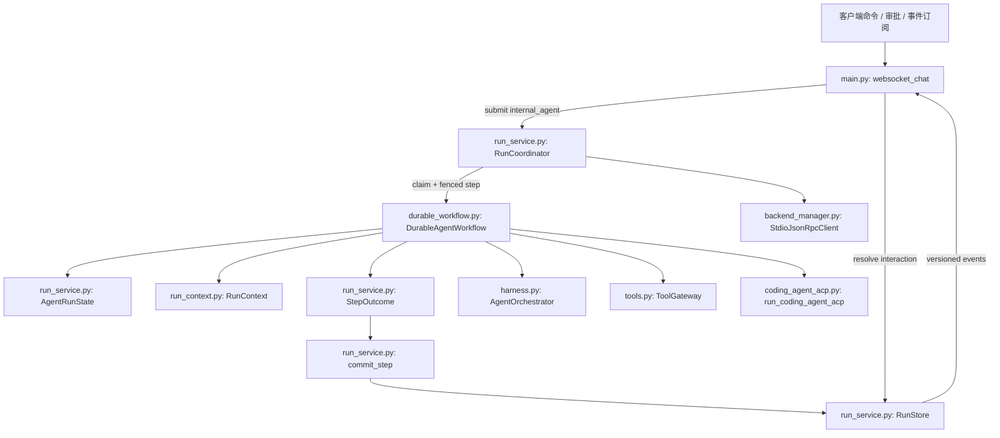
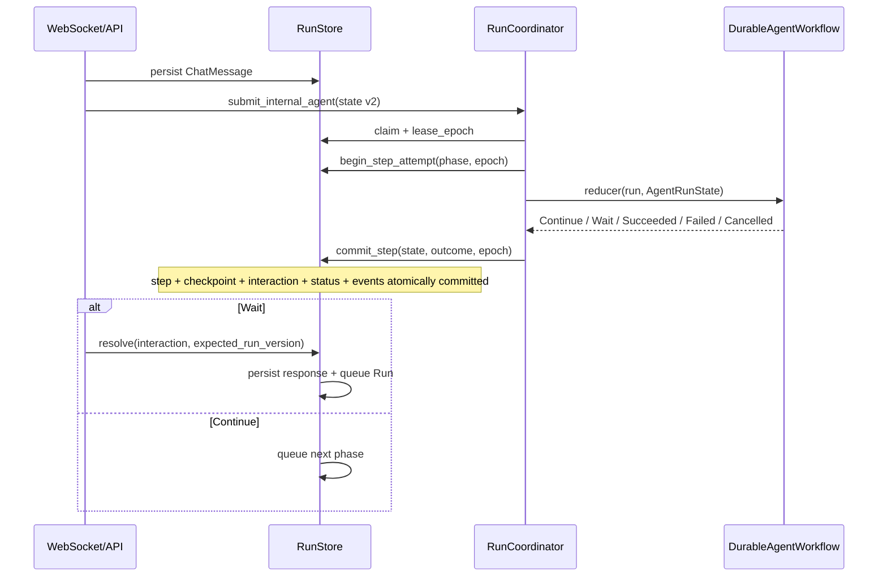
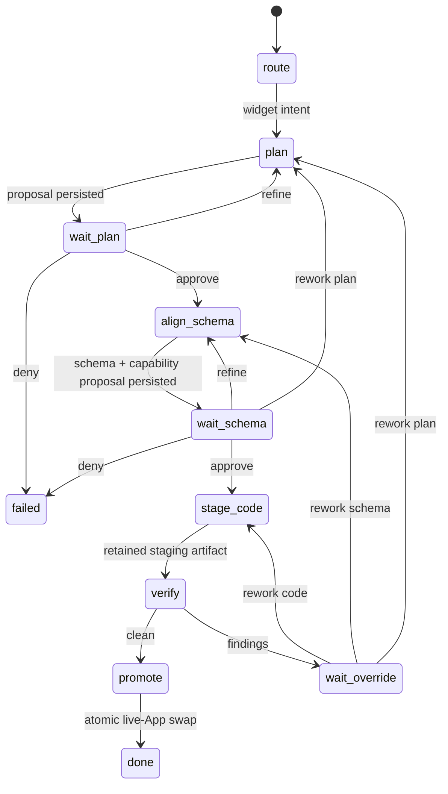
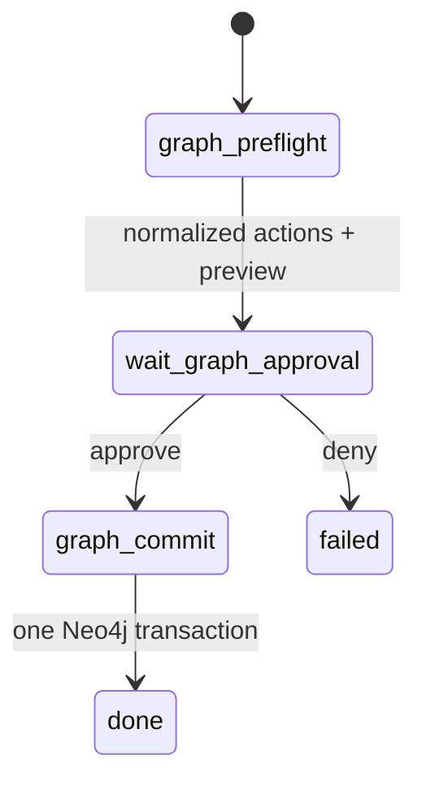

# Agent Harness：单一持久控制平面

App 类型目录通过只读 `list_app_types` tool 提供；`list_app_specs` 返回已安装 App 的类型和功能声明。二者使用 `workspace:read` scope，不创建可执行 action，也不改变权限。Router 与 Coding Agent 使用同一 [App 类型与功能标准](/architecture/app-types.md)；计划功能不能当作已可用工具。

Chat、Capability、MCP 和远端 Agent action 都由 `RunStore + RunCoordinator` 管理生命周期。WebSocket 只负责持久化输入、提交 Run、resolve interaction 和把持久事件投影给客户端；它不再创建或持有 agent 执行 task。

## 1. 组件边界


```mermaid
flowchart TB
    Client[客户端命令 / 审批 / 事件订阅] --> Main[main.py: websocket_chat]
    Main -->|submit internal_agent| Coordinator[run_service.py: RunCoordinator]
    Main -->|resolve interaction| Store[run_service.py: RunStore]
    Store -->|versioned events| Main

    Coordinator -->|claim + fenced step| Workflow[durable_workflow.py: DurableAgentWorkflow]
    Workflow --> State[run_service.py: AgentRunState]
    Workflow --> Context[run_context.py: RunContext]
    Workflow --> Outcome[run_service.py: StepOutcome]
    Outcome --> Commit[run_service.py: commit_step]
    Commit --> Store

    Workflow --> Domain[harness.py: AgentOrchestrator]
    Workflow --> Gateway[tools.py: ToolGateway]
    Workflow --> ACP[coding_agent_acp.py: run_coding_agent_acp]
    Coordinator --> MCP[backend_manager.py: StdioJsonRpcClient]
```

职责划分：

- `RunStore`：Run state、step attempt、checkpoint、interaction 和 versioned event 的事实源。
- `RunCoordinator`：排队、session FIFO lane、lease/heartbeat、orphan recovery、取消和 adapter 分派。
- `DurableAgentWorkflow`：版本 2 的 chat reducer；每次调用只推进一个 phase，并返回 typed `StepOutcome`。
- `RunContext`：每一步显式传递 run/session/step/attempt/trace、冻结模型标识及非秘密 `jev_router` / `workflow_decisions` 配置；LLM 和 Tool audit 不从占位 helper 猜测这些值。
- `AgentOrchestrator`：保留部分路由、Converse 和格式化 domain helper；不再拥有 `/ws/chat` 的运行生命周期。
- `ToolGateway`、MCP client 和 Coding Agent ACP：分别强制本地模型工具、外部 JSON-RPC 和代码生成边界。OpenCode 的原生 ACP server 与 Codex ACP bridge 使用完全相同的 Ambient session、权限、staging、验证和 repair 状态机。

`backend/main.py` 作为组合根在每个活跃 application lifespan 中只创建一个 Graph adapter，并把同一个实例注入
`DurableAgentWorkflow` 与每个 `AgentOrchestrator`。路由上下文、只读查询、mutation 和
schema 阶段不得在请求或 reducer step 内再次调用 `create_graph_database()`；否则
Neo4j deployment 会为每条消息重复创建 Driver、连接池并重做 ontology 初始化。
Graph adapter 的生命周期也只属于组合根：所有 Run、Coding Agent 和 MCP 任务停止后，
应用 shutdown 必须显式 `close()`；SQLite adapter 提供同一无副作用关闭契约。即使
startup、应用上下文或任一较早的 shutdown 步骤失败，组合根仍必须按顺序尝试其余
清理步骤，不能因为一个异常而泄漏后续进程或 Graph Driver。同一进程中的测试或嵌入式
宿主可能多次进入 ASGI lifespan；组合根不得复用上一次 shutdown 已关闭的 Neo4j
Driver，而要在下一次 startup 创建并重新注入一个新 adapter。

## 2. Reducer 协议


```mermaid
sequenceDiagram
    participant WS as WebSocket/API
    participant S as RunStore
    participant C as RunCoordinator
    participant W as DurableAgentWorkflow

    WS->>S: persist ChatMessage
    WS->>C: submit_internal_agent(state v2)
    C->>S: claim + lease_epoch
    C->>S: begin_step_attempt(phase, epoch)
    C->>W: reducer(run, AgentRunState)
    W-->>C: Continue / Wait / Succeeded / Failed / Cancelled
    C->>S: commit_step(state, outcome, epoch)
    Note over S: step + checkpoint + interaction + status + events atomically committed
    alt Wait
        WS->>S: resolve(interaction, expected_run_version)
        S->>S: persist response + queue Run
    else Continue
        S->>S: queue next phase
    end
```

`AgentRunState` 保存 workflow type/version、session、phase、attempt、intent、模型快照、budget、artifact refs、workflow data、pending interaction、summary ref 和最后错误。所有字段必须可 JSON 序列化。

Outcome 语义：

- `Continue(next_phase)` 保存 checkpoint 后重新入队；
- `Wait(interaction definition)` 在同一 transaction 中创建 pending interaction 并释放 worker；
- `Succeeded` 保存 result 与 artifacts；
- `Failed` 根据 `retryable` 重排队或失败；未知副作用进入 `needs_attention`；
- `Cancelled` 只有确认没有未知副作用时才进入 `cancelled`。

所有 commit 必须匹配 `lease_owner + lease_epoch`。取消、恢复或重新领取后，旧 callback 会被 fencing 拒绝。

## 3. Version 2 workflow

### Widget create / modify


```mermaid
stateDiagram-v2
    [*] --> route
    route --> plan: widget intent
    plan --> wait_plan: proposal persisted
    wait_plan --> align_schema: approve
    wait_plan --> plan: refine
    wait_plan --> failed: deny
    align_schema --> wait_schema: schema + capability proposal persisted
    wait_schema --> stage_code: approve
    wait_schema --> align_schema: refine
    wait_schema --> plan: rework plan
    wait_schema --> failed: deny
    stage_code --> verify: retained staging artifact
    verify --> promote: clean
    verify --> wait_override: findings
    wait_override --> stage_code: rework code
    wait_override --> align_schema: rework schema
    wait_override --> plan: rework plan
    promote --> done: atomic live-App swap
```

Schema interaction 原子批准数据 schema 与 capability grants。Workflow 随后生成带 grants digest 的不可变 Runtime Contract。Coding Agent 使用 `promote=False` 生成 staging；`verify` 要求 Manifest grants 等于 contract、代码使用为其子集，再检查 Graph schema。`promote` 持久化 marker、提交 schema 并原子替换 live App。recovery 不重复发布；失败、返工和取消保留旧 live App。

如果 Schema `refine` 在调用模型或校验结果时失败，durable retry 只能恢复已解析 interaction 中明确的 `refine` 提案与反馈，并重新生成提案；必须创建新的 Schema 审批 interaction。不得把旧 `approve`、`deny` 或 `rework_plan` 当作重试授权，也不得跳过新审批继续编码。恢复输入须校验其来源 run、interaction 类型与已解析状态；不匹配时安全失败。

首帧验收使用隔离 Chromium Runtime，并由宿主显式启用 `ephemeral_storage`，提供原生 Widget SDK 的 `ambient.storage` 与生命周期注册接口。存储仅在本次验收的内存中存在，最多 256 个键、1 MiB JSON 值；能力 RPC 仍经过原有授权器。首帧结果证明代码可以加载和渲染，持久化、暂停前刷盘与实际交互需要分别验证。文件首次读取的 `file_not_found` 在授权后返回；其他读取故障需要保留可见错误状态。

计划生成、计划修改、编码与自动修复共享同一 UI 质量指南。默认视图先呈现摘要、主要操作和有意义的视觉层级；“全量信息”通过紧凑列表、分页或可展开详情保持可访问，不等于把全部字段平铺成文字。文档、笔记等以阅读为目的的 App 仍保留必要正文。需要趋势、分布等可视化时，使用真实数据驱动的图形，不以 Unicode 字符串冒充图表。原生 `ambient.html` 支持内置 HTML/SVG 标签和内联样式，详见 [Widget SDK](../widgets/sdk.md)；此能力不增加外部库、DOM 全局对象或网络权限。

验收关注 320/640 像素宽度、明暗主题、键盘操作、控件名称、可见错误和详情访问。界面文案以任务和状态为中心，不把计划、权限契约、实现说明或原始供应商异常当作常驻正文。请求失败后保留未保存的用户编辑；重试原操作，避免重新读取覆盖待保存内容，不能把写入失败显示为已保存。确定性测试检查共享指南传播、图形渲染与权限边界；独立 GPT-6 luna 案例验证实际生成产物的图形、布局、详情与交互，并保留绑定代码哈希的截图。首帧成功不能证明 UI 质量；也不使用适用于所有 App 的文字数量或强制图表门槛。

Schema verification 的生成 fallback 必须返回完整有效的 `unknown_props`、`type_mismatches`、`unknown_types` 三组列表，并在列表填充完成后构造 `VerificationDiff`。任一 finding 都使 `is_clean=false` 并进入 `wait_override`；缺列表或非法结果是验证失败，不能当作 clean。用户批准不能绕过 mandatory findings，必须返工代码、Schema 或计划后再次验证。

### Graph mutation


```mermaid
stateDiagram-v2
    [*] --> graph_preflight
    graph_preflight --> wait_graph_approval: normalized actions + preview
    wait_graph_approval --> graph_commit: approve
    wait_graph_approval --> failed: deny
    graph_commit --> done: one Neo4j transaction
```

preflight 不写数据库，并先确认每个 record 的 entity 已存在于唯一的 `ambient-context` 本体。App-scoped Widget mutation 还先根据批准 grant 解析 entity/operation/edge type。commit 使用 `apply_actions_atomic()`，在一个 Neo4j transaction 中同时提交 context record/edge、rollback ticket、完整 reverse actions和 Graph effect ledger；崩溃重试返回原结果而不会重复写。Multi-intent 先整体 preflight，再按 saga 顺序推进；只有确定终止时才逆序补偿。补偿不完整或效果未知时进入 `needs_attention`。

### Converse 与只读查询

- `converse` 使用 bounded tool loop：限制模型迭代、工具调用数、总 wall clock、单次 LLM timeout、assistant 输出大小及相同调用重复次数。
- 当前 Converse 只暴露 `READ` effect 工具和 `workspace:read` scope。
- `graph_query` 直接执行只读查询并产生最终 projection；`clarify` 持久化澄清回复后结束。

## 4. Tool 与 Context 边界

`ToolRegistry` 是注册 facade，`ToolGateway` 是模型请求本地工具的执行 enforcement point。`ToolSpec` 声明 input/output schema、effect、scope、approval、timeout、幂等要求、输出上限和敏感字段。Gateway 拒绝未知工具/参数、scope 越界、缺失审批或缺失幂等键；相同幂等键携带不同参数也会被拒绝。每次调用产生带 run/step/attempt/trace 和 duration 的 started/succeeded/failed/cancelled 事件，所有结果都做类型和大小检查。生产 registry 目前只注册 READ 工具；Graph/App 等写操作由带持久 effect ledger 的专用 workflow 执行，不依赖进程内 tool cache 或不可终止的工作线程。

Capability/MCP/ACP/HTTP adapter 由同一个 `RunCoordinator` effect boundary 执行，复用 lease fencing、持久审批、deadline、取消和 `needs_attention` 语义；协议专属的 schema/capability/进程 policy 仍由各 adapter 校验。HTTP Agent 另有总 wall-clock deadline、request/response/event 上限、有界 SSE decoder，并关闭环境代理继承。远端 effect 默认 manual recovery；manifest 的字符串声明不能替代远端幂等或 reconciliation 证明。它们不伪装成 Python tool，也不会绕过 durable Run 控制面。

`RunContext` 由 reducer 从当前持久 Run 与 checkpoint 构造，并显式传给路由、计划、Schema、校验和 Converse provider。每个 Agent 角色还接收由结构化 `SystemCapabilityCatalog` 生成的最小投影；Coding Agent 只接收本 App 批准的 Runtime Contract。`ContextManager` 按稳定顺序限制近期消息数、单消息字符数、artifact 字符数和总 prompt；窗口外消息形成 checkpoint 内的确定性摘要，并用 `context_summary_ref=sha256:…` 校验恢复内容。LLM audit 记录 prompt/model/tool-schema hash 和实际读取的 artifact hash。当前裁剪是字符预算，provider 返回的 token/cost 则进入 Run 总预算。Run 的 primary/fast 模型、Coding Agent、Agent 模型绑定与解析后的 shared model 都在提交时快照，恢复后不会因 UI 中途切换设置而漂移。

### 4.1 开发任务的预算边界

入口路由与普通 Converse 默认限制为 8 次模型调用。确认 `widget_create` 或 `widget_modify` 后，默认的总轮次限制改为 `max_model_turns=null`；实际 Harness 模型调用仍累计计数，每次生成的局部尝试上限、active wall clock、token 和费用预算继续生效。`model_turn_limit_explicit` 记录调用方是否明确设置轮次限制，显式的有限值（包括 8）保持有效。历史 checkpoint 没有这个标记时，原默认 8 次按开发默认策略迁移；非默认有限限制继续保留。

启动 Coding Agent 不算一次 Harness 模型调用。ACP session 内部的编码、工具调用与不同错误的自动修复没有固定轮次上限，但仍受有限且为正的单次请求超时、取消、允许文件与权限、重复 finding 和文件无变化的停止条件约束。当前 Run 的 token/cost 只覆盖回传 usage 的 Harness 模型调用，不表示 ACP 内部的完整费用。

Manifest、权限、功能依赖、AST 与 Schema 的确定性校验不消耗模型轮次。Schema 解析确实需要模型 fallback 时才惰性申请模型预算；缺少预算不能阻止纯代码校验，fallback 又不能绕过有限预算或失败关闭规则。已批准 contract 和有效草稿都保留的验证预算失败，retry 从 `verify` 继续并重做校验，不为单纯继续验证重新生成代码；明确修改代码的 feedback 仍进入编码阶段。

单应用的计划、Schema 对齐和编码同时保留原始用户请求与 Router 摘要；复合与 slash 命令步骤使用各自的范围内指令。计划覆盖适用的交互、持久化、数据来源和失败恢复，并给出可观察的验收条件。修复提示保留逐项功能条件；超长段落指向完整的原始 ACP 指令。Schema 模型回退读取完整 Controller，遵守 staging 的 2 MiB 上限；超限则拒绝，不能只验证前缀。

Schema 对齐提示还包含当前版本的 App 类型/功能 ID 目录和自定义功能 ID 格式。初始生成与用户反馈后的 refinement 都必须使用本目录中的标准功能 ID 或合法的 `custom:<namespace>.<feature>` ID；批准的 `required_features` ID 会由后续 App 实现原样声明。功能标准从完整用户请求和获批计划中拆分成多个可独立验收的目标，涵盖适用的核心行为、数据源核实、持久化、定位、交互/失败恢复，以及可访问和主题适配的视觉呈现。若计划要求核实数据源，就应要求确认所选服务支持的字段，准确标注单位并诚实呈现不可用数据；只有请求或计划明确给出参数和映射细节时，才把它们写入标准，不能预先编造 API 配方。需要完整信息的界面也应明确摘要、真实图形或趋势视图和可访问的细节；只声明任务相关的状态，不把无关状态强加给 App。每个标准逐项填写其获批能力和精确来源路径，避免用一个笼统条目代替不同目标。用户提出 refinement 时，定向修复逐条处理每个具体反馈，保留仍然正确的功能标准、ID 与授权依赖，再分别补充缺失目标。提案解析或功能覆盖复核失败时，服务最多发起一次带有界校验诊断的定向修复；修复后的确定性拒绝会作为不可重试的 Schema 错误返回，避免 durable workflow 在新尝试中丢弃诊断并重复生成。模型调用或传输失败保持既有重试分类；配置错误和预算错误继续原样传播。

功能覆盖复核按原始请求、批准方案和直接反馈中的可观察结果及明确状态转换，审查 `required_features` 整体；一条验收条件可以覆盖多个目标，不要求重复声明。依赖检查比对实际声明的 capability、来源 ID 和获批路径。当服务或其精确响应字段尚未确定时，不要求额外编造查询参数、变量清单、响应字段映射、序列化或代码组织；要求实现时核对所选服务文档及真实响应、按实际提供的数据展示用户要求的信息即可。用户或批准方案明确指定的字段与行为仍须覆盖。复核须指出真实遗漏、不受支持的依赖或功能降级；遇到不确定或无法复核时继续失败关闭，不自动改成通过。

网络 capability 审批必须以有依据的具体 origin 和 path 为准。不能从服务名或功能名拼出 URL/path，也不能把同一供应商上不同 API host 的路径合并到一个来源。若 origin 或 path 尚无可靠资料，应明确标注需核实，并先确认实际端点后再请求对应范围的审批；已批准路径是能力边界，不是可以在后续实现中自由替换的占位符。此提示要求模型谨慎，不代表系统自动验证外部端点的真实性。

Jev 可仅用于入口路由；`workflow_decisions=off` 时开发设计复核走 LLM。最终 Runtime Contract 批准后，正常执行路径由 Coding Agent 和确定性验证推进，不再重新路由或用 Jev 决定是否允许发布。最终审批前的目标覆盖复核仍保留，避免将占位提示误报为功能完成。

## 5. 事件、取消与保留期

Run event envelope 包含 `event_id`、`sequence`、`schema_version`、`stream_epoch`、Run/session/step/attempt/trace 标识、时间、duration、model usage、`redacted` 和 payload。payload 入库前按敏感键脱敏并做尺寸上限；终态 event 默认保留 30 天。前端以 `(stream_epoch, sequence)` 维护 replay cursor，以 `event_id` 去重。

同一 session 的 `waiting_user` Run 释放 worker slot但保留 FIFO lane。resolve 使用 `run_version` 拒绝重复或迟到响应。Running 取消会取消 scheduler task，并向 tool/MCP/ACP 子调用传播；未知外部副作用不会被标成安全取消。

`needs_attention` 不能直接改成 cancelled；`POST /api/runs/{id}/reconcile` 必须持久记录 `confirmed_not_committed`、`compensated` 或 `confirmed_committed` 后才能关闭人工审查。Promise 兼容调用把 `projection_type + call_id` 放入 Run correlation，并把 call ID 纳入 idempotency identity，重连后可由 durable Run/event 重建响应关联。

Plan、Schema、verification 和 MCP/Agent permission 都使用 Run interaction，不使用全局 Future。Coding Agent ACP 只执行 strict policy 中的精确 argv；policy 外请求直接拒绝，不挂起 worker 等待进程内审批。

## 6. 确定性评测

`RunStoreTraceAdapter` 从真实 Run、step attempt、canonical event 和 LLM audit 生成 `EvaluationTrace`，并从未知 effect、policy violation 和未批准 effectful tool 等持久信号推导 unsafe trajectory。CI 的 scripted fake 场景走生产 `RunCoordinator + DurableAgentWorkflow`；指标同时包含 outcome/trajectory、成功率、unsafe action rate、tool calls、tokens、cost、latency 与恢复率。真实模型场景仍要求至少三次重复，且与确定性门禁分开运行。

决策/生成分离的测试重点包括候选缺失、低置信、超时、无效答案、生成漂移、缺参数、审批绕过、预算耗尽和恢复后的失败轨迹。通过这些测试表明已覆盖的控制边界有效，不代表任意真实语义任务有高 QoS 保证；真实准确率、coverage、完整链路费用与 p50/p95 必须另行评估。

## 7. 远程工作区入口

模型连接与编码执行器分别管理：`llm_discovery.sync_codex_connection` 将托管 Codex 登录
投影到 Provider Registry，主/快速模型经各自快照使用原生推理，编码执行仍由 ACP 所有。
同步以编码目录统一模型展示，并独立记录用途兼容性；明确不支持主推理的条目禁选并在
解析时拒绝。同步不改变模型绑定、Run 快照、工具权限或恢复语义。新版原生推理复用
固定 `0.159.3` 二进制和独立推理 home，保留未升级安装的旧 profile；版本与 Linux 限制
见 [Provider 契约](../integrations/llm-providers.md)。工具执行始终由 Ambient 工具循环所有。

原生推理为每次接收保留 2 MiB 总字节硬上限、单行 StreamReader 界限和最多 64 个已登记 item。普通
JSON-RPC 控制消息最多 1,024 条；仅精确匹配当前 thread/turn、结构合法且绑定已知 agent-message item
的 delta 可使用独立的 8,192 条流式预算。每条流式消息的原始字节仍计入总字节上限；未知、格式错误、跨
thread/turn 的通知以及 callback 仍按控制消息预算并保留原有校验和 fail-closed 行为。达到任一上限时，内部诊断只记录限额
类型和标量计数，不记录 prompt、payload 或原始协议行；对外固定错误码与 `native_reason` 保持不变。
delta envelope 可带可选 `emittedAtMs`；存在时必须是有符号 64 位 JSON integer（不接受 boolean 或 null），不额外假定非负。字段缺省兼容未发送时间戳的旧版协议；多余 envelope 字段仍不授予流式预算。

`RemoteWorkspaceConnector` 是本地前台与 API 的受限传输入口，使用 `RemoteWorkspaceNodeStore` 保存并验证本机授权。它不改变 `RunCoordinator`、tool effect、审批或恢复语义。云平台只领取节点、签发一次性入口并中转；远程请求进入原有本地 API 和 Run 路径，仍受相同应用、能力和持久执行边界约束。完整范围和协议见 [远程工作区设计](../architecture/remote-workspace.md)。

## 8. 决策与生成分离

`backend/agent/decisions.py` 的 `DecisionService.evaluate` 为声明的 purpose、state 和 questions 提供 `Choice`、`Noul`、`Score` 证据。问题独立求值，不会读取同次调用中其他问题的答案。候选使用 opaque key，随后映射为精确业务 ID；输出保留完整分布、实际模型、输入/请求 hash、安全 usage、耗时与固定错误码。Score 只作为证据，不替代审批或硬校验。

Score 严格检查类型、有限值、范围、概率总和、等级 keys 和 legend。实测响应出现两位小数网格时，允许有限的舍入一致性校验：在各概率 `p ± 0.005`、真实总和为 1 的约束下求加权期望的可行范围，只有它与 `score ± 0.005` 相交才接受，且保留供应商 score。该规则根据实测推断，不代表供应商承诺精度；Choice/Noul 门槛不变。

采用决策后，`IntentGenerationTask` 固定 kind、目标 App 和 `decision_hash`，生成模型只补自由参数。编译拒绝改选固定字段、旧 hash 与不完整计划；完整 `IntentPlan` 再进入原 durable workflow。已知 Schema 的有限只读列表模板可以由代码编译，复杂查询与自由文本 mutation 继续生成。复合计划只有在参数完整且全计划语义复核接受时才可省 refiner；顺序和目标固定，仍在首个 effect 前整体 preflight。

Schema 对齐对完整 inventory 逐候选判断复用，并独立判断 disposition 与 Graph context；生成提案受选择集合约束，歧义或集合漂移回退完整生成，source hash 追溯该次冻结输入。计划语义复核也是可选证据，不自动批准计划、增加 grants 或绕过 Manifest/Schema 验证。

通用决策使用 `JEV_DECISION_*` 环境配置，默认 `off`；非秘密快照保存于 `model_snapshot.workflow_decisions`，由 `RunContext.workflow_decisions` 传递。缺少字段的历史 Run 按 `off` 恢复。key 仅从运行时 `TYPESAFE_API_KEY` 读取。决策与生成共同计入模型、token、费用和剩余时间预算；取消与预算耗尽向上传播。

`DecisionConfig.stage_modes` 随 Run 冻结为用途模式字典。`JEV_DECISION_STAGE_MODES` 默认 `{}`，未指定用途继承 `JEV_DECISION_MODE`；合法用途仅有 `intent_parameters`、`graph_query_template`、`schema_selection`、`composite_review`、`development_plan_review`、`feature_coverage_review`，合法模式为 `off`、`shadow`、`cascade`。非法 JSON、用途或模式拒绝创建快照；历史配置缺字典按 `{}` 解释，模式与 key 无关。

`shadow` 只记录证据，`cascade` 仅在门控及编译通过后采用。新路由生成分离要求 `jev_router.mode=cascade` 与 `intent_parameters` 的有效用途模式为 `cascade`；其他用途各自决定是否调用或采用。仅开启旧 `jev_router=cascade` 时仍只允许高置信 `converse` 直达。实测合成用例的多项 Noul 触发回退，可先只启用路由参数生成、其他用途设为 `shadow` 或 `off`，不因此宣称语义质量提升。例如：

```dotenv
JEV_ROUTER_MODE=cascade
JEV_DECISION_MODE=off
JEV_DECISION_STAGE_MODES='{"intent_parameters":"cascade","graph_query_template":"shadow","schema_selection":"shadow","composite_review":"shadow","development_plan_review":"shadow","feature_coverage_review":"shadow"}'
```

`shadow` 仍消耗 API 调用和延迟。详见[意图路由](/agent/intent-router.md)；完整设计与配置表位于仓库 `proposals/decision-generation-harness/DESIGN.md`。
