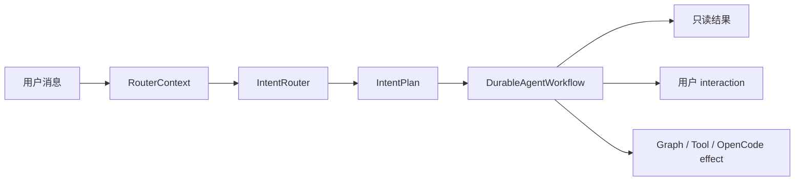

# 意图路由

`IntentRouter` 把用户输入转换为结构化 `IntentPlan`。它决定 durable workflow 走哪条 phase 路径，但不直接执行工具、写 Graph 或发布应用。

## 1. 路由上下文

路由输入由以下信息组成：

- 当前用户消息、会话语言和模型快照；
- 已安装应用的 manifest、intent 与 schema 引用；
- 有上限的 `GraphSnapshot`；
- 可用 capability 摘要；
- fast model（未配置时回退到会话 primary model）。

模型必须通过 `classify_intent` tool schema 返回结构化参数。解析失败、未知 kind、低置信或不安全的旧分类会降级为 `clarify`，不会猜测并执行副作用。

## 2. 顶层 IntentKind

| Kind | 用途 | 主要后续路径 |
| --- | --- | --- |
| `converse` | 普通对话和有界只读 tool loop | Converse phase |
| `graph_query` | 只读结构化查询 | Graph query phase |
| `graph_mutation` | 一批明确 Graph action | preflight → 必要确认 → atomic apply |
| `widget_create` | 创建新应用 | plan → confirm → staging → verify → publish |
| `widget_modify` | 修改已有应用 | plan → confirm → staging → verify → publish |
| `multi_intent` | 有顺序的多个子动作 | 全量预检后按 saga step 执行 |
| `plan_and_act` | 需要显式计划的复合动作 | 与 durable multi-step 路径汇合 |
| `clarify` | 缺少必要信息或无法安全分类 | 创建用户 interaction 或澄清消息 |

`IntentPlan` 还包含 `confidence`、`rationale`，并按 kind 使用 `app_id`、`instruction`、`actions`、`query`、`sub_intents` 或 `clarification_*` 字段。

## 3. SubIntent

`multi_intent` 与 `plan_and_act` 可以包含：

- `graph_mutation`
- `graph_query`
- `widget_create`
- `widget_modify`
- `widget_extend_schema`
- `widget_fix_code`
- `widget_rewrite`

Reducer 在第一个副作用前预检完整列表，然后顺序执行并在每一步 checkpoint。前一步输出可以供后一步使用；失败时根据已持久化的 effect 和 recovery 数据继续或进入 `needs_attention`，而不是依赖旧的内存 DAG。

## 4. 路由与执行的边界

- 路由结果只是计划，不是授权。
- Graph action 仍须经过 schema preflight。
- Widget 仍须经过 staging、controller 验证和 schema verification。
- Tool/MCP/OpenCode 仍须经过对应权限与 lifecycle policy。
- 同一 Run 使用启动时冻结的模型选择；中途修改会话模型只影响下一个 Run。

执行细节见 [Agent Harness](/agent/harness.md) 和[持久 Run](/architecture/runs.md)。
