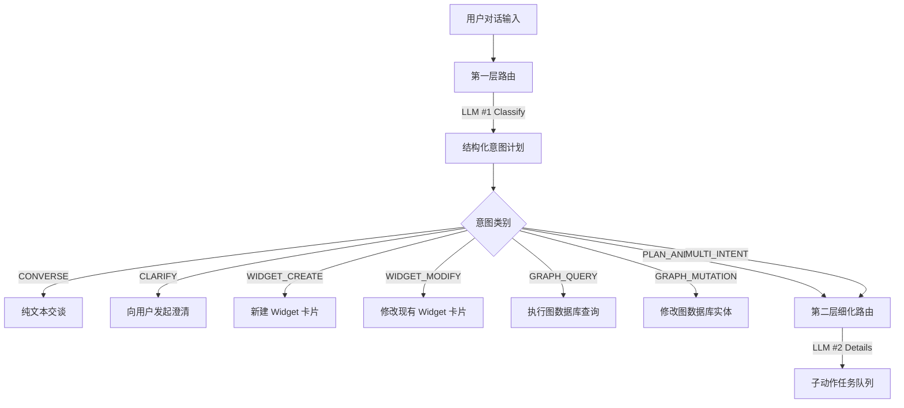

# 意图路由

在 Ambient Agent 中，用户的每一次对话输入在被送入大语言模型响应前，都需要通过**两层 LLM 意图路由结构**进行精准分类与编排，以确定接下来该执行普通的文本交谈，还是触发系统级的图数据库写入或前端 Widget 卡片生成。

## 1. 意图分类规划图

## 2. 意图枚举定义

在 `backend/agent/intent_plan.py` 中，定义了以下主要的意图种类：

### 顶层意图 `IntentKind`

- `CONVERSE`: 纯文本对话（闲聊或无需系统调用）。
- `CLARIFY`: 询问澄清。当用户指令模糊（例如有同名 Widget，且没有指明更新哪一个）时，路由为此状态以提供选择项。
- `WIDGET_CREATE`: 触发全新小程序的 XML 编译与生成逻辑。
- `WIDGET_MODIFY`: 修改或迭代现有卡片的 HTML/CSS/JS 代码。
- `GRAPH_QUERY`: 用户要求查询或列出任务、日历等，直接路由至图数据库的 Cypher-like SQL 查询模块。
- `GRAPH_MUTATION`: 用户要求新增、删除、完成某项任务，直接路由至图变更模块。
- `MULTI_INTENT` / `PLAN_AND_ACT`: 混合式复杂命令，需要拆解并串联多个子动作运行。

## 3. 子动作规划 `SubIntent`

对于混合式意图（如“新建一个 Todo 小程序，并在里面写上明天买牛奶的任务”），第一层路由会将意图归为 `MULTI_INTENT`，并抛出多个子意图列表：

1.  `WIDGET_CREATE` (创建小程序)
2.  `GRAPH_MUTATION` (往数据库插入买牛奶的 `Task` 实体)
3.  `WIDGET_EXTEND_SCHEMA` (将该小程序的权限契约对齐到 `Task` 架构)

第二层路由 `refine_sub_intents()` 会调用 LLM #2 填充每一个 SubIntent 的详细属性 payload、 Cypher 语句或代码修复参数，最后交由任务管道 `WidgetDAG` 统一按依赖关系顺序串联执行。
