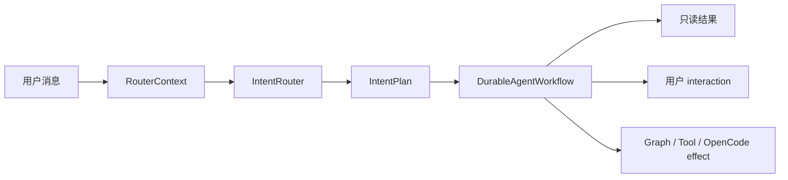

# 意图路由

`IntentRouter` 把用户输入转换为结构化 `IntentPlan`。它决定 durable workflow 走哪条 phase 路径，但不直接执行工具、写 Graph 或发布应用。

## 1. 路由上下文

路由输入由以下信息组成：

- 当前用户消息、会话语言和模型快照；
- 已安装应用的 manifest、intent 与 schema 引用；
- 有上限的 `GraphSnapshot`；
- 可用 capability 摘要；
- fast model（未配置时回退到会话 primary model）。

生成模型必须通过 `classify_intent` tool schema 返回完整参数。未知 kind 转为 `clarify`；未获得可用 tool call 或普通调用异常时，默认回退为 `converse`，其 `confidence` 为 0。旧 Router 的 `confidence` 是模型自评分，没有自动按低分降级的门槛；配置错误与预算耗尽仍由上层处理。标记为 deprecated 的计划被 durable workflow 拒绝。

可选 Jev 分类层返回独立的 `RouteDecision`，不替代上述完整 `IntentPlan`。它的概率门控与旧生成模型的自评分是两个不同机制，见第 6 节。

## 2. 顶层 IntentKind

| Kind | 用途 | 主要后续路径 |
| --- | --- | --- |
| `converse` | 普通对话和有界只读 tool loop | Converse phase |
| `graph_query` | 只读结构化查询 | Graph query phase |
| `graph_mutation` | 一批明确 Graph action | preflight → 必要确认 → atomic apply |
| `widget_create` | 创建新应用 | plan → confirm → staging → verify → publish |
| `widget_modify` | 修改已有应用 | plan → confirm → staging → verify → publish |
| `multi_intent` | 有顺序的多个子动作 | 全量预检后按 saga step 执行 |
| `plan_and_act` | 需要显式计划的复合动作 | 与 durable multi-step 路径汇合 |
| `clarify` | 缺少必要信息或无法安全分类 | 创建用户 interaction 或澄清消息 |

`IntentPlan` 还包含 `confidence`、`rationale`，并按 kind 使用 `app_id`、`instruction`、`actions`、`query`、`sub_intents` 或 `clarification_*` 字段。

## 3. SubIntent

`multi_intent` 与 `plan_and_act` 可以包含：

- `converse`
- `graph_mutation`
- `graph_query`
- `widget_create`
- `widget_modify`
- `widget_extend_schema`
- `widget_fix_code`
- `widget_rewrite`

Reducer 在第一个副作用前预检完整列表，然后顺序执行并在每一步 checkpoint。前一步输出可以供后一步使用；失败时根据已持久化的 effect 和 recovery 数据继续或进入 `needs_attention`，而不是依赖旧的内存 DAG。

## 4. 路由与执行的边界


```mermaid
flowchart LR
    Message[用户消息] --> Context[RouterContext]
    Context --> Router[IntentRouter]
    Router --> Plan[IntentPlan]
    Plan --> Reducer[DurableAgentWorkflow]
    Reducer --> Read[只读结果]
    Reducer --> Interaction[用户 interaction]
    Reducer --> Effect[Graph / Tool / OpenCode effect]
```

- 路由结果只是计划，不是授权。
- Graph action 仍须经过 schema preflight。
- Widget 仍须经过 staging、controller 验证和 schema verification。
- Tool/MCP/OpenCode 仍须经过对应权限与 lifecycle policy。
- 同一 Run 使用启动时冻结的模型选择和非秘密 Jev 配置；中途修改配置只影响下一个 Run。Jev API key 不进入 Run 快照。

## 5. `/` 显式路由命令

`/` 命令是一层轻量路由 DSL，不是新的执行器。前端通过
`GET /api/chat/commands` 获取同一份命令定义、参数结构，以及当前全部 App/Skill ID；
后端重新解析原始消息并编译成 `IntentPlan`，因此不能通过伪造前端 payload 绕过
Router、审批或 durable reducer。

| 命令 | 编译结果 | 参数 |
| --- | --- | --- |
| `/ask` | `converse` | 自然语言指令 |
| `/app` | `widget_modify` | 已安装 App ID + 指令 |
| `/create` | `widget_create` | 新 App ID + 指令 |
| `/query` | `graph_query` | 自然语言查询；受约束 Router 生成结构化 `query` |
| `/mutate` | `graph_mutation` | 自然语言变更；受约束 Router 生成结构化 `actions` |
| `/skill` | `converse` | 已安装 Skill ID + 指令 |

一条消息最多包含 8 个命令。多个命令按书写顺序编译为一个 `multi_intent`，完整预检后
由 saga 顺序执行，例如：

```text
/query 列出未完成任务 /mutate 新建“发布版本”任务 /app planner 增加周视图
```

普通文字出现在第一个命令前时，会作为最前面的 `converse` 子步骤保留。若指令需要包含
形如 `/query` 的字面量，可写成 `\/query`。未知 `/word` 始终保留为普通文本。

命令只提高意图表达精度，不扩大权限：

- `/query` 与 `/mutate` 只约束结构化路由结果；前者仍为只读，后者仍须 Graph
  preflight 与用户确认。
- `/app` 与 `/create` 仍进入计划、Schema、staging、校验和发布流程。
- `/skill` 可在同一消息中出现多次；所有 Skill ID 在 route phase 一次性解析并固定。
  外部 Skill 仍强制进入只读语义沙箱，不能与同一消息中的 effect 命令组合执行。
- 包含多个只读对话步骤时，每一步只看到自己的指令；客户端最终只得到一条按顺序合并的
  durable 回复，恢复不会重复调用或重复投影。

执行细节见 [Agent Harness](/agent/harness.md) 和[持久 Run](/architecture/runs.md)。

## 6. 可选 Jev 分类层

Jev 通过独立的 TypeSafe API 判断八类顶层 kind，并在已安装 App 候选及 `none`、`multiple` 中选择目标。`RouteDecision` 保留完整概率分布、供应商 confidence、实际模型版本与候选 App 证据；它不生成 Graph 参数、新 App ID、澄清问题或有序子意图。

| 模式 | 行为 |
| --- | --- |
| `off`（默认） | 使用现有 Router，不调用 Jev |
| `shadow` | 先调用 Jev 并记录证据，再由现有 Router 生成完整 `IntentPlan`；增加一次受超时限制的往返 |
| `cascade`，`intent_parameters` 有效模式未启用级联 | 保持兼容路径：只有通过门控的高置信 `converse` 可以省略生成 Router |
| `cascade`，且 `intent_parameters` 有效模式为 `cascade` | 采用有效 kind/目标决策，让生成模型仅补参数；Graph 模板须另有该用途的级联模式，编译失败回退完整 Router |

级联门控检查最高 kind 概率及它与第二名的差值，并验证响应、上下文上限及候选 App 的一致性。直达 `converse` 不能指向某个 App 或 `multiple`；有候选 App 分布时，`none` 也须通过同样的概率与差值门槛。门控未通过时回退生成 Router，不直接向用户请求澄清。`clarify` 是否合适由完整生成计划决定。

只有旧路由级联启用时，Graph/App/复合/澄清仍走完整生成路径。双级联模式中的 `IntentGenerationTask` 固定 kind、目标 App 和 `decision_hash`，使用 `generate_intent_parameters` 让模型补齐自由参数；编译拒绝重选固定字段、旧 hash 和缺参数计划。`graph_query` 标签不会被包装成 `query={}`；已知 Schema 的单实体无过滤列表模板可编译成带 type/limit 的只读 query，复杂 filters、排序、计数、日期条件及自由文本 mutation 继续生成。

复合候选只有在所有参数完整、全计划语义复核接受时才省去第二层 refiner；次序和目标保持固定，仍在首个副作用前整体 preflight。高置信 `converse` 直达保留原始用户指令，并沿用有界只读对话流程。显式 `/` 命令在 Jev 前编译；`/query` 和 `/mutate` 仍按已明确的 kind 补齐参数。外部 Skill 继续先进入只读语义沙箱，绕过 Jev。

新环境配置默认 `routing-context-v2`，按路由用途只投影一次完整请求、App 候选、已选历史/摘要和 Graph 类型计数，不重复完整 App manifest 或全 capability catalog。projection 不再截断已有请求或候选以取得可执行分类；超限即回退。缺版本字段的历史快照使用 `routing-context-v1`，恢复不因新默认而更换上下文语义。

后端环境配置如下；将 key 注入后端运行环境，不要写入仓库、Run 快照或日志：

| 环境变量 | 默认值 | 用途 |
| --- | --- | --- |
| `TYPESAFE_API_KEY` | 未设置 | TypeSafe API key，仅在调用时读取 |
| `JEV_ROUTER_MODE` | `off` | `off`、`shadow` 或 `cascade` |
| `JEV_ROUTER_MODEL` | `jev-1.13.0` | 固定 `jev-x.y.z` 版本；不接受浮动别名 |
| `JEV_ROUTER_TIMEOUT_SECONDS` | `1.5` | 请求超时，秒 |
| `JEV_ROUTER_MIN_PROBABILITY` | `0.95` | 直达所需的最高 kind 概率 |
| `JEV_ROUTER_MIN_MARGIN` | `0.15` | 最高与第二名 kind 概率的最小差值 |
| `JEV_ROUTER_MAX_STATE_CHARS` | `48000` | Jev state 字符上限；超过上限即回退，不截断后直达 |
| `JEV_ROUTER_CONTEXT_VERSION` | `routing-context-v2` | 新 Run 的专用上下文投影；兼容 `routing-context-v1` |

非秘密配置和分类规则版本在 Run 启动时冻结于 `model_snapshot.jev_router`，并通过 `RunContext.jev_router` 传递。配置只接受固定 `jev-x.y.z` 版本，拒绝 `jev-latest`、`jev-preview`；响应中的实际版本必须与 Run 配置精确一致。非法环境配置会拒绝创建新 Run；没有 Jev 配置快照的历史 Run 按 `off` 恢复。缺 key、超时、HTTP 错误、非法响应、上下文过大和低置信都沿用旧 Router；错误不会伪造有效概率或完整计划。

`LLMAuditLog` 的 `route_decision` stage 记录 Jev 分类证据、规则及模型版本、usage 和延迟；`response.routing` 保存模式、原因、完整 decision、最高概率与差值、非秘密配置、最终计划 kind 及两条路径的 kind 是否一致。原因包括 `shadow_mode`、`intent_uncertain`、`requires_generated_plan`、`direct_converse`、`target_conflict`、`target_uncertain`，服务失败使用固定错误码。HTTP 200 返回的 decision 无效时，仍保留可验证的安全 usage 和模型字段。生成 Router 的 `route` 与 `route_refine` stage 同时保存供应商返回的 usage；网络超时等情况的未知费用不视为零，Jev `cost_usd` 按官方单价估算。审计不包含认证 header 或 key。

Jev 与后续生成共用本次路由的墙钟预算；生成阶段只接收扣除 Jev 耗时后的剩余时间。两次模型调用均计入原有调用与用量限制，预算耗尽和取消向上层传播，不作为服务故障回退。

参数生成的审计 stage 为 `intent_generate`；`response.routing` 还保留 projection metadata、`generation_task` 绑定及生成失败的回退原因。Graph 模板与复合复核使用 `decision:graph_query_template`、`decision:composite_review`，便于分开统计判断、生成与整条流程成本。

建议先在测试环境使用 `shadow`，以相同上下文评估中文、跨轮指代、数据操作与代码修改混淆、复合请求及只读误入副作用路径；记录 coverage、回退率、完整链路延迟和费用。真实数据验收前保持默认 `off`。实现边界和离线评分命令见仓库中的 `proposals/jev-intent-router/IMPLEMENTATION.md`；研究结论及评估用例保留在同目录。

通用判断的冻结配置位于 `model_snapshot.workflow_decisions` / `RunContext.workflow_decisions`，默认 `off`，历史快照缺字段时也按 `off` 恢复。`DecisionConfig.stage_modes` 随配置保存用途模式字典，环境变量 `JEV_DECISION_STAGE_MODES` 默认 `{}`，缺项继承 `JEV_DECISION_MODE`。仅接受 `intent_parameters`、`graph_query_template`、`schema_selection`、`composite_review`、`development_plan_review` 五个用途，以及 `off`、`shadow`、`cascade` 三种模式；非法 JSON、用途或模式拒绝快照，旧配置缺字典按 `{}` 恢复。用途模式不涉及 key，也不改变已有 Run 的冻结配置。

实测合成用例中多项 Noul 判断未过门槛，可只对路由参数生成启用 `cascade`，其他阶段先旁路或关闭；这不代表语义质量已提高。下面的配置启用参数生成，保留其他用途的付费 `shadow` 证据：

```dotenv
JEV_ROUTER_MODE=cascade
JEV_DECISION_MODE=off
JEV_DECISION_STAGE_MODES='{"intent_parameters":"cascade","graph_query_template":"shadow","schema_selection":"shadow","composite_review":"shadow","development_plan_review":"shadow"}'
```

Score 的两位小数舍入兼容校验保留严格类型、范围、概率总和、keys 和 legend，并检查 `p ± 0.005`、真实总和为 1 下的加权期望范围与 `score ± 0.005` 是否相交；只保留供应商分数，不改 Choice/Noul 门槛。该规则来自实测推断，详见[Agent Harness](/agent/harness.md)。完整接口、配置与故障轨迹设计见仓库 `proposals/decision-generation-harness/DESIGN.md`；这些判断不替代用户审批、权限或确定性校验。
