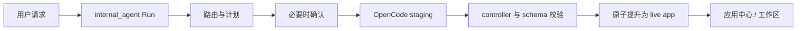

# Widget 与应用中心

“Widget”指可在工作区中渲染的 React UI；“App”指带有持久 manifest 和 controller 产物的 Widget；“Capability”指应用中心中可调用但不一定已有 UI 的 skill、MCP 或其他后端能力。

## 1. App 产物

每个应用位于 `workspace/apps/<app-id>/`：

```text
<app-id>/
├── manifest.json      # 必需：身份、版本、intent、schema 和 backend 信息
├── controller.js      # 必需：默认导出的 React 组件
└── README.md          # 可选：应用说明
```

旧的 `index.html` 和 `style.css` 只作为兼容源文件被识别；当前生成路径只允许 `controller.js`、`manifest.json` 和 `README.md`，不应再新建三文件 HTML/CSS/JS Widget。

Manifest V1 的必填字段为：

```json
{
  "manifest_version": 1,
  "id": "task-board",
  "title": "Task Board",
  "description": "Manage tasks",
  "app_version": "1.0.0",
  "intents": ["manage tasks"],
  "schema_refs": ["Task"]
}
```

`id` 必须与目录名相同并使用小写 kebab-case。可选 `backend_type` 为 `code`、`agent` 或 `mcp`；MCP/agent 应分别提供对应配置。

## 2. Controller 加载

`controller.js` 默认导出一个 React 组件。宿主使用 `@babel/standalone` 转译模块，再通过 `new Function("exports", "React", "ambient", ...)` 执行并渲染导出组件。

```javascript
export default function TaskBoard({ ambient }) {
  const { useEffect, useState } = ambient.react;
  const { Card, Text } = ambient.components;
  const [tasks, setTasks] = useState([]);

  useEffect(() => ambient.graph.subscribe({ type: "Task" }, setTasks), []);
  return ambient.html`<${Card} title="Tasks"><${Text} text=${`${tasks.length} items`} /></${Card}>`;
}
```

运行时提供 `ambient.graph`、`ambient.runs`、`ambient.capabilities`、`ambient.mcp`、React hooks、HTM 和标准组件。完整接口见 [ambient SDK](/widgets/sdk.md)。

## 3. 创建、修改与发布



- 新应用和修改都先写 staging，live 目录在批准与校验前保持不变。
- controller 必须包含默认导出，通过大小、UTF-8、模块语法与 host-capability 规则检查。
- `SchemaVerificationService` 从 controller 提取 Graph 使用，与有效 schema 比较；需要扩展 schema 时先生成 proposal 并走确认流程。
- 发布以 artifact hash 和 Run effect 记录保护；恢复时会验证 staged/live 产物，避免重复或错误提升。

## 4. 应用中心

`GET /api/app-store` 合并三类条目：

- `generated_app`：已有 manifest 和 UI 的工作区应用；
- `skill`：BackendManager 发现的 skill 能力；
- `mcp`：MCP server/tool 能力。

条目状态为 `ready`、`needs_ui`、`generating` 或 `unavailable`。没有 UI 的 capability 可以通过 `/api/capabilities/{catalog_id}/ui` 启动持久 UI 生成 Run；生成成功后将 capability 与新 app 绑定。

应用中心布局使用带 `revision` 的持久记录。`PUT /api/app-store/layout` 发现并发 revision 冲突时返回 `409`，客户端必须重新加载后再提交。

## 5. 数据与能力边界

- Widget 不拥有独立数据模型；持久业务数据使用 Graph schema。
- `ambient.graph.mutate` 由后端预检并原子写入；不要使用已弃用的 `ambient.model`。
- `ambient.capabilities.invoke` 和 `ambient.runs.start` 创建持久 Run，不应绕过确认和 effect 记录。
- `ambient.mcp.callTool` 仍由后端按 manifest、tool identity 和权限策略校验。
- controller 与宿主同 realm 执行，只应加载可信代码。详见[运行边界](/widgets/sandbox.md)。
