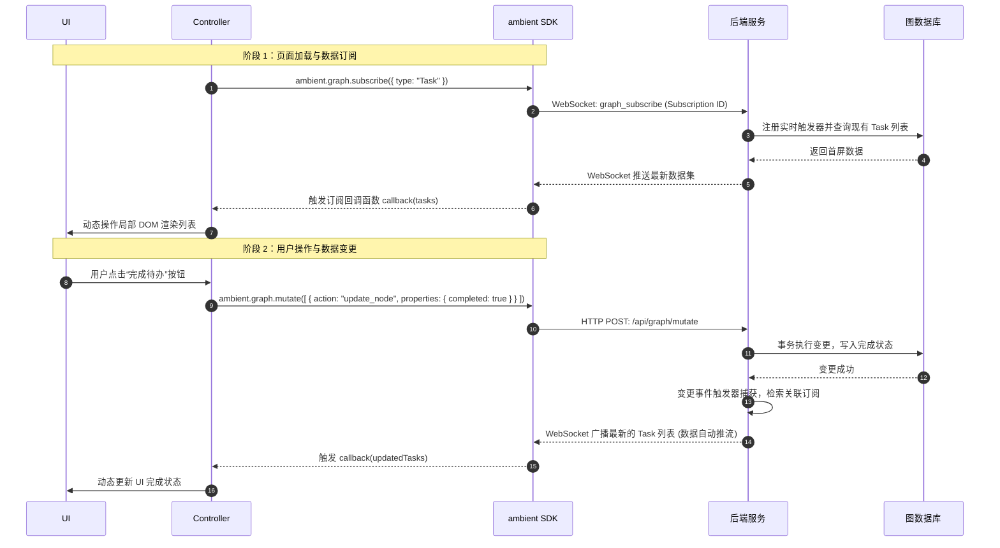

# Widget (Apps) 架构设计

在 Ambient Agent 中，**Widget（又称 Apps）** 是由大语言模型动态生成并在前端 Canvas 工作区中挂载运行的微型交互卡片。为了在保障系统安全的同时提供极高的灵活性与响应速度，Widget 采用了类似于 MVC 的 **UI (View) - Controller (Logic) - Data (Model)** 解耦设计，并通过隔离沙箱和响应式通信链路进行高效协作。

## 1. 核心层解耦设计

Widget 的代码与状态在结构上被拆分为独立的三个层次，互不干扰，通过标准接口进行数据通信：

```
┌────────────────────────────────────────────────────────┐
│                      SandboxWidget                     │
│                                                        │
│   ┌────────────────┐   ┌──────────────┐   ┌────────┐   │
│   │    UI (View)   │   │  Controller  │   │  Data  │   │
│   │  HTML + Scoped │◀──│  JS Closure  │──▶│  SDK   │   │
│   │      CSS       │   │(new Function)│   │ State  │   │
│   └────────────────┘   └──────────────┘   └────────┘   │
└───────────────────────────────▲────────────────▲───────┘
                                │                │       
                                HTTP POST        WebSocket
                                (Mutate)         (Subscribe)
                                │                │       
┌───────────────────────────────▼────────────────▼───────┐
│                      Backend Server                    │
└────────────────────────────────────────────────────────┘
```

### A. UI 层
- **HTML 结构**: 定义在 XML 的 `<html-content>` 块中。它描述了卡片的骨架与基础 DOM，支持嵌入 Tailwind CSS 工具类以进行声明式样式排版。
- **CSS 隔离**: 定义在 XML 的 `<css-styles>` 块中。为了防止 Widget 样式污染系统主界面，前端 `SandboxWidget` 会在挂载时对 CSS 规则执行 Scoping 编译，将所有选择器绑定到该 Widget 唯一的 Scope ID（例如 `[data-widget-scope="widget-1a2b"]`）前缀上。

### B. Controller 层
- **JS 闭包**: 定义在 XML 的 `<js-script>` 块中。Widget 的交互逻辑在一个隔离的 `new Function("root", "ambient", "fetch", ...)` 闭包中动态执行。
- **DOM 限制**: 闭包只接收一个指向该卡片局部根节点的 `root` 变量。Widget 内部必须使用 `root.querySelector` 而非全局 `document.querySelector` 进行节点检索，从而彻底杜绝了 Widget 篡改系统 UI 或窃取其他卡片隐私的风险。
- **事件绑定**: 负责将用户在 UI 上的操作（如点击、输入）转化为具体的业务逻辑动作，调用 `ambient` API 触发状态更新。

### C. Data 层
- **局部临时状态**: 使用 `ambient.state` 进行管理，适用于跨组件的轻量级状态传递和单页布局的数据存取。
- **持久化图数据**: Widget 的长期业务数据全部托管在后端的 SQLite 图数据库中。Widget 内部通过调用 `ambient.graph.subscribe` 声明式地监听目标 Schema，或者通过 `ambient.graph.mutate` 提交原子事务变更。

## 2. 三层协作与响应式数据流

Widget 的核心优势在于 **“响应式订阅 (Reactive Subscription)”**。Controller 层不需要主动轮询数据库，而是依靠 WebSocket 管道与后端保持实时一致。

以下展示了 Widget 在“加载初始化”以及“发生用户操作修改数据”时的完整协作过程：



## 3. 设计原则与最佳实践

为了保证 Widget 的健壮度与系统整体性能，开发与生成 Widget 时应遵循以下基本原则：

1. **单向数据流与零手动拉取**: 
   - 严禁在 Widget JavaScript 中使用周期性 `setInterval` 轮询后端 API 来同步数据。
   - 必须使用 `ambient.graph.subscribe` 建立起持久的响应式链路。数据源的变化会自动向下流动，驱动 UI 的重新渲染。

2. **视图与逻辑的彻底分离**: 
   - HTML 保持纯净的结构呈现；样式均写在 Scoped 样式表内。
   - 交互逻辑一律收拢在 JavaScript 中，通过 `root.addEventListener` 动态绑定，不要在 HTML 中写 inline `onclick="..."`。

3. **轻量级状态持久化**:
   - 避免将海量的数据存放在全局 JavaScript 局部变量中。
   - 需要跨越生命周期（卡片刷新或全屏切换）的信息，应尽量依托图数据库（Node/Edge）或者 `ambient.state` 存储，从而使得 Widget 具备高容错性和天然的多端同步性。
