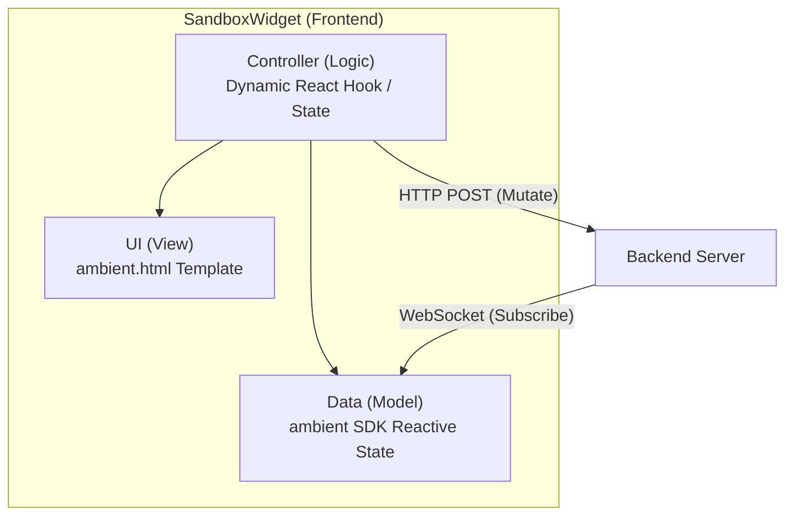
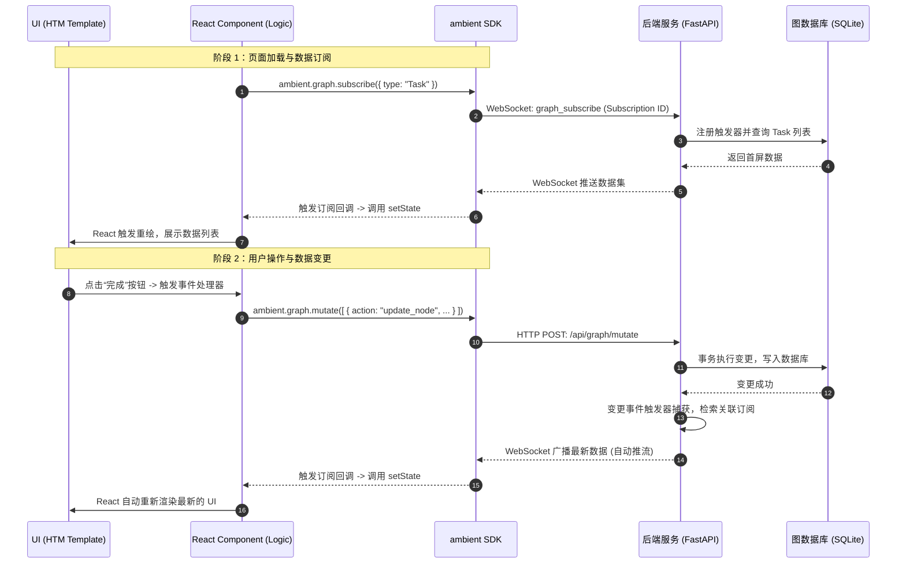

# Widget (Apps) 架构设计

在 Ambient Agent 中，**Widget（又称 Apps）** 是由大语言模型动态生成并在前端 Canvas 工作区中挂载运行的微型交互卡片。为了在保障系统安全的同时提供极高的开发灵活性与响应速度，Widget 采用了 **React + HTM 统一渲染架构**，通过隔离沙箱和响应式通信链路进行高效协作。

## 0. 统一 React + HTM 渲染模式

系统全面采用统一的 **React 组件 + HTM 模板** 渲染方案。大模型生成的 Widget XML 采用如下标准格式：

```xml
<ambient-widget>
  <js-script>
    const { useState, useEffect } = ambient.react;
    const { Card, Button, Text, Column } = ambient.components;

    export default function App() {
      const [count, setCount] = useState(0);
      
      return ambient.html`
        <${Card} title="计数器 App">
          <${Column} gap="12px">
            <${Text} text="当前计数: ${count}" />
            <${Button} label="增加" onClick=${() => setCount(count + 1)} />
          <//>
        <//>
      `;
    }
  </js-script>
</ambient-widget>
```

> [!NOTE]
> 历史版本的 HTML 模板、Scoped CSS 文件以及 A2UI JSON 声明式布局已废弃并全部移除。

### 核心特性
1. **动态编译**: 前端通过嵌入的 `@babel/standalone` 在浏览器端动态转译 ES 模块化的 Widget 脚本。
2. **HTM 声明式模板**: 利用轻量级的 `htm` 库（绑定在 `ambient.html`），以原生的 JS 模板字符串语法编写 JSX，免去了复杂的编译流水线。
3. **预置优质组件**: 前端注入了统一设计语言的组件库（`ambient.components`），确保生成卡片的外观和系统主题保持高度一致，具备极佳的高级质感与响应式设计。

---

## 1. 核心层解耦设计

Widget 采用典型的 **UI (View) - Controller (Logic) - Data (Model)** 架构：



### A. UI 层 (View)
- Widget 的界面完全通过 `ambient.html` 语法描述，使用预置组件库（如 `Card`, `Button`, `Text`, `Column`, `Row`, `TextField`, `Checkbox`, `List`, `Table`）。
- 样式遵循系统的 Vanilla CSS 规范设计，Widget 开发者可以通过组件的 props 直接控制边距、对齐和主题表现。

### B. Controller 层 (Logic)
- Widget 逻辑以标准的 React 函数组件（需 `export default` 导出）运行，可以使用所有的 React Hooks（通过 `ambient.react` 注入，包括 `useState`, `useEffect`, `useMemo`, `useRef` 等）。
- 事件处理函数直接绑定在 React 组件的事件属性上（例如 `onClick=${handleClick}`），无需执行繁琐的手动 DOM 操作。

### C. Data 层 (Model)
- **局部状态**: 使用标准的 `useState` 或 `useReducer` 进行卡片内部轻量状态管理。
- **持久化与共享数据**: 通过后端 SQLite 提供支撑。使用 `ambient.graph.subscribe` 订阅实体图的变化；使用 `ambient.graph.mutate` 提交原子事务变更。
- **工具链集成**: 使用 `ambient.mcp.callTool` 直接调用系统注册的 MCP 工具。

---

## 2. 三层协作与响应式数据流

Widget 的核心优势在于 **“响应式订阅 (Reactive Subscription)”**。组件不需要主动轮询数据库，而是依靠 WebSocket 管道与后端保持实时一致。



---

## 3. 开发原则与最佳实践

为了保证 Widget 的健壮度与系统整体性能，开发与生成 Widget 时应遵循以下基本原则：

1. **单向数据流与零手动拉取**: 
   - 严禁在 Widget 中使用 `setInterval` 轮询后端 API 来同步数据。
   - 必须使用 `ambient.graph.subscribe` 建立起持久的响应式链路。数据源的变化会自动向下流动，驱动 UI 重新渲染。

2. **声明式 UI 渲染**:
   - 严禁使用任何 `document.querySelector` 或 `root.querySelector` 等命令式 DOM 操作去修改视图。所有交互和数据渲染都必须通过 React 状态管理。

3. **使用标准组件库**:
   - 优先使用 `ambient.components` 导出的高质量组件，确保系统设计系统（Design System）的统一性和交互的高级质感。
