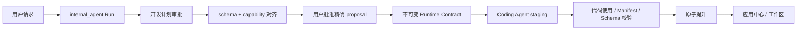

# Widget 与应用中心

“Widget”是可在工作区渲染的 React UI；“App”是带持久 Manifest V2 和 Controller 的 Widget；“Capability”是应用中心中可调用、但不一定有 UI 的后端动作。App 只能通过批准的 capability grants 访问宿主或外部资源。

## 1. App 产物

```text
workspace/apps/<app-id>/
├── manifest.json      # 必需：身份、schema refs 和精确 capability grants
├── controller.js      # 必需：默认导出的 React 组件
├── README.md          # 可选：应用说明
└── data/              # 可选：受 file.* grant 约束的私有运行数据
```

Manifest V2 是唯一可加载与发布的格式：

```json
{
  "manifest_version": 2,
  "id": "task-board",
  "title": "Task Board",
  "description": "Manage tasks",
  "app_version": "1.0.0",
  "intents": ["manage tasks"],
  "schema_refs": ["Task"],
  "capabilities": [
    {"id": "graph.query", "scope": {"entities": ["Task"]}},
    {
      "id": "graph.mutate",
      "scope": {"entities": ["Task"], "operations": ["create", "update", "delete"]}
    }
  ]
}
```

`id` 必须与目录名相同并使用小写 kebab-case。没有外部访问的 App 仍必须写 `"capabilities": []`。V1、顶层 `data_sources`、`index.html`、`style.css`、`layout.json` 和 `index.jsx` 不属于新版本产物，也不会隐式迁移或加载。

## 2. Controller 与最小 SDK

`controller.js` 默认导出一个 React 组件。宿主转译模块后，只根据 Manifest 中批准的 grants 构造 `ambient` capability membrane。

```javascript
export default function TaskBoard({ ambient }) {
  const { useEffect, useState } = ambient.react;
  const { Card, Text } = ambient.components;
  const [tasks, setTasks] = useState([]);

  useEffect(() => ambient.graph.subscribe({ type: "Task" }, setTasks), []);
  return ambient.html`<${Card} title="Tasks"><${Text} text=${`${tasks.length} items`} /><//>`;
}
```

本例的 `ambient.graph.subscribe` 只有在 `graph.query` grant 存在且包含 `Task` 时才会注入。若 App 没有 `network.request`，`ambient.net` 不存在；若没有任何 `file.*` grant，`ambient.files` 不存在。所有请求在后端再次使用持久 Manifest 授权。

## 3. 创建、修改与发布



- 用户拒绝 capability proposal 时不启动 Coding Agent。
- 修改已有 App 时，当前 grants 会进入 proposal；任何扩大或替换都需要用户明确批准。
- Coding Agent 只获得批准的 schema、grants、SDK 子集和允许文件列表。
- Controller 的 capability ID、source ID、catalog ID、action ID 必须是可静态提取的字符串字面量。
- Verifier 要求 staging Manifest 的规范化 grants 与 Runtime Contract 完全相等，并要求代码使用是它的子集。
- live 目录在批准和校验完成前保持不变；恢复时使用 artifact hash、grants digest 和 Run effect 记录防止错误提升。

详细 contract 见 [Widget 能力安全架构](/architecture/capability-security.md)。

## 4. 应用中心

`GET /api/app-store` 合并 `generated_app`、`skill` 和 `mcp` 条目。没有 UI 的能力可启动持久 UI 生成 Run；生成的 UI 必须申请只允许目标 `catalog_id + action_id` 的 `capability.invoke` grant，不能直接绑定 provider、MCP server 或 tool name。

条目状态为 `ready`、`needs_ui`、`generating` 或 `unavailable`。布局以 revision 乐观并发控制；冲突返回 `409`，客户端重新加载后再提交。

## 5. 数据与能力边界

- Graph 只保存用户上下文；App cache、cursor、UI state 和原始 provider payload 放在 `data/`。
- `graph.query` 与 `graph.mutate` 分开授权，并进一步限制 entity、operation 和 edge type。
- `network.request` grant 同时声明 source 的公开 HTTPS origin、path、method 和响应上限；Controller 不传完整 URL。
- `file.*` 只访问 `app://data/`，不能读取 Manifest、Controller、会话、Graph 或凭据。
- `capability.invoke` 只调用精确批准的应用中心 action；直接 `ambient.mcp` 已从 Widget SDK 删除。
- Grant 只代表 App 可以发起请求；Run interaction、adapter spawn permission、输入/输出 schema、幂等和恢复 policy 继续执行。

运行时错误使用稳定的 `code`、`capability`、`operation`、`hint` 和安全 `details`，并写入有界审计/诊断，供后续修复使用。
