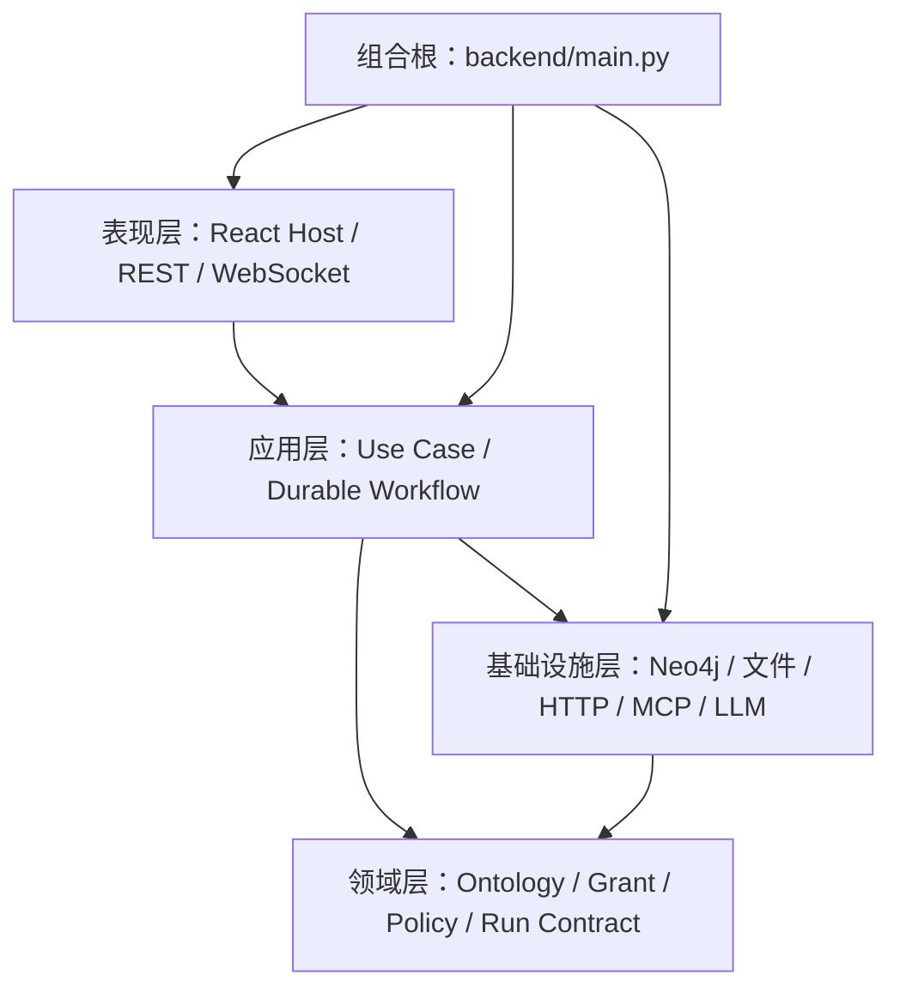
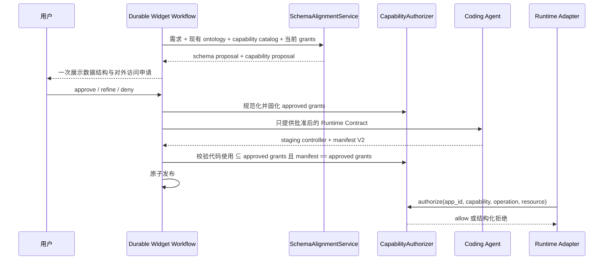

# Widget 能力安全架构

本页是 Widget 对外访问能力的规范。凡是 Controller 需要读取外部数据、访问文件、查询或修改 Graph、调用已安装能力，都必须先声明、在 schema 对齐阶段获得用户批准，并在运行时逐次授权。未声明、未批准或超出 scope 的访问一律失败关闭。

## 1. 分层与依赖方向



依赖只能指向内层抽象：

- 领域层定义 capability 类目、grant 值对象、scope 规则和拒绝原因，不依赖 FastAPI、React、Neo4j 或具体 SDK。
- 应用层编排“提出申请、等待审批、固化授权、执行访问”，不在 route 或组件内复制策略。
- 基础设施层实现 Graph、HTTP、App 文件和已安装 Capability adapter；每个 adapter 在产生副作用前调用同一个 authorizer。
- 表现层只收集用户决策和转发命令。前端隐藏某个方法不是授权，后端检查才是最终边界。
- `backend/main.py` 只负责装配对象和传递依赖，不承载 capability 业务规则。

## 2. Capability Ontology

Capability ontology 与 `ambient-context` 数据本体都属于系统领域模型，但承担不同职责：数据本体定义“Graph 中可以存什么”，capability ontology 定义“App 可以对什么资源执行什么操作”。类目 ID 是稳定契约，不允许 App 自造。

| 类目 ID | SDK | scope 的最小字段 | 说明 |
| --- | --- | --- | --- |
| `graph.query` | `ambient.graph.subscribe` | `entities` | 只读取列出的本体实体；include 的目标实体也必须在 scope 内 |
| `graph.mutate` | `ambient.graph.mutate` | `entities`, `operations` | 对列出的实体执行 `create`、`update`、`delete`；边操作还受 `edge_types` 约束 |
| `network.request` | `ambient.net.request` | `sources` | 访问声明的 HTTPS JSON source；source 固定 origin、path、method 和响应上限 |
| `file.read` | `ambient.files.read/list` | `paths` | 读取 App 私有 data 目录内匹配的相对路径 |
| `file.write` | `ambient.files.write` | `paths`, `max_bytes` | 原子写入 App 私有 data 目录；禁止路径逃逸与符号链接 |
| `file.delete` | `ambient.files.delete` | `paths` | 删除 App 私有 data 文件，不删除目录或 App 产物 |
| `capability.invoke` | `ambient.capabilities.invoke` | `catalog_ids`, `actions` | 只调用应用中心中精确列出的能力与 action；MCP 只能通过该入口间接使用 |

`sendMessage`、窗口控制、主题、React hooks、HTM 和系统 UI 组件是无外部数据权限的 host feature，不属于 grant。新版本不再向生成的 Widget 暴露任意 `fetch`、原始 WebSocket、`ambient.mcp`、任意工作区文件系统或通用 shell。

## 3. Grant 契约

App manifest V2 必须包含 `capabilities`；没有任何外部访问的 App 使用空数组。每个 grant 只有 ontology 中已注册的 `id` 和该类目允许的 `scope`。

```json
{
  "manifest_version": 2,
  "id": "daily-planner",
  "title": "Daily Planner",
  "description": "Plans tasks with public weather context",
  "app_version": "1.0.0",
  "intents": ["plan my day"],
  "schema_refs": ["Task", "Event"],
  "capabilities": [
    {
      "id": "graph.query",
      "scope": {"entities": ["Task", "Event"]}
    },
    {
      "id": "graph.mutate",
      "scope": {"entities": ["Task"], "operations": ["create", "update"]}
    },
    {
      "id": "network.request",
      "scope": {
        "sources": {
          "forecast": {
            "base_url": "https://api.open-meteo.com",
            "paths": ["/v1/forecast"],
            "methods": ["GET"],
            "response_limit": 1048576
          }
        }
      }
    }
  ]
}
```

规范化后的 grant 必须满足：

- 不接受未知类目、未知 scope 字段、重复 grant、空 resource 列表或通配的网络 origin。
- 所有数组去重并排序；manifest revision 和 grants digest 随批准结果持久化。
- 修改 grant、网络 origin/path/method、Graph 实体或 mutation operation 都是权限扩大，必须重新经过 schema 对齐审批。
- Controller 产物中的 capability 使用必须是字符串字面量，并且是批准 grant 的子集。
- Manifest 不能在 codegen 阶段自行扩大批准结果；staging 校验比较批准 grant 与产物 manifest 的规范化值。

## 4. 从申请到执行



Schema 对齐 interaction 的 proposal 是一个原子对象：

```json
{
  "schemas": {"reused_schemas": [], "new_schemas": []},
  "capabilities": [
    {"id": "graph.query", "scope": {"entities": ["Task"]}}
  ]
}
```

用户批准的是精确值，不是“信任这个 App”。拒绝时不进入 codegen；refine 时模型必须同时保留未被反馈改变的 schema 与 grants。

## 5. 三层执行与失败关闭

| 层 | 检查 | 目的 |
| --- | --- | --- |
| 发布静态检查 | 禁止 host global/import/dynamic code；提取 `ambient.*` 调用并与 grant 对齐 | 在产物进入 live 前发现越权代码 |
| SDK membrane | 只构造获批类目的 SDK 方法；每次请求自动绑定当前 `app_id` | 缩小可发现接口并避免 Controller 选择其他 App 身份 |
| 后端 authorizer | 从持久 manifest 重新读取 grants，验证 operation/resource，再调用 adapter | 不信任前端、WebSocket payload 或 Controller 声明 |

任何一层不能解析请求时都拒绝。稳定错误包含 `code`、`capability`、`operation` 和安全的 `details`；不得返回 secret、绝对宿主路径或无界上游响应。所有允许与拒绝结果进入审计记录。

## 6. 资源边界

### Graph

- query 顶层 `type` 必须明确且出现在 `graph.query.entities`；不允许“查询所有类型”。
- include 的 `target_type` 必须明确且获批。
- mutation 先由 Graph adapter 预检并解析节点真实类型，再由 authorizer 检查 entity、operation 和 edge type，最后进入 durable effect boundary。
- Graph mutation grant 不替代单次高风险操作的 Run interaction；授权回答“App 能否申请”，interaction 回答“这次 effect 是否执行”。

### Network

- Controller 只传 source ID、相对 path、method、query 和 JSON body。
- origin、允许 path/method 和 response limit 全部来自批准 grant；禁止 redirect、环境代理、localhost、IP literal 和私网/保留地址。
- OAuth、secret、签名或专有 SDK 不进入 Widget；它们由应用中心能力 adapter 持有，Widget 只申请 `capability.invoke`。

### Files

- `app://data/` 是唯一 Widget 文件根；manifest、controller、README、staging、会话、Graph 和 LLM 凭据永远不可见。
- path 必须是规范化 POSIX 相对路径，拒绝空路径、绝对路径、`..`、NUL、符号链接和不匹配的 glob。
- write 使用临时文件、`fsync` 和原子替换；delete 只删除精确获批的普通文件。

### Installed capabilities

- Widget 不直接选择 MCP server、tool 或 remote Agent URL。
- `catalog_id + action_id` 必须同时在 `capability.invoke` scope 中，输入/输出仍按 Capability Manifest schema 校验。
- adapter 的 spawn permission、deadline、幂等、恢复和审计策略继续生效；Widget grant 不能放宽 adapter policy。

## 7. 版本、撤销与迁移

- Manifest V2 是新版本唯一可发布格式；V1、`data_sources` 顶层字段和直接 `ambient.mcp` 不再进入新运行路径。
- 撤销 grant 会生成新的 manifest revision，立即影响新请求；已在执行的持久 Run 按其不可变授权快照完成或进入 `needs_attention`。
- 旧 App 不自动获得 grant。需要继续运行时必须重新走 schema/capability 对齐并发布 V2；否则仅能查看元数据，Controller 不加载。
- `forward/` 中已经完成或失效的设计草案不再作为规范；本页、Agent 系统能力目录和版本化契约是单一事实来源。

## 8. 验收条件

实现必须由测试证明：

1. 未声明类目、超出 entity/operation/source/path/catalog action 的请求全部被后端拒绝。
2. 用户没有批准 capability proposal 时不能进入 staging。
3. Coding Agent 不能通过修改 manifest 扩大授权，发布校验必须拒绝。
4. Widget 只看到批准后的 SDK surface，且不能使用被禁止的 host global。
5. Agent prompt 中的能力说明由结构化 catalog 生成，并与 authorizer 使用同一 ontology。
6. 中英文文档、manifest/schema 示例、静态 verifier、SDK 和后端 policy 使用相同的类目 ID。
