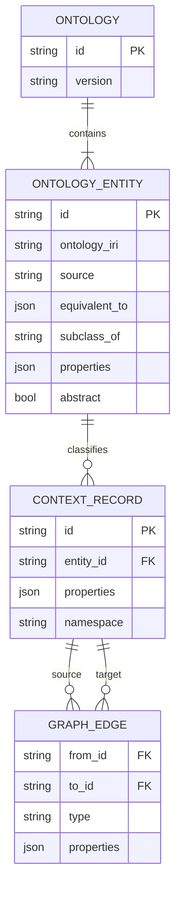

# 规范本体与知识图谱

知识图谱只保存有助于 Agent 理解用户上下文的事实。Neo4j 是主要运行时后端；`workspace/graph.db` 仅保留为隔离测试和一次性迁移使用的本地 SQLite 兼容适配器，不再是部署环境的知识图谱后端。

## 1. 唯一本体

每个 workspace 恰好有一个本体：`ambient-context`。App 所看到的 schema 是这个规范本体中的实体，不是 App 自己拥有的一套独立 schema。每个实体都包含：

- 稳定的 `id`、名称、描述和属性类型；
- 表明词汇来源的 `ontology_iri` 与 `source`；
- 用于和成熟外部本体对齐的零到多个 `equivalent_to` 对应关系；
- `ambient-context` 内可选的 `subclass_of` 父实体；
- `is_core` 与 `abstract` 生命周期标记。

预置本体从 Schema.org 概念出发，包含抽象根实体 `Thing`，以及常见的用户上下文实体：`Task`、`Event`、`Note`、`Person`、`Organization`、`Project`、`Document`、`Place`、`Message` 和 `SoftwareApplication`。语义相符时，App 必须复用这些实体。

本体增长是增量且原子的：

1. 扩展已有实体的属性；或
2. 向 `ambient-context` 添加实体，并可记录外部 `ontology_iri`/`equivalent_to` 映射和规范的 `subclass_of` 父实体。

其他词汇中的实体不能被安装成第二套、未连接的本体。父实体不存在、实例化抽象实体、使用未注册实体 ID、属性类型不支持或写入未知属性都会被拒绝。普通流程不能移除 core 实体。

## 2. 知识图谱模型

每个 `ContextRecord` 恰好通过一条 `INSTANCE_OF` 关系归类到一个已注册的 `OntologyEntity`；系统不会为每种类型创建动态 Neo4j label。固定 label 模型避免动态拼接 Cypher，并显式表达“一个记录只能属于一个实体”的约束。只有实体和属性都通过校验后才能 upsert 记录。Edge 的端点必须已经存在，或在同一 mutation batch 中先创建。

Neo4j 还保存内部 effect 与 rollback 元数据，使 graph mutation 和幂等结果在同一个 ACID transaction 中提交。这些元数据节点属于基础设施状态，不会出现在知识图谱查询结果中。

## 3. 数据放置

KG 只接受 `user_context` 数据。用户的任务、会议、项目、联系人或文档引用能提升跨 App 理解，因此属于 KG。

仅为了让 App 持续运行的数据——缓存、同步 cursor、UI 状态、job checkpoint、凭据和 provider 原始 payload——必须放在该 App 的 workspace 目录中。如果“这份数据存在”本身对上下文有价值，KG 可以保存一个带 URI 与摘要的 `Document` 或类似 `SoftwareApplication` 的引用，但不能复制私有 payload。非上下文 scope 的 schema proposal 会被拒绝。

## 4. 查询与 Mutation

Widget 使用 `ambient.graph.subscribe(query, callback)` 注册实时查询。后端保存订阅，在 mutation 后重新执行有界查询并推送变化。Agent 只读查询通过 `graph_query_engine.execute_graph_query` 执行；`RouterContext` 通过 Graph adapter 的 `routing_snapshot()` 生成有上限的快照，不直接访问 SQLite 表，也不把整张图塞进 prompt。SQLite 与 Neo4j adapter 必须返回相同的计数、最近记录和 schema 快照契约。

公开 mutation action 为 `create_node`、`update_node_property`、`delete_node`、`create_edge` 和 `delete_edge`。`preflight_actions` 在不写库的情况下校验整个 batch；`apply_actions_atomic` 在一个 Neo4j transaction 中提交 batch、reverse actions、rollback ticket 和 effect ledger。相同幂等 key 携带相同输入时返回原结果，携带不同输入时会被拒绝。

Widget 声明和 manifest `schema_refs` 只提供上下文，不构成授权，最终以后端本体校验为准。若请求的数据没有合适实体，schema alignment 流程必须先增长本体并获得批准，随后 record mutation 才能通过。

发布前的确定性 schema diff 只在 JavaScript 值的类型可由字面量或显式类型转换静态确定时报告类型不匹配。对 `place.latitude`、函数返回值等动态表达式，校验器必须标记为未知并把最终类型判断交给 graph mutation preflight，不能臆测为字符串并触发无效返工。

## 5. 配置与迁移

部署环境由 backend factory 选择 `GRAPH_DATABASE_BACKEND=neo4j`，并读取 `NEO4J_URI`、`NEO4J_USERNAME`、`NEO4J_PASSWORD` 与 `NEO4J_DATABASE`。根目录 Docker Compose 会启动 Neo4j 并为 backend 完成配置；Dev Container 的 Compose 配置也会启动隔离的 Neo4j sidecar，并通过容器网络连接开发工作区。`GRAPH_DATABASE_BACKEND=sqlite` 是显式的本地/测试适配器。

设置 `GRAPH_MIGRATE_SQLITE=1` 后，系统会一次性导入已有的 `workspace/graph.db`。Importer 会先校验或注册旧实体定义，再导入记录与关系，并在 Neo4j 写入 migration marker，保证重启幂等。作为可恢复的数据源，原 SQLite 文件不会被删除。

## 6. 验收标准

- 新后端只暴露一个预置本体及其 core 实体清单。
- 未知或抽象的实体 ID 不能用于 record。
- 每个已存 context record 都恰好解析到一个本体实体。
- 获批的属性扩展/新实体原子生效，并始终对齐到 `ambient-context`。
- runtime-only schema proposal 会被拒绝，App 私有状态不会被复制到 KG。
- Neo4j mutation 失败时，record、edge、history 与 effect entry 一起回滚。
- SQLite 到 Neo4j 的迁移需显式开启、可重复执行且不会删除源文件。
- Router 的快照构建不得依赖具体存储实现，在 Dev Container 的 Neo4j 后端与 SQLite 测试适配器上行为一致。
- 静态 schema diff 不得把无法确定类型的动态 JavaScript 表达式误报为类型不匹配；实际 mutation 仍须通过后端 preflight。
