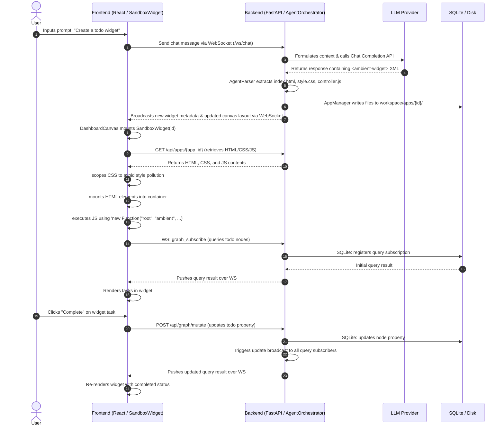

# Ambient Agent: Apps & Widgets System Architecture

Ambient Agent is designed around a dynamic **GUI Widget (Canvas Workspace)** architecture. In this system, "Apps" refer to the dynamically-generated React-compatible **Mini App Cards (Widgets)**. This document outlines the architecture of these widgets, how the frontend and backend communicate, and the libraries/frameworks involved.

---

## 1. System Overview Architecture

This diagram shows how the frontend, backend, database layers, and external APIs are structured to support dynamic widgets.

```mermaid
graph TB
    subgraph Frontend["Frontend (React 19 + TypeScript + Vite)"]
        direction TB
        App["App.tsx<br/>(Main Coordinator / State)"]
        Canvas["DashboardCanvas.tsx<br/>(Grid Layout Canvas)"]
        Sandbox["SandboxWidget.tsx<br/>(Sandboxed App Container)"]
        WSClient["websocket.ts<br/>(Native WebSockets)"]
    end

    subgraph Backend["Backend (FastAPI + Uvicorn)"]
        direction TB
        Main["main.py<br/>(ASGI Web & WS Server)"]
        Orchestrator["AgentOrchestrator<br/>(Workspace & LLM Router)"]
        Parser["AgentParser<br/>(XML XML-to-Widget Compiler)"]
        AppMgr["AppManager<br/>(Widget Disk & Records Storage)"]
        BackendMgr["BackendManager<br/>(MCP Daemon & SSE Proxy)"]
    end

    subgraph Data["Data & Storage Layer"]
        SQLiteDB[("SQLite graph.db<br/>(SQLModel Graph Storage)")]
        DiskApps[("Local Filesystem<br/>(workspace/apps/{app_id}/*)")]
    end

    subgraph External["External Integration"]
        LLM["LLM Service<br/>(Ollama / MiniMax / OpenAI)"]
        MCPServer["MCP Servers<br/>(Stdio CLI subprocesses)"]
    end

    %% Connections
    App --> Canvas
    Canvas --> Sandbox
    App <--> WSClient
    WSClient <-->|WebSocket: /ws/chat| Main
    
    %% API Calls
    Sandbox -->|HTTP POST: /api/graph/mutate| Main
    Sandbox -->|HTTP GET: /api/apps/{app_id}| Main
    
    %% Backend Flow
    Main <--> Orchestrator
    Orchestrator --> Parser
    Orchestrator --> AppMgr
    Main <--> BackendMgr
    
    %% Database / Disk
    AppMgr <-->|Read/Write HTML, CSS, JS| DiskApps
    Main <-->|SQLModel ORM| SQLiteDB
    BackendMgr <-->|JSON-RPC 2.0 via Stdio| MCPServer
    Orchestrator <-->|HTTPS Client (httpx)| LLM
```

---

## 2. Dynamic Widget Lifecycle Flow

This sequence diagram illustrates the lifecycle of a Widget, from user prompt, backend parsing, disk serialization, websocket distribution, frontend rendering, and user-initiated data mutation.



---

## 3. Communication Channels

The connection between the Frontend and Backend relies on two main protocols:

### A. WebSockets (URL: `ws://localhost:8000/ws/chat?session_id=...`)
Designed for real-time bidirectional synchronization:
*   **Chat stream**: Sends user inputs, broadcasts system and agent text streams to all clients in the session.
*   **Canvas Sync**: Updates layout grids, widget additions, positions, and removal.
*   **Graph Subscriptions**: Enables reactive UI updating. Widgets subscribe to SQL-like graph patterns (`ambient.graph.subscribe(query, callback)`), and updates are broadcast automatically when mutations occur.
*   **MCP Operations**: Routes `mcp_call_tool` and `mcp_read_resource` messages. The backend acts as a coordinator, running local tools and sending the results back.
*   **Agent Interaction**: Orchestrates inter-agent protocol messages through the socket (`ag_ui_message`).

### B. REST HTTP APIs
Used for transactional, file-based, or bulk data exchanges:
*   `GET /api/apps`: Lists all registered Widgets in the workspace database.
*   `GET /api/apps/{app_id}`: Retrieves the source assets (`index.html`, `style.css`, `controller.js`) for the sandboxed renderer.
*   `DELETE /api/apps/{app_id}`: Uninstalls a widget and clears its assets from disk.
*   `POST /api/graph/mutate`: Dispatches batches of graph transformations (nodes/edges creation, updates, and deletion).

---

## 4. Sandboxing & The `ambient` SDK

To guarantee security, style isolation, and a clean local development experience, widgets run inside a **Custom JavaScript Sandboxed Environment** (`SandboxWidget.tsx`).

### Scoping & Isolation
*   **HTML Scope**: Widget HTML is rendered inside an isolated `div` container.
*   **CSS Scope**: Scoped to the specific widget wrapper using a scoped container class (supported by Tailwind v4 utilities) to prevent styling from leaking to other components.
*   **JS Scope**: Executed inside an isolated wrapper:
    ```javascript
    const runScript = new Function("root", "ambient", "fetch", widget.js);
    runScript(contentEl, ambient, customFetch);
    ```
    *   `root`: Refers *only* to the widget's root container. Widgets are required to use `root.querySelector` to find elements.
    *   `fetch`: A custom fetch proxy that intercepts external REST requests, caching them for 5 minutes (`CACHE_TTL = 300000ms`) to eliminate duplicated traffic across widget lifecycles.

### SDK Capabilities (`ambient`)
The sandbox passes the following `ambient` SDK methods to the widget's JavaScript scope:

| API | Method / Namespace | Description | Communication Method |
| :--- | :--- | :--- | :--- |
| **Messaging** | `ambient.sendMessage(text)` | Sends a text chat query as the user | WebSocket (`type: "chat"`) |
| **Layout** | `ambient.fullscreen()` | Expands the widget card into fullscreen layout | Local callback to Canvas |
| | `ambient.minimize()` | Restores the widget card size | Local callback to Canvas |
| **State** | `ambient.state.get(pointer)` | Fetches a value from local sandboxed state | Local state memory |
| | `ambient.state.set(pointer, val)` | Updates sandboxed state and syncs with backend | WebSocket (`type: "ag_ui_message"`) |
| | `ambient.state.onChange(p, cb)` | Subscribes to changes on a state key | Local event emitter |
| **Graph DB** | `ambient.graph.subscribe(q, cb)` | Real-time reactive query subscription | WebSocket (`type: "graph_subscribe"`) |
| | `ambient.graph.mutate(actions)` | Applies transactional changes to SQLite Graph DB | REST HTTP (`POST /api/graph/mutate`) |
| **MCP** | `ambient.mcp.callTool(name, args)` | Invokes backend CLI tool capabilities | WebSocket (`type: "mcp_call_tool"`) |
| | `ambient.mcp.readResource(uri)` | Reads backend data sources | WebSocket (`type: "mcp_read_resource"`) |
| **Agent** | `ambient.agent.connect()` | Registers listeners for agent communication | WebSocket (`type: "ag_ui_message"`) |
| | `ambient.agent.send(msg)` | Sends message payload to backend agent | WebSocket (`type: "ag_ui_message"`) |

---

## 5. Technology Stack & Frameworks

The system relies on several modern frameworks and libraries:

### Frontend Technologies
1.  **React 19**: Modern core framework with component lifecycles, hooks, and Concurrent rendering.
2.  **TypeScript**: Static typing for interface stability and robust client-side validation.
3.  **Vite**: Fast bundling, Dev server, and hot module replacement.
4.  **Tailwind CSS v4** (via `@tailwindcss/vite`): Styles utilities. Its custom `@utility` and component-scoped systems are leveraged for scoped widget aesthetics.
5.  **Native WebSockets API**: Standard browser interface for real-time duplex data flow (no socket.io overhead).

### Backend Technologies
1.  **FastAPI**: Highly performant, async Python framework serving both HTTP endpoints and WebSocket protocol handlers.
2.  **Uvicorn**: Lightning-fast ASGI web server implementation.
3.  **SQLModel (SQLAlchemy + Pydantic)**: Modern SQL mapper for Python. Facilitates SQLite interaction for both Chat Session logs and Graph DB entities while providing native Pydantic data validation.
4.  **Jinja2**: Backend prompt formatting and contextual template assembly.
5.  **HTTPX**: Asynchronous client used to interact with LLM providers (e.g. Ollama, MiniMax, OpenAI).
6.  **Agent Client Protocol (ACP)**: Defines structured payloads for agent-to-agent and client-to-agent notifications.
