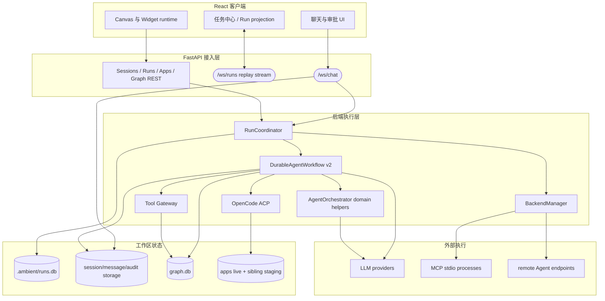
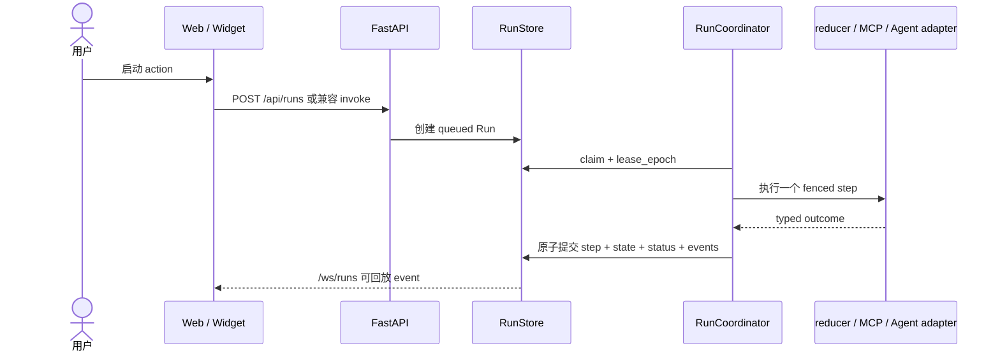
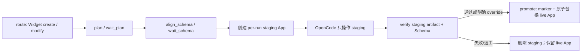

# 系统架构概述

Ambient Agent 是一个本地优先的 Canvas 工作区：React 前端承载聊天、任务中心和动态 Widget；FastAPI 后端管理会话、持久 Run、图数据、App artifact、LLM 以及外部 MCP/Agent runtime。

## 1. 当前系统边界

`RunStore + RunCoordinator` 是 chat `internal_agent`、Capability、MCP tool/resource 和远端 Agent action 的唯一 durable control plane。`AgentOrchestrator` 只提供路由、Converse 和格式化 domain helper；WebSocket ingress 只提交命令、resolve 持久 interaction 并投影结果，不直接执行 workflow 或外部副作用。

## 2. Durable Run 生命周期

同一 session 使用 FIFO lane；`waiting_user` 释放 worker slot 但继续占有 lane。interaction 响应通过 Run version 防止迟到审批，恢复后由 scheduler 重新领取。

Multi-intent 在任何写入前对整体子意图做 preflight，再按序作为 saga 执行。已完成步骤只有在保存完整补偿数据时才自动回滚；其他未知副作用进入 `needs_attention`。

## 3. Widget 代码生命周期

Widget build 由 `DurableAgentWorkflow` 的显式 phase 驱动；OpenCode 采用 staging/promotion：

每个 staging artifact 与 Run checkpoint 绑定；recovery 根据持久 promotion marker 区分“已发布”和“仍待验证”，失败或取消会清理 staging。artifact validation 检查必需文件、大小、UTF-8 和 default export，并使用与前端一致的 Babel pipeline 编译，在禁用动态代码生成、无宿主网络全局且有超时的 Node VM 中完成 module-load smoke；`window`、`document`、`fetch`、WebSocket、Worker、storage、动态 import/require 等直接能力 fail closed。Schema verification 是另一层。这仍不是完整的浏览器 render smoke 或 OS 级 sandbox。

## 4. 数据与通信

- `/ws/chat`：聊天命令、durable interaction 响应、MCP tool/resource 与 Agent Run 的响应投影，以及图订阅控制。
- `/ws/runs?after_sequence=N`：版本化、可回放的 workspace Run event stream。
- Runs REST：创建、查询、取消、重试、effect reconciliation 和 resolve interaction。
- Apps REST：读取或管理 live App artifact。
- Graph REST/WebSocket：写命令先进入 graph v2 Run，查询和 subscription 保持兼容。

客户端只重放声明为订阅的读模型，不会在断线重连时重放聊天、审批或工具命令。Run event 客户端使用 `stream_epoch + sequence` 检测 reset/gap，并以 `event_id` 去重。

Run event payload 在入库前按敏感键递归脱敏并限制大小，`redacted` 说明内容曾被隐去或截断。Event 与 LLM audit 默认保留 30 天，分别由 `RUN_EVENT_RETENTION_DAYS` 和 `AGENT_AUDIT_RETENTION_DAYS` 调整。

## 5. 安全边界说明

- 模型本地工具经过 `ToolGateway` 的 schema、effect、scope、approval、timeout、幂等和输出限制；当前 Converse 只暴露 read tools。
- MCP 进程使用精确 argv、受限继承环境、initialize/capability negotiation、调用 deadline、有界 stdout/stderr、best-effort cancellation 和 terminate→kill。
- OpenCode 校验 app ID、拒绝 traversal/symlink、使用 argv 而非 shell、限制 cwd/environment/output，并在 staging 中工作。
- 浏览器 Widget 的 `new Function` 只提供模块作用域和 ErrorBoundary，不是 hostile-code security sandbox；真正的强隔离仍需要 iframe/Worker/独立 origin 或 OS sandbox。
- MCP/ACP/远端 Agent 使用各自的协议 adapter，但都由 RunCoordinator effect boundary 管理；它们不是 Python ToolGateway 调用。OpenCode 仍没有强制的 OS 网络隔离，权限提示不应被解释为完整 sandbox。
