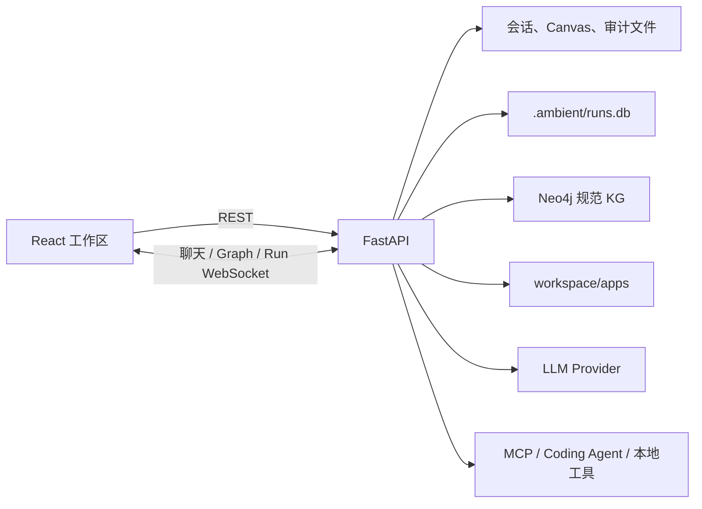

# 系统与请求链路

## 1. 运行时组成

`backend/main.py` 是装配点。它创建 `WorkspaceStorage`、`LLMConfigStore`、配置指定的 graph adapter、`AppManager`、`AppStoreService`、`RunStore`、`RunCoordinator` 和 `DurableAgentWorkflow`，并在应用生命周期中恢复可运行任务与清理遗留 staging。

## 2. 用户请求如何执行

1. 前端通过 `/ws/chat` 发送消息。
2. 后端先保存 `ChatMessage`，解析当前会话语言、模型与 Coding Agent 快照，再向 `RunCoordinator` 提交 `internal_agent` Run。
3. Coordinator 持久化 Run，并为同一 session 管理执行 lane。
4. `DurableAgentWorkflow` 调用 `IntentRouter` 生成 `IntentPlan`，然后按 phase 推进状态。
5. 只读对话或查询可以直接完成；Graph mutation、复合任务和 Widget 创建/修改会经过计划、必要的用户 interaction、预检、执行与校验。
6. 每个 step 使用 claim、lease epoch 和 run version 防止过期 worker 提交。可见事件写入 `run_events` 后经 `/ws/runs` 推送。
7. 前端将 Run 状态投影到聊天、任务抽屉、应用中心和工作区。

旧的内存 Agent 循环和 Widget DAG 不再是生产执行路径。`AgentOrchestrator` 只提供路由和有界只读 Converse helper，执行所有权属于 Run 控制平面。

## 3. Widget 创建与加载

Widget 有两条进入路径：

- 对话返回 `<ambient-widget>`：`AgentParser` 提取单个 `<js-script>`，`AppManager` 保存 `controller.js` 和 manifest。
- 创建或修改应用：durable workflow 让用户选择的 OpenCode 或 Codex 在 staging 目录生成 controller；完成语法、安全规则与 schema 校验后才提升为 live app。失败或未获批不会覆盖现有产物。

前端从 `/api/apps/{id}` 获取应用，`SandboxWidget` 使用 Babel 转译 controller，并注入 React、`ambient` API 和系统组件。它提供故障隔离，但不提供 hostile JavaScript 安全边界。

## 4. 数据与通信职责

| 通道/存储 | 用途 |
| --- | --- |
| REST `/api/sessions`, `/api/canvas` | 会话和 Canvas CRUD |
| REST `/api/runs`, `/api/run-interactions` | Run 查询、取消、重试、协调和用户决策 |
| REST `/api/apps`, `/api/app-store` | 应用产物和统一能力目录 |
| REST `/api/coding-agents` | Coding Agent 可用性与默认选择 |
| REST `/api/graph/mutate` | 后端预检后的 Graph mutation |
| `/ws/chat` | 聊天消息、兼容投影和 Widget Graph 订阅/命令 |
| `/ws/runs` | 带 sequence、event ID 和 stream epoch 的可恢复事件流 |
| `workspace/sessions/*.json` | 会话与消息 |
| `workspace/.ambient/runs.db` | Run、step、interaction 和 canonical event |
| Neo4j | 规范本体实体、上下文 record、graph edge、effect 和 mutation history |
| `workspace/graph.db` | 仅用于显式 SQLite 测试适配器和按需迁移源 |

## 5. 安全与一致性原则

- Provider 密钥不返回给前端，凭据文件位于 Git 忽略的工作区。
- Coding Agent Runtime 使用可信内置 Adapter，将 CLI 按需安装到专用持久卷，并统一管理安装、认证、动态模型发现、模型绑定与运行状态。Codex 通过容器内设备码登录使用自己的 ChatGPT 订阅，并通过官方 app-server `model/list` 返回当前账号可选模型；OpenCode 引用中心 Provider Registry 的模型绑定。后端不会把 Ambient Provider 密钥或模型绑定传给 native 模式的 Codex。
- Docker Compose 放开默认 seccomp 对非特权 user namespace 的拦截，使 Codex 能在容器边界内继续使用自己的 bubblewrap `workspace-write` 沙箱；不授予 `SYS_ADMIN`，也不切换到 `danger-full-access`。
- Backend 镜像内置与前端锁文件一致的 Node.js 与 `@babel/standalone` verifier runtime。所有 Coding Agent 生成的 `controller.js` 只有通过语法、禁用 host/network global 与受限 VM 执行检查后才会从 staging 提升为 live App；校验器缺失时必须失败关闭，不能发布未验证代码。
- Coding Agent 的生成契约必须明确禁止 `fetch`、浏览器 host global 和未声明的网络访问。staging 校验失败时，adapter 会把每轮最新的有界诊断反馈给同一个 agent，在原 staging 中最多进行三轮修复并逐轮重新校验；耗尽修复预算仍失败才终止 Run，且始终不会发布违规代码。这样 manifest 与 controller 中依次暴露的独立错误也能进入同一个修复闭环。
- Graph mutation 必须通过规范本体预检，并在一个 Neo4j transaction 中原子提交。
- MCP、工具和 Coding Agent 的授权与沙箱策略在后端执行；前端不注入 API 不能替代授权。
- 有副作用的 durable step 使用 effect/idempotency 记录、interaction 和 fencing，避免恢复或并发造成重复提交。
- Run event 是版本化契约；前端保留未知事件以兼容未来版本。

下一步可阅读[持久 Run](/architecture/runs.md)、[Agent Harness](/agent/harness.md)、[Widget 架构](/architecture/apps.md)或[图数据库](/architecture/graph-db.md)。
