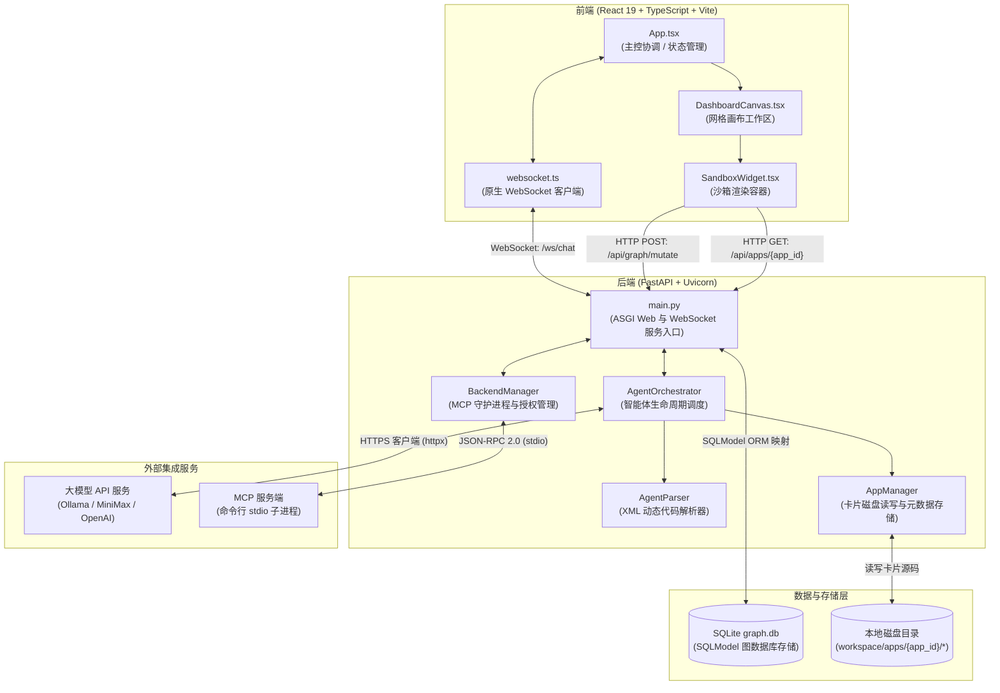
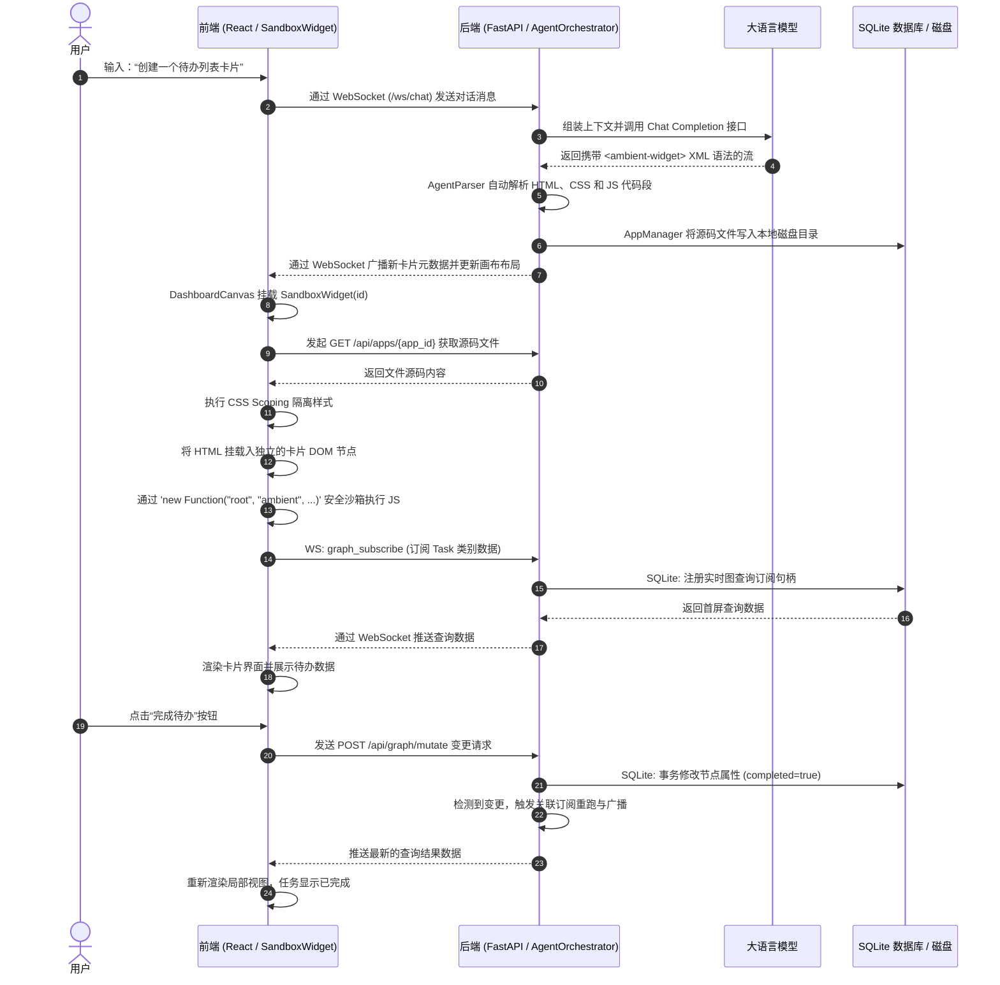

# 系统架构概述

Ambient Agent 围绕动态的 **GUI 卡片工作区 (Canvas Workspace)** 架构进行设计。系统中的“Apps”是指大模型动态生成的、兼容 React 的**微型交互卡片（Widgets）**。本页面概述了这些卡片小程序的总体架构、前后端连接方式以及所涉及的技术框架。

---

## 1. 架构模块图

本图展示了前端、后端、数据库层以及外部 API 是如何协同工作的：

---

## 2. 动态卡片生命周期序列

本序列图描绘了 Widget 卡片的完整生命周期，包括用户输入、后端解析落盘、WebSocket 广播、前端沙箱挂载及后续的数据交互：

---

## 3. 通信链路划分

前后端在处理 Widget 卡片时使用两种通信协议协同：

### A. 双向长连接 WebSockets (接口: `/ws/chat`)
负责高实时、双向的数据流同步：
*   **对话与布局同步**：广播用户的聊天消息、卡片在 Canvas 上被拖拽/缩放/固定后的网格布局设置。
*   **响应式查询订阅**：卡片 JS 通过 `ambient.graph.subscribe()` 订阅的数据流均走此通道推送。
*   **MCP 命令行回调**：当 Widget 通过 SDK 触发 MCP 调用时，后台在执行完子进程后通过 WS 发回响应。

### B. 事务型 REST HTTP APIs
处理结构化文件读取或非实时突发请求：
*   `GET /api/apps` 与 `GET /api/apps/{app_id}`：拉取卡片列表或用于前端沙箱挂载读取的代码文件。
*   `DELETE /api/apps/{app_id}`：卸载特定卡片并清理磁盘空间。
*   `POST /api/graph/mutate`：原子事务型修改图数据库中的节点或关系边。

---

## 4. 沙箱与 `ambient` 开发包

为保障系统安全与组件样式绝对隔离，所有 Widget 的交互逻辑均在前端 `SandboxWidget` 内部的容器沙箱中执行。有关沙箱编译机制与 `ambient` 提供的多维度数据交互 API，请参阅[沙箱隔离机制](/widgets/sandbox)及[ambient SDK 参考手册](/widgets/sdk)。

---

## 5. 技术栈与所用框架

本系统基于以下现代开源技术栈构建：

### 前端技术栈
1.  **React 19**：现代核心前端框架，支持并发渲染与灵活的 Hooks 挂载。
2.  **TypeScript**：强类型保障静态接口安全与逻辑推导。
3.  **Vite**：闪电般快速的模块打包器与本地热重载开发服务器。
4.  **Tailwind CSS v4**：样式实用类，通过 `@tailwindcss/vite` 在构建时自动编译出 scoped 卡片样式。
5.  **原生 WebSockets API**：浏览器标准双向通信接口，避免了 socket.io 的冗余开销。

### 后端技术栈
1.  **FastAPI**：超高性能的 Python 异步 Web/WebSocket 框架。
2.  **Uvicorn**：轻量级 ASGI 服务器。
3.  **SQLModel (SQLAlchemy + Pydantic)**：用于 SQLite 的 ORM 框架，完美兼容 Pydantic 的类型验证与对象关系映射。
4.  **HTTPX**：用于与云端大模型或 Ollama 之间执行高效的异步 HTTP 请求通信。
5.  **Agent Client Protocol (ACP)**：规范智能体协作与工具委派的数据契约。
