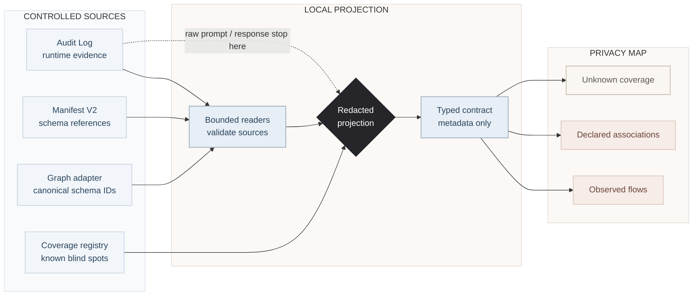

# Privacy Data Map V1

状态：Issue #8 的 V1 实现规范
用户界面名称：**Privacy Map（隐私地图）**
工程名称：**Privacy Data Map**

## 1. Purpose

Privacy Map 为用户提供一个**有范围、已脱敏、由现有证据派生**的数据流拓扑。它回答的是 Ambient Agent 当前能够证明什么，而不是生成第二套审计事实。

V1 需要在不暴露正文内容的前提下说明：

1. 哪些传输路径有实际 Audit runtime evidence；
2. 哪些 App 与 schema 的关系只来自 Manifest 声明；
3. 哪些通道仍未被可靠观测；
4. 当前视图使用什么范围、时间窗口和限制。

当前源数据不能稳定提供完整的 `session_id`、`run_id` 或 `app_id` 归因，因此 V1 固定为 workspace scope。即使新记录包含部分 trace 字段，也不能据此假设历史证据已经完整。

## 2. Product principles

- **本地派生**：只读取现有 LLM Audit JSONL、Manifest V2 `schema_refs`、当前 graph adapter 的规范 schema ID，以及显式 coverage registry。
- **不复制 raw payload**：响应和界面不得包含 prompt、response、credential、tool arguments、graph values 或上游 body。
- **不建立第二个 evidence store**：每次请求按需计算，不持久化 Privacy Map presentation database。
- **证据优先**：缺少证据表示 unknown，不表示“没有发生”。
- **声明不等于行为**：Manifest 与 `schema_refs` 不能证明权限、运行时使用、graph mutation 或 compliance。
- **限制必须可见**：partial coverage、损坏记录和缺失引用必须在 UI 中可见，不能被静默转换成“完整”或“空”。
- **功能与语义并重**：UI 可以有鲜明设计，但不得混淆 observed、declared 和 unknown。

## 3. Non-goals

V1 不负责：

- 取代按时间排序的 Audit Log；
- 读取或分类 prompt/response 内容；
- 从自然语言推断敏感信息类别；
- 把 permission 表示为 runtime evidence；
- 证明隐私合规、数据驻留或所有出站路径；
- 证明未观测路径没有被使用；
- 重构 Audit retention；
- 在证据不充分时增加 session/run 过滤；
- 修改 durable workflow、Router scoring、MCP、HTTP Agent、ACP/Coding Agent、graph mutation 或 Manifest 语义；
- 把 Privacy Map 变成 generated App、Widget 或 Canvas window。

## 4. Current evidence boundary

现有 Audit Log 的基础记录包含：

```text
id · timestamp · provider · model · prompt · response · stage
```

V1 只投影：

```text
timestamp · provider · model · normalized stage · aggregate count
```

`provider` 和 `model` 是允许展示的运行元数据，但调用方仍不得把 secret、正文片段或任意 payload 填入这些字段。

Audit Log 目前不能完整归因到 session、run、App、schema、MCP server、HTTP Agent 或 ACP process；部分出站路径、失败传输和旧记录也没有统一 instrumentation。因此：

- V1 的 `coverage.status` 永远是 `partial`；
- 成功读取、非零计数或健康 source 都不能升级为 `complete`；
- MCP、HTTP Agent、统一 Coding Agent/ACP、provider management 与隔离 Widget Runtime 必须显示为 `not_instrumented`。

## 5. Evidence semantics

### 5.1 Observed

`observed` 表示受支持的 runtime path 已写入一条可投影的 Audit record。它可以证明记录时间、provider、model、stage 与聚合次数，但不能证明传输正文、用户身份、数据驻留或全量网络行为。

### 5.2 Declared

`declared` 表示有效 Manifest V2 通过 `schema_refs` 声明 App 与中央 schema 的关联。它是 association，不是传输边；不得带 event count、timestamp，也不得使用“发送、读取、写入”等运行时动词。

### 5.3 Unknown

`unknown` 表示对应通道缺少 instrumentation、源数据不完整或归因字段不足。Unknown 是一等状态，不能被隐藏、渲染成零或折叠进 observed/declared。

### 5.4 Permission

Permission 回答操作是否被允许，不属于 evidence class。V1 不把 capability grants 或 approval records 投影成 observed flow。

## 6. Trust boundaries and derivation

原始 Audit payload 必须在 projection boundary 之前停止：



虚线表示禁止边界，不是数据流：raw prompt/response 不得进入 Privacy Map model。

## 7. Backend design

### 7.1 Responsibilities

`PrivacyDataMapService` 只做确定性、只读的 metadata projection：

1. 消费注入的 bounded source readers；
2. 规范化 allowlisted metadata；
3. 聚合 observed flows；
4. 把有效 `schema_refs` 转为 declared associations；
5. 合并 source health 与 coverage registry；
6. 返回 strict typed response。

它不得写磁盘、调用 LLM、发起网络请求、修改 graph/Manifest/Audit/permission，也不得依赖具体 UI 布局。

### 7.2 Audit source health

`WorkspaceAuditProjectionStream` 以 binary streaming 方式读取 workspace Audit JSONL，并设置固定上限：单行 1 MiB、总扫描 256 MiB、最多 1,000,000 个 physical lines。它只输出 `timestamp/provider/model/stage`，消费完成后返回健康计数。

以下情况必须区分：

- 文件首次不存在：有效的空 source；
- malformed/structurally invalid/ineligible/oversized 记录：跳过并计数，source 标记 degraded；
- 文件不可读、路径身份变化、link/junction 或读取中断：整个请求失败，不能返回“空地图”。

### 7.3 Metadata normalization

所有可见 metadata 都经过 Unicode、长度、control character 与时间格式验证。Stage 只映射到 `chat | route | plan | mutation | verify | title | other`。派生 ID 使用 canonical tuple 的 SHA-256；同一 ID 对应不同 tuple 时 fail closed。

### 7.4 Manifest and schema declarations

`AppDeclarationSnapshotReader` 只读取 Apps 根目录下安全 direct child 的 `manifest.json`，沿用 `AppManifest` 的 V2 validation 和文件大小限制。损坏 App 计入 warning，不阻止其他 App。

`GraphSchemaSnapshotReader` 调用当前组合根已经创建的 graph adapter 的 `list_schema_ids(limit, max_id_codepoints)`。SQLite 与 Neo4j 都在查询层完成排序、截断和 limit；Privacy Map 不创建第二个 graph connection，也不复制 schema definitions。

只有 `schema_ref` 能匹配当前注册的 canonical schema ID 时才生成 association。缺失引用进入 health/warning，不伪造 schema node。

### 7.5 Coverage registry

V1 coverage 是代码内固定、可审计的能力表：

| Channel | Observation |
| --- | --- |
| `llm` | `partial` |
| `mcp` | `not_instrumented` |
| `http_agent` | `not_instrumented` |
| `coding_agent_acp` | `not_instrumented` |
| `provider_management` | `not_instrumented` |
| `isolated_widget_runtime` | `not_instrumented` |

新增 observed channel 必须先有强制 instrumentation、稳定 identity、失败行为和测试，不能只改 UI 文案。

## 8. API contract

### 8.1 Contract invariants

`GET /api/privacy-data-map` 返回 `contract_version: 1` 的 strict model，未知字段被拒绝。核心字段：

```json
{
  "contract_version": 1,
  "generated_at": "2026-07-29T00:00:00Z",
  "scope": {"kind": "workspace", "observed_window": null},
  "source_health": {},
  "coverage": {"status": "partial", "channels": []},
  "nodes": [],
  "observed_flows": [],
  "declared_associations": [],
  "warnings": []
}
```

节点顺序、flow 顺序、association 顺序和 warning 顺序必须确定；空数组是有效结果，但 coverage 仍为 partial。

### 8.2 HTTP behavior

- 只接受无 query string 的精确 `GET /api/privacy-data-map`；
- trailing slash 保持 404，不自动 redirect；
- 所有该路径的成功和错误响应都带 `Cache-Control: no-store`；
- build 在 threadpool 中执行，避免阻塞 event loop；
- 并发请求只共享正在执行的同一次 build，完成结果不缓存；
- endpoint 不新增独立身份模型，沿用平台现有 access boundary。

### 8.3 Error contract

公开错误只返回稳定 code 与统一消息 `Privacy Map is temporarily unavailable.`，不得泄露路径、异常正文或源数据。主要 code：

- `privacy_map_audit_source_unreadable`；
- `privacy_map_app_source_unreadable`；
- `privacy_map_schema_source_unreadable`；
- `privacy_map_invalid_request`；
- `privacy_map_id_collision`；
- `privacy_map_projection_failed`；
- `privacy_map_resource_limit_exceeded`。

Resource limit 返回 503；请求形状错误返回 400；source/projection 错误返回 500。

## 9. Retention, access, and deletion

### 9.1 Retention

Privacy Map 不持久化 projection，因此没有独立 retention。Observed history 由现有 Audit Log retention 决定；Manifest 与 graph schema 的生命周期仍由各自权威系统决定。

### 9.2 Access

V1 使用 Ambient Agent 当前 workspace API 的访问边界，不宣称多用户隔离。未来若平台加入用户/tenant 身份，Privacy Map 必须在 source reader 之前完成同范围授权，不能先读全量数据再在 UI 过滤。

### 9.3 Deletion

删除源证据后，后续请求自然不再包含对应 projection。实现不得保留隐藏 cache、analytics copy 或恢复已删除 raw data 的索引。

## 10. Frontend integration

### 10.1 Platform surface

Privacy Map 是 platform-owned system drawer，不是 generated App。入口位于 system toolbar、Workspace/App Center 与移动端 More；它与 Audit、Tasks drawer 互斥，并在 blocking interaction/dialog 出现前关闭。

### 10.2 Information architecture

Quiet Intelligence UI 分为：

- 范围、生成时间、source health 与 partial coverage 摘要；
- observed runtime flows；
- declared App-schema associations；
- unknown/not-instrumented channels；
- warning 与限制说明。

Observed 使用方向与计数；Declared 使用无方向 association；Unknown 使用独立状态卡，三者不共享误导性的视觉语法。

### 10.3 Required states

界面必须处理 loading、empty、degraded、error、success 和 refresh。错误状态保留稳定的重试入口；degraded 状态展示 warning count；没有 observed flow 时不能写“没有数据传输”。

### 10.4 Accessibility and responsive behavior

Drawer 需要语义 heading、键盘关闭、可见 focus、屏幕阅读器 label 与 reduced-motion 支持。关闭后优先把焦点还给原 trigger；trigger 已卸载时回退到可见 system toolbar。窄屏采用单列重排，不通过缩小字体压缩桌面布局。

## 11. UI design ownership

本规范固定证据语义、状态、错误行为与 accessibility，不固定像素级视觉。Quiet Intelligence 是当前 V1 设计方向；后续视觉调整必须保持：

- observed/declared/unknown 可一眼区分；
- partial coverage 始终可见；
- 不用“安全、完整、已保护”等结论性语言；
- 不把 declaration 绘制为 runtime transmission；
- 不显示 raw payload。

UI 参考 ZIP 仍是外部设计参考，未经单独批准不得复制、提交或上传派生资产。

## 12. Implementation sequence

### Phase A — Redacted backend projection

实现 typed models、bounded readers、graph adapter schema-ID projection、deterministic service、strict endpoint、sanitized errors 与 backend tests。

### Phase B — System drawer and semantic view

接入 AppWorkspace/SystemUI，完成 drawer lifecycle、focus restoration、i18n、loading/error/degraded/empty states 与 semantic sections。

### Phase C — Visual map

使用 Quiet Intelligence 视觉层次展示 observed topology 与 declared association，同时保留列表式可读信息和移动端重排。

### Deferred instrumentation work

MCP、HTTP Agent、统一 Coding Agent/ACP、provider management 与隔离 Widget Runtime 需要各自的强制 instrumentation 设计。Widget Runtime 的 CSP、认证 MessagePort、nonce handshake 与 capability allowlist 提供执行隔离，但不等于 Privacy Map 已经拥有完整的 runtime/network flow evidence。它们不属于 V1 的观测范围，也不能通过沙箱存在、Manifest 声明或其他间接信号推断补齐。

## 13. Test and acceptance matrix

### 13.1 Backend

至少验证：strict contract、确定性顺序、字段脱敏、timestamp/stage normalization、bounded streaming、malformed/oversized records、路径与 link/junction 变化、Manifest V2、schema missing/unsafe、SQLite/Neo4j parity、resource limits、ID collision、single-flight、no-store、trailing slash、query rejection 与 sanitized errors。

### 13.2 Frontend

至少验证：API parsing、unknown field rejection、observed/declared/unknown 文案、loading/empty/degraded/error/success、refresh、drawer 互斥、blocking surface、焦点恢复、Workspace/App Center/mobile 入口、responsive 与 durable Run UI 无回归。

### 13.3 Repository gates

上传前必须通过：

```text
uv run ruff check .
uv run ruff format --check .
PYTHONPATH=. uv run pytest
uv run python scripts/verify_uml.py
uv run python scripts/verify_docs.py
npm --prefix frontend run lint
npm --prefix frontend run test
npm --prefix frontend run build
git diff --check
conflict-marker scan
```

若 Windows 环境被维护者代码的原生依赖或平台 API 阻塞，必须记录为环境限制，并使用不进入仓库的临时兼容方式验证相关测试；不得把测试 workaround 提交到产品代码。

## 14. V1 completion criteria

V1 完成需要同时满足：

- 用户能从 platform surface 打开 Privacy Map；
- observed flow 只来自可验证 Audit metadata；
- declared association 只来自有效 Manifest V2 与 canonical schema ID；
- unknown channels 和 `coverage.status = partial` 始终可见；
- raw prompt/response/secret/tool args/graph values 不进入 response 或 UI；
- projection 不写入第二个数据库或缓存完成结果；
- SQLite 与 Neo4j adapter 都支持同一 bounded schema-ID 接口；
- source 失败不会伪装成空或完整地图；
- drawer 与最新 durable Run、AppWorkspace、SystemUI 和 Widget Runtime 架构兼容；
- 双语文档、UML、后端、前端及 Git 验证通过。
