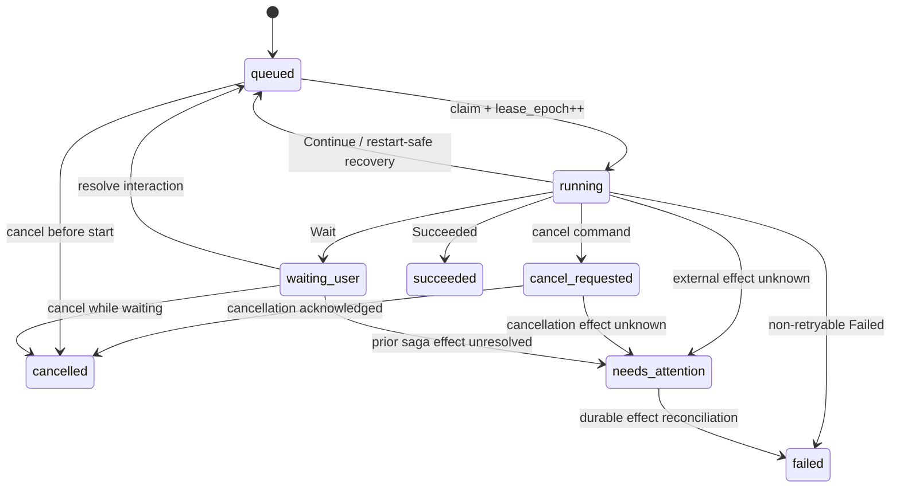

# 持久 Run 与 Runtime

Ambient Agent 使用工作区内的 SQLite Run Store 记录后台工作的事实状态。浏览器连接只是命令入口和事件订阅者；断开浏览器不会删除 Run。

Capability、MCP、远端 Agent action 与 chat `internal_agent` workflow 都由 `RunCoordinator` 调度。`/ws/chat` 只持久化消息、提交 Run、resolve interaction 和投影事件，不持有执行协程。

## 1. 持久状态模型

Run、step attempt、interaction 和 event 位于 `workspace/.ambient/runs.db`。

`AgentRunState` 是 reducer 的 JSON checkpoint，包含：

- `workflow_type`、`workflow_version`、`phase` 和 `attempt`；
- `session_id`、结构化 `intent` 与模型快照；
- `RunBudget` 的模型轮数、时限、token/cost 上限及计数；
- artifact 引用、workflow 私有 `data`、待处理 interaction、上下文摘要引用和最后错误。

每次 durable reducer 调用只推进一个 step，并返回下列一种 `StepOutcome`：

| Outcome | Run 结果 |
| --- | --- |
| `Continue(next_phase)` | 保存 checkpoint 后重新入队 |
| `Wait(interaction definition)` | 在 step transaction 中创建 interaction，然后进入 `waiting_user` |
| `Succeeded` | 保存 result/artifacts，进入 `succeeded` |
| `Failed(retryable)` | 可重试时重新入队，否则进入 `failed` |
| `Failed(effect_state="unknown")` | 进入 `needs_attention`，不伪装成安全失败 |
| `Cancelled` | 进入 `cancelled`；未知副作用同样进入 `needs_attention` |

step attempt、最新 state、checkpoint、Run 状态、interaction 和 reducer event outbox 由 `commit_step()` 在一个 SQLite transaction 中提交。只有提交成功后才进行兼容 WebSocket 投影；旧 lease 无法留下“幽灵审批”或迟到事件。成功 checkpoint 的终态 phase 统一为 `done`，具体最后一步仍由 `step_key` 保留。

默认总预算为 8 个模型 turn、300 秒 active wall time、64,000 token 和 5 美元；usage 在每次模型响应后累计进 checkpoint，任何一项超额都以 `budget_exhausted` 失败。上下文只按稳定顺序装入近期消息；窗口外消息形成确定性 extractive summary，摘要正文与 `sha256:` 引用一起持久化。LLM audit 同时记录 prompt、tool schema 和被读取 artifact 的 hash。

## 2. 状态、领取与恢复

Worker 领取 Run 时递增 `lease_epoch`。所有 durable step commit 都必须同时匹配 `lease_owner` 与 `lease_epoch`；取消、恢复或新 worker 重新领取后，旧 callback 会收到 `StaleLeaseError`，不能再发布状态。

`RunCoordinator` 通过 heartbeat 更新 lease，并周期性执行 orphan recovery：

- `restart_safe` 的过期 `running` Run 回到 `queued`；
- 不能确认外部副作用的 manual Run 进入 `needs_attention`；
- MCP tool、HTTP Agent 等远端 effect 不接受 manifest 单方面的 `restart_safe` 声明；只有只读调用或具备可强制幂等/对账协议的 adapter 才能自动恢复；
- graceful shutdown 会同步释放本 worker 的 lease，并遵循同一恢复策略；它不会执行取消补偿或修改 live effect，只有已经持久化为 `cancel_requested` 的命令才允许补偿；
- `waiting_user` 不占 worker slot，但 interaction 和 Run 都保留在数据库中。

queued / waiting Widget Run 被取消时，先在 state/checkpoint 中持久化 cleanup tombstone 并进入不可 claim 状态；transaction 提交后才通过受约束的 staging 路径幂等删除 artifact，随后以第二个 transaction 清除 tombstone 并终结。重启会恢复任一清理窗口；无法确认清理成功则进入 `needs_attention`，且不能绕过 tombstone 直接 reconciliation。`needs_attention` 不能再被 cancel 命令直接改写为 `cancelled`。操作者必须调用持久化 reconciliation 命令，明确选择 `confirmed_not_committed`、`compensated` 或 `confirmed_committed`；前两者允许之后显式 retry，确认已提交的副作用会保持 retry blocked，避免重复动作。

## 3. Session lane 与交互

带 `session_id` 的 Run 使用持久 FIFO lane。同一 session 中，只要较早 Run 仍为 `running`、`waiting_user`、`cancel_requested` 或 `needs_attention`，后续 Run 就不能被 claim；不同 session 仍可并行。

interaction resolve 使用 `run_version` 做乐观并发检查。响应、其他待处理 interaction 的关闭、Run 重新入队及 events 在一个 transaction 中完成；重复或迟到响应返回冲突，而不是唤醒未知协程。

`internal_agent` Run resolve 到 `queued`，由 scheduler 从 checkpoint 继续。MCP tool/resource 和 Agent adapter 使用相同的持久 interaction 语义，不依赖 WebSocket 连接或全局 Future。需要兼容 Promise response 的调用把 `projection_type + call_id` 作为 Run `correlation` 持久化；客户端重发同一 idempotency key 时得到原 Run，而不是重复外部动作。内置前端在 canonical Run stream 重放到关联 Run 时读取其持久终态并重新触发 response，因此后端重启不会把已提交调用的 Promise 永久挂起。

## 4. 版本化事件流

`/ws/runs?after_sequence=N` 提供可回放事件。内置前端通过 `/ws/chat?projection=commands_only` 只提交命令，再从此 canonical stream 生成 chat projection；默认 `/ws/chat` projection 仅为旧客户端兼容。每个 event 包含：

- 全局递增 `sequence`、唯一 `event_id`；
- `schema_version` 和当前数据库的 `stream_epoch`；
- `run_id`、可选 `session_id`、`step_id`、`attempt` 和 `trace_id`；
- `type`、JSON `payload` 与 `created_at`；
- 可选 `duration_ms`、`model_usage`，以及表示 payload 已脱敏/截断的 `redacted`。

客户端用 `(stream_epoch, sequence)` 维护游标，并用 `event_id` 去重。`stream_epoch` 改变表示事件存储已重建，客户端应丢弃旧 sequence 游标并重新同步 Run projection。

### 4.1 v1 核心事件契约

Python 中的 Pydantic 模型是 v1 事件契约的事实源，并生成前端 TypeScript discriminated union。核心事件的 `type` 和 `payload` 如下：

| `type` | 最小 payload |
| --- | --- |
| `run_created` | `status` |
| `status_changed` | `from`、`to`；可携带 `version` 或 `lease_epoch` |
| `step_started` | `step_key`、`attempt`、`lease_epoch` |
| `step_committed` | `step_key`、`attempt`、`lease_epoch`、`run_version`、`outcome` |
| `interaction_requested` | `interaction_id`、`type` |
| `interaction_resolved` | `interaction_id`、`run_version`、`status` |

v1 envelope 的 `schema_version` 必须为 `1`；`sequence` 为正整数，`event_id`、`stream_epoch`、`run_id` 和 `trace_id` 为非空字符串。核心 payload 允许保留新增字段，以便在同一 schema version 中添加非破坏性元数据。

前端不得因未知 `type` 丢弃 envelope：已知事件使用强类型 union，未知事件以 `UnknownRunEvent` 携带 `payload: unknown` 继续进入游标、去重和重放逻辑。`frontend/src/types/run-events.generated.ts` 只能通过 `scripts/generate_run_event_types.py` 生成；CI 使用 `--check` 防止 Python 契约和 TypeScript 类型漂移。

RunStore 在入库前递归替换常见 secret/token/password 键、截断超限字符串/集合，并设置 `redacted`。Scheduler 启动时清理超过 `RUN_EVENT_RETENTION_DAYS` 的终态 Run events，默认 30 天。

## 5. Adapter 与 API

- `internal_agent`：版本化 reducer；由 scheduler 领取并 fenced commit。
- `mcp_tool`：通过托管的 MCP stdio client 执行。
- `mcp_request`：以 Run 执行白名单内的 resource/prompt 读请求。
- `agent_message`：调用获批的远端 Agent endpoint。

`POST /api/graph/mutate` 与 WebSocket rollback 也提交 `graph_mutation` v2 Run：预检、持久 approval interaction、fenced atomic commit 与 effect ledger 都经过同一控制平面。旧同步响应仍保留，并附带 `run_id`。

公共入口保持兼容：

- `POST /api/runs`、`GET /api/runs`、`GET /api/runs/{id}`；
- `POST /api/runs/{id}/cancel`、`POST /api/runs/{id}/retry`；
- `POST /api/runs/{id}/reconcile`；
- `POST /api/run-interactions/{id}/resolve`；
- `GET /api/runtimes`、`POST /api/runtimes/{id}/stop`；
- `/ws/runs?after_sequence=N`。

默认并发为全局 4、每 owner 1，分别由 `RUNNER_MAX_CONCURRENCY` 与 `RUNNER_MAX_PER_APP` 配置。Session lane 是另一层约束，不由 owner limit 替代。
