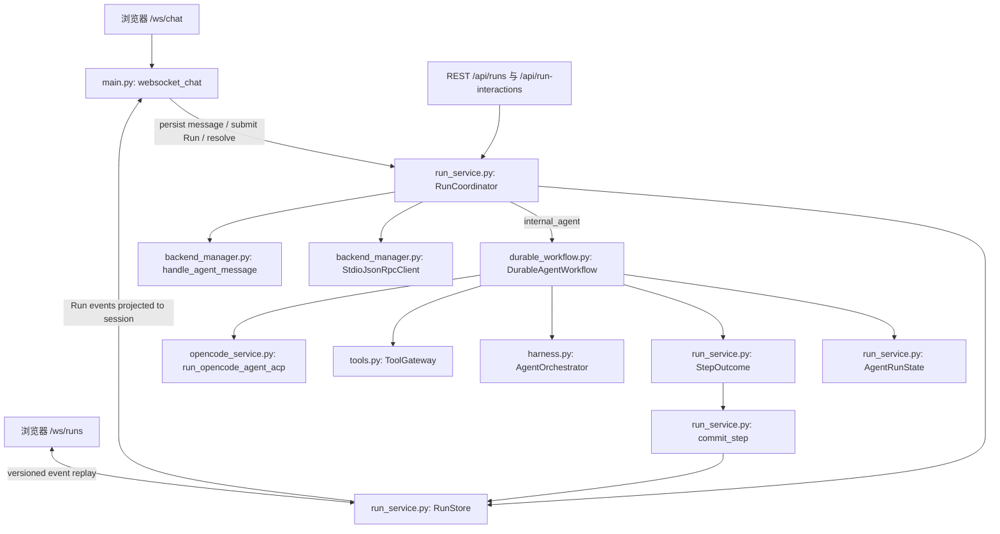
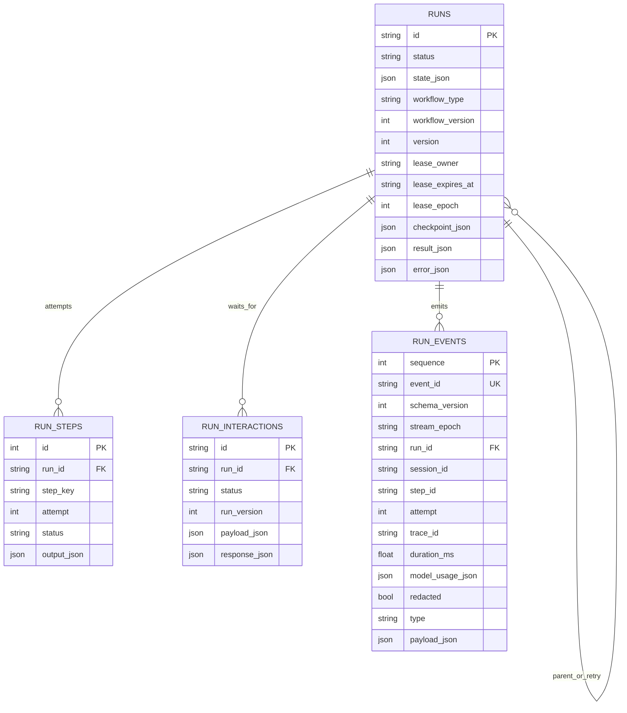
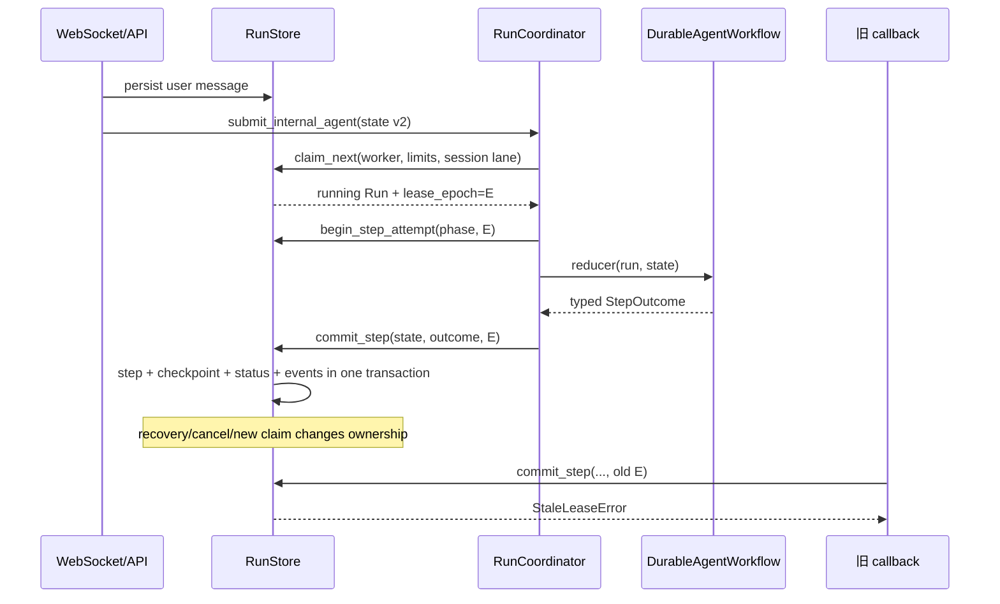
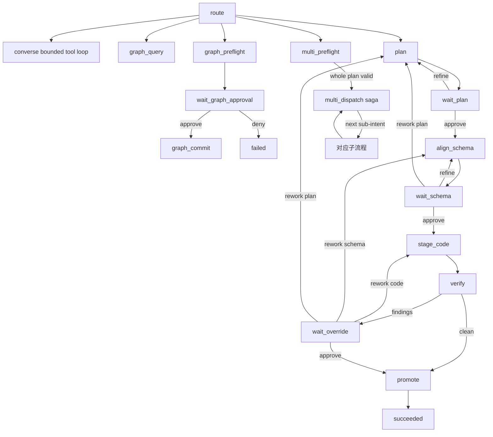
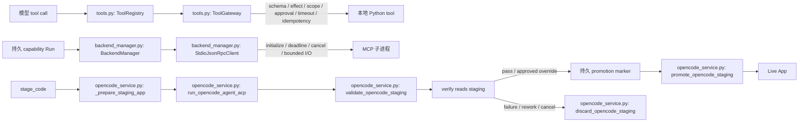
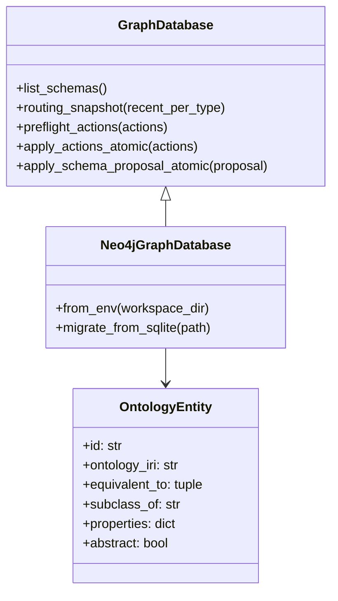
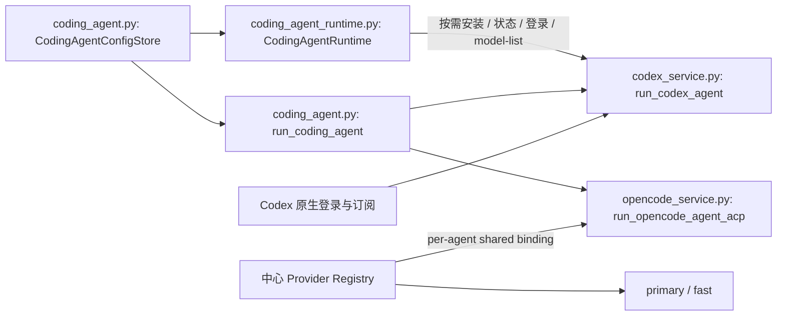

# 后端 Runtime UML

本页描述 scheduler-owned chat、持久 reducer 和统一的副作用执行边界。图中的 Python 引用由 `scripts/verify_uml.py` 检查。

## 1. 单一控制平面

WebSocket 只创建轻量的提交/响应投影 bridge，不在连接 task 中执行 agent、MCP 或远端 Agent 副作用。`AgentOrchestrator` 被 reducer 复用为 domain helper，控制权在 `RunCoordinator`；浏览器断线不改变 Run 的事实状态。

## 2. 持久数据模型

## 3. Claim、执行与 fencing

同一 session 的较早 Run 处于 `running`、`waiting_user`、`cancel_requested` 或 `needs_attention` 时，后续 Run 不能被 claim。`waiting_user` 释放 worker slot，但保留 session lane。

## 4. Version 2 workflow 状态

所有 wait phase 都先持久化 interaction 再返回 `Wait`。resolve 以 `expected_run_version` 检查并原子记录 response、关闭同 Run 其他 pending interaction、重新入队和追加 events。

## 5. Tool、MCP 与 OpenCode 边界

`ToolGateway` 当前统一模型请求的本地 Python tools；Capability、MCP、远端 Agent 与 ACP 仍各自保留 adapter/permission policy。OpenCode 已有 path、argv、environment、output、process-group 和 staging 约束，但并非 OS 级网络/文件系统 sandbox。

Backend 镜像必须同时包含 Node.js 与由前端 lockfile 固定的 `@babel/standalone`。`validate_opencode_staging` 对 OpenCode/Codex 共用的 staging 执行 Babel 解析、host/network global 拒绝和受限 VM smoke test；verifier 缺失或失败时 staging 不得提升为 live App。

## 6. 事件与恢复边界

Run event payload 在入库前脱敏并限制大小，envelope 记录 duration/model usage/`redacted` 元数据；终态 event 默认保留 30 天。Graph effect ledger 防止 checkpoint 窗口重复写，App promotion marker 区分已发布与待发布 staging。只有完整补偿数据的 saga step 才自动回滚。

## 7. 规范本体与 KG 存储边界

`create_graph_database()` 是运行时 factory：部署选择 Neo4j，SQLite `GraphDatabase` 仅作为测试与迁移兼容适配器。两种 adapter 执行同一 `ambient-context` 本体契约；未知实体、抽象实体和未知属性都不能写入 record。

## 8. Coding Agent Runtime 与模型所有权

内置 Adapter 是受信任的能力清单，但 CLI 只有在用户选择安装时才下载到独立持久卷。安装、认证、动态模型发现与执行使用同一 Agent 专用状态目录；Ambient Provider 凭据不会进入 native 模式的 Codex 进程。Codex 模型列表来自 app-server `model/list`，不在 Ambient 中硬编码。Provider 连接集中管理，模型消费角色分开绑定：Ambient 使用 `primary/fast`，OpenCode 使用可继承或专用的 `shared_binding`，Codex 使用 `native` 绑定。Run 提交时同时冻结 Agent、Agent 模型配置与解析后的 shared model，恢复执行不会受设置页后续变化影响。

Docker 默认 seccomp 会阻止 Codex bubblewrap 创建非特权 user namespace。Compose 仅放开该 syscall 过滤层，让 Codex 自己的 `workspace-write` 沙箱在外层容器边界内工作；不使用 `SYS_ADMIN` 或 `danger-full-access`。
