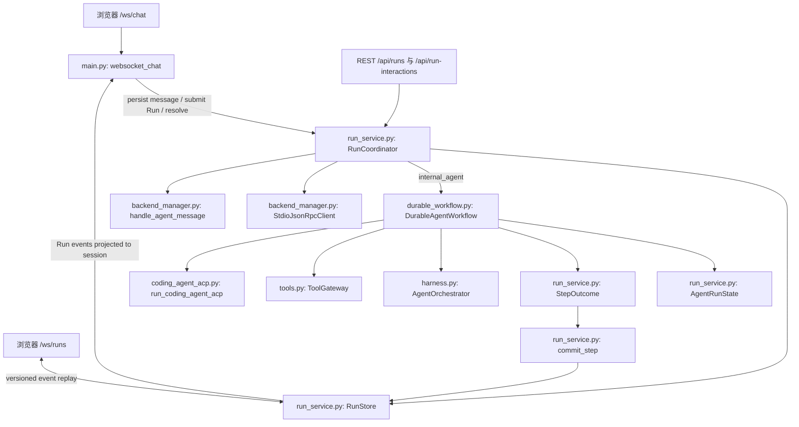
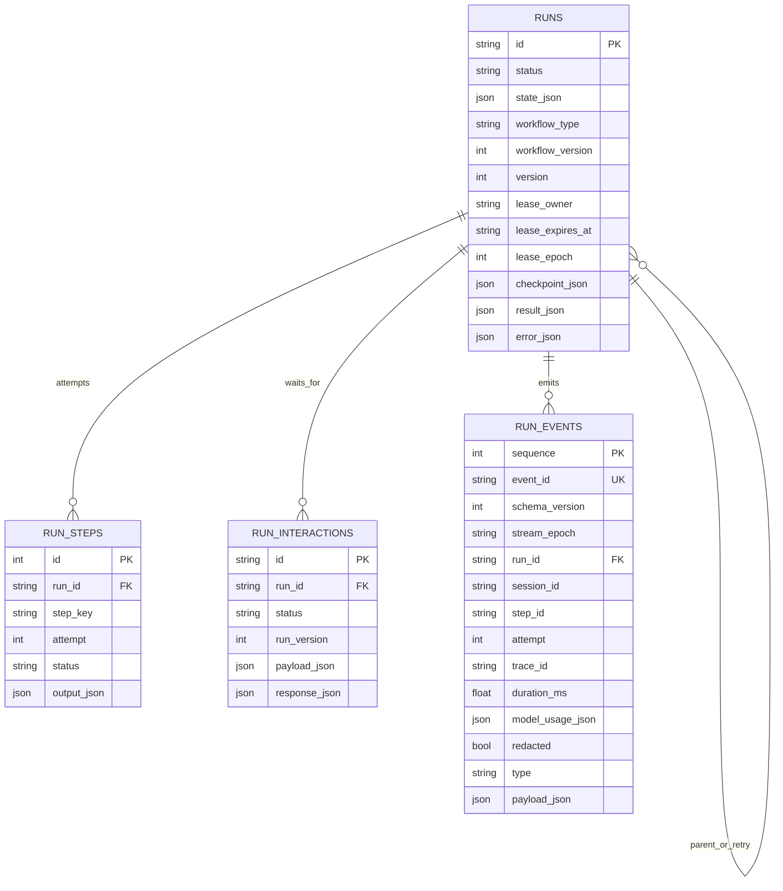
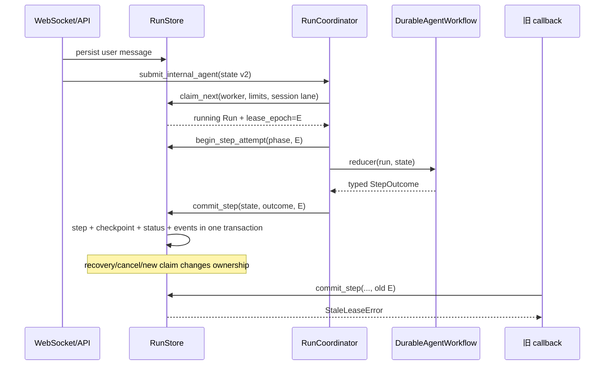
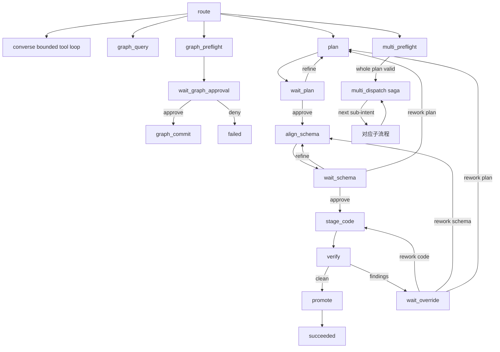
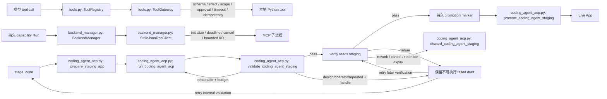
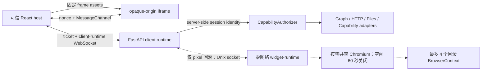
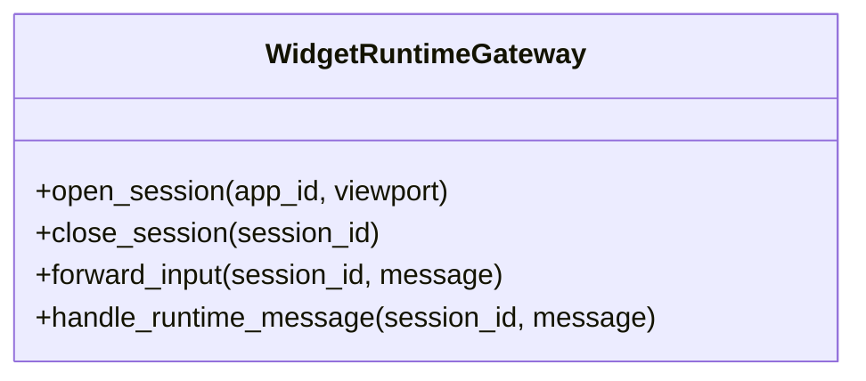
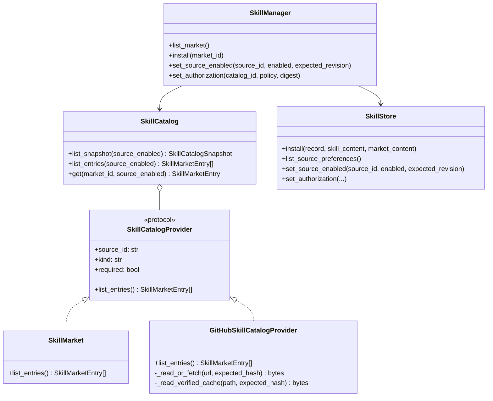
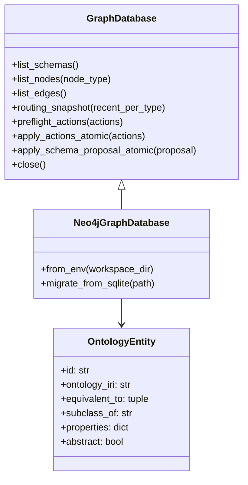

# 后端 Runtime UML

本页描述 scheduler-owned chat、持久 reducer 和统一的副作用执行边界。图中的 Python 引用由 `scripts/verify_uml.py` 检查。

## 1. 单一控制平面

```mermaid
flowchart TB
    Chat[浏览器 /ws/chat] --> Main[main.py: websocket_chat]
    RunAPI[REST /api/runs 与 /api/run-interactions] --> Coordinator[run_service.py: RunCoordinator]
    RunWS[浏览器 /ws/runs] <-->|versioned event replay| Store[run_service.py: RunStore]

    Main -->|persist message / submit Run / resolve| Coordinator
    Coordinator --> Store
    Coordinator -->|internal_agent| Workflow[durable_workflow.py: DurableAgentWorkflow]
    Workflow --> State[run_service.py: AgentRunState]
    Workflow --> Outcome[run_service.py: StepOutcome]
    Outcome --> Commit[run_service.py: commit_step]
    Commit --> Store

    Workflow --> Domain[harness.py: AgentOrchestrator]
    Workflow --> Tools[tools.py: ToolGateway]
    Workflow --> ACP[coding_agent_acp.py: run_coding_agent_acp]
    Coordinator --> MCP[backend_manager.py: StdioJsonRpcClient]
    Coordinator --> Remote[backend_manager.py: handle_agent_message]

    Store -->|Run events projected to session| Main
```

WebSocket 只创建轻量的提交/响应投影 bridge，不在连接 task 中执行 agent、MCP 或远端 Agent 副作用。`AgentOrchestrator` 被 reducer 复用为 domain helper，控制权在 `RunCoordinator`；浏览器断线不改变 Run 的事实状态。

## 2. 持久数据模型

```mermaid
erDiagram
    RUNS ||--o{ RUN_STEPS : attempts
    RUNS ||--o{ RUN_INTERACTIONS : waits_for
    RUNS ||--o{ RUN_EVENTS : emits
    RUNS ||--o{ RUNS : parent_or_retry

    RUNS {
        string id PK
        string status
        json state_json
        string workflow_type
        int workflow_version
        int version
        string lease_owner
        string lease_expires_at
        int lease_epoch
        json checkpoint_json
        json result_json
        json error_json
    }
    RUN_STEPS {
        int id PK
        string run_id FK
        string step_key
        int attempt
        string status
        json output_json
    }
    RUN_INTERACTIONS {
        string id PK
        string run_id FK
        string status
        int run_version
        json payload_json
        json response_json
    }
    RUN_EVENTS {
        int sequence PK
        string event_id UK
        int schema_version
        string stream_epoch
        string run_id FK
        string session_id
        string step_id
        int attempt
        string trace_id
        float duration_ms
        json model_usage_json
        bool redacted
        string type
        json payload_json
    }
```

## 3. Claim、执行与 fencing

```mermaid
sequenceDiagram
    participant WS as WebSocket/API
    participant S as RunStore
    participant C as RunCoordinator
    participant W as DurableAgentWorkflow
    participant X as 旧 callback

    WS->>S: persist user message
    WS->>C: submit_internal_agent(state v2)
    C->>S: claim_next(worker, limits, session lane)
    S-->>C: running Run + lease_epoch=E
    C->>S: begin_step_attempt(phase, E)
    C->>W: reducer(run, state)
    W-->>C: typed StepOutcome
    C->>S: commit_step(state, outcome, E)
    S->>S: step + checkpoint + status + events in one transaction

    Note over S: recovery/cancel/new claim changes ownership
    X->>S: commit_step(..., old E)
    S-->>X: StaleLeaseError
```

同一 session 的较早 Run 处于 `running`、`waiting_user`、`cancel_requested` 或 `needs_attention` 时，后续 Run 不能被 claim。`waiting_user` 释放 worker slot，但保留 session lane。

## 4. Version 2 workflow 状态

```mermaid
flowchart TB
    Route[route] --> Converse[converse bounded tool loop]
    Route --> Query[graph_query]
    Route --> GPre[graph_preflight]
    GPre --> GWait[wait_graph_approval]
    GWait -->|approve| GCommit[graph_commit]
    GWait -->|deny| Failed[failed]

    Route --> Plan[plan]
    Plan --> WPlan[wait_plan]
    WPlan -->|approve| Align[align_schema]
    WPlan -->|refine| Plan
    Align --> WSchema[wait_schema]
    WSchema -->|approve| Stage[stage_code]
    WSchema -->|refine| Align
    WSchema -->|rework plan| Plan
    Stage --> Verify[verify]
    Verify -->|clean| Promote[promote]
    Verify -->|findings| Override[wait_override]
    Override -->|rework code| Stage
    Override -->|rework schema| Align
    Override -->|rework plan| Plan
    Promote --> Success[succeeded]

    Route --> Multi[multi_preflight]
    Multi -->|whole plan valid| Saga[multi_dispatch saga]
    Saga -->|next sub-intent| RouteSub[对应子流程]
    RouteSub --> Saga
```

所有 wait phase 都先持久化 interaction 再返回 `Wait`。resolve 以 `expected_run_version` 检查并原子记录 response、关闭同 Run 其他 pending interaction、重新入队和追加 events。

## 5. Tool、MCP 与 Coding Agent ACP 边界

```mermaid
flowchart LR
    Model[模型 tool call] --> Registry[tools.py: ToolRegistry]
    Registry --> Gateway[tools.py: ToolGateway]
    Gateway -->|schema / effect / scope / approval / timeout / idempotency| LocalTool[本地 Python tool]

    Run[持久 capability Run] --> Backend[backend_manager.py: BackendManager]
    Backend --> MCP[backend_manager.py: StdioJsonRpcClient]
    MCP -->|initialize / deadline / cancel / bounded I/O| Process[MCP 子进程]

    Stage[stage_code] --> Prepare[coding_agent_acp.py: _prepare_staging_app]
    Prepare --> ACP[coding_agent_acp.py: run_coding_agent_acp]
    ACP --> Validate[coding_agent_acp.py: validate_coding_agent_staging]
    Validate -->|repairable + budget| ACP
    Validate -->|pass| Verify[verify reads staging]
    Validate -->|design/operator/repeated + handle| Retain[保留不可执行 failed draft]
    Verify -->|pass| Marker[持久 promotion marker]
    Marker --> Promote[coding_agent_acp.py: promote_coding_agent_staging]
    Verify -->|failure| Retain
    Retain -->|retry internal validation| Stage
    Retain -->|retry later verification| Verify
    Verify -->|rework / cancel / retention expiry| Discard[coding_agent_acp.py: discard_coding_agent_staging]
    Promote --> Live[Live App]
```

`ToolGateway` 当前统一模型请求的本地 Python tools；Capability、MCP、远端 Agent 与 ACP 仍各自保留 adapter/permission policy。所有 Coding Agent 都通过同一个 ACP client、session、文件/终端权限、输出上限、process-group、staging、验证和 repair 状态机执行；这些约束并非 OS 级网络/文件系统 sandbox。

Backend 镜像必须同时包含 Node.js 与由前端 lockfile 固定的 `@babel/standalone`。`validate_coding_agent_staging` 对所有 Coding Agent 共用的 staging 执行 Babel 解析、host/network global 拒绝和受限 VM smoke test；verifier 缺失或失败时 staging 不得提升为 live App。

### 5.1 Widget 隔离 Runtime

```mermaid
flowchart LR
    Host[可信 React host] -->|固定 frame assets| Frame[opaque-origin iframe]
    Host <-->|nonce + MessageChannel| Frame
    Host <-->|ticket + client-runtime WebSocket| Gateway[FastAPI client runtime]
    Gateway -->|server-side session identity| Authorizer[CapabilityAuthorizer]
    Authorizer --> Adapters[Graph / HTTP / Files / Capability adapters]
    Gateway <-.->|仅 pixel 回滚：Unix socket| Supervisor[零网络 widget-runtime]
    Supervisor -.-> Chromium["按需共享 Chromium；空闲 60 秒关闭"]
    Chromium -.-> Contexts[最多 4 个回滚 BrowserContext]
```

```mermaid
classDiagram
    class WidgetRuntimeGateway {
        +open_session(app_id, viewport)
        +close_session(session_id)
        +forward_input(session_id, message)
        +handle_runtime_message(session_id, message)
    }
```

默认链路由 ticket 认证的 client-runtime Gateway 在内存中绑定
`session_id -> app_id/revision/grants_digest/artifact_digest`；所有 Controller
payload 身份字段都被忽略。Controller 只在 opaque-origin frame 内执行，并经
MessageChannel 把 RPC 交给可信 host 和 Backend authorizer。Workspace 稳态最多
驻留 Active + Warm 两个 Widget，挂起过渡最多再保留一个 Suspending Widget。

`WidgetRuntimeGateway`、Unix socket、共享 Chromium 和独立 BrowserContext 仅属于
显式 pixel 回滚链路。Runtime 不挂载工作区且使用 `network_mode: none`；浏览器
按需启动，最后一个会话关闭 60 秒后回收，默认最多 4 个 Context。

### 5.2 Skill Catalog 发现与授权边界

```mermaid
classDiagram
    class SkillCatalogProvider {
        <<protocol>>
        +source_id: str
        +kind: str
        +required: bool
        +list_entries() SkillMarketEntry[]
    }
    class SkillCatalog {
        +list_snapshot(source_enabled) SkillCatalogSnapshot
        +list_entries(source_enabled) SkillMarketEntry[]
        +get(market_id, source_enabled) SkillMarketEntry
    }
    class SkillMarket {
        +list_entries() SkillMarketEntry[]
    }
    class GitHubSkillCatalogProvider {
        +list_entries() SkillMarketEntry[]
        -_read_or_fetch(url, expected_hash) bytes
        -_read_verified_cache(path, expected_hash) bytes
    }
    class SkillManager {
        +list_market()
        +install(market_id)
        +set_source_enabled(source_id, enabled, expected_revision)
        +set_authorization(catalog_id, policy, digest)
    }
    class SkillStore {
        +install(record, skill_content, market_content)
        +list_source_preferences()
        +set_source_enabled(source_id, enabled, expected_revision)
        +set_authorization(...)
    }

    SkillCatalogProvider <|.. SkillMarket
    SkillCatalogProvider <|.. GitHubSkillCatalogProvider
    SkillCatalog o-- SkillCatalogProvider
    SkillManager --> SkillCatalog
    SkillManager --> SkillStore
```

Provider 只负责发现、不可变来源 pin、下载与标准化；Catalog 负责跨来源去重、
确定性排序和可选来源故障隔离；Manager/Store 仍是唯一安装与授权控制面。
GitHub commit/hash、registry badge 或上游扫描都不会产生 Ambient trust。
远程 standalone Skill 与本地外部 Skill 一样安装为
`quarantined + disabled`，并复用精确 digest/revision 绑定的
`agent.context.inject` 通道。`scripts/`、`references/`、`assets/` 和依赖不进入
这个 Runtime；未来可执行扩展必须转成 Capability/Plugin/Widget，继续经过各自
的 sandbox、grant、approval 和 audit。

来源开关是 `SkillStore` 中的 workspace 控制面偏好，缺省为开启，并与 Skill
registry 共用 CAS revision。关闭来源后 `SkillCatalog` 不调用对应 Provider，
但仍在 source status 中保留它以便 UI 重新开启；已安装 snapshot 与授权不变。
开关不是 Provider trust 或 Skill grant，也不写入 ontology/KG。

## 6. 事件与恢复边界

Run event payload 在入库前脱敏并限制大小，envelope 记录 duration/model usage/`redacted` 元数据；终态 event 默认保留 30 天。Graph effect ledger 防止 checkpoint 窗口重复写，App promotion marker 区分已发布与待发布 staging。只有完整补偿数据的 saga step 才自动回滚。

## 7. 规范本体与 KG 存储边界

```mermaid
classDiagram
    class GraphDatabase {
        +list_schemas()
        +list_nodes(node_type)
        +list_edges()
        +routing_snapshot(recent_per_type)
        +preflight_actions(actions)
        +apply_actions_atomic(actions)
        +apply_schema_proposal_atomic(proposal)
        +close()
    }
    class Neo4jGraphDatabase {
        +from_env(workspace_dir)
        +migrate_from_sqlite(path)
    }
    class OntologyEntity {
        +id: str
        +ontology_iri: str
        +equivalent_to: tuple
        +subclass_of: str
        +properties: dict
        +abstract: bool
    }

    GraphDatabase <|-- Neo4jGraphDatabase
    Neo4jGraphDatabase --> OntologyEntity
```

`create_graph_database()` 是组合根唯一调用的运行时 factory：部署选择 Neo4j，SQLite `GraphDatabase` 仅作为测试与迁移兼容适配器。创建后的同一 adapter 被注入 Workflow、Agent 路由与工具；请求和 reducer step 不得创建第二个 Driver。两种 adapter 执行同一 `ambient-context` 本体契约，并由组合根在 shutdown 显式 `close()`；未知实体、抽象实体和未知属性都不能写入 record。可信 Host 的有界图谱快照只能通过 `list_schemas()`、`list_nodes()` 与一次性 `list_edges()` 组装，不能依赖 SQLite 私有连接，也不能按节点执行 N+1 关系查询。

## 8. Coding Agent Runtime 与模型所有权

```mermaid
flowchart LR
    Settings[coding_agent.py: CodingAgentConfigStore] --> Runtime[coding_agent_runtime.py: CodingAgentRuntime]
    Runtime -->|ACP launch descriptor| ACP[coding_agent_acp.py: run_coding_agent_acp]
    Settings --> Dispatch[coding_agent.py: run_coding_agent]
    Dispatch --> ACP
    Runtime --> OpenCode[OpenCode native ACP server]
    Runtime --> Bridge[@agentclientprotocol/codex-acp]
    Bridge --> AppServer[Codex app-server]

    Provider[中心 Provider Registry] --> Ambient[primary / fast]
    Provider -->|per-agent shared binding| OpenCode
    Native[Codex 原生登录与订阅] --> AppServer
```

ACP 是唯一的代码生成 orchestration 边界。内置 Adapter 只声明受信任的 launch descriptor：ACP server 命令、底层 CLI、环境、模型配置与版本来源；不能另写一套 prompt loop、权限或 repair 行为。OpenCode 启动原生 `opencode acp`。Codex 使用镜像中固定版本的 `@agentclientprotocol/codex-acp`，通过 `CODEX_PATH` 连接 Ambient 管理的 Codex CLI，再由后者启动官方 app-server。若新增 Agent 不原生支持 ACP，必须优先选择 ACP Registry 中可审计、版本固定、维护活跃的 bridge；bridge 只做协议映射，权限与生命周期仍由 Ambient ACP client 所有。

CLI 只有在用户选择安装时才下载到独立持久卷。安装、认证、动态模型发现与执行使用同一 Agent 专用状态目录；Ambient Provider 凭据不会进入 native 模式的 Codex 进程。Codex 模型列表仍来自 app-server `model/list`，不在 Ambient 中硬编码。Provider 连接集中管理，模型消费角色分开绑定：Ambient 使用 `primary/fast`，OpenCode 使用可继承或专用的 `shared_binding`，Codex 使用 `native` 绑定。Run 提交时同时冻结 Agent、Agent 模型配置与解析后的 shared model，恢复执行不会受设置页后续变化影响。

Docker 默认 seccomp 会阻止 Codex bubblewrap 创建非特权 user namespace。Compose 仅放开该 syscall 过滤层，让 Codex 自己的 `workspace-write` 沙箱在外层容器边界内工作；不使用 `SYS_ADMIN` 或 `danger-full-access`。
