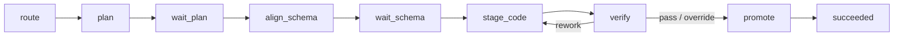

# Durable phase pipeline

> This route is retained for old documentation links. The production harness no longer uses WidgetDAG, SubExecutor, or CodingPlanExecutor. Its only execution model is the explicit durable phase reducer driven by `RunCoordinator`.

## 1. Phase rules

`DurableAgentWorkflow` executes only the step named by `AgentRunState.phase` and returns `Continue`, `Wait`, `Succeeded`, `Failed`, or `Cancelled`. `RunCoordinator` claims the step with `lease_owner + lease_epoch`; `RunStore.commit_step()` commits the attempt, checkpoint, status, and events in one SQLite transaction.

Before waiting for a user, the workflow persists an interaction and then returns `Wait`. `waiting_user` releases the worker slot but retains the session FIFO lane. Resolution atomically records the response using `run_version` and requeues the Run. There is no process-local approval Future.

## 2. Effects and recovery

- Graph mutation preflights first, commits in one transaction, and records an effect ledger keyed by `run_id + phase`.
- Multi-intent preflights the whole request, then executes serially as a saga. Only steps with complete reverse data are compensated automatically.
- App code is written only to per-Run staging. After verification, a promotion marker and atomic live-App swap make recovery non-duplicating.
- Cancellation or failure discards staging. Runs with uncertain external effects enter `needs_attention` instead of reporting false success or cancellation.

## 3. Safe execution

Converse exposes only the minimum ToolSpec set required by its phase. OpenCode is strict by default: terminals execute only exact argv admitted by policy, never through a shell, and cwd, environment, output, and process-group lifecycle are bounded. Out-of-policy requests fail closed.
