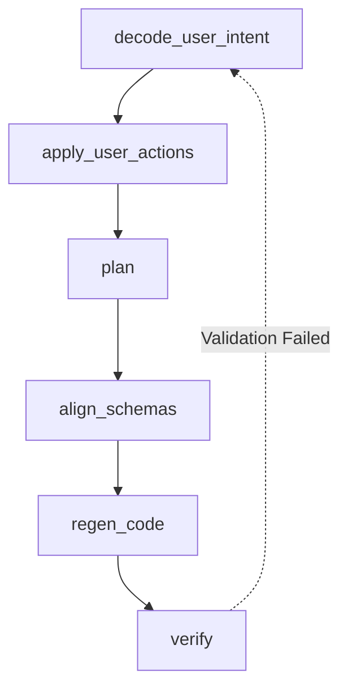

# DAG Pipeline (WidgetDAG)

Card compilation and updates run inside `WidgetDAG`, which schedules 6 sequential task nodes with automatic dependency invalidations.

## 1. Execution Order

If any task node gets updated, downstream steps are marked `dirty` and re-executed.

## 2. Task Nodes Description

- `decode_user_intent`: Interprets natural language revision queries.
- `apply_user_actions`: Merges user checkbox feedback.
- `plan`: Outlines custom widget build strategies.
- `align_schemas`: Validates node structure alignments.
- `regen_code`: Invokes code generations.
- `verify`: Runs sanity, script safety, and syntax checks.
