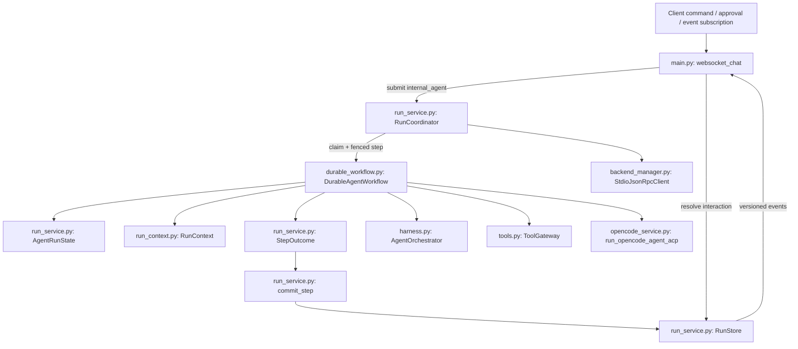
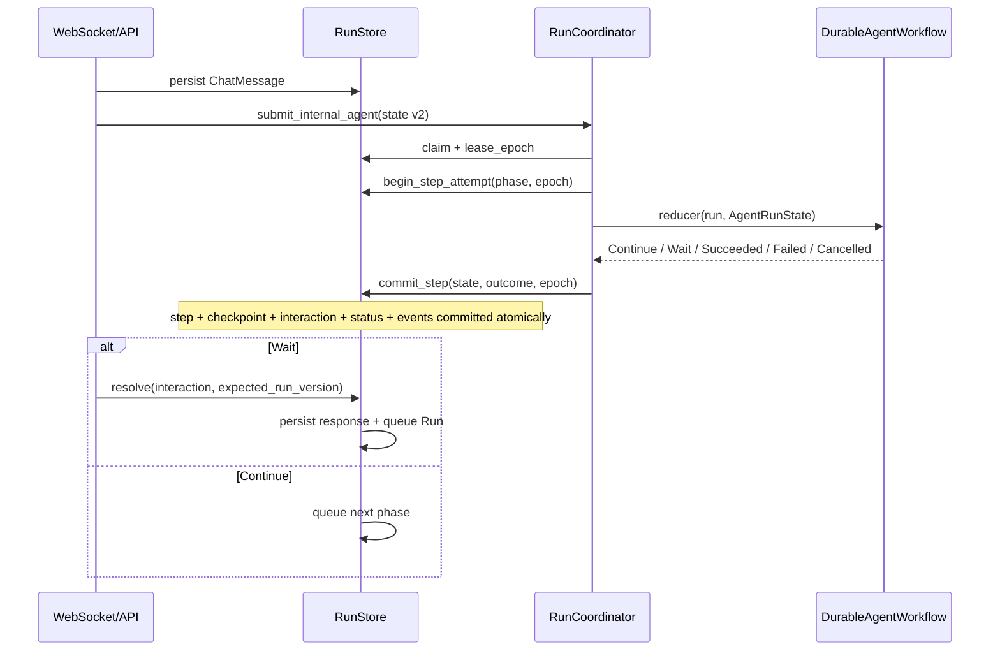
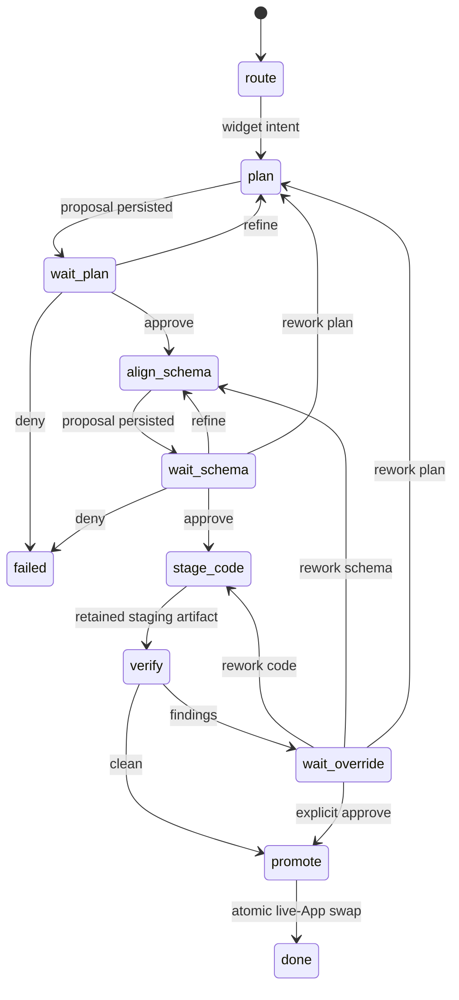
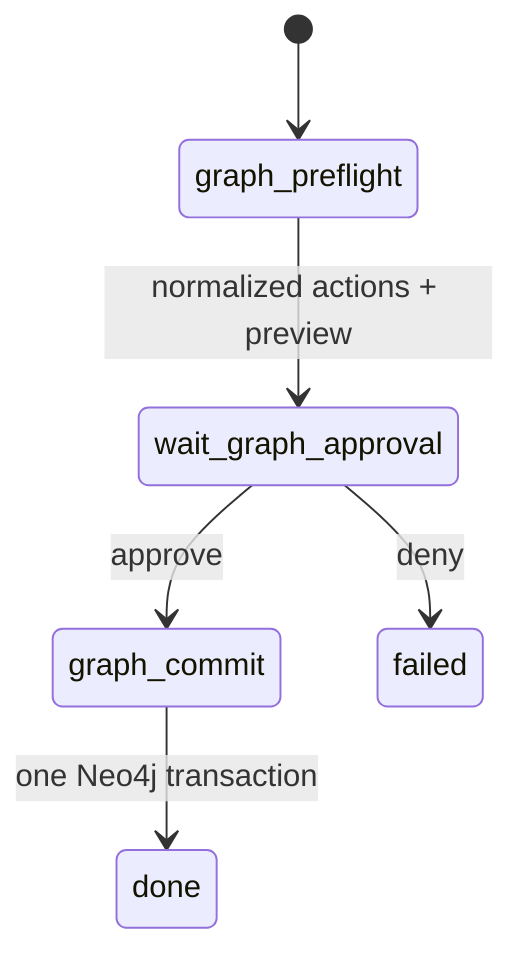

# Agent Harness: One Durable Control Plane

Chat, capability, MCP, and remote-Agent actions are all lifecycle-managed by `RunStore + RunCoordinator`. A WebSocket only persists input, submits Runs, resolves interactions, and projects durable events to clients; it no longer creates or owns an agent execution task.

## 1. Component boundaries

Responsibilities:

- `RunStore`: source of truth for Run state, step attempts, checkpoints, interactions, and versioned events.
- `RunCoordinator`: queueing, session FIFO lanes, leases/heartbeats, orphan recovery, cancellation, and adapter dispatch.
- `DurableAgentWorkflow`: version 2 chat reducer; each invocation advances exactly one phase and returns a typed `StepOutcome`.
- `RunContext`: explicitly carries run/session/step/attempt/trace and frozen model IDs into every LLM and tool audit call.
- `AgentOrchestrator`: retained routing, Converse, and formatting domain helpers; it no longer owns `/ws/chat` execution lifecycle.
- `ToolGateway`, the MCP client, and OpenCode ACP: enforcement boundaries for local model tools, external JSON-RPC, and code generation respectively.

## 2. Reducer protocol

`AgentRunState` stores workflow type/version, session, phase, attempt, intent, model snapshots, budget, artifact references, workflow data, pending interaction, summary reference, and last error. Every field must remain JSON serializable.

Outcome semantics:

- `Continue(next_phase)` checkpoints and requeues;
- `Wait(interaction definition)` creates the pending interaction in the same transaction and releases the worker;
- `Succeeded` stores result and artifacts;
- `Failed` requeues according to `retryable` or fails; an unknown effect enters `needs_attention`;
- `Cancelled` enters `cancelled` only when no unknown effect remains.

Every commit must match `lease_owner + lease_epoch`. Cancellation, recovery, or a newer claim fences out a late callback.

## 3. Version 2 workflows

### Widget create / modify

OpenCode runs with `promote=False` and returns `OpenCodeStagedResult`. `verify` reads staging only. `promote` revalidates the artifact, computes its hash, persists a promotion marker, commits the approved schema, and atomically replaces the live App. Recovery checks the marker and does not publish twice. Failure, rework, and cancellation discard staging and preserve the old live App.

### Graph mutation

Preflight performs no database write and first verifies that every record entity exists in the single `ambient-context` ontology. Commit uses `apply_actions_atomic()` to store context records/edges, a rollback ticket, complete reverse actions, and the `run_id + phase` Graph effect ledger in one Neo4j transaction. If a worker crashes after that transaction but before the Run checkpoint, retry returns the original result rather than duplicating writes. `/api/graph/mutate` and WebSocket rollback use the same reducer, with an explicit command recorded as a durable approval interaction. Multi-intent preflights the complete request first, then `multi_dispatch` advances it serially as a saga. A retryable current phase preserves prior effects and compensation data; only a terminal failure compensates in reverse and rewinds cursor/results to the saga start. Incomplete compensation or uncertain effects enter `needs_attention`.

### Converse and read-only queries

- `converse` uses a bounded tool loop: model iterations, tool-call count, total wall clock, each LLM timeout, assistant output size, and identical repeated calls are capped.
- Converse currently exposes only `READ` tools with the `workspace:read` scope.
- `graph_query` executes a read-only query and produces the final projection; `clarify` persists a clarification response and completes.

## 4. Tool and Context boundaries

`ToolRegistry` is the registration facade, and `ToolGateway` is the execution enforcement point for model-requested local tools. `ToolSpec` declares input/output schemas, effect, scope, approval, timeout, idempotency requirement, output bound, and sensitive fields. The gateway rejects unknown tools/arguments, scope violations, missing approval, missing idempotency keys, and reuse of a key with different arguments. Every invocation emits started/succeeded/failed/cancelled events with run/step/attempt/trace IDs and duration, and every result receives type and size validation. The production registry currently contains only READ tools; Graph/App writes use dedicated workflows with durable effect ledgers instead of a process-local tool cache or an unkillable worker thread.

Capability, MCP, ACP, and HTTP adapters execute at the same `RunCoordinator` effect boundary and share lease fencing, durable approval, deadline, cancellation, and `needs_attention` semantics. HTTP Agents additionally have a total wall-clock deadline, request/response/event bounds, a bounded SSE decoder, and disabled environment-proxy inheritance. Remote effects default to manual recovery; a manifest string cannot replace proof of remote idempotency or reconciliation. Protocol-specific schemas, capabilities, and process policies remain enforced by their adapters; they do not masquerade as Python tools or bypass the durable Run control plane.

The reducer constructs `RunContext` from the durable Run and checkpoint and passes it explicitly into routing, planning, schema alignment, verification, and Converse providers. `ContextManager` deterministically bounds recent-message count, per-message characters, artifact characters, and total prompt size. Messages outside the window become a deterministic checkpointed summary verified by `context_summary_ref=sha256:…`. LLM audit rows record prompt/model/tool-schema hashes and the hashes of retrieved artifacts. Trimming is character-based, while provider-reported token and cost usage enters the Run's total budget. The primary/fast models, Coding Agent, agent model binding, and resolved shared model are snapshotted at submission, so recovery does not drift when the UI changes settings mid-run.

## 5. Events, cancellation, and retention

The Run event envelope includes `event_id`, `sequence`, `schema_version`, `stream_epoch`, Run/session/step/attempt/trace identifiers, time, duration, model usage, `redacted`, and payload. Payloads are redacted by sensitive key and size-bounded before insertion; terminal events are retained for 30 days by default. The frontend maintains a replay cursor with `(stream_epoch, sequence)` and deduplicates by `event_id`.

A same-session `waiting_user` Run releases its worker slot but retains the FIFO lane. Resolution checks `run_version` to reject duplicate or stale responses. Cancelling a running Run cancels the scheduler task and propagates into tool/MCP/ACP child calls; an uncertain external effect is never reported as safely cancelled.

`needs_attention` cannot be changed directly to cancelled. `POST /api/runs/{id}/reconcile` must durably record `confirmed_not_committed`, `compensated`, or `confirmed_committed` before manual review closes. Promise-compatible calls store `projection_type + call_id` in Run correlation and include the call ID in idempotency identity, so reconnect handling can reconstruct response correlation from durable Runs/events.

Plan, schema, verification, and MCP/Agent permission all use Run interactions rather than global Futures. OpenCode ACP executes only exact argv admitted by strict policy; an out-of-policy request fails closed instead of holding a worker on process-local approval.

## 6. Deterministic evaluation

`RunStoreTraceAdapter` derives `EvaluationTrace` from real Runs, step attempts, canonical events, and LLM audit records, including unsafe trajectory signals from unknown effects, policy violations, and unapproved effectful tools. Scripted CI scenarios execute through production `RunCoordinator + DurableAgentWorkflow`; reported metrics cover outcome/trajectory, success rate, unsafe action rate, tool calls, tokens, cost, latency, and recovery rate. Real-model scenarios remain separate and require at least three repetitions.
