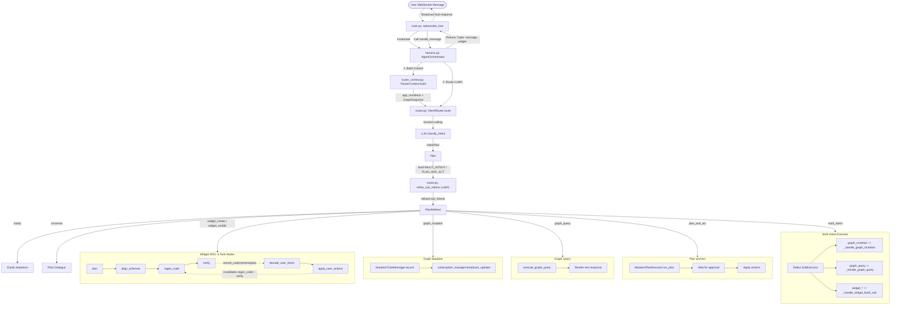

# Agent Harness Architecture

This document describes the Agent Harness layout and execution flows under `backend/agent/`.

## 1. Component Relationships

The harness decouples intent routing, workspace storage state, prompts formatting, and LLM requests.

```mermaid
classDiagram
    class WorkspaceStorage {
        +workspace_dir: str
        +get(model_class, obj_id) BaseModel
        +add(obj) void
        +commit() void
        +refresh(obj) void
        +get_sessions() List
        +get_messages(session_id) List
        +get_audit_logs() List
        +delete_session(session_id) bool
        +get_canvas_config() dict
        +save_canvas_config(config) void
    }

    class AgentOrchestrator {
        +db: WorkspaceStorage
        +app_manager: AppManager
        +context_manager: ContextManager
        +run_opencode_agent_acp_fn: Callable
        +handle_message(session_id, content, on_update) Tuple
        -_classify_intent(content) IntentPlan
        -_handle_widget_build(plan, session_id, on_update) Tuple
        -_handle_widget_build_sub(plan, session_id, on_update, ...) Tuple
        -_handle_graph_mutation(plan, session_id, on_update) Tuple
        -_handle_graph_query(plan, session_id, on_update) Tuple
        -_handle_plan_and_act(plan, session_id, on_update) Tuple
        -_handle_multi_intent(plan, session_id, on_update) Tuple
        -_handle_converse(plan, session_id, content, on_update) Tuple
    }

    class IntentPlan {
        +kind: IntentKind
        +confidence: float
        +rationale: str
        +app_id: str
        +instruction: str
        +actions: List~dict~
        +query: dict
        +sub_intents: List~SubIntent~
        +clarification_message: str
        +clarification_options: List~dict~
        +deprecated: bool
        +to_dict() dict
        +from_dict(data) IntentPlan
        +from_tool_call_args(args) IntentPlan
        +tool_schema() dict
    }

    class SubIntent {
        +kind: SubIntentKind
        +app_id: str
        +instruction: str
        +actions: List~dict~
        +query: dict
        +extend_schema_props: dict
        +feedback: str
        +to_dict() dict
        +from_dict(data) SubIntent
    }

    class IntentKind {
        <<enum>>
        +WIDGET_CREATE
        +WIDGET_MODIFY
        +GRAPH_MUTATION
        +GRAPH_QUERY
        +PLAN_AND_ACT
        +MULTI_INTENT
        +CLARIFY
        +CONVERSE
    }

    class SubIntentKind {
        <<enum>>
        +GRAPH_MUTATION
        +GRAPH_QUERY
        +WIDGET_CREATE
        +WIDGET_MODIFY
        +WIDGET_EXTEND_SCHEMA
        +WIDGET_FIX_CODE
        +WIDGET_REWRITE
    }

    class RouterContext {
        +app_manifests: List~dict~
        +graph_snapshot: GraphSnapshot
        +session_recent: List~dict~
        +build(app_manager, graph_db, session_messages) RouterContext
        +render_for_prompt() str
    }

    class GraphSnapshot {
        +type_counts: Dict
        +recent_nodes_by_type: Dict
        +schema_manifest: List~dict~
        +node_count: int
        +edge_count: int
        +from_db(db, recent_per_type) GraphSnapshot
    }

    class IntentRouter {
        +route(content, context) IntentPlan
        +route_legacy(content, existing_apps) IntentPlan
        +refine_sub_intents(plan, context) IntentPlan
    }

    class WidgetDAG {
        +_nodes: Dict~str, TaskNode~
        +_order: List~str~
        +_dirty: Set~str~
        +register(node) void
        +dirty(*names) void
        +idle() bool
        +pending() List~str~
        +step(ctx) TaskResult
    }

    class TaskNode {
        +name: str
        +run: Callable
        +needs_outputs_from: Set~str~
        +invalidates: Set~str~
    }

    class TaskResult {
        +success: bool
        +outputs: dict
        +error: str
        +ask_user: dict
        +invalidates_if_redo: Set~str~
    }

    class VerificationDiff {
        +unknown_props: List~UnknownProperty~
        +type_mismatches: List~TypeMismatch~
        +unknown_types: List~UnknownType~
        +is_clean: bool
        +to_markdown() str
        +to_per_field_payload() List~dict~
    }

    class SchemaVerificationService {
        +diff(app_id, widget_code, schemas) VerificationDiff
        +verify(app_id, widget_code, schemas) str
    }

    class MutationTicketManager {
        +record(session_id, forward_actions, snapshot_before) MutationTicket
        +pin(session_id, ticket_id) bool
        +rollback(session_id, ticket_id) List~dict~
        +get(session_id, ticket_id) MutationTicket
    }

    class PlanExecutor {
        <<abstract>>
        +run_plan(plan, instruction, on_update) PlanPhaseResult
    }

    class CodingPlanExecutor {
        +run_plan(plan, instruction, on_update) PlanPhaseResult
    }

    class MutationPlanExecutor {
        +run_plan(plan, instruction, on_update) PlanPhaseResult
    }
    class PlanPhaseResult {
        +success: bool
        +output: str
        +error: str
        +extra: dict
    }

    class AgentOrchestrator {
        +db: WorkspaceStorage
        +app_manager: AppManager
        +context_manager: ContextManager
        +run_opencode_agent_acp_fn: function
        +handle_message(session_id: str, content: str, on_update: Callable) tuple
        -_run_callback(callback: Callable, data: Any) void
        -_handle_graph_mutation(plan, session_id, on_update) tuple
        -_handle_graph_query(plan, session_id, on_update) tuple
        -_handle_plan_and_act(plan, session_id, on_update) tuple
        -_handle_multi_intent(plan, session_id, on_update) tuple
        -_handle_converse(plan, session_id, content, on_update) tuple
        -_handle_widget_build(plan, session_id, on_update) tuple
    }

    class AppManager {
        +list_apps() List
        +get_app_files(app_id) Dict
        +create_or_update_app(app_id, title, html, css, js, kwargs) void
        +get_manifest(app_id) AppManifest|None
    }

    class PromptManager {
        +prompts_dir: Path
        +env: Environment
        +get_prompt(template_name, kwargs) str
    }

    ChatSession "1" --* "0..*" ChatMessage : contains
    ContextManager --> AppManager : references
    ContextManager --> ChatMessage : queries database
    AgentOrchestrator --> ContextManager : constructs message history
    AgentOrchestrator --> AppManager : references
    AgentOrchestrator --> AgentParser : extracts XML widgets
    AgentOrchestrator --> PromptManager : loads system prompt
    AgentOrchestrator --> IntentRouter : classifies user intent (LLM #1)
    AgentOrchestrator --> IntentRouter : refines sub_intents (LLM #2)
    AgentOrchestrator --> PlanExecutor : dispatches to coding/mutation
    AgentOrchestrator --> WidgetDAG : widget build pipeline
    IntentRouter --> IntentPlan : returns structured plan
    IntentRouter --> RouterContext : consumed
    IntentPlan --> SubIntent : 0..* sub_intents
    SubIntent --> SubIntentKind : kind enum
    IntentPlan --> IntentKind : kind enum
    RouterContext --> GraphSnapshot : embeds snapshot
    IntentPlan --> IntentKind : kind is an enum value
    PlanExecutor <|-- CodingPlanExecutor
    PlanExecutor <|-- MutationPlanExecutor
    MutationPlanExecutor --> MutationTicketManager : records rollback tickets
    MutationTicketManager --> AgentOrchestrator : consumed in graph mutation paths
    WidgetDAG --> TaskNode : 0..* nodes
    TaskNode --> TaskResult : runs produce results
    AgentOrchestrator --> SchemaVerificationService : structured diff (Direction A)
    SchemaVerificationService --> VerificationDiff : returns
    LLMService --> LLMAuditLog : writes prompt audit logs
    LLMConfigStore --> ModelRunContext : resolves provider profiles
    AgentOrchestrator --> ModelRunContext : uses primary/fast snapshots
    ModelRunContext --> OpenCodeACP : injects selected model
```

Each `handle_message()` run captures immutable primary and fast model snapshots. Top-level routing uses
the fast model; refinement, planning, schema alignment, verification, and conversation use the primary
model. Widget code generation injects that same primary model and its process-local endpoint/credentials
into the OpenCode ACP subprocess through `OPENCODE_CONFIG_CONTENT`; nothing is written to project config.
Changing a session model while a run is active therefore affects only the next request.

## 2. Message Processing Flow

