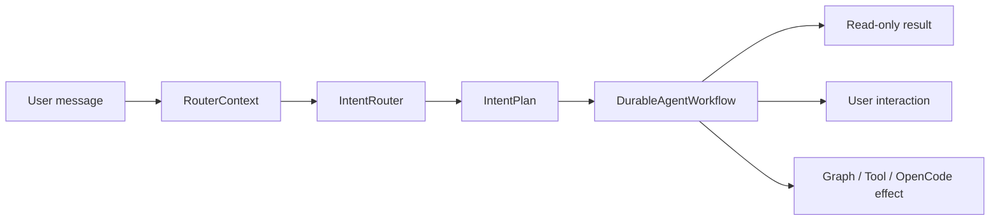

# Intent Router

`IntentRouter` converts user input into a structured `IntentPlan`. It chooses the durable workflow's phase path but does not execute tools, write Graph data, or publish apps directly.

## 1. Routing context

Routing input contains:

- the current user message, session language, and model snapshot;
- installed app manifests, intents, and schema references;
- a bounded `GraphSnapshot`;
- an available-capability summary;
- the fast model, falling back to the session primary model when unset.

The model must return structured arguments through the `classify_intent` tool schema. Parse failures, unknown kinds, low confidence, or unsafe legacy classifications degrade to `clarify`; they do not guess and execute side effects.

## 2. Top-level IntentKind

| Kind | Purpose | Main next path |
| --- | --- | --- |
| `converse` | Normal conversation and bounded read-only tool loop | Converse phase |
| `graph_query` | Read-only structured query | Graph query phase |
| `graph_mutation` | An explicit Graph action batch | preflight → required confirmation → atomic apply |
| `widget_create` | Create a new app | plan → confirm → staging → verify → publish |
| `widget_modify` | Modify an existing app | plan → confirm → staging → verify → publish |
| `multi_intent` | Ordered sub-actions | preflight all, then execute saga steps |
| `plan_and_act` | Composite action requiring an explicit plan | joins the durable multi-step path |
| `clarify` | Missing required detail or unsafe classification | create a user interaction or clarification message |

`IntentPlan` also contains `confidence` and `rationale`, plus kind-specific `app_id`, `instruction`, `actions`, `query`, `sub_intents`, or `clarification_*` fields.

## 3. SubIntent

`multi_intent` and `plan_and_act` may contain:

- `graph_mutation`
- `graph_query`
- `widget_create`
- `widget_modify`
- `widget_extend_schema`
- `widget_fix_code`
- `widget_rewrite`

The reducer preflights the complete list before the first side effect, then executes sequentially and checkpoints each step. Earlier output may feed later steps. On failure, persisted effect and recovery data determine continuation or `needs_attention`; execution does not depend on the old in-memory DAG.

## 4. Routing versus execution

- A routing result is a plan, not authorization.
- Graph actions still pass schema preflight.
- Widgets still pass staging, controller verification, and schema verification.
- Tools, MCP, and OpenCode still pass their permission and lifecycle policies.
- A Run uses the model selection frozen at start; changing the session model affects only the next Run.

See [Agent Harness](/en/agent/harness.md) and [Durable Runs](/en/architecture/runs.md) for execution details.
