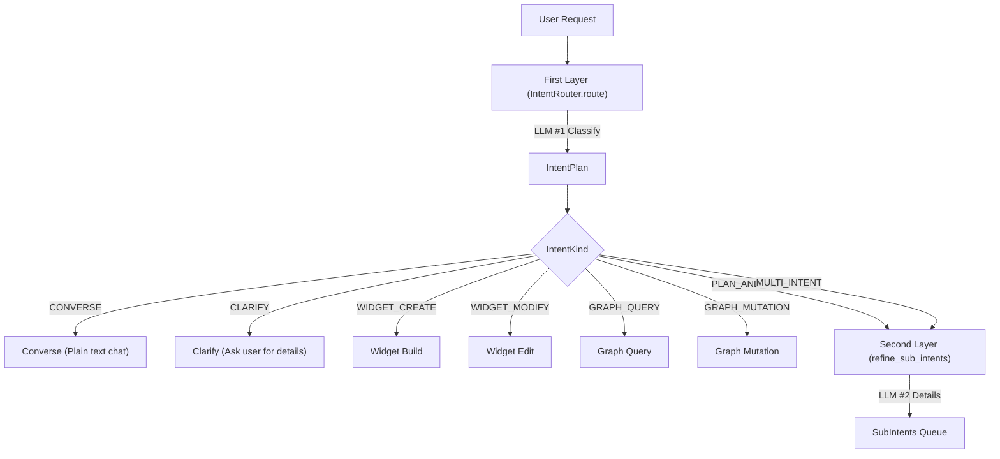

# Intent Router (IntentRouter)

Every user message in Ambient Agent passes through a two-layer routing layout to specify target executions.

---

## 1. Routing Diagram

---

## 2. Intent Kinds (`IntentKind`)

*   `CONVERSE`: Plain text chat.
*   `CLARIFY`: Emitted when arguments are ambiguous (e.g. updating a card with multiple matches). Triggers dropdown prompt to ask user.
*   `WIDGET_CREATE` / `WIDGET_MODIFY`: Card code generation.
*   `GRAPH_QUERY` / `GRAPH_MUTATION`: SQLite graph database reads and writes.
*   `MULTI_INTENT`: Triggers the second-layer refinement `refine_sub_intents()` to detail action schemas.
