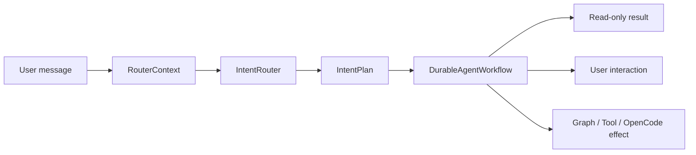

# Intent Router

`IntentRouter` converts user input into a structured `IntentPlan`. It chooses the durable workflow's phase path but does not execute tools, write Graph data, or publish apps directly.

## 1. Routing context

Routing input contains:

- the current user message, session language, and model snapshot;
- installed app manifests, intents, and schema references;
- a bounded `GraphSnapshot`;
- an available-capability summary;
- the fast model, falling back to the session primary model when unset.

The generative model must return complete arguments through the `classify_intent` tool schema. Unknown kinds become `clarify`; when no usable tool call is returned or an ordinary call fails, the default fallback is `converse` with a `confidence` of 0. The existing Router's `confidence` is a model self-rating, with no automatic threshold for low scores. Configuration errors and exhausted budgets remain the caller's responsibility. The durable workflow rejects plans marked deprecated.

The optional Jev classifier returns a separate `RouteDecision`, rather than replacing the complete `IntentPlan`. Its probability gate and the generative model's self-rating are different mechanisms; see section 6.

## 2. Top-level IntentKind

| Kind | Purpose | Main next path |
| --- | --- | --- |
| `converse` | Normal conversation and bounded read-only tool loop | Converse phase |
| `graph_query` | Read-only structured query | Graph query phase |
| `graph_mutation` | An explicit Graph action batch | preflight → required confirmation → atomic apply |
| `widget_create` | Create a new app | plan → confirm → staging → verify → publish |
| `widget_modify` | Modify an existing app | plan → confirm → staging → verify → publish |
| `multi_intent` | Ordered sub-actions | preflight all, then execute saga steps |
| `plan_and_act` | Composite action requiring an explicit plan | joins the durable multi-step path |
| `clarify` | Missing required detail or unsafe classification | create a user interaction or clarification message |

`IntentPlan` also contains `confidence` and `rationale`, plus kind-specific `app_id`, `instruction`, `actions`, `query`, `sub_intents`, or `clarification_*` fields.

## 3. SubIntent

`multi_intent` and `plan_and_act` may contain:

- `converse`
- `graph_mutation`
- `graph_query`
- `widget_create`
- `widget_modify`
- `widget_extend_schema`
- `widget_fix_code`
- `widget_rewrite`

The reducer preflights the complete list before the first side effect, then executes sequentially and checkpoints each step. Earlier output may feed later steps. On failure, persisted effect and recovery data determine continuation or `needs_attention`; execution does not depend on the old in-memory DAG.

## 4. Routing versus execution


```mermaid
flowchart LR
    Message[User message] --> Context[RouterContext]
    Context --> Router[IntentRouter]
    Router --> Plan[IntentPlan]
    Plan --> Reducer[DurableAgentWorkflow]
    Reducer --> Read[Read-only result]
    Reducer --> Interaction[User interaction]
    Reducer --> Effect[Graph / Tool / OpenCode effect]
```

- A routing result is a plan, not authorization.
- Graph actions still pass schema preflight.
- Widgets still pass staging, controller verification, and schema verification.
- Tools, MCP, and OpenCode still pass their permission and lifecycle policies.
- A Run uses the model selection and non-secret Jev configuration frozen at start; changing configuration affects only the next Run. The Jev API key is excluded from Run snapshots.

## 5. Explicit `/` routing commands

Slash commands form a small routing DSL, not another executor. The client reads
the shared command definitions, argument shapes, and all current App/Skill IDs
from `GET /api/chat/commands`. The backend reparses the original message and
compiles it into an `IntentPlan`, so a forged client payload cannot bypass the
Router, approvals, or the durable reducer.

| Command | Compiled intent | Arguments |
| --- | --- | --- |
| `/ask` | `converse` | Natural-language instruction |
| `/app` | `widget_modify` | Installed App ID + instruction |
| `/create` | `widget_create` | New App ID + instruction |
| `/query` | `graph_query` | Natural language; a constrained Router produces `query` |
| `/mutate` | `graph_mutation` | Natural language; a constrained Router produces `actions` |
| `/skill` | `converse` | Installed Skill ID + instruction |

One message may contain up to eight commands. Multiple commands compile, in
source order, into one `multi_intent` that is fully preflighted before its saga
steps run. For example:

```text
/query list pending tasks /mutate create a "ship release" task /app planner add a week view
```

Text before the first command is preserved as the first `converse` step. Use
`\/query` when an instruction needs a literal command-shaped word. Unknown
`/word` values always remain ordinary text.

Commands improve intent precision without expanding authority:

- `/query` and `/mutate` constrain only the structured route. Query stays
  read-only; mutation still requires Graph preflight and user approval.
- `/app` and `/create` still use planning, Schema alignment, staging,
  verification, and publication.
- `/skill` may appear more than once. All Skill IDs are resolved and pinned in
  the route phase. An external Skill still forces the read-only semantic
  sandbox and cannot be combined with effect commands in the same Run.
- For several conversation steps, each model call sees only its own
  instruction. The client receives one ordered, durable final projection, and
  recovery cannot duplicate calls or replies.

See [Agent Harness](/en/agent/harness.md) and [Durable Runs](/en/architecture/runs.md) for execution details.

## 6. Optional Jev classifier

Jev uses the separate TypeSafe API to classify the eight top-level kinds and choose from installed App candidates plus `none` and `multiple`. `RouteDecision` retains complete probability distributions, provider confidence, the actual model version, and App selection evidence. It does not generate Graph parameters, new App IDs, clarification questions, or ordered sub-intents.

| Mode | Behavior |
| --- | --- |
| `off` (default) | Use the existing Router without calling Jev |
| `shadow` | Call Jev and record evidence, then use the existing Router for the complete `IntentPlan`; adds one timeout-bounded round trip |
| `cascade` | Only a high-confidence `converse` that passes the gate may skip the generative Router; all other requests use the existing Router |

The cascade gate checks the highest kind probability and its margin over the runner-up, then validates the response, context limit, and App selection consistency. A direct `converse` cannot target a specific App or `multiple`; when an App probability distribution is present, `none` must also pass the same probability and margin thresholds. A rejected decision falls back to the generative Router instead of asking the user to clarify. The complete generated plan determines whether `clarify` is appropriate.

`graph_query`, `graph_mutation`, `widget_create`, `widget_modify`, `multi_intent`, `plan_and_act`, and `clarify` all retain the complete generative path. A Jev `graph_query` label is never packaged into an executable plan with `query={}`. An accepted `converse` passes through the original user instruction and uses the existing bounded read-only conversation flow. Explicit `/` commands compile before Jev; `/query` and `/mutate` still call the generative Router to fill parameters for their already explicit kind. External Skills still enter the read-only semantic sandbox first and bypass Jev.

Configure the backend with these environment variables. Inject the key into its runtime environment; do not store it in the repository, Run snapshots, or logs:

| Environment variable | Default | Purpose |
| --- | --- | --- |
| `TYPESAFE_API_KEY` | Unset | TypeSafe API key, read only when calling the service |
| `JEV_ROUTER_MODE` | `off` | `off`, `shadow`, or `cascade` |
| `JEV_ROUTER_MODEL` | `jev-1.13.0` | Fixed `jev-x.y.z` version; floating aliases are rejected |
| `JEV_ROUTER_TIMEOUT_SECONDS` | `1.5` | Request timeout in seconds |
| `JEV_ROUTER_MIN_PROBABILITY` | `0.95` | Minimum highest kind probability for direct routing |
| `JEV_ROUTER_MIN_MARGIN` | `0.15` | Minimum gap between the top two kind probabilities |
| `JEV_ROUTER_MAX_STATE_CHARS` | `48000` | Jev state character limit; overflow skips Jev and uses the existing Router without truncating the state |

Non-secret configuration and the classification rules version are frozen in `model_snapshot.jev_router` when a Run starts and propagated through `RunContext.jev_router`. Configuration accepts only fixed `jev-x.y.z` versions and rejects `jev-latest` and `jev-preview`; the actual response version must exactly match the Run configuration. Invalid environment configuration rejects creation of a new Run. Historical Runs without a Jev configuration snapshot resume with `off`. A missing key, timeout, HTTP error, invalid response, oversized context, or low confidence preserves the existing Router path. Failures do not fabricate valid probabilities or a complete plan.

The `route_decision` stage in `LLMAuditLog` records Jev classification evidence, rules and model versions, usage, and latency. Its `response.routing` contains the mode, reason, complete decision, top probability and margin, non-secret configuration, final plan kind, and agreement between the two kinds. Reasons include `shadow_mode`, `intent_uncertain`, `requires_generated_plan`, `direct_converse`, `target_conflict`, and `target_uncertain`; service failures use fixed error codes. An invalid decision in an HTTP 200 response still retains verifiable, sanitized usage and model fields. The generative Router's `route` and `route_refine` stages also store provider-reported usage; unknown charges after a network timeout or similar failure are not treated as zero, and Jev `cost_usd` is estimated from published rates. Audit records exclude authentication headers and the key.

Jev and subsequent generation share the routing wall-clock budget; generation receives only the time remaining after Jev. Both model calls count toward existing call and usage limits. Exhausted budgets and cancellation propagate to the caller rather than triggering service-failure fallback.

Start with `shadow` in a test environment and use identical context to evaluate Chinese, cross-turn references, data changes versus code changes, composite requests, and read-only requests misclassified as effects. Measure coverage, fallback rate, complete-path latency, and cost. Keep the default `off` until real-data acceptance. Repository file `proposals/jev-intent-router/IMPLEMENTATION.md` describes the implementation boundaries and offline scoring commands; the research and evaluation cases remain in the same directory.
