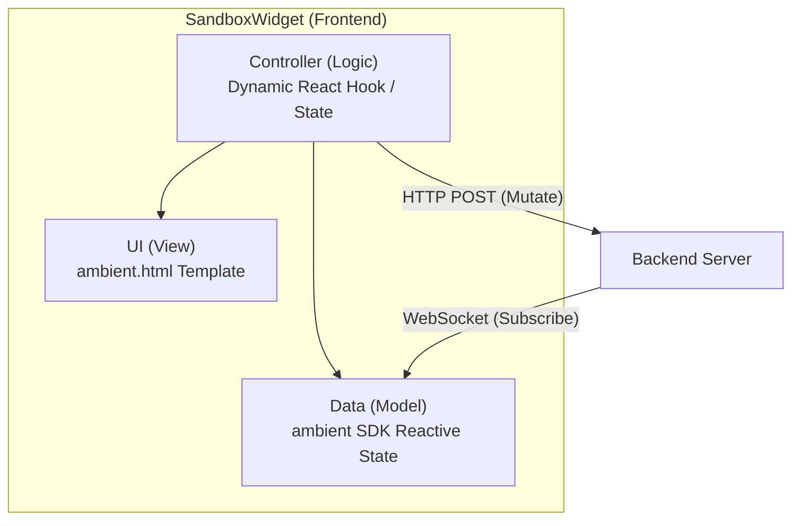
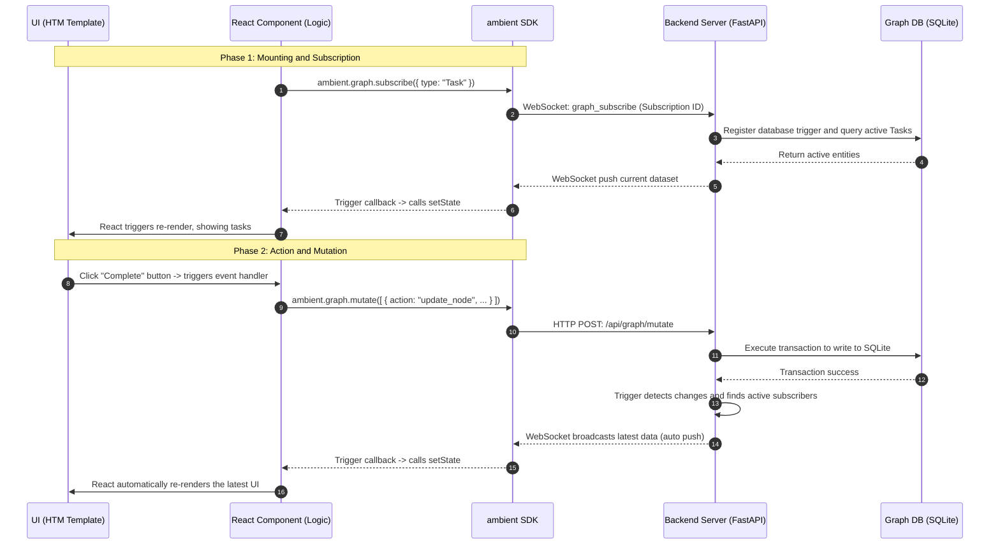

# Widget (Apps) Architecture Design

In Ambient Agent, **Widgets (also referred to as Apps)** are React-compatible micro-interaction cards dynamically generated by Large Language Models (LLMs) and mounted within the frontend Canvas workspace. To ensure both system security and highly responsive user interfaces, Widgets employ a **Unified React + HTM Rendering Architecture**, collaborating via isolated sandboxes and reactive communication protocols.

## 0. Unified React + HTM Rendering Paradigm

The system exclusively utilizes a unified **React Component + HTM Template** rendering scheme. The standard XML schema of LLM-generated Widgets is structured as follows:

```xml
<ambient-widget>
  <js-script>
    const { useState, useEffect } = ambient.react;
    const { Card, Button, Text, Column } = ambient.components;

    export default function App() {
      const [count, setCount] = useState(0);
      
      return ambient.html`
        <${Card} title="Counter App">
          <${Column} gap="12px">
            <${Text} text="Current count: ${count}" />
            <${Button} label="Increment" onClick=${() => setCount(count + 1)} />
          <//>
        <//>
      `;
    }
  </js-script>
</ambient-widget>
```

> [!NOTE]
> Legacy HTML structures, Scoped CSS blocks, and A2UI JSON layout schemas have been completely deprecated and removed.

### Core Features
1. **Dynamic Compilation**: The frontend leverages `@babel/standalone` to transpile modern ES-module-based Widget scripts directly in the browser.
2. **Declarative HTM Templates**: Uses the lightweight `htm` library (exposed via `ambient.html`) to compile standard JSX-like layouts using vanilla JS template strings, removing the need for a build step.
3. **Pre-defined Premium Components**: Injects a premium, uniform design component library (`ambient.components`), guaranteeing that generated cards match the system's aesthetic style and support responsive design.

---

## 1. Decoupled Architecture

Widgets are structured using the classic **UI (View) - Controller (Logic) - Data (Model)** pattern:



### A. UI Layer (View)
- The user interface is declared purely using `ambient.html`, leveraging pre-built components (e.g., `Card`, `Button`, `Text`, `Column`, `Row`, `TextField`, `Checkbox`, `List`, `Table`).
- Styling conforms to the vanilla CSS design system, and developers can customize margin, alignment, and theme variants via component props.

### B. Controller Layer (Logic)
- Widget controller logic runs as a standard React function component (exported as `default`), with full access to standard React Hooks (injected via `ambient.react`, including `useState`, `useEffect`, `useMemo`, `useRef`).
- Event handlers are directly attached as props to React components (e.g., `onClick=${handleClick}`), avoiding the need for manual DOM manipulation.

### C. Data Layer (Model)
- **Local Ephemeral State**: Managed via standard React state hooks (`useState` or `useReducer`).
- **Persistent Graph Data**: Powered by a backend SQLite Graph Database. Widgets listen to reactive changes via `ambient.graph.subscribe` and transactionally submit database updates via `ambient.graph.mutate`.
- **Tool Integration**: Invokes MCP (Model Context Protocol) tools directly using `ambient.mcp.callTool`.

---

## 2. Reactive Collaboration and Data Flow

The core strength of Widgets lies in **Reactive Subscription**. Components do not poll backend APIs; instead, they remain in sync with the database via WebSocket pipes.



---

## 3. Design Principles and Best Practices

To ensure system reliability and performance, Widget design should adhere to the following principles:

1. **Reactive Data Flow (Zero Polling)**:
   - Do not use `setInterval` or manual loops to poll API endpoints.
   - Always establish a subscription using `ambient.graph.subscribe`. Any changes to the database will automatically flow down and trigger UI re-renders.

2. **Declarative UI Rendering**:
   - Avoid any imperative DOM actions such as `document.querySelector` or `root.querySelector`. All UI and state rendering must be handled via React.

3. **Utilize Standard Components**:
   - Prefer using components from `ambient.components` to ensure design consistency and a premium feel.
