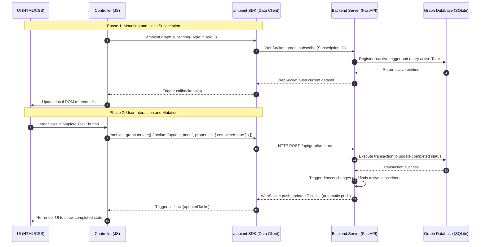

# Widget (Apps) Architecture Design

In Ambient Agent, **Widgets (also referred to as Apps)** are React-compatible micro-interaction cards dynamically generated by Large Language Models (LLMs) and mounted within the frontend Canvas workspace. To ensure both system security and highly responsive user interfaces, Widgets employ a decoupled **UI (View) - Controller (Logic) - Data (Model)** design pattern, collaborating via isolated sandboxes and reactive communication protocols.

---

## 0. Three Widget Rendering Paradigms

The frontend `SandboxWidget` supports three distinct rendering modes, matched automatically based on the XML tag formats generated by the LLM:

1. **HTML / CSS / JS Mixed Mode (Legacy Default)**:
   - UI defined in `<html-content>`, styles scoped dynamically from `<css-styles>`, and logic executed via a standard JS closure within `new Function("root", "ambient", "fetch", ...)` manipulating the local DOM.
2. **A2UI Declarative Layout Mode**:
   - UI declared in `<layout-json>` outlining components in JSON. The frontend recursively renders them as standard React UI components. Logic runs inside a JS closure, binding event handlers using `ambient.ui.on`.
3. **React JSX Dynamic Compilation Mode**:
   - UI defined directly as a modern React component within `<react-jsx>`, transpiled on-the-fly in the browser using `@babel/standalone`. Logic resides in `<js-script>` as an ES module exporting a custom `useController` Hook. This enables highly dynamic and reusable React components.

---

## 1. Decoupled Architecture

The code and state of a Widget are logically separated into three layers to prevent cross-contamination, interacting with each other through standardized interfaces:

```
┌────────────────────────────────────────────────────────┐
│                      SandboxWidget                     │
│                                                        │
│   ┌────────────────┐   ┌──────────────┐   ┌────────┐   │
│   │    UI (View)   │   │  Controller  │   │  Data  │   │
│   │  HTML + Scoped │◀──│  JS Closure  │──▶│  SDK   │   │
│   │      CSS       │   │ (new Function)  │   │ State  │   │
│   └────────────────┘   └──────────────┘   └────────┘   │
└───────────────────────────────▲────────────────▲───────┘
                                │                │       
                                HTTP POST        WebSocket
                                (Mutate)         (Subscribe)
                                │                │       
┌───────────────────────────────▼────────────────▼───────┐
│                      Backend Server                    │
└────────────────────────────────────────────────────────┘
```

### A. UI Layer (View)
- **HTML Structure**: Declared inside the XML `<html-content>` block. It defines the layout structure and basic DOM elements, and natively supports Tailwind CSS utility classes.
- **CSS Isolation**: Declared inside the XML `<css-styles>` block. To prevent styles from leaking into the global scope, `SandboxWidget` compiles all selector rules at mount time, scoping them with a unique attribute prefix (e.g. `[data-widget-scope="widget-1a2b"]`).

### B. Controller Layer (Logic)
- **JS Closure**: Declared inside the XML `<js-script>` block. The Widget's interactive logic is executed inside a safe, dynamic closure created via `new Function("root", "ambient", "fetch", ...)`.
- **DOM Access Restrictions**: The closure only receives a `root` element pointing to the Widget's local container. Using global browser APIs like `document.querySelector` is prohibited; instead, Widgets must query elements using `root.querySelector` to prevent them from altering the main system UI or accessing other Widgets.
- **Event Binding**: Listens to user interactions (e.g. click, input) and translates them into SDK calls to trigger state mutations or messages.

### C. Data Layer (Model)
- **Local Ephemeral State**: Managed via `ambient.state`. This is suitable for light state storage across components and page layouts.
- **Persistent Graph Data**: All long-term business entity data resides in the backend SQLite Graph Database. Widgets interact with this database reactively via `ambient.graph.subscribe` to listen to specific schemas, or transactionally via `ambient.graph.mutate` to submit database edits.

---

## 2. Reactive Collaboration and Data Flow

The core advantage of Widgets is **Reactive Subscription**. The controller layer does not need to poll backend APIs; instead, it relies on a WebSocket connection to stay in sync with the database.

The sequence below illustrates the data flow during Widget initialization and user modification:



---

## 3. Design Principles and Best Practices

To ensure system stability and performance, Widget development should adhere to the following principles:

1. **Reactive Data Flow (Zero Polling)**:
   - Do not use `setInterval` or manual loops to poll API endpoints for updates.
   - Always establish a subscription using `ambient.graph.subscribe`. Any modifications to the database will automatically flow down and trigger UI re-renders.

2. **Strict Separation of View and Logic**:
   - Keep HTML files clean; define custom styles in the scoped CSS block.
   - Avoid inline handlers (such as `onclick="..."`) in the HTML block. Use `root.addEventListener` inside the JS block instead.

3. **Resilient Ephemeral State**:
   - Do not store critical states in global JavaScript variables that might clear on canvas refreshes or fullscreen overlays.
   - Store persistent variables in the Graph Database (as nodes and edges) or use `ambient.state` to ensure multi-client synchronization.
