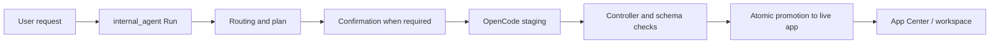

# Widgets and App Center

A “Widget” is a React UI rendered in the workspace. An “App” is a Widget with a persistent manifest and controller artifact. A “Capability” is a skill, MCP tool, or other backend capability listed in App Center that may not yet have a UI.

## 1. App artifacts

Each app lives under `workspace/apps/<app-id>/`:

```text
<app-id>/
├── manifest.json      # Required: identity, version, intents, schemas, backend
├── controller.js      # Required: default-exported React component
└── README.md          # Optional app documentation
```

Legacy `index.html` and `style.css` files are recognized only as compatibility sources. The current generation path permits only `controller.js`, `manifest.json`, and `README.md`; do not create new three-file HTML/CSS/JS Widgets.

Manifest V1 requires these fields:

```json
{
  "manifest_version": 1,
  "id": "task-board",
  "title": "Task Board",
  "description": "Manage tasks",
  "app_version": "1.0.0",
  "intents": ["manage tasks"],
  "schema_refs": ["Task"]
}
```

`id` must match the directory name and use lowercase kebab-case. Optional `backend_type` is `code`, `agent`, or `mcp`; MCP and agent backends provide their corresponding configuration.

An App that reads public external data declares its own App-scoped HTTP connector in `data_sources`; Ambient does not preinstall business capabilities such as `weather.forecast`:

```json
{
  "data_sources": {
    "forecast": {
      "type": "http",
      "base_url": "https://api.open-meteo.com",
      "allowed_paths": ["/v1/forecast"],
      "methods": ["GET"],
      "response_format": "json",
      "response_limit": 1048576
    }
  }
}
```

V1 connectors support credential-free HTTPS JSON APIs only. `base_url` must be a public origin and each path must be declared explicitly. Localhost, IP literals, private/reserved destinations, redirects, proxy environment variables, and oversized responses fail closed. OAuth, secrets, signatures, and dedicated SDKs require an MCP/Capability binding; credentials must never be written into a manifest or controller.

## 2. Controller loading

`controller.js` default-exports a React component. The host transpiles the module with `@babel/standalone`, executes it through `new Function("exports", "React", "ambient", ...)`, and renders the exported component.

```javascript
export default function TaskBoard({ ambient }) {
  const { useEffect, useState } = ambient.react;
  const { Card, Text } = ambient.components;
  const [tasks, setTasks] = useState([]);

  useEffect(() => ambient.graph.subscribe({ type: "Task" }, setTasks), []);
  return ambient.html`<${Card} title="Tasks"><${Text} text=${`${tasks.length} items`} /></${Card}>`;
}
```

The runtime exposes `ambient.graph`, `ambient.net`, `ambient.runs`, `ambient.capabilities`, `ambient.mcp`, React hooks, HTM, and standard components. See the complete [ambient SDK](/en/widgets/sdk.md).

## 3. Creation, modification, and publication



- New apps and modifications write to staging first. The live directory remains unchanged until approval and verification.
- A controller must contain a default export and pass size, UTF-8, module syntax, and host-capability rules.
- A manifest with `data_sources` must pass the connector contract, and every `ambient.net.request("source-id", ...)` in the controller must reference a source declared by the sibling manifest.
- `SchemaVerificationService` extracts Graph usage from the controller and compares it with effective schemas. Required schema extensions become a proposal and follow confirmation.
- Publication is protected by artifact hashes and Run effect records. Recovery validates staged/live artifacts to avoid duplicate or incorrect promotion.

## 4. App Center

`GET /api/app-store` combines three entry kinds:

- `generated_app`: a workspace app with a manifest and UI;
- `skill`: a skill capability discovered by BackendManager;
- `mcp`: an MCP server/tool capability.

Entry status is `ready`, `needs_ui`, `generating`, or `unavailable`. A capability without UI can start a durable UI-generation Run through `/api/capabilities/{catalog_id}/ui`; success binds the capability to the new app.

App Center layout uses a persistent `revision`. `PUT /api/app-store/layout` returns `409` on a concurrent revision conflict; the client must reload before submitting again.

## 5. Data and capability boundaries

- Widgets do not own separate data models; persistent domain data uses Graph schemas.
- The backend preflights and atomically commits `ambient.graph.mutate`. Do not use the deprecated `ambient.model`.
- `ambient.net.request` can address only a data source declared by the current App manifest. Widgets cannot supply full URLs and cannot call `fetch` directly.
- `ambient.capabilities.invoke` and `ambient.runs.start` create durable Runs and must not bypass confirmation or effect records.
- `ambient.mcp.callTool` remains subject to backend manifest, tool-identity, and permission checks.
- Controllers execute in the host realm and should only load trusted code. See [Runtime Boundary](/en/widgets/sandbox.md).

Data-source failures return stable `code`, `message`, `hint`, and safe `details`, and append a bounded diagnostic to the workspace. When that App is modified later, Durable Workflow supplies recent diagnostics alongside the Runtime Contract so the coding agent can correct source ids, manifest paths, request parameters, or upstream response issues without receiving secrets or unbounded response bodies.
