# Widgets and App Center

A “Widget” is a React UI rendered in the workspace. An “App” is a Widget with a persistent Manifest V2 and Controller. A “Capability” is an invokable backend action in App Center that may not have a UI. An App accesses host or external resources only through approved capability grants.

## 1. App artifacts

```text
workspace/apps/<app-id>/
├── manifest.json      # Required: identity, schema refs, exact capability grants
├── controller.js      # Required: default-exported React component
├── README.md          # Optional App documentation
└── data/              # Optional private runtime data constrained by file.* grants
```

Manifest V2 is the only loadable and publishable format:

```json
{
  "manifest_version": 2,
  "id": "task-board",
  "title": "Task Board",
  "description": "Manage tasks",
  "app_version": "1.0.0",
  "intents": ["manage tasks"],
  "schema_refs": ["Task"],
  "capabilities": [
    {"id": "graph.query", "scope": {"entities": ["Task"]}},
    {
      "id": "graph.mutate",
      "scope": {"entities": ["Task"], "operations": ["create", "update", "delete"]}
    }
  ]
}
```

`id` matches the directory name and uses lowercase kebab case. An App with no external access still writes `"capabilities": []`. V1, top-level `data_sources`, `index.html`, `style.css`, `layout.json`, and `index.jsx` are not new-version artifacts and are neither implicitly migrated nor loaded.

## 2. Controller and minimal SDK

`controller.js` default-exports a React component. After transpilation, the host constructs an `ambient` capability membrane only from approved Manifest grants.

```javascript
export default function TaskBoard({ ambient }) {
  const { useEffect, useState } = ambient.react;
  const { Card, Text } = ambient.components;
  const [tasks, setTasks] = useState([]);

  useEffect(() => ambient.graph.subscribe({ type: "Task" }, setTasks), []);
  return ambient.html`<${Card} title="Tasks"><${Text} text=${`${tasks.length} items`} /><//>`;
}
```

The example injects `ambient.graph.subscribe` only when a `graph.query` grant exists and includes `Task`. Without `network.request`, `ambient.net` does not exist. Without a `file.*` grant, `ambient.files` does not exist. The backend reloads the persistent Manifest and authorizes every request again.

## 3. Creation, modification, and publication

```mermaid
flowchart LR
    Request[User request] --> Run[internal_agent Run]
    Run --> Plan[Development plan approval]
    Plan --> Align[Schema + capability alignment]
    Align --> Approval[User approves exact proposal]
    Approval --> Contract[Immutable Runtime Contract]
    Contract --> Stage[Coding Agent staging]
    Stage --> Verify[Code use / Manifest / Schema checks]
    Verify --> Promote[Atomic promotion]
    Promote --> Store[App Center / workspace]
```



- A denied capability proposal prevents the Coding Agent from starting.
- For an existing App, current grants enter the proposal. Any expansion or replacement requires explicit approval.
- The Coding Agent receives only approved schemas, grants, the SDK subset, and allowed files.
- Controller capability IDs, source IDs, catalog IDs, and action IDs must be statically extractable string literals.
- Verification requires normalized staging Manifest grants to equal the Runtime Contract and code use to be a subset.
- The live directory remains unchanged until approval and verification complete. Recovery checks artifact hash, grants digest, and Run effect records before promotion.

See [Widget Capability Security](/en/architecture/capability-security.md) for the full contract.

## 4. App Center

`GET /api/app-store` combines `generated_app`, `skill`, and `mcp` items. A headless capability may start a durable UI-generation Run. Its UI requests a `capability.invoke` grant limited to the target `catalog_id + action_id`; it never binds a provider, MCP server, or tool name directly.

Items are `ready`, `needs_ui`, `generating`, or `unavailable`. Layout uses revision-based optimistic concurrency. A conflict returns `409`, after which the client reloads before submitting again.

## 5. Data and capability boundaries

- The Graph stores only user context. App caches, cursors, UI state, and raw provider payloads live under `data/`.
- `graph.query` and `graph.mutate` are separate grants further constrained by entity, operation, and edge type.
- A `network.request` grant declares the public HTTPS origin, paths, methods, and response limit. The Controller never supplies a full URL.
- `file.*` accesses only `app://data/`; it cannot read the Manifest, Controller, sessions, Graph, or credentials.
- `capability.invoke` calls only exact approved App Center actions. Direct `ambient.mcp` has been removed from the Widget SDK.
- A grant only allows the App to request an operation. Run interactions, adapter spawn permission, input/output schemas, idempotency, and recovery policy remain in force.

Runtime errors use stable `code`, `capability`, `operation`, `hint`, and safe `details`, and write bounded audit/diagnostic records for later repair.
