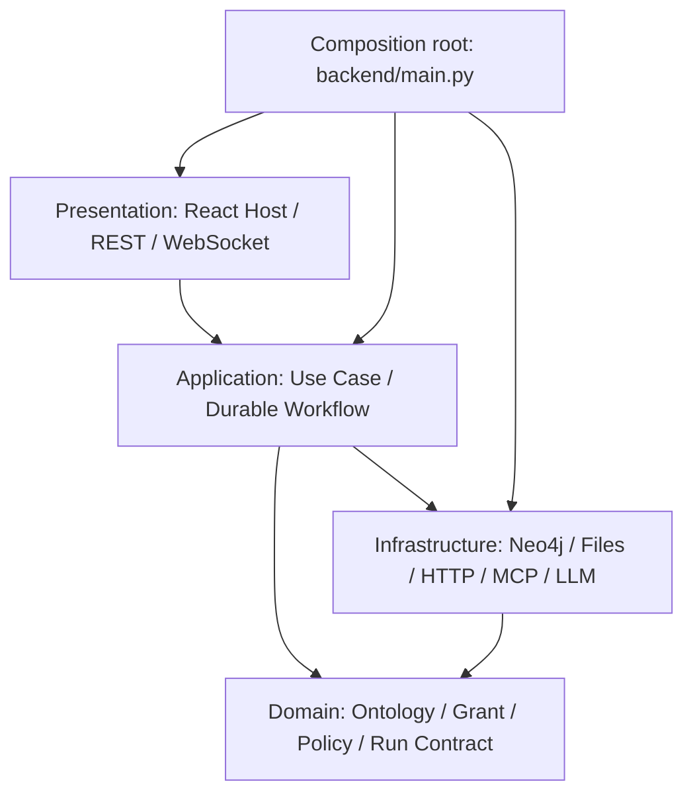
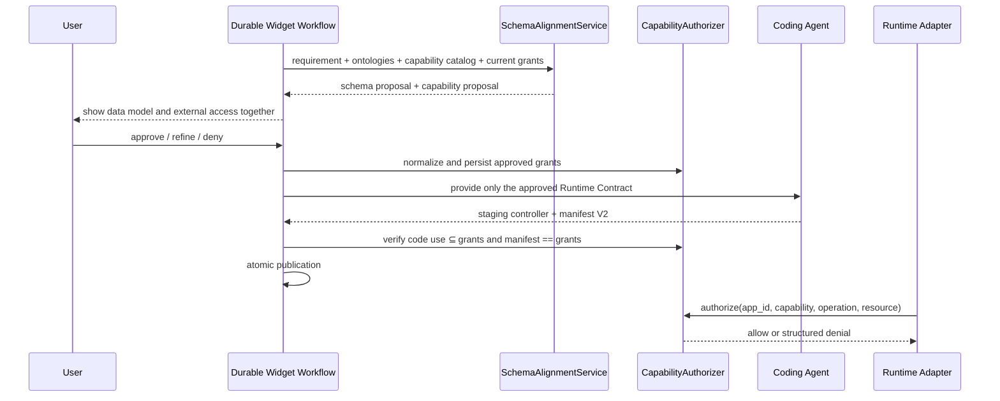

# Widget Capability Security Architecture

This page is the normative contract for external access from Widgets. Before a Controller may read external data, access files, query or mutate the Graph, or invoke an installed capability, it must declare the access, obtain user approval during schema alignment, and pass authorization on every runtime operation. Undeclared, unapproved, or out-of-scope access fails closed.

## 1. Layers and dependency direction



Dependencies point toward inner abstractions:

- The domain layer defines capability categories, grant value objects, scope rules, and denial reasons without depending on FastAPI, React, Neo4j, or a concrete SDK.
- The application layer orchestrates proposal, approval, grant persistence, and access. Routes and components do not duplicate policy.
- The infrastructure layer implements Graph, HTTP, App-file, and installed-capability adapters. Every adapter calls the same authorizer before an effect.
- The presentation layer collects decisions and forwards commands. Hiding a frontend method is not authorization; backend enforcement is final.
- `backend/main.py` composes objects and passes dependencies; it does not own capability business rules.

## 2. Capability Ontology

The Capability Ontology and the `ambient-context` data ontology are both domain models with different purposes: the data ontology says what the Graph may store, while the Capability Ontology says which operations an App may perform on which resources. Category IDs are stable contracts and Apps cannot invent them.

| Category ID | SDK | Minimum scope fields | Meaning |
| --- | --- | --- | --- |
| `graph.query` | `ambient.graph.subscribe` | `entities` | Read only listed ontology entities; included target entities must also be in scope |
| `graph.mutate` | `ambient.graph.mutate` | `entities`, `operations` | Perform `create`, `update`, or `delete` on listed entities; edge operations also use `edge_types` |
| `network.request` | `ambient.net.request` | `sources` | Access declared HTTPS JSON sources with fixed origins, paths, methods, and response limits |
| `file.read` | `ambient.files.read/list` | `paths` | Read matching relative paths under the App-private data directory |
| `file.write` | `ambient.files.write` | `paths`, `max_bytes` | Atomically write App-private data; path escape and symlinks are forbidden |
| `file.delete` | `ambient.files.delete` | `paths` | Delete App-private data files, never directories or App artifacts |
| `capability.invoke` | `ambient.capabilities.invoke` | `catalog_ids`, `actions` | Invoke only exact installed capabilities and actions; MCP is used indirectly through this entry point |

`sendMessage`, window control, theme, React hooks, HTM, and system UI components are host features without external-data authority and need no grant. The new version does not expose arbitrary `fetch`, raw WebSockets, `ambient.mcp`, arbitrary workspace filesystem access, or a general shell to generated Widgets.

## 3. Grant contract

App Manifest V2 requires `capabilities`; an App with no external access uses an empty array. Every grant contains only a registered ontology `id` and the fields allowed by that category's `scope`.

```json
{
  "manifest_version": 2,
  "id": "daily-planner",
  "title": "Daily Planner",
  "description": "Plans tasks with public weather context",
  "app_version": "1.0.0",
  "intents": ["plan my day"],
  "schema_refs": ["Task", "Event"],
  "capabilities": [
    {
      "id": "graph.query",
      "scope": {"entities": ["Task", "Event"]}
    },
    {
      "id": "graph.mutate",
      "scope": {"entities": ["Task"], "operations": ["create", "update"]}
    },
    {
      "id": "network.request",
      "scope": {
        "sources": {
          "forecast": {
            "base_url": "https://api.open-meteo.com",
            "paths": ["/v1/forecast"],
            "methods": ["GET"],
            "response_limit": 1048576
          }
        }
      }
    }
  ]
}
```

Normalized grants obey these rules:

- Unknown categories, unknown scope fields, duplicate grants, empty resource lists, and wildcard network origins are rejected.
- Arrays are deduplicated and sorted; the manifest revision and grants digest are persisted with the approved result.
- Changing a grant, network origin/path/method, Graph entity, or mutation operation expands authority and requires schema-alignment approval again.
- Capability use in a Controller must use string literals and remain a subset of approved grants.
- Code generation cannot expand the approved result through the manifest; staging verification compares normalized approved grants with the artifact manifest.

## 4. From proposal to execution



The schema-alignment interaction uses one atomic proposal:

```json
{
  "schemas": {"reused_schemas": [], "new_schemas": []},
  "capabilities": [
    {"id": "graph.query", "scope": {"entities": ["Task"]}}
  ]
}
```

The user approves an exact value, not “trust this App.” Denial prevents code generation; refinement preserves all schemas and grants that the feedback did not change.

## 5. Three enforcement layers and fail-closed behavior

| Layer | Check | Purpose |
| --- | --- | --- |
| Static publication check | Reject host globals/imports/dynamic code; extract `ambient.*` calls and compare them with grants | Catch overreach before an artifact becomes live |
| SDK membrane | Construct only approved SDK methods and bind every request to the current `app_id` | Reduce discoverable surface and prevent the Controller from selecting another App identity |
| Backend authorizer | Reload grants from the persistent manifest, validate operation/resource, then call the adapter | Distrust frontend, WebSocket payloads, and Controller declarations |

Every parsing ambiguity is denied. Stable errors include `code`, `capability`, `operation`, and safe `details`; they never return secrets, absolute host paths, or unbounded upstream bodies. Allowed and denied outcomes are audited.

## 6. Resource boundaries

### Graph

- A query must name a top-level `type` present in `graph.query.entities`; querying all types is forbidden.
- Every included `target_type` must be explicit and approved.
- A mutation is preflighted by the Graph adapter to resolve actual node types, then checked for entity, operation, and edge type before entering the durable effect boundary.
- A Graph mutation grant does not replace a per-effect Run interaction. A grant answers whether the App may request an operation; an interaction decides whether this effect executes now.

### Network

- The Controller supplies only a source ID, relative path, method, query, and JSON body.
- Origin, allowed paths/methods, and response limit come from the approved grant. Redirects, environment proxies, localhost, IP literals, and private/reserved destinations are blocked.
- OAuth, secrets, signatures, and proprietary SDKs do not enter a Widget. An App Center adapter holds them and the Widget requests `capability.invoke`.

### Files

- `app://data/` is the only Widget file root. Manifest, controller, README, staging, sessions, Graph, and LLM credentials are never visible.
- Paths are normalized POSIX-relative paths. Empty paths, absolute paths, `..`, NUL, symlinks, and nonmatching globs are rejected.
- Writes use a temporary file, `fsync`, and atomic replacement. Delete removes only an exactly approved regular file.

### Installed capabilities

- A Widget never selects an MCP server, tool, or remote-Agent URL directly.
- Both `catalog_id` and `action_id` must be in `capability.invoke` scope. Capability Manifest input and output schemas still apply.
- Adapter spawn permission, deadlines, idempotency, recovery, and audit policy remain in force. A Widget grant cannot weaken adapter policy.

## 7. Versioning, revocation, and migration

- Manifest V2 is the only publishable format for the new version. V1, the top-level `data_sources` field, and direct `ambient.mcp` do not enter the new runtime path.
- Revoking a grant creates a new manifest revision and affects new requests immediately. An already-running durable Run completes against its immutable authorization snapshot or enters `needs_attention`.
- Old Apps receive no implicit grants. They must repeat schema/capability alignment and publish V2; otherwise metadata remains viewable but the Controller is not loaded.
- Completed or stale drafts under `forward/` are not normative. This page, the Agent System Capability Catalog, and versioned contracts are the single sources of truth.

## 8. Acceptance criteria

Tests must prove that:

1. Undeclared categories and out-of-scope entities, operations, sources, paths, catalog IDs, and actions are rejected by the backend.
2. Staging cannot begin before the capability proposal is approved.
3. A Coding Agent cannot expand authority by editing the manifest; publication rejects the artifact.
4. A Widget sees only its approved SDK surface and cannot use forbidden host globals.
5. Agent capability guidance is generated from a structured catalog shared with the authorizer.
6. Chinese and English docs, manifest/schema examples, the static verifier, SDK, and backend policy use identical category IDs.
