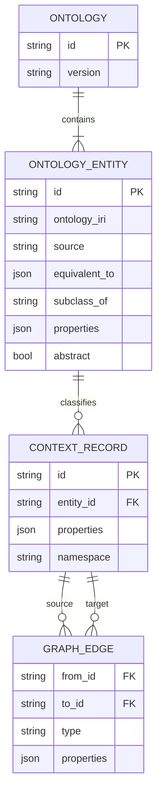

# Canonical Ontology and Knowledge Graph

The knowledge graph stores only facts that help the Agent understand the user's context. Neo4j is the primary runtime backend. `workspace/graph.db` remains a local SQLite compatibility adapter for isolated tests and one-time migration; it is not the deployed knowledge-graph backend.

## 1. One ontology

The workspace has exactly one ontology, `ambient-context`. A schema exposed to Apps is an ontology entity in that canonical ontology, not an independent App-owned schema. Every entity has:

- a stable `id`, name, description, and property types;
- an `ontology_iri` and `source` identifying the vocabulary it came from;
- zero or more `equivalent_to` correspondences for alignment with an established external ontology;
- an optional `subclass_of` parent in `ambient-context`;
- `is_core` and `abstract` lifecycle flags.

The pre-built ontology starts from Schema.org concepts and contains an abstract `Thing` root plus common user-context entities: `Task`, `Event`, `Note`, `Person`, `Organization`, `Project`, `Document`, `Place`, `Message`, and `SoftwareApplication`. Existing Apps must reuse these entities when their meaning matches.

Ontology growth is additive and atomic:

1. extend properties on an existing entity; or
2. add an entity to `ambient-context`, optionally recording an external `ontology_iri`/`equivalent_to` mapping and a canonical `subclass_of` parent.

An entity from another vocabulary is never installed as a second, disconnected ontology. Missing parents, attempts to instantiate an abstract entity, unregistered entity IDs, unsupported property types, and unknown properties are rejected. Core entities cannot be removed by ordinary flows.

## 2. Knowledge-graph model

Each `ContextRecord` has exactly one `INSTANCE_OF` relationship to one registered `OntologyEntity`; it does not acquire one Neo4j label per type. This fixed-label model avoids dynamic Cypher and makes the one-entity invariant explicit. A record is upserted only after its entity and properties validate. Edge endpoints must already exist or be created earlier in the same mutation batch.

Neo4j also stores internal effect and rollback metadata so a graph mutation and its idempotency result commit in the same ACID transaction. Those metadata nodes are infrastructure state and are excluded from knowledge-graph queries.

## 3. Data placement

The KG accepts only `user_context` data. Facts such as a user's task, meeting, project, contact, or document reference belong in the KG because they improve cross-App understanding.

Data needed only to keep an App running—cache entries, sync cursors, UI state, job checkpoints, credentials, and provider payloads—belongs under that App's workspace directory. If its existence is useful context, the KG may contain a `Document` or `SoftwareApplication`-style reference with a URI and summary, but not the private payload. Schema proposals with a non-context data scope are rejected.

## 4. Queries and mutations

Widgets register live queries with `ambient.graph.subscribe(query, callback)`. The backend retains subscriptions, reruns bounded queries after mutations, and pushes changes. Agent read-only queries execute through `graph_query_engine.execute_graph_query`; `RouterContext` asks the Graph adapter for a bounded `routing_snapshot()` instead of reading SQLite tables or placing the whole graph in a prompt. SQLite and Neo4j adapters must expose the same counts, recent-record, and schema snapshot contract.

Public mutation actions are `create_node`, `update_node_property`, `delete_node`, `create_edge`, and `delete_edge`. `preflight_actions` validates the complete batch without writing. `apply_actions_atomic` commits the batch, reverse actions, rollback ticket, and effect-ledger entry in one Neo4j transaction. A repeated idempotency key with identical input returns the original result; reusing it with different input is rejected.

Widget declarations and manifest `schema_refs` provide context, not authorization. Backend ontology validation is final. If a requested record has no suitable entity, the schema-alignment flow must grow the ontology and receive approval before the record mutation can pass.

The deterministic pre-publish schema diff reports a type mismatch only when a JavaScript value's type is statically known from a literal or explicit coercion. Dynamic expressions such as `place.latitude` and function results are classified as unknown and deferred to graph-mutation preflight; the verifier must not invent a string type and trigger needless rework.

## 5. Configuration and migration

The backend factory selects `GRAPH_DATABASE_BACKEND=neo4j` for deployment and reads `NEO4J_URI`, `NEO4J_USERNAME`, `NEO4J_PASSWORD`, and `NEO4J_DATABASE`. The root Docker Compose stack provisions Neo4j and configures the backend accordingly; the Dev Container Compose configuration also provisions an isolated Neo4j sidecar and connects the development workspace over the container network. `GRAPH_DATABASE_BACKEND=sqlite` is the explicit local/test adapter.

Setting `GRAPH_MIGRATE_SQLITE=1` imports an existing `workspace/graph.db` once. The importer validates or registers legacy entity definitions before records, preserves IDs and relationships, and records a Neo4j migration marker so restarts are idempotent. The SQLite file is left intact as a recoverable source.

## 6. Acceptance criteria

- A fresh backend exposes one pre-built ontology and its core entity inventory.
- Unknown or abstract entity IDs cannot be used for records.
- Every stored context record resolves to exactly one ontology entity.
- An approved extension/new entity is visible to subsequent writes atomically and remains aligned to `ambient-context`.
- Runtime-only schema proposals are rejected and App-private state is not copied into the KG.
- Neo4j mutation failure rolls back records, edges, history, and the effect entry together.
- SQLite-to-Neo4j migration is opt-in, repeatable, and does not delete the source.
- Router snapshot construction is storage-independent and behaves consistently with the Dev Container Neo4j backend and the SQLite test adapter.
- The static schema diff does not report unknown dynamic JavaScript expressions as type mismatches; actual mutations must still pass backend preflight.
