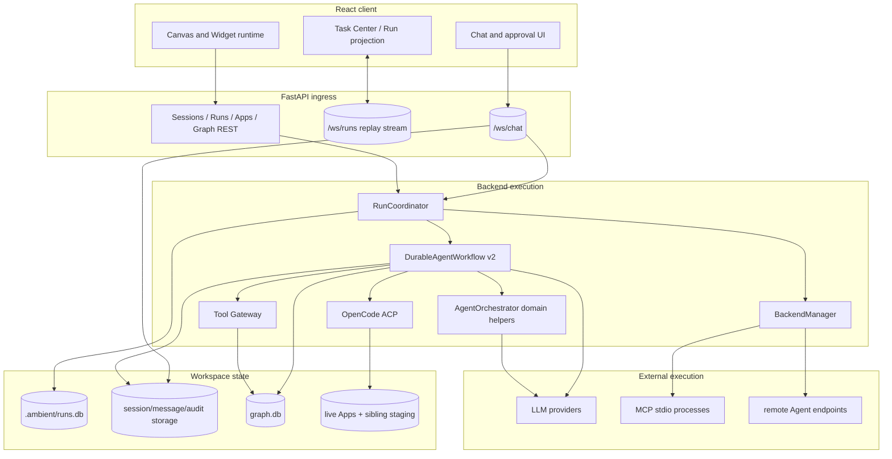
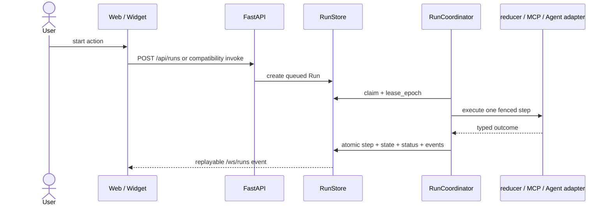
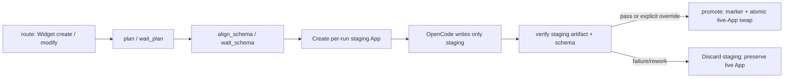

# System Architecture Overview

Ambient Agent is a local-first Canvas workspace. The React frontend hosts chat, the Task Center, and dynamic Widgets. The FastAPI backend manages sessions, durable Runs, graph data, App artifacts, LLM calls, and external MCP/Agent runtimes.

## 1. Current system boundary

`RunStore + RunCoordinator` are the single durable control plane for chat `internal_agent`, capability, MCP tool/resource, and remote-Agent actions. `AgentOrchestrator` supplies only routing, Converse, and formatting domain helpers. WebSocket ingress submits commands, resolves durable interactions, and projects results; it does not execute a workflow or external side effect directly.

## 2. Durable Run lifecycle

Runs in one session share a FIFO lane. `waiting_user` releases its worker slot but retains the lane. Interaction responses use a Run version to reject stale approvals, and the scheduler claims the resumed Run again.

Multi-intent requests preflight the complete sub-intent set before any write, then execute serially as a saga. A completed step is compensated automatically only when complete compensation data was stored; other uncertain effects enter `needs_attention`.

## 3. Widget code lifecycle

`DurableAgentWorkflow` drives Widget builds through explicit phases, while OpenCode uses staging and promotion:

Each staging artifact is tied to its Run checkpoint. Recovery uses the durable promotion marker to distinguish an already-published artifact from one still awaiting verification, while failure or cancellation cleans staging. Artifact validation checks the required file, size, UTF-8, and a default export, then compiles it through the same Babel pipeline as the frontend and performs a bounded module-load smoke test in a Node VM with dynamic code generation and host/network globals removed. Direct access to `window`, `document`, `fetch`, WebSocket, Worker, storage, dynamic import, or require fails closed. Schema verification is separate. This is still not a complete browser render smoke test or an OS-level sandbox.

## 4. Data and communication

- `/ws/chat`: chat commands, durable interaction responses, response projection for MCP tool/resource and Agent Runs, and graph-subscription control.
- `/ws/runs?after_sequence=N`: versioned, replayable workspace Run events.
- Runs REST: create, query, cancel, retry, reconcile effects, and resolve interactions.
- Apps REST: read or manage live App artifacts.
- Graph REST/WebSocket: write commands first enter the graph v2 Run; queries and subscriptions remain compatible.

The client replays declared read subscriptions only; it does not replay chat, approval, or tool commands after reconnect. Run-event clients use `stream_epoch + sequence` for reset/gap detection and `event_id` for deduplication.

Run event payloads are recursively redacted by sensitive key and size-bounded before storage; `redacted` records that data was hidden or truncated. Event and LLM-audit retention default to 30 days and are configured with `RUN_EVENT_RETENTION_DAYS` and `AGENT_AUDIT_RETENTION_DAYS` respectively.

## 5. Security boundary notes

- Model-requested local tools pass through `ToolGateway` schema, effect, scope, approval, timeout, idempotency, and output controls. Converse currently exposes read-only tools.
- MCP processes use exact argv, a restricted inherited environment, initialize/capability negotiation, call deadlines, bounded stdout/stderr, best-effort cancellation, and terminate→kill shutdown.
- OpenCode validates App IDs, rejects traversal/symlinks, uses argv rather than a shell, bounds cwd/environment/output, and writes to staging.
- A browser Widget's `new Function` provides module scoping and an ErrorBoundary, not hostile-code isolation. Strong isolation requires an iframe/Worker/separate origin or an OS sandbox.
- MCP, ACP, and remote Agents keep protocol-specific adapters but are all governed by the RunCoordinator effect boundary; they are not Python ToolGateway calls. OpenCode still lacks enforced OS-level network isolation. A permission prompt must not be interpreted as a complete sandbox.
