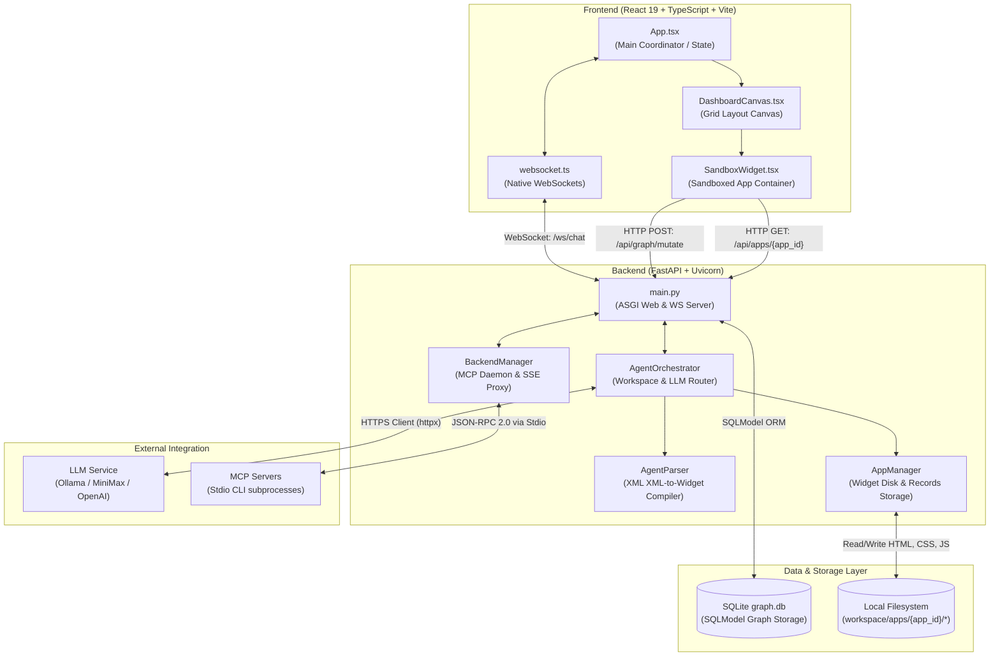

# System Overview Architecture

This document describes the high-level system architecture of Ambient Agent, focusing on how the React frontend and FastAPI backend communicate, and the data flows that govern dynamic widget layouts.

## Communication Methods

1.  **WebSockets** (`/ws/chat`): Provides bidirectional, real-time message broadcasting, canvas layout syncing, graph query subscription pushes, and MCP execution calls.
2.  **REST HTTP API**: Handles file retrieval for card mounting (`GET /api/apps/{app_id}`), listing available apps, and transactional database modifications (`POST /api/graph/mutate`).
