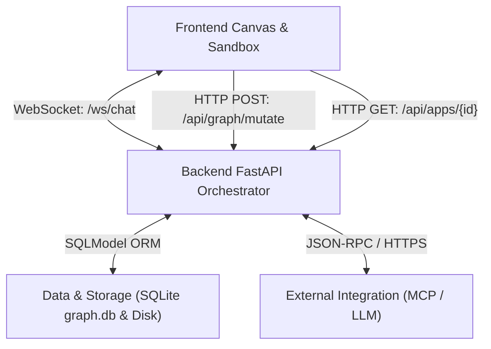
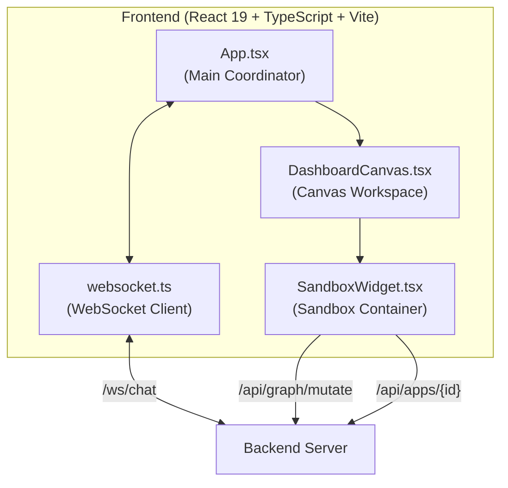
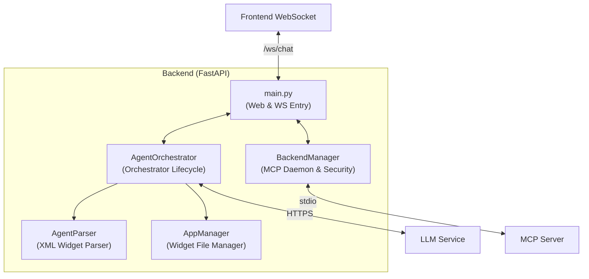
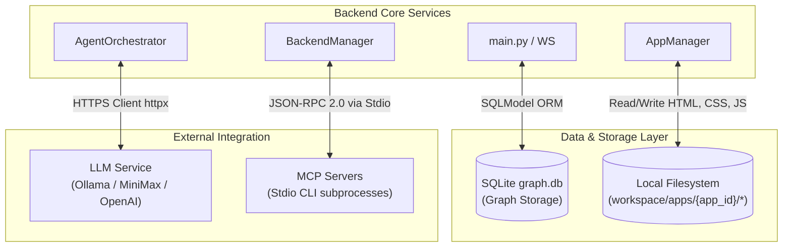

# System Overview Architecture

This document describes the high-level system architecture of Ambient Agent, focusing on how the React frontend and FastAPI backend communicate, and the data flows that govern dynamic widget layouts.

## System Architecture Modules (Summary-Detail Structure)

### 1. High-Level Macro Overview (Summary)

Shows the macro communication paths between the Frontend Canvas workspace, Backend Orchestrator, Storage layer, and External services:

### 2. Frontend Subsystem Details (Detail - Frontend)

Shows the coordination of frontend state, grid canvas workspace, and isolated widget container:

### 3. Backend Subsystem Details (Detail - Backend)

Shows the WebSocket ASGI entry point, lifecycle coordinator orchestrator, and dynamic code parser:

### 4. Data Layer & External Integration (Detail - Data & Integration)

Shows how files are stored on disk, SQLModel mapping in SQLite, and stdio execution for MCP daemons:

## Communication Methods

1.  **WebSockets** (`/ws/chat`): Provides bidirectional, real-time message broadcasting, canvas layout syncing, graph query subscription pushes, and MCP execution calls.
2.  **REST HTTP API**: Handles file retrieval for card mounting (`GET /api/apps/{app_id}`), listing available apps, and transactional database modifications (`POST /api/graph/mutate`).

## Sandboxing & Apps Architecture

For detailed information on the decoupled architecture of Widgets (Apps) including UI, Controller, and Data layers, please see [Widget Apps Architecture](/en/architecture/apps.md). For details on the security sandbox and compiled scoping, see [Sandbox Isolation](/en/widgets/sandbox) and [ambient SDK Reference](/en/widgets/sdk).
