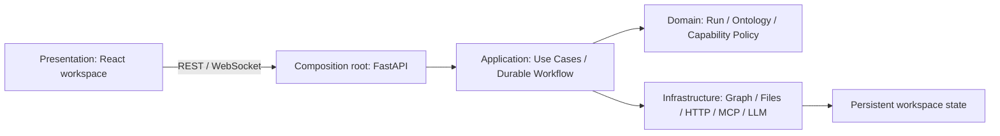

# System and Request Flow

## 1. Runtime components and layers

`backend/main.py` is the composition root. It only creates and connects workspace/Graph adapters, App/Capability services, `RunCoordinator`, and Workflows. Business rules belong to domain and application objects; routes do not decide authorization or operate storage directly. See [Widget Capability Security](/en/architecture/capability-security.md) for the dependency rules.

## 2. How a user request executes

1. The frontend sends a message through `/ws/chat`.
2. The backend stores a `ChatMessage`, resolves the current session language, model, and coding-agent snapshot, and submits an `internal_agent` Run to `RunCoordinator`.
3. The Coordinator persists the Run and manages the execution lane for that session.
4. `DurableAgentWorkflow` calls `IntentRouter` to create an `IntentPlan`, then advances explicit phases.
5. Read-only conversation or queries may finish directly. Graph mutations, composite tasks, and Widget create/modify flows pass through planning, schema + capability alignment approval, preflight, execution, and verification.
6. Each step uses claims, lease epochs, and Run versions to reject stale worker commits. Visible events are stored in `run_events` and pushed through `/ws/runs`.
7. The frontend projects Run state into chat, the Task Drawer, App Center, and workspace.

The old in-memory Agent loop and Widget DAG are no longer production paths. `AgentOrchestrator` only provides routing and bounded read-only Converse helpers; the Run control plane owns execution.

## 3. Widget creation and loading

Widgets have one publication path. The durable workflow confirms a plan, asks the user to approve a schema and capability proposal, then lets the selected OpenCode or Codex backend generate Manifest V2 plus a controller in staging. Promotion is atomic and happens only when code use is a subset of approved grants, manifest grants exactly equal the approved value, and syntax, security, and schema checks pass. Inline XML Widgets and unverified direct writes are not new-version paths.

The frontend fetches an app and its approved grants from `/api/apps/{id}`. `SandboxWidget` transpiles the controller with Babel and builds the smallest `ambient` membrane for those grants. Backend adapters authorize every operation again; the frontend API surface never replaces backend policy.

## 4. Data and communication responsibilities

| Channel/storage | Purpose |
| --- | --- |
| REST `/api/sessions`, `/api/canvas` | Session and Canvas CRUD |
| REST `/api/runs`, `/api/run-interactions` | Run listing, cancellation, retry, reconciliation, and user decisions |
| REST `/api/apps`, `/api/app-store` | App artifacts and unified capability catalog |
| REST `/api/coding-agents` | Coding-agent availability and default selection |
| REST `/api/apps/{id}/graph/*` | App-scoped Graph query/mutation after grant authorization and preflight |
| REST `/api/apps/{id}/files/*` | File operations within `app://data/` after path-grant authorization |
| REST `/api/apps/{id}/data-sources/*` | Public HTTPS JSON sources declared by `network.request` grants |
| `/ws/chat` | Chat commands and App-scoped Graph subscriptions |
| `/ws/runs` | Recoverable stream with sequence, event ID, and stream epoch |
| `workspace/sessions/*.json` | Sessions and messages |
| `workspace/.ambient/runs.db` | Runs, steps, interactions, and canonical events |
| Neo4j | Canonical ontology entities, context records, graph edges, effects, and mutation history |
| `workspace/graph.db` | Explicit SQLite test adapter and opt-in migration source only |

## 5. Security and consistency principles

- Provider secrets are not returned to the frontend and live in a Git-ignored workspace file.
- The Coding Agent Runtime uses trusted built-in adapters, installs CLIs on demand into a dedicated persistent volume, and normalizes installation, authentication, dynamic model discovery, model binding, and execution state. Codex uses a container device-code login and its own ChatGPT subscription, and obtains the models available to that account through the official app-server `model/list` method; OpenCode references a model binding from the central Provider Registry. The backend never passes Ambient provider secrets or bindings to native-mode Codex.
- Docker Compose relaxes the default seccomp filter for unprivileged user namespaces so Codex can retain its bubblewrap `workspace-write` sandbox inside the container boundary. It does not add `SYS_ADMIN` or switch Codex to `danger-full-access`.
- The backend image includes Node.js and the `@babel/standalone` verifier runtime pinned by the frontend lockfile. A coding agent's `controller.js` is promoted from staging only after syntax checks, forbidden host/network-global checks, and restricted-VM execution. A missing verifier fails closed instead of publishing unverified code.
- A Coding Agent receives only a role projection generated from the [Agent System Capability Catalog](/en/agent/system-capabilities.md) and an immutable Runtime Contract. The generation contract forbids `fetch`, browser host globals, direct MCP, and unapproved access; staging failures return only bounded repair diagnostics.
- Graph mutations must pass canonical-ontology preflight and commit atomically in one Neo4j transaction.
- Widget external access is constrained by the Capability Ontology, approved grants, static verifier, SDK membrane, and backend authorizer. MCP, tools, and Coding Agents additionally retain their adapter policies.
- Effectful durable steps use effect/idempotency records, interactions, and fencing to avoid duplicate commits during recovery or concurrency.
- Run events are a versioned contract; the frontend preserves unknown events for forward compatibility.

Continue with [Widget Capability Security](/en/architecture/capability-security.md), [Agent System Capability Catalog](/en/agent/system-capabilities.md), [Durable Runs](/en/architecture/runs.md), or [Graph Database](/en/architecture/graph-db.md).
