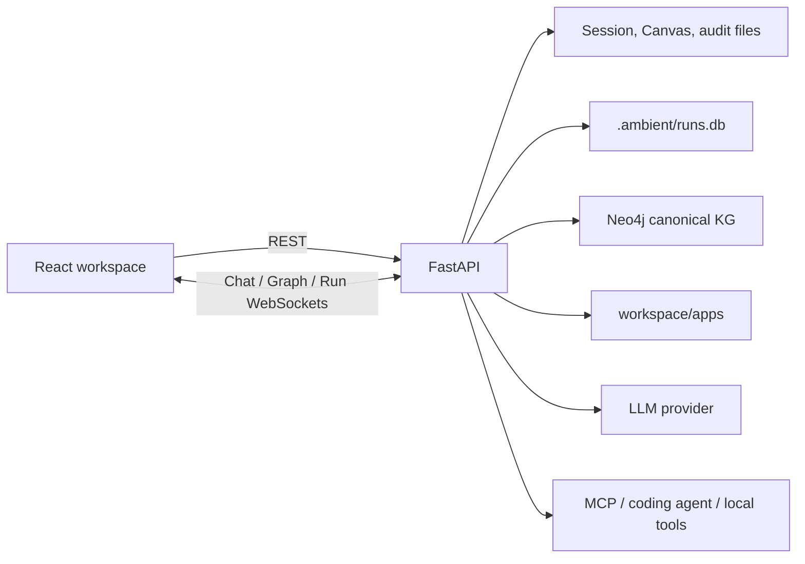

# System and Request Flow

## 1. Runtime components

`backend/main.py` is the assembly point. It creates `WorkspaceStorage`, `LLMConfigStore`, the configured graph adapter, `AppManager`, `AppStoreService`, `RunStore`, `RunCoordinator`, and `DurableAgentWorkflow`. During application startup it resumes runnable tasks and cleans up stale staging artifacts.

## 2. How a user request executes

1. The frontend sends a message through `/ws/chat`.
2. The backend stores a `ChatMessage`, resolves the current session language, model, and coding-agent snapshot, and submits an `internal_agent` Run to `RunCoordinator`.
3. The Coordinator persists the Run and manages the execution lane for that session.
4. `DurableAgentWorkflow` calls `IntentRouter` to create an `IntentPlan`, then advances explicit phases.
5. Read-only conversation or queries may finish directly. Graph mutations, composite tasks, and Widget create/modify flows pass through planning, required user interactions, preflight, execution, and verification.
6. Each step uses claims, lease epochs, and Run versions to reject stale worker commits. Visible events are stored in `run_events` and pushed through `/ws/runs`.
7. The frontend projects Run state into chat, the Task Drawer, App Center, and workspace.

The old in-memory Agent loop and Widget DAG are no longer production paths. `AgentOrchestrator` only provides routing and bounded read-only Converse helpers; the Run control plane owns execution.

## 3. Widget creation and loading

Widgets enter through two paths:

- Conversation returns `<ambient-widget>`: `AgentParser` extracts one `<js-script>`, and `AppManager` stores `controller.js` plus a manifest.
- App create or modify flow: the durable workflow asks the selected OpenCode or Codex backend to generate a controller in staging. It promotes the artifact to the live app only after syntax, safety-rule, and schema checks. Failure or missing approval does not overwrite the current artifact.

The frontend fetches an app from `/api/apps/{id}`. `SandboxWidget` transpiles the controller with Babel and injects React, the `ambient` API, and system components. This contains rendering failures but is not a security boundary for hostile JavaScript.

## 4. Data and communication responsibilities

| Channel/storage | Purpose |
| --- | --- |
| REST `/api/sessions`, `/api/canvas` | Session and Canvas CRUD |
| REST `/api/runs`, `/api/run-interactions` | Run listing, cancellation, retry, reconciliation, and user decisions |
| REST `/api/apps`, `/api/app-store` | App artifacts and unified capability catalog |
| REST `/api/coding-agents` | Coding-agent availability and default selection |
| REST `/api/graph/mutate` | Graph mutations after backend preflight |
| `/ws/chat` | Chat messages, compatibility projections, and Widget Graph subscriptions/commands |
| `/ws/runs` | Recoverable stream with sequence, event ID, and stream epoch |
| `workspace/sessions/*.json` | Sessions and messages |
| `workspace/.ambient/runs.db` | Runs, steps, interactions, and canonical events |
| Neo4j | Canonical ontology entities, context records, graph edges, effects, and mutation history |
| `workspace/graph.db` | Explicit SQLite test adapter and opt-in migration source only |

## 5. Security and consistency principles

- Provider secrets are not returned to the frontend and live in a Git-ignored workspace file.
- Codex runs only through a bearer-token-authenticated host bridge and reuses the host CLI login/ChatGPT subscription. The Docker image neither installs Codex nor stores its credentials, and the backend does not pass the Ambient Agent provider secret or Run model into the Codex process. The bridge accepts only backend-created randomized staging directories under the shared `workspace/apps` directory.
- Graph mutations must pass canonical-ontology preflight and commit atomically in one Neo4j transaction.
- MCP, tool, and coding-agent authorization and sandbox policy are enforced by the backend. Omitting a frontend API is not authorization.
- Effectful durable steps use effect/idempotency records, interactions, and fencing to avoid duplicate commits during recovery or concurrency.
- Run events are a versioned contract; the frontend preserves unknown events for forward compatibility.

Continue with [Durable Runs](/en/architecture/runs.md), [Agent Harness](/en/agent/harness.md), [Widget Architecture](/en/architecture/apps.md), or [Graph Database](/en/architecture/graph-db.md).
