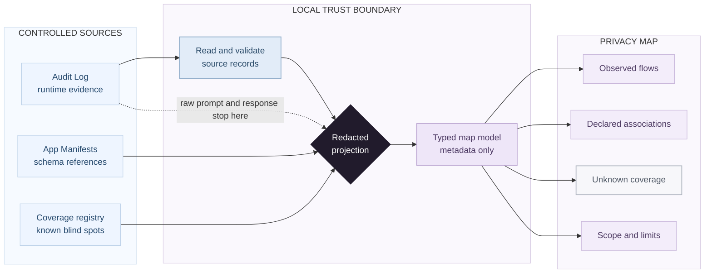

# Privacy Data Map V1

Status: V1 implementation draft for Issue #8
User-facing name: **Privacy Map**
Engineering name: **Privacy Data Map**

## 1. Purpose

The Privacy Map gives a user a scoped, redacted view of how data is known to move through Ambient Agent.
It is derived from existing platform evidence and declarations; it is not a second source of truth.

The map must answer four questions without exposing raw content:

1. What transmission paths were actually observed?
2. What App-to-schema relationships were only declared?
3. Which paths are not reliably instrumented?
4. What scope, time window, and limitations apply to the view?

The first release is workspace-scoped because historical records and several transmission paths do
not provide reliable `session_id`, `run_id`, or `app_id` attribution. Newer records may carry
optional run, session, step, or trace metadata, but the presence of optional fields does not make
workspace-wide evidence complete enough for V1 filtering.

## 2. Product principles

- **Local derivation:** build the view from the workspace's existing Audit Log, App Manifests, the
  active graph adapter's canonical ontology/schema identities, and an explicit
  instrumentation-coverage registry.
- **No raw-payload copy:** never place prompts, responses, credentials, tool arguments, or graph
  values in the Privacy Map response or UI.
- **No second evidence store:** compute the map on read. Do not persist a second copy of Audit Log
  payloads or a presentation database.
- **Evidence before inference:** show only what the source can support. Missing evidence means
  unknown, not "no transfer."
- **Declarations are not behavior:** Manifest fields and `schema_refs` can describe an App, but they
  do not prove runtime activity, permission, compliance, or graph mutation.
- **Visible limitations:** partial coverage and malformed source records must be visible states, not
  silently converted into an empty or complete map.
- **Design freedom with semantic guardrails:** the visual language can be expressive, but it must
  preserve the evidence classes, accessibility, and failure behavior defined here.

## 3. Non-goals

V1 does not:

- replace the chronological Audit Log;
- inspect or classify prompt and response content;
- infer sensitive-data categories from natural language;
- grant, enforce, or display permissions as observed behavior;
- certify privacy, security, compliance, or data residency;
- prove that an uninstrumented path was unused;
- redesign Audit Log retention;
- add session-level or run-level filtering without corresponding source identifiers;
- redesign LLM routing, MCP, HTTP Agent, Coding Agent/ACP, graph mutation, or Manifest semantics;
- turn the Privacy Map into a generated App, App Center catalog item, Widget, or Canvas window.

## 4. Current evidence boundary

Every supported Audit Log record contains the following projection inputs:

```text
id · timestamp · provider · model · prompt · response · stage
```

Newer records may also contain optional `run_id`, `session_id`, `step_id`, `trace_id`, attempt,
latency, usage, finish, error, and hash metadata. V1 deliberately does not copy those fields into the
map contract.

This is enough to derive a coarse LLM transmission topology using:

```text
timestamp · provider · model · normalized stage · count
```

V1 redaction is field-based rather than content-classification based. `provider` and `model` are
intentional user-facing metadata, so their normalized values appear in the map. Callers and
configuration paths must not place credentials, prompt fragments, response fragments, or other
payload content in those metadata fields.

It is not enough to reliably attribute every transmission to a session, run, generated App,
ontology/schema identity, MCP server, HTTP Agent, or Coding Agent/ACP process. Historical rows can lack
the optional identifiers, and several transmission paths remain uninstrumented.

The existing Audit Log also has known reliability limitations:

- not every outbound path records an audit entry;
- failed transmissions are not comprehensively recorded;
- some callers are responsible for logging rather than one mandatory transmission boundary;
- malformed JSONL records can currently be swallowed by `get_audit_logs()`;
- append failures are not represented in the user-facing data;
- records do not include an instrumentation version or coverage marker.

The Privacy Map must therefore report overall coverage as `partial` in V1. No count or successful
read may upgrade it to `complete`.

## 5. Evidence semantics

### 5.1 Observed

`observed` means a supported runtime event was recorded by an instrumented path.

For V1, an observed flow can prove only:

- Ambient Agent recorded an LLM transmission;
- the recorded provider and model;
- the normalized stage;
- the recorded time;
- aggregate frequency within the view.

It does not prove the semantic contents of the transfer, the user who caused it, data residency, or
whether every related network attempt was recorded.

### 5.2 Declared

`declared` means a valid App Manifest names a relationship such as an App's `schema_refs`.

A declared relationship is an association, not a runtime flow. It must not carry event counts,
timestamps, arrows that imply transmission, or language such as "sent," "read," or "wrote."

### 5.3 Unknown

`unknown` means the platform cannot make a reliable runtime claim because the path is not
instrumented, the source data is incomplete, or the required attribution field does not exist.

Unknown is a first-class state. It must not be hidden, rendered as zero, or folded into observed or
declared data.

### 5.4 Permission

Permission means an operation is allowed. It is not an evidence class and must remain separate from
the three states above. V1 does not project permission records into the map.

## 6. Trust boundaries and derivation

The decisive design rule is that raw Audit Log payloads stop before the projection boundary.



The dotted line is a prohibition, not a data-flow edge: raw payloads must not reach the projection.

## 7. Backend design

### 7.1 Responsibilities

Introduce a small `PrivacyDataMapService` that:

1. receives metadata-only source snapshots through injected readers;
2. normalizes allowlisted metadata;
3. aggregates deterministic observed flows;
4. converts Manifest `schema_refs` into declared associations;
5. joins static instrumentation coverage and runtime source health;
6. returns a typed, redacted response model.

The service must not:

- read prompt or response text for classification;
- write to disk;
- mutate Audit Log, Manifest, graph schema, or permission data;
- call an LLM;
- perform network requests;
- depend on frontend presentation choices.

The service input boundary is explicit:

```text
AuditProjectionRecord(timestamp, provider, model, stage)
AuditProjectionStream(
    iter_records() -> one-shot Iterator[AuditProjectionRecord],
    health_after_exhaustion() -> AuditSourceHealth,
    raises AuditProjectionSourceError,
)
WorkspaceAuditProjectionStream(
    workspace_dir,
    iter_records() -> one-shot Iterator[AuditProjectionRecord],
    health_after_exhaustion() -> AuditSourceHealth,
)
AuditSourceHealth(
    valid_record_count,
    malformed_json_count,
    structurally_invalid_record_count,
    projection_ineligible_record_count,
    oversized_line_count,
)
AppDeclarationSnapshot(declarations, invalid_app_count, source_error)
AppDeclarationSnapshotReader(
    apps_dir,
    read() -> AppDeclarationSnapshot,
)
SchemaIdSnapshot(schema_ids, unsafe_schema_id_count, source_error)
```

`LLMAuditLog`, raw JSON objects, `prompt`, and `response` must never be passed to
`PrivacyDataMapService`. The Audit Log reader discards raw payload fields before constructing an
`AuditProjectionRecord`. The existing Audit Log API may use a separate full-record adapter over the
same parser.

`AuditProjectionStream` is consumed exactly once. It never materializes an unbounded metadata list;
the reader retains only the current source line and health counters. Opening the Audit file or
encountering an I/O failure during iteration raises the internal typed
`AuditProjectionSourceError`. That exception carries no public path, raw exception text, or record
content. `health_after_exhaustion()` is valid only after normal iterator exhaustion.

`WorkspaceAuditProjectionStream` is the concrete workspace adapter. It resolves only
`audit_logs.jsonl` below an absolute workspace root captured at construction and opens it in binary
mode. Production reads reject a symlink, junction, directory, device, pipe, non-regular file, or
resolved path outside that root as a sanitized source error. A relative workspace path cannot switch
sources after a current-working-directory change. The adapter has three observable lifecycle states:
unused, consuming, and normally exhausted. It is request-local and is not a cross-thread sharing
primitive. A second serial call to `iter_records()`, or a call to `health_after_exhaustion()` before
normal exhaustion, is a projection error. A failed or abandoned iteration never exposes health
counters as if they described a complete scan. Before yielding an accepted metadata record, the
adapter releases its references to the raw line and decoded object so prompt and response payloads
are not retained in the suspended generator frame.

All public response models use strict Pydantic configuration with unknown fields forbidden. The
serializer accepts only those response models, not arbitrary dictionaries.

### 7.2 Audit source health

`WorkspaceStorage.get_audit_logs()` currently cannot distinguish an empty file from malformed or
unreadable input. V1 adds a Privacy-Map-specific structured projection reader without changing the
existing `/api/audit-logs` compatibility path. A future Audit Log redesign may share parsing
infrastructure, but that is not required by this slice.

Rules:

- distinguish syntactically malformed JSONL, structurally invalid Audit Log records, records that
  remain valid for the legacy Audit Log API but are ineligible for Privacy Map projection, valid
  projection records, and source-level I/O failures;
- one malformed, structurally invalid, or projection-ineligible line does not block other valid
  records;
- malformed line contents are never returned;
- JSON syntax, UTF-8 decoding, parser recursion, and parser `ValueError` failures such as Python's
  bounded integer-conversion rejection are malformed-record outcomes; those exceptions are caught
  only around `json.loads()`. A `MemoryError` or unrelated exception outside that parser call is
  never downgraded to a malformed line;
- malformed JSON, structurally invalid records, projection-ineligible records, and oversized lines
  degrade source health and overall coverage through separate stable warning codes;
- a missing file is a valid empty source;
- an unreadable file or source-level I/O failure is an error, not an empty map;
- timestamps without a timezone may remain visible through the existing Audit Log compatibility
  path, but are projection-ineligible and are never interpreted using the host timezone;
- sorting is deterministic and independent of file order.
- parse the file as a stream and retain only aggregate state plus the current record;
- enforce a documented `MAX_AUDIT_LINE_BYTES` before JSON decoding; an oversized line is skipped and
  counted separately without buffering an unbounded line;
- count line bytes before the terminating LF; a preceding CR, when present, is part of the line
  payload for the byte limit. The LF itself still contributes to `MAX_AUDIT_BYTES_SCANNED`;
- use bounded binary `readline(size)` calls. Once a line crosses `MAX_AUDIT_LINE_BYTES`, clear the
  retained prefix and drain the remainder in fixed-size chunks without JSON or UTF-8 decoding;
- do not impose a silent whole-file truncation. If an operational time or resource limit is added,
  the endpoint must return an explicit degraded/error state rather than a map presented as complete.
- if `AuditProjectionSourceError` occurs after valid records were yielded, discard all partial
  aggregates and map it only to `privacy_map_audit_source_unreadable`; never return a partial map.

Each request is a bounded best-effort scan, not a transactionally consistent snapshot of all runtime
activity. The production adapter opens one validated regular file and scans only the byte prefix
whose length was captured from that open file descriptor before iteration. Bytes appended after that
boundary are intentionally deferred to the next request, so a continuously active writer cannot
extend one scan indefinitely. A final in-boundary line without LF is still evaluated normally:
complete valid JSON may be accepted, while an incomplete or malformed tail is counted as malformed.
The projection does not claim that an append which races the boundary is visible in the current
response.

Accounting is mutually exclusive and deterministic:

1. each physical line contributes to the global byte and physical-line scan limits;
2. a line longer than `MAX_AUDIT_LINE_BYTES` increments `oversized_line_count` before blank-line
   classification or JSON parsing, including a whitespace-only oversized line;
3. an in-limit line containing only JSON whitespace bytes (`SP`, `HTAB`, or `CR`) is ignored;
   vertical tab, form feed, and non-ASCII Unicode whitespace are not blank JSONL lines and proceed to
   JSON decoding;
4. JSON decoding failure increments `malformed_json_count`;
5. a decoded value that is not an object, or an object that cannot satisfy the existing
   `LLMAuditLog` shape, increments `structurally_invalid_record_count`;
6. a legacy-compatible `LLMAuditLog` whose timestamp or projection metadata fails the stricter
   Privacy Map rules increments `projection_ineligible_record_count`;
7. an accepted record increments `valid_record_count` and is yielded for aggregation.

For a stream that exhausts normally within the resource limits, every nonblank physical line
increments exactly one counter. `valid_record_count` equals the number of records accepted before
aggregation, not the number of output flows. Every nonzero issue counter produces exactly one
warning with the same count; warnings with a zero count are omitted.

Counter-to-contract mapping is fixed:

| Reader/service counter | `source_health` field and warning code |
|---|---|
| `malformed_json_count` | `malformed_json_records` |
| `structurally_invalid_record_count` | `structurally_invalid_audit_records` |
| `projection_ineligible_record_count` | `projection_ineligible_audit_records` |
| `oversized_line_count` | `oversized_audit_lines` |
| `invalid_app_count` | `invalid_app_declarations` |
| `unsafe_schema_id_count` | `unsafe_schema_ids` |
| unresolved valid `schema_refs` | `missing_schema_references` |

Snapshot `source_error` values are internal typed enums, never exception strings. They map only to
the stable public error codes in Section 8.2. Audit source failures use the typed streaming
exception above rather than a snapshot field.

App and schema snapshots are completed before the Audit stream is consumed. Their source errors are
therefore checked first, in the stable order App declarations and then graph schemas. If either
snapshot is unreadable, the service must not scan the Audit Log. This preserves the most immediate
known failure category and avoids a bounded but unnecessary Audit scan. Audit source failures are
evaluated only after both precomputed snapshots are readable.

The existing `/api/audit-logs` response contract must remain compatible unless a separate,
maintainer-approved Audit Log change is made.

### 7.3 Metadata normalization

The projection may consume only:

- `timestamp`;
- `provider`;
- `model`;
- `stage`.

Normalization rules:

- provider and model display values first use Unicode NFKC normalization, then reject prohibited
  code points across the entire normalized value, then trim surrounding permitted Unicode
  whitespace, and are rejected if the result is empty;
- provider and model values containing Unicode control, format, surrogate, private-use, unassigned,
  line-separator, or paragraph-separator code points are rejected even when those code points appear
  only at an edge where `str.strip()` would otherwise remove them;
- provider and model values longer than `200` Unicode code points are rejected rather than
  truncated;
- `stage` is matched case-sensitively against an explicit alias table and never echoed directly;
- `session_title` maps to `title`;
- unrecognized non-empty stages map to `other`;
- a non-string stage, or a stage containing only Unicode whitespace, is projection-ineligible;
- for records whose legacy `prompt` and `response` fields are valid strings, changing only those
  string values must not change any Privacy Map ID, label, grouping, ordering, warning, coverage
  value, or other serialized field.

The legacy Audit Log model still validates record shape before projection. A non-string `prompt` or
`response` remains structurally invalid for compatibility with that source contract; this rule does
not authorize the Privacy Map to inspect, classify, normalize, or otherwise use valid raw content.

Initial stage vocabulary:

```text
chat · route · plan · mutation · verify · title · other
```

This vocabulary is a display normalization layer, not a new routing or Audit Log taxonomy.

Projection timestamps use `YYYY-MM-DDTHH:MM:SS`, an optional one-to-six-digit fractional
second, and either a `Z` or `±HH:MM` suffix. The year is `0001..9999`; the calendar date must be valid;
hour is `00..23`; minute and second are `00..59`; the optional fraction contains one to six digits;
and offset hour/minute are `00..23` and `00..59`. The RFC 3339 unknown-offset form `-00:00` is
projection-ineligible. Inputs accepted by the legacy Audit Log model but outside this grammar remain
Audit-compatible and are projection-ineligible. Accepted timestamps are converted to UTC before
grouping or calculating first/last times and `observed_window`. Serialization uses uppercase `Z`,
removes trailing fractional zeros, and omits the fractional part when it is zero. UTC conversion
overflow is projection-ineligible. Equivalent instants expressed with different offsets therefore
serialize identically.

Derived opaque IDs for recorded model targets, observed flows, and declared associations use the
following versioned algorithm:

1. construct a canonical JSON array whose first element is the namespace string `privacy-map-v1`,
   using the fixed tuples below;
2. serialize it with UTF-8 encoding, `ensure_ascii=false`, and separators `(",", ":")`;
3. hash the bytes with SHA-256;
4. use the full lowercase hexadecimal digest after the item-kind prefix.

Canonical tuples:

```text
["privacy-map-v1", "recorded_model_target", provider, model]
["privacy-map-v1", "observed_flow", source_node_id, destination_node_id, normalized_stage]
["privacy-map-v1", "declared_association", app_id, schema_id]
```

The corresponding item-kind prefixes are exactly `model_target:`, `flow:`, and `declaration:`.
The platform node uses the fixed ID `platform:ambient-agent`. Validated App and schema identities
remain readable as `app:<app-id>` and `schema:<schema-id>`; they are not derived opaque IDs and are
not hashed.

Python `hash()` and file-order suffixes are forbidden. A full-digest collision between different
canonical tuples produces a stable projection error rather than an order-dependent ID.

Ordering is also part of the contract:

- coverage channels follow the version-controlled registry order;
- nodes sort by kind precedence `platform`, `recorded_model_target`, `app`, `schema`, then by ID;
- observed flows sort by destination node ID, stage, then flow ID;
- declared associations sort by App ID, schema ID, then association ID;
- warnings sort by stable warning code;
- the observed window is the minimum and maximum timestamp among accepted projection records.

V1 uses fixed, version-controlled resource bounds:

```text
MAX_AUDIT_LINE_BYTES = 1_048_576
MAX_AUDIT_BYTES_SCANNED = 268_435_456
MAX_AUDIT_PHYSICAL_LINES = 1_000_000
MAX_UNIQUE_RECORDED_MODEL_TARGETS = 512
MAX_OBSERVED_FLOW_GROUPS = 2_048
MAX_APP_DIRECTORY_ENTRIES_SCANNED = 8_192
MAX_APP_CANDIDATES_SCANNED = 4_096
MAX_APP_NODES = 2_048
MAX_SCHEMA_IDS_SCANNED = 8_192
MAX_SCHEMA_ID_MATERIALIZED_CODEPOINTS = 129
MAX_SCHEMA_NODES = 4_096
MAX_SCHEMA_REFERENCES_SCANNED = 8_192
MAX_DECLARED_ASSOCIATIONS = 8_192
```

These limits bound scan work, aggregate dictionaries, and serialized output cardinality. Byte and
physical-line accounting includes blank and whitespace-only input, plus bytes drained while
skipping an oversized line. Crossing either scan limit or discovering an item that would exceed any
unique-cardinality limit fails closed with `privacy_map_resource_limit_exceeded`. The service
discards partial aggregates and returns no map payload. It must not truncate, sample, merge
unrelated identities, or identify the value that crossed the limit. Raising a limit requires a
reviewed contract change and load-test evidence.

### 7.4 Manifest and schema declarations

`AppManager.list_apps()` is not a safe source for this endpoint because it may reconcile pending
deletions, migrate legacy metadata, create a Manifest, and update lifecycle records. V1 therefore
uses a dedicated `AppDeclarationSnapshotReader` over the configured Apps directory. It reuses the
existing `AppManifest.read()` contract but does not call `AppManager.list_apps()` or add
Privacy-specific behavior to AppManager.

Rules:

- read existing `manifest.json` files without migration, repair, reconciliation, deletion, or
  lifecycle-record writes;
- treat a missing Apps root as a valid empty source; inability to enumerate an existing root is a
  source error and never a successful empty snapshot;
- reject an Apps root that is itself a symlink or junction as an unreadable declaration source,
  including a broken link; the reader must not resolve or enumerate the linked target;
- count every physical entry returned by the Apps-root directory iterator before filtering hidden
  entries, ordinary files, or unsupported filesystem objects. Fail closed at
  `MAX_APP_DIRECTORY_ENTRIES_SCANNED + 1`;
- separately stop at `MAX_APP_CANDIDATES_SCANNED + 1` and fail closed when the sentinel candidate
  exists. Both directory-entry and candidate bounds must be known before reading any Manifest;
- expose only `app_id` and `schema_refs` to the projection;
- use the validated `app_id` as both the App node identity and V1 display label; Manifest title does
  not cross the privacy projection seam;
- count invalid or skipped Apps under a stable warning code without exposing paths or exception
  strings;
- include only valid App Manifests accepted by the existing `AppManifest` contract;
- capture the Apps-root filesystem identity before enumeration and verify that the root remains the
  same non-link directory after enumeration and around every Manifest read;
- capture each candidate directory identity from enumeration and verify that the same non-link
  directory remains directly below the configured Apps root before and after its Manifest read;
- open each Manifest once, verify the opened handle is the same bounded regular file that was
  inspected without following its final path component where the operating system supports that
  primitive, and parse only from that opened handle. A detected root, candidate, or Manifest identity
  change invalidates the source/App rather than following the replacement;
- reject symlinks or junctions that escape the configured Apps root. These checks prevent accidental
  path traversal and fail closed on detected replacement races; they are not an isolation boundary
  against a malicious process already running as the same local operating-system user;
- include an App-to-schema association only when the referenced schema ID exists in the registry;
- report a missing referenced schema as a declaration warning, without inventing a schema node;
- count every valid `schema_refs` entry, including unresolved references, against
  `MAX_SCHEMA_REFERENCES_SCANNED`; crossing that aggregate bound fails closed before associations or
  missing-reference warnings are returned;
- include schema nodes only for registered safe schema IDs referenced by at least one valid App
  declaration. Unreferenced registry IDs remain outside the V1 response;
- never copy full graph schema definitions into the response;
- never interpret `schema_refs` as read/write permission or runtime evidence;
- never infer direction of data movement from a declaration.

The service treats these snapshots as validated internal contracts, but still fails closed if an
injected or corrupted snapshot contains a duplicate App ID, duplicate schema registry ID, duplicate
reference within one App declaration, an invalid App ID, or an unsafe schema registry identity.
It does not silently merge, normalize, or select one conflicting declaration. Missing references are
counted per valid App/reference pair; the same missing schema ID referenced by two Apps therefore
contributes two missing-reference outcomes.

V1 adds the narrow, bounded ID-list adapter contract
`list_schema_ids(*, limit: int, max_id_codepoints: int) -> list[str]`. The active graph adapter owns
the query and must apply stable ordering, row count, and per-value materialization bounds in storage
before identities enter Python. The SQLite adapter orders by the original `graph_schemas.id`, uses
SQL `LIMIT`, and returns at most `max_id_codepoints` codepoints from each ID. A Neo4j adapter must
apply equivalent ordering, row, and string-prefix bounds to canonical `OntologyEntity.id` values
for the active Ambient ontology. Every implementation rejects booleans, non-integers, zero, and
negative bounds. The Privacy Map schema reader requests `MAX_SCHEMA_IDS_SCANNED + 1` rows and
`MAX_SCHEMA_ID_MATERIALIZED_CODEPOINTS` codepoints. The 129-codepoint sentinel preserves enough
information to reject every value beyond the 128-codepoint safe-ID contract without materializing
an unbounded legacy/corrupt value. Receiving the extra row is a resource-limit failure, not a
truncated successful snapshot. This bounded ID-only seam avoids loading or parsing full
schema/ontology definitions merely to build the map.

`GraphSchemaSnapshotReader` owns this adapter boundary. It requests the bounded ID list, rejects an
extra sentinel row with `PrivacyDataMapResourceLimitError`, and immediately validates and projects
the returned identities into `SchemaIdSnapshot`. Each storage adapter translates expected
SQLite/driver read failures into the storage-neutral `GraphSchemaReadError`; that error or a
non-string identity becomes `SourceError.UNREADABLE`. Unexpected programming errors are not
silently downgraded to source health. Schema names, descriptions, properties, registration
metadata, and full definitions are never queried or materialized for the Privacy Map path. The
method performs no business-data mutation and does not change ontology/schema registration, graph
mutation, router context, or schema-validation behavior.

Schema IDs are identity values and must not be silently normalized. For presentation, accept only
exact IDs matching `[A-Za-z][A-Za-z0-9_.-]{0,127}`. Omit unsafe IDs and their associations with a
stable warning count; do not rewrite them into a different identity.

### 7.5 Coverage registry

Coverage cannot be inferred from the presence or absence of log rows. V1 must use a small,
version-controlled registry describing which transmission channels are instrumented.

Initial coverage:

| Channel | Observation state | V1 meaning |
|---|---|---|
| LLM | `partial` | Some successful transmissions are recorded; attribution and failures are incomplete. |
| MCP | `not_instrumented` | No reliable Privacy Map event source. |
| HTTP Agent | `not_instrumented` | No reliable Privacy Map event source. |
| Coding Agent/ACP | `not_instrumented` | No reliable Privacy Map event source. |
| Provider management | `not_instrumented` | Discovery and connection tests are not a reliable event source. |
| Isolated Widget Runtime | `not_instrumented` | CSP, authenticated MessagePort communication, nonce handshakes, and capability allowlists isolate execution, but Privacy Map does not yet receive complete Widget runtime or network-flow evidence. |

The registry is product truth about instrumentation coverage, not a runtime permission list.
Adding a channel as `complete` requires tests showing that success, failure, retry, and cancellation
paths all pass through mandatory instrumentation.

Evidence at an Ambient-to-child-process boundary proves only that Ambient handed a request to that
process. It does not prove which later network requests the child made or that data crossed the
machine boundary. In the same way, an empty observed-flow set never proves that no transfer
occurred through an uninstrumented browser, process, or network path.

## 8. API contract

Endpoint:

```http
GET /api/privacy-data-map
```

V1 has no query parameters. Adding time filters before source attribution and indexing are reliable
would imply precision the current data does not provide. Any non-empty query string is rejected with
`400 privacy_map_invalid_request`; unknown parameters are never silently ignored.

Example response:

```json
{
  "contract_version": 1,
  "generated_at": "2026-07-19T00:00:00Z",
  "scope": {
    "kind": "workspace",
    "observed_window": {
      "from": "2026-07-18T08:15:00Z",
      "to": "2026-07-19T00:00:00Z"
    }
  },
  "source_health": {
    "status": "degraded",
    "valid_audit_records": 12,
    "malformed_json_records": 1,
    "structurally_invalid_audit_records": 0,
    "projection_ineligible_audit_records": 1,
    "oversized_audit_lines": 0,
    "invalid_app_declarations": 0,
    "unsafe_schema_ids": 0,
    "missing_schema_references": 0
  },
  "coverage": {
    "status": "partial",
    "channels": [
      {
        "id": "llm",
        "observation": "partial"
      },
      {
        "id": "mcp",
        "observation": "not_instrumented"
      }
    ]
  },
  "nodes": [
    {
      "id": "platform:ambient-agent",
      "kind": "platform",
      "label": "Ambient Agent"
    },
    {
      "id": "model_target:08e047f9d63d6fbf056b4b083099d8d7fb0e9e691f0117529809d1288f13aa87",
      "kind": "recorded_model_target",
      "label": "OpenAI · gpt-example",
      "location": "unknown"
    },
    {
      "id": "app:morning-planner",
      "kind": "app",
      "label": "morning-planner"
    },
    {
      "id": "schema:Task",
      "kind": "schema",
      "label": "Task"
    }
  ],
  "observed_flows": [
    {
      "id": "flow:e7c84975c42780296fc744f62a816704e204e7c7db118324fcd38db763d33580",
      "evidence": "observed",
      "source_node_id": "platform:ambient-agent",
      "destination_node_id": "model_target:08e047f9d63d6fbf056b4b083099d8d7fb0e9e691f0117529809d1288f13aa87",
      "stage": "chat",
      "count": 12,
      "first_observed_at": "2026-07-18T08:15:00Z",
      "last_observed_at": "2026-07-19T00:00:00Z"
    }
  ],
  "declared_associations": [
    {
      "id": "declaration:2269092a9528a054ba56ff10ffd0fdb523a98d1ebb9ec8356a174abd1d300475",
      "evidence": "declared",
      "app_node_id": "app:morning-planner",
      "schema_node_id": "schema:Task"
    }
  ],
  "warnings": [
    {
      "code": "malformed_json_records",
      "count": 1
    },
    {
      "code": "projection_ineligible_audit_records",
      "count": 1
    }
  ]
}
```

### 8.1 Contract invariants

- `contract_version` is the response schema version, independent of Manifest version.
- All timestamps use the canonical UTC serialization defined in Section 7.3.
- `generated_at` comes from an injected clock, which must return an offset-aware value convertible
  to UTC; a naive or out-of-range value is a projection failure and is never interpreted in host
  time.
- `observed_window` is `null` when there are no valid observed records.
- `coverage.status` is always `partial` in V1.
- A `recorded_model_target` proves only that an Audit record named a provider/model pair. It does
  not identify a URL, deployment instance, network endpoint, processor, or physical destination.
- `location` remains `unknown` unless a future trusted source can prove target locality.
- Node and relationship arrays use stable deterministic ordering.
- `observed_flows` contains only `observed` evidence.
- `declared_associations` contains only `declared` evidence and no runtime count or timestamp.
- Unknown paths are represented through `coverage.channels`, not fabricated graph edges.
- `source_health.status` is `healthy` only when all source issue counts are zero; any recoverable
  malformed, invalid, ineligible, oversized, Manifest, schema-ID, or missing-schema-reference issue
  makes it `degraded`. Source-level failures return an HTTP error rather than a successful payload
  with `error` health.
- A missing referenced schema increments `missing_schema_references` and produces exactly one
  `missing_schema_references` warning when nonzero.
- Warnings contain stable codes and counts, never raw exception messages or source content.
- Strict response models reject unknown fields.
- The serialized response must not contain keys named `prompt`, `response`, `content`, `payload`,
  `credentials`, `token`, `api_key`, or `headers`.
- Canary values supplied only through excluded raw fields such as `prompt` and `response` must not
  appear anywhere in serialized output, even under an allowed key.

### 8.2 HTTP behavior

| Condition | Response |
|---|---|
| Missing Audit Log with otherwise readable sources | `200`, empty observed flows, partial coverage |
| No Apps or schemas | `200`, empty declared associations |
| Some malformed, structurally invalid, projection-ineligible, or oversized Audit Log lines | `200`, valid flows retained, degraded source health and distinct warnings |
| Audit Log source cannot be read | `500`, `privacy_map_audit_source_unreadable` |
| App declaration source cannot be read safely | `500`, `privacy_map_app_source_unreadable` |
| Manifest for one App is invalid | `200`, other declarations remain, invalid count and stable warning |
| Graph schema registry cannot be read | `500`, `privacy_map_schema_source_unreadable` |
| Derived-ID collision | `500`, `privacy_map_id_collision` |
| Invalid injected clock or unexpected projection failure | `500`, `privacy_map_projection_failed` |
| Scan or unique-cardinality limit exceeded | `503`, `privacy_map_resource_limit_exceeded` |
| Any non-empty query string | `400`, `privacy_map_invalid_request` |
| Trailing-slash path `/api/privacy-data-map/` | `404`, without redirecting to the protected route |

The endpoint must not return stale cached data after a source error unless a future cache contract
explicitly marks the response as stale.

The synchronous projection builder performs bounded file and database I/O. FastAPI must execute it
in its worker thread pool rather than on the application event loop, so one Privacy Map scan cannot
block unrelated HTTP or WebSocket work. The builder result must be exactly the base
`PrivacyDataMapResponse` contract; subclasses and arbitrary response-like objects are rejected
before serialization so contract-external fields cannot cross the endpoint.

Concurrent Privacy Map requests within one process use single-flight execution. The first caller
creates one shared build task; callers that arrive while it is active wait asynchronously for that
same task and receive the same typed response or sanitized error classification. A caller owns only
its wait, not the build lifecycle. Cancelling any caller therefore must not cancel the shared worker
or clear the active flight while the bounded scan is still running. Only the shared build task may
publish the outcome, release waiters, and clear the active flight after the worker has actually
finished.

The coordinator must not retain the result after that in-flight cohort has consumed it, must not
create a second evidence store, and must not turn later requests into a time-based cache hit. An
unrelated endpoint remains schedulable while the single build is running. Builder `BaseException`
instances are not retained or exposed; every waiter receives only the sanitized projection-failure
classification and never the original object or text.

### 8.3 Error contract

Errors use a strict response model rather than FastAPI's default exception-detail shape:

```json
{
  "contract_version": 1,
  "error": {
    "code": "privacy_map_audit_source_unreadable",
    "message": "Privacy Map is temporarily unavailable."
  }
}
```

The public message is stable and generic. Error responses contain no partial map payload, source
paths, exception strings, raw records, provider/model values, or Manifest/schema contents. Every
response on the exact route, including representative `200`, `400`, `405`, `500`, and `503`
responses, includes `Cache-Control: no-store`. Internal logs may record a correlation ID and
sanitized exception class, but never raw prompt or response content.

## 9. Retention, access, and deletion

### 9.1 Retention

The Privacy Map has no independent retention policy because it stores no map data. Its observed view
inherits the available Audit Log history; its declared view reflects current valid Manifests and
registered schema IDs.

V1 must show that the visible time window describes available evidence, not a guarantee about the
full lifetime of the workspace.

### 9.2 Access

The endpoint exposes less data than `/api/audit-logs`, but it still reveals provider/model usage,
App IDs, schema IDs, counts, and timing. Documentation and request headers alone are not an
access-control boundary.

V1 inherits the **current Ambient Agent deployment and API access boundary**. It does not narrow
the whole product to loopback-only publication, so the existing multi-client workflow remains
available. It also does not introduce endpoint-specific authentication or claim authenticated
workspace authorization.

The route therefore has the same network reachability and CORS policy as the surrounding Ambient
Agent API. CORS, `Host`, `Origin`, and forwarded headers are not authorization signals, so the
Privacy Map does not treat them as proof of identity or locality. Browser, LAN, container, CLI,
proxy, and tunnel access follow the platform and deployment configuration rather than a separate
route-local allowlist.

This is an explicit V1 limitation, not a claim that the redacted projection is public or
non-sensitive. Deployments must protect the endpoint at the same boundary as other workspace data
APIs, especially `/api/audit-logs`. If Ambient Agent adds authenticated workspace authorization,
that control must cover the Privacy Map at the shared API boundary; it must not be approximated
with client-controlled request headers inside this feature.

Installing the Privacy Map must not change Docker publication, development listeners, supported
client devices, global CORS behavior, or proxy behavior for the rest of Ambient Agent. The route
itself remains read-only and accepts no query parameters. Unsupported methods use the framework's
normal method handling.

Successful and error responses include:

```http
Cache-Control: no-store
```

### 9.3 Deletion

- deleting Audit Log records removes their contribution on the next read;
- deleting an App removes its declared associations on the next read;
- removing a registered schema would remove or invalidate its association on the next read, but the
  current graph interface has no schema-removal operation;
- closing the drawer clears the in-memory response from component state;
- V1 adds no export, snapshot, analytics, or browser persistence.

Deleting a Chat Session does not delete Audit Log records and therefore does not remove its observed
contribution. Optional `session_id` values on newer records do not provide complete attribution
across historical and uninstrumented paths, so session-scoped map deletion cannot be implemented or
claimed. There is currently no Audit Log purge API.

The map does not create a deletion workflow. Any future Audit Log deletion feature must define
atomicity, authorization, user confirmation, and its relationship to session deletion separately.

## 10. Frontend integration

### 10.1 Platform surface

`PrivacyDataMapPanel` is a platform-level system drawer. It is not part of generated App content.

It should reuse:

- `SystemDrawer`;
- `SystemIconButton`;
- existing scrim, Escape, focus restoration, and responsive drawer behavior;
- semantic theme tokens and existing workspace breakpoints.

Entry points:

1. App Center system actions;
2. desktop Workspace system actions;
3. compact/mobile More menu.

System surfaces use the following observable stacking contract:

- Privacy Map, Audit Log, and Task Center are mutually exclusive drawers;
- opening any one of those drawers closes the other two and any open system popover;
- opening Models & Providers closes every system drawer before showing its dialog;
- a blocking permission, plan, schema, or verification dialog closes Privacy Map before taking
  focus rather than leaving an interactive drawer behind the modal;
- the home App Center may remain visible beneath Privacy Map because it is a non-modal workspace
  surface;
- an App Center overlay must close before Privacy Map opens so only one modal context remains exposed
  to assistive technology;
- closing Privacy Map restores focus to the exact App Center, Workspace, or More-menu trigger that
  opened it when that trigger still exists; otherwise focus moves to the nearest surviving system
  toolbar.

The implementation may use a single active-surface state or coordinated close handlers, but it must
not rely on independent booleans that permit overlapping drawers.

### 10.2 Information architecture

The panel must expose:

- title and concise explanation;
- workspace scope and observed time window;
- coverage status and blind spots before or beside the visual map;
- observed, declared, and unknown layers with text labels;
- refresh action;
- semantic list/table equivalent of every visible node and relationship;
- source-health and error states.

The visual graph and semantic fallback must be derived from the same typed view model. They must not
perform separate aggregation.

The typed client is a fail-closed contract boundary, not a permissive JSON cast. It rejects unknown
fields, dangling or duplicate identities, invalid Unicode/timestamps, and responses that exceed the
same version-controlled cardinality limits as the backend. In particular, a V1 success response
contains exactly one platform node and no more than `512` recorded model targets, `2_048` App nodes,
or `4_096` schema nodes. A recorded-model label is already NFKC-normalized, trimmed, free of the
prohibited Unicode categories from Section 7.3, and no longer than `403` Unicode code points
(`200 + " · " + 200`). The browser reads at most `16 MiB`; crossing any client-side bound is a
malformed-contract error and never produces a guessed or partially rendered map.

### 10.3 Required states

| State | Required behavior |
|---|---|
| Loading | Preserve panel structure, announce loading, disable duplicate refresh. |
| Empty | Explain that no observed records are available; still show partial coverage and declarations. |
| Partial | Show observed data together with a prominent coverage limitation. |
| Degraded | Keep valid results, show malformed-record warning without raw details. |
| Error | Show a stable, actionable message and retry control; do not show stale data as current. |
| Malformed API | Reject the response, show error state, and render no guessed topology. |

### 10.4 Accessibility and responsive behavior

- Desktop interactive targets are at least `40 × 40` CSS pixels.
- Mobile interactive targets are at least `44 × 44` CSS pixels.
- The map cannot rely on color alone; evidence class requires text, pattern, shape, or icon support.
- The semantic view is the normative interaction surface: every selection, detail, and navigation
  action available from the visual map must be available there.
- The visual map may be non-interactive. If a visual node or relationship is clickable or
  focusable, it must also be keyboard operable, expose an accessible name and state, show visible
  focus, and synchronize selection with the semantic view.
- Keyboard focus is visible and follows the existing System UI behavior.
- Pagination controls remain in the focus order at page boundaries through `aria-disabled`;
  activating a boundary control is a no-op. Page-range changes are announced briefly without
  replaying the list, so focus cannot be stranded on a newly disabled element or escape the drawer.
- Status changes use an appropriate live region without repeatedly announcing the whole map.
- Reduced-motion users receive no animated traversal, pulsing, or automatic camera motion.
- At widths below the existing `720px` drawer breakpoint, the panel uses the established full-screen
  drawer behavior.
- The layout supports a `320px` viewport and `safe-area-inset-*`.
- Chinese and English copy must be available through the project i18n path.

## 11. UI design ownership

The engineering contract intentionally does not prescribe:

- the topology metaphor;
- node and edge silhouettes;
- palette beyond accessible semantic distinction;
- animation style;
- the exact observed/declared/unknown visual encoding;
- detail-card composition;
- compact visual recomposition;
- microcopy tone or brand expression.

Those choices belong to the UI design pass. A candidate is acceptable when it preserves:

- the evidence meanings in Section 5;
- the API contract;
- equivalent semantic access;
- all loading, empty, partial, degraded, error, and malformed states;
- keyboard, contrast, target-size, responsive, and reduced-motion requirements;
- no raw-payload path into the DOM.

This separation allows a distinctive Privacy Map without letting visual novelty change the truth
claims.

## 12. Implementation sequence

Implementation must follow the repository's docs-first and Red-Green-Refactor rules.

### Phase A — Redacted backend projection

1. Add failing contract and source-health tests.
2. Add the Privacy-Map-specific structured Audit Log projection reader.
3. Add the metadata-only audit, non-mutating Manifest, and minimal schema-ID snapshot seams.
4. Add strict typed Privacy Map response models.
5. Implement `PrivacyDataMapService` with injected clock, digest function, and readers.
6. Add the approved workspace access boundary and `GET /api/privacy-data-map`.
7. Verify that no raw payload object, key, or value can cross the projection boundary or enter
   serialization.

### Phase B — System drawer and semantic view

1. Add failing component and integration tests.
2. Add a typed API client.
3. Add `PrivacyDataMapPanel`.
4. Add App Center, Workspace, and mobile entry points.
5. Enforce the system-surface stacking and focus-restoration contract.
6. Implement all required states and the semantic representation.

### Phase C — Visual map

1. Prototype the topology and interaction language without changing data semantics.
2. Test keyboard selection, synchronized detail state, 320px layout, and reduced motion.
3. Conduct light/dark theme, Chinese/English, contrast, and zoom review.
4. Keep the semantic representation as a permanent equivalent view, not a temporary fallback.

### Deferred instrumentation work

MCP, HTTP Agent, Coding Agent/ACP, provider-management, Isolated Widget Runtime, failure, retry,
cancellation, session, run, App, and schema attribution require event instrumentation at their true
execution boundaries. The Widget sandbox is a security boundary, not proof that every flow is
observed. Each channel should be added through a separate reviewed slice rather than inferred from
prompts, Manifest declarations, or sandbox configuration.

## 13. Test and acceptance matrix

### 13.1 Backend

- the response never serializes prompt or response text;
- raw payload objects and fields never enter `PrivacyDataMapService`;
- changing only valid `prompt` and `response` string values cannot influence any serialized Privacy
  Map field, including IDs, labels, grouping, ordering, warnings, or coverage;
- strict response models reject unknown fields and canary raw values never appear in serialization;
- valid rows aggregate by normalized provider, model, and stage;
- every nonblank Audit Log line enters exactly one counter category and blank lines are ignored;
- `valid_audit_records` equals the number of records accepted before aggregation;
- every nonzero warning count equals its corresponding source-health count and zero-count warnings
  are omitted;
- the streaming reader does not construct an unbounded metadata-record list;
- output ordering and IDs are deterministic;
- IDs remain identical across separate Python processes;
- known-answer fixtures assert the exact `model_target:`, `flow:`, and `declaration:` prefixes and full
  SHA-256 digests shown in the contract example;
- an injected digest collision produces the stable projection error;
- naive, invalid, and out-of-range timestamps are rejected deterministically;
- timestamps outside the exact offset-hour, offset-minute, and fractional-second grammar are
  rejected even if a lower-level parser could normalize them;
- legacy naive timestamps remain compatible with `/api/audit-logs` but are excluded from the map
  with a stable projection-ineligible warning;
- equivalent timestamps with different offsets produce the same canonical UTC instant;
- a naive or out-of-range injected clock is rejected with `privacy_map_projection_failed`;
- provider/model normalization rejects empty values and unsafe control or format characters rather
  than stripping them;
- provider/model normalization follows the exact Unicode, length, and rejection rules;
- unknown stage values become `other`;
- `session_title` maps to `title`;
- missing stages default to `chat`, while empty or whitespace-only stages are projection-ineligible;
- one malformed JSONL row preserves valid rows and degrades source health;
- one structurally invalid Audit Log object preserves valid rows and produces its distinct warning;
- oversized JSONL lines follow the bounded streaming policy and produce their distinct warning;
- an oversized whitespace-only physical line is counted as oversized before blank-line handling;
- blank-only input that crosses the byte or physical-line scan limit fails closed with
  `privacy_map_resource_limit_exceeded`;
- an Audit iteration I/O failure after valid records discards partial aggregates and returns only
  `privacy_map_audit_source_unreadable`;
- an unreadable source produces a stable error, not an empty map;
- a missing Audit Log produces a valid empty observed view;
- each scan and unique-cardinality limit has a boundary-value test;
- exceeding any resource limit returns `privacy_map_resource_limit_exceeded`, no truncated map, no
  offending identity, and `Cache-Control: no-store`;
- overall coverage cannot become `complete`;
- each known uninstrumented channel remains visible;
- Generated App direct browser network activity remains visible as `not_instrumented` and never
  becomes an observed flow without runtime evidence;
- process-boundary evidence is never described as proof of machine egress;
- valid `schema_refs` produce declared associations;
- Privacy Map reads do not create, migrate, repair, reconcile, or delete Manifest/lifecycle files;
- App node labels use the validated `app_id`, not Manifest title;
- read-only App discovery rejects symlink or junction escapes from the configured Apps root;
- invalid Apps are counted without exposing paths or exception strings;
- missing schema IDs degrade source health, increment `missing_schema_references`, and produce the
  same-count warning without schema copies or observed flows;
- the aggregate `schema_refs` scan limit covers both registered and missing references at its exact
  boundary and fails closed on the next reference;
- unsafe schema IDs are omitted and counted without silent identity normalization;
- the schema reader uses bounded `GraphDatabase.list_schema_ids(*, limit=...)`, passes only IDs
  across the projection boundary, opens SQLite in read-only URI mode with `query_only` defense in
  depth, and does not parse definitions, issue writes, change journal mode, or mutate the registry.
  SQLite may create or access its normal `-wal`/`-shm` coordination sidecars when the live database
  uses WAL mode; those engine files are not Privacy Map persistence. V1 does not use
  `immutable=1`, because ignoring a live WAL could return stale schema IDs;
- graph schema query order cannot affect serialized output;
- Manifest declarations carry no count or observed timestamp;
- recorded model-target location remains `unknown` without trusted evidence;
- injected clock controls `generated_at`;
- the service performs no writes and creates no map persistence file;
- App and schema snapshot failures are checked before Audit iteration, with App failure taking
  precedence when both precomputed snapshots are unreadable;
- the synchronous builder runs outside the application event loop;
- cancelling a single-flight caller cancels only that caller's wait; the shared worker remains
  active, later callers join it, and no overlapping scan can start until it actually finishes;
- builder `BaseException` values release all waiters only after the worker finishes, clear
  coordinator state, and expose only a sanitized failure class;
- builder subclasses or response-like objects cannot add contract-external serialized fields;
- any non-empty query string returns `400 privacy_map_invalid_request` without invoking the builder;
- `/api/privacy-data-map/` returns `404` without a redirect or builder invocation, while preserving
  `Cache-Control: no-store`;
- successful and error responses include `Cache-Control: no-store`;
- exact error-model tests cover Audit, App, and schema source failure, digest collision,
  resource-limit failure, and unexpected projection failure without partial payloads or sensitive
  details;
- boundary tests show that the route does not impose a loopback-only Host/Origin gate and follows
  the enclosing application's CORS behavior;
- unrelated Ambient Agent actual requests and preflights retain the existing global CORS behavior;
- Docker publication, development listeners, and documented multi-client behavior remain
  unchanged;
- `Cache-Control: no-store` is asserted on representative `200`, `400`, `405`, `500`, and `503`
  responses;
- existing `/api/audit-logs` tests remain compatible;
- one invalid App does not block valid App declarations;
- endpoint failures do not return a success body;
- unexpected errors do not expose paths, exception strings, or raw records.
- deleting a Chat Session does not claim to remove Audit Log-derived flows.

### 13.2 Frontend

- loading, empty, partial, degraded, error, and malformed-response states render correctly;
- no raw prompt, response, or payload enters the DOM;
- scope, time window, source health, and coverage are visible;
- observed flows and declared associations use distinct text semantics;
- unknown channels remain visible when observed flows exist;
- refresh updates the view and prevents duplicate requests;
- stale data is cleared or explicitly marked before an error is shown;
- visual and semantic selections remain synchronized;
- all nodes and relationships are available in the semantic view;
- keyboard navigation and focus restoration work;
- accessible names exist for all controls;
- status announcements are useful and not noisy;
- Chinese and English copy are covered;
- light and dark themes preserve meaning and contrast;
- reduced-motion behavior is covered;
- App Center, Workspace desktop, and mobile More entry points open the panel;
- Privacy Map, Audit Log, and Task Center cannot remain open simultaneously;
- Models & Providers and blocking workflow dialogs close Privacy Map before taking focus;
- closing Privacy Map restores focus to its surviving trigger or nearest system toolbar;
- non-interactive visual maps expose all behavior through the semantic view;
- interactive visual items meet the same keyboard, focus, name, state, and synchronized-selection
  requirements as the semantic view;
- the drawer remains usable at 320px and respects safe areas.

### 13.3 Repository gates

Before any commit:

```powershell
uv run ruff check .
uv run ruff format --check .
$env:PYTHONPATH='.'
uv run pytest
uv run python scripts/verify_uml.py

Set-Location frontend
npm run lint
npm run test
npm run build
```

If implementation adds a core public service/model or changes `WorkspaceStorage`'s documented public
surface, update `docs/architecture/uml.md` in the same change.

## 14. V1 completion criteria

V1 is ready for review only when:

- the endpoint exposes a typed, deterministic, payload-free projection;
- observed, declared, and unknown remain semantically distinct from storage through UI;
- coverage is visibly partial and names the uninstrumented channels;
- malformed and unreadable source behavior is tested;
- no second evidence store exists;
- the endpoint inherits the current platform API boundary without narrowing Ambient Agent's
  supported deployment or multi-client behavior;
- the panel is reachable from all required system entry points;
- system drawers and dialogs follow the defined stacking and focus-restoration contract;
- every visual item has an equivalent accessible semantic representation;
- all repository verification gates pass;
- the implementation branch is rebased or merged onto the latest `origin/main` after a fresh audit
  of Issue #8, open PRs, Audit Log, AppManager, integrations, System UI, and project rules.
