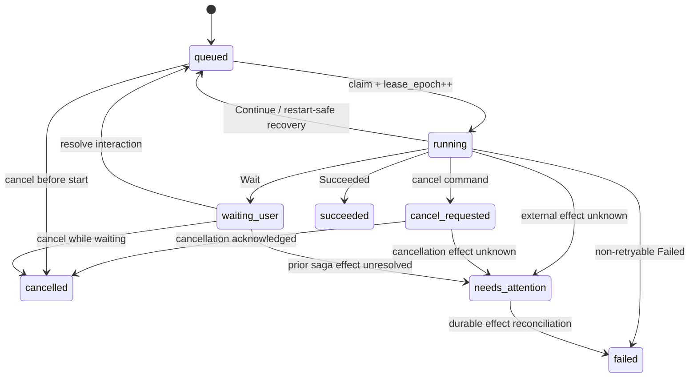

# Durable Runs and Runtimes

Ambient Agent uses a workspace-local SQLite Run Store as the source of truth for background work. Browser connections submit commands and subscribe to events; disconnecting a browser does not delete a Run.

Capability, MCP, remote-Agent, and chat `internal_agent` workflows are all scheduled by `RunCoordinator`. `/ws/chat` only persists messages, submits Runs, resolves interactions, and projects events; it owns no execution coroutine.

## 1. Persistent state model

Runs, step attempts, interactions, and events live in `workspace/.ambient/runs.db`.

`AgentRunState` is the reducer's JSON checkpoint. It carries:

- `workflow_type`, `workflow_version`, `phase`, and `attempt`;
- `session_id`, structured `intent`, and model snapshots;
- `RunBudget` limits and counters for model turns, wall time, tokens, and cost;
- artifact references, workflow-private `data`, a pending interaction, a context-summary reference, and the last error.

Each durable reducer invocation advances one step and returns one `StepOutcome`:

| Outcome | Run result |
| --- | --- |
| `Continue(next_phase)` | Checkpoint and requeue |
| `Wait(interaction definition)` | Create the interaction inside the step transaction, then enter `waiting_user` |
| `Succeeded` | Persist result/artifacts and enter `succeeded` |
| `Failed(retryable)` | Requeue when retryable; otherwise enter `failed` |
| `Failed(effect_state="unknown")` | Enter `needs_attention` instead of claiming a safe failure |
| `Cancelled` | Enter `cancelled`; an unknown effect also enters `needs_attention` |

`commit_step()` stores the step attempt, latest state, checkpoint, Run status, interaction, and reducer event outbox in one SQLite transaction. Compatibility WebSocket projection happens only after commit, so a stale lease cannot leave a ghost approval or late event. Successful checkpoints use the uniform terminal phase `done`; `step_key` still records the concrete final phase.

The default total budget is eight model turns, 300 seconds of active wall time, 64,000 tokens, and USD 5. Usage is accumulated into the checkpoint after every model response, and exceeding any limit fails with `budget_exhausted`. Context keeps recent messages in stable order; messages outside the window become a deterministic extractive summary whose content and `sha256:` reference are persisted together. LLM audit rows also record prompt, tool-schema, and retrieved-artifact hashes.

## 2. State, claims, and recovery

Claiming a Run increments `lease_epoch`. Every durable step commit must match both `lease_owner` and `lease_epoch`. After cancellation, recovery, or a newer claim, a late callback receives `StaleLeaseError` and cannot publish state.

`RunCoordinator` heartbeats active leases and periodically recovers orphans:

- expired `restart_safe` work returns to `queued`;
- manual work with an uncertain external effect enters `needs_attention`;
- remote effects such as MCP tools and HTTP Agents cannot opt into `restart_safe` by manifest assertion alone; only read-only calls or adapters with enforceable idempotency/reconciliation protocols are auto-recoverable;
- graceful shutdown synchronously releases this worker's leases using the same policy; it does not run cancellation compensation or change live effects, because only a durably recorded `cancel_requested` command may compensate;
- `waiting_user` consumes no worker slot, while the interaction and Run remain durable.

Cancelling a queued or waiting Widget Run first persists a cleanup tombstone in state/checkpoint and makes the Run unclaimable. Only after that transaction commits does it idempotently delete the artifact through the constrained staging path, then clear the tombstone and finish in a second transaction. Startup recovers either crash window; an unconfirmed cleanup enters `needs_attention` and cannot bypass the tombstone through reconciliation. `needs_attention` cannot be rewritten to `cancelled` by another cancel command. An operator must issue a durable reconciliation command with `confirmed_not_committed`, `compensated`, or `confirmed_committed`. The first two make a later explicit retry safe; a confirmed committed effect remains retry-blocked to prevent duplication.

## 3. Session lanes and interactions

Runs with a `session_id` share a persistent FIFO lane. A later Run cannot be claimed while an earlier Run in that session is `running`, `waiting_user`, `cancel_requested`, or `needs_attention`. Runs from different sessions can execute concurrently.

Interaction resolution uses `run_version` for optimistic concurrency. The response, closure of sibling interactions, Run requeue, and events are committed together. Duplicate or stale responses produce a conflict rather than waking an unknown coroutine.

`internal_agent` Runs resolve to `queued`, allowing the scheduler to resume from the checkpoint. MCP tool/resource and Agent adapters use the same durable interaction semantics and do not depend on a WebSocket connection or global Future. Promise-compatible calls persist `projection_type + call_id` in Run `correlation`; resubmitting the same idempotency key returns the original Run rather than repeating the external action. When the canonical Run stream replays a correlated Run, the bundled frontend reads its durable terminal state and re-emits the response, so a backend restart cannot leave an already-submitted call's Promise permanently pending.

## 4. Versioned event stream

`/ws/runs?after_sequence=N` exposes replayable events. The bundled frontend uses `/ws/chat?projection=commands_only` for commands and derives chat projection from this canonical stream; the default `/ws/chat` projection remains only for legacy clients. Each event includes:

- a monotonically increasing `sequence` and unique `event_id`;
- `schema_version` and the database's current `stream_epoch`;
- `run_id`, plus optional `session_id`, `step_id`, `attempt`, and `trace_id`;
- `type`, JSON `payload`, and `created_at`;
- optional `duration_ms`, `model_usage`, and `redacted`, which marks a payload that was sanitized or truncated.

Clients track `(stream_epoch, sequence)` and deduplicate by `event_id`. A changed `stream_epoch` means the event store was rebuilt; the client must discard its old sequence cursor and rebuild the Run projection.

### 4.1 Core v1 event contract

Pydantic models in Python are the source of truth for the v1 event contract and generate the frontend TypeScript discriminated union. Core event `type` and `payload` pairs are:

| `type` | Minimum payload |
| --- | --- |
| `run_created` | `status` |
| `status_changed` | `from` and `to`; optionally `version` or `lease_epoch` |
| `step_started` | `step_key`, `attempt`, and `lease_epoch` |
| `step_committed` | `step_key`, `attempt`, `lease_epoch`, `run_version`, and `outcome` |
| `interaction_requested` | `interaction_id` and `type` |
| `interaction_resolved` | `interaction_id`, `run_version`, and `status` |

The v1 envelope requires `schema_version: 1`, a positive integer `sequence`, and non-empty `event_id`, `stream_epoch`, `run_id`, and `trace_id`. Core payloads preserve additional fields so non-breaking metadata can be added within the schema version.

The frontend must not discard an envelope merely because its `type` is unknown. Known events use a strongly typed union, while `UnknownRunEvent` carries `payload: unknown` through cursor, deduplication, and replay handling. `frontend/src/types/run-events.generated.ts` is generated only by `scripts/generate_run_event_types.py`; CI runs its `--check` mode to prevent drift between the Python contract and TypeScript types.

Before insertion, RunStore recursively replaces conventional secret/token/password keys and bounds oversized strings and collections, setting `redacted` when it changes content. Scheduler startup removes terminal-Run events older than `RUN_EVENT_RETENTION_DAYS`, which defaults to 30 days.

## 5. Adapters and APIs

- `internal_agent`: versioned reducer, claimed by the scheduler and committed with fencing.
- `mcp_tool`: executes through a managed MCP stdio client.
- `mcp_request`: executes allowlisted resource/prompt reads as Runs.
- `agent_message`: invokes an approved remote Agent endpoint.

`POST /api/graph/mutate` and WebSocket rollback also submit a v2 `graph_mutation` Run. Preflight, durable approval interaction, fenced atomic commit, and the effect ledger all remain inside the same control plane. The legacy synchronous response remains and now includes `run_id`.

Compatible public entry points remain:

- `POST /api/runs`, `GET /api/runs`, and `GET /api/runs/{id}`;
- `POST /api/runs/{id}/cancel` and `POST /api/runs/{id}/retry`;
- `POST /api/runs/{id}/reconcile`;
- `POST /api/run-interactions/{id}/resolve`;
- `GET /api/runtimes` and `POST /api/runtimes/{id}/stop`;
- `/ws/runs?after_sequence=N`.

The defaults are four concurrent Runs globally and one per owner, configured with `RUNNER_MAX_CONCURRENCY` and `RUNNER_MAX_PER_APP`. Session lanes are an additional constraint, not a replacement for owner limits.
