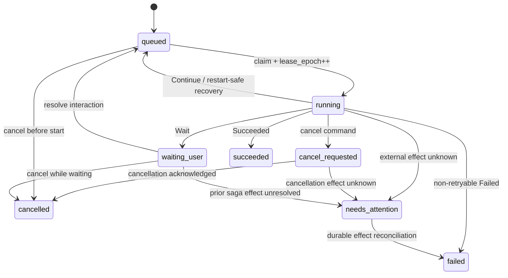

# Durable Runs and Runtimes

Ambient Agent uses a workspace-local SQLite Run Store as the source of truth for background work. Browser connections submit commands and subscribe to events; disconnecting a browser does not delete a Run.

Capability, MCP, remote-Agent, and chat `internal_agent` workflows are all scheduled by `RunCoordinator`. `/ws/chat` only persists messages, submits Runs, resolves interactions, and projects events; it owns no execution coroutine.

## 1. Persistent state model

Runs, step attempts, interactions, and events live in `workspace/.ambient/runs.db`.

`AgentRunState` is the reducer's JSON checkpoint. It carries:

- `workflow_type`, `workflow_version`, `phase`, and `attempt`;
- `session_id`, structured `intent`, and model snapshots;
- `RunBudget` limits and counters for model turns, wall time, tokens, and cost;
- artifact references, workflow-private `data`, a pending interaction, a context-summary reference, and the last error.

Each durable reducer invocation advances one step and returns one `StepOutcome`:

| Outcome | Run result |
| --- | --- |
| `Continue(next_phase)` | Checkpoint and requeue |
| `Wait(interaction definition)` | Create the interaction inside the step transaction, then enter `waiting_user` |
| `Succeeded` | Persist result/artifacts and enter `succeeded` |
| `Failed(retryable)` | Requeue when retryable; otherwise enter `failed` |
| `Failed(effect_state="unknown")` | Enter `needs_attention` instead of claiming a safe failure |
| `Cancelled` | Enter `cancelled`; an unknown effect also enters `needs_attention` |

`commit_step()` stores the step attempt, latest state, checkpoint, Run status, interaction, and reducer event outbox in one SQLite transaction. Compatibility WebSocket projection happens only after commit, so a stale lease cannot leave a ghost approval or late event. Successful checkpoints use the uniform terminal phase `done`; `step_key` still records the concrete final phase.

The default total budget is eight model turns, 300 seconds of active wall time, 64,000 tokens, and USD 5. Usage is accumulated into the checkpoint after every model response, and exceeding any limit fails with `budget_exhausted`. Context keeps recent messages in stable order; messages outside the window become a deterministic extractive summary whose content and `sha256:` reference are persisted together. LLM audit rows also record prompt, tool-schema, and retrieved-artifact hashes.

An explicit retry creates a new Run attempt and resumes from the prior checkpoint. The new attempt resets active wall time and adds another same-sized allowance window while retaining cumulative model-turn, token, and cost usage. Auditing therefore keeps total usage across the retry chain without letting an exhausted ceiling from the old attempt make recovery fail immediately.

When a Widget fails before promotion—including a stalled Coding Agent validation-repair loop, `budget_exhausted`, verifier unavailability, and process errors—the workflow must retain `data.staged_app` and mark it as a non-executable failed draft. A Coding Agent adapter running with `promote=False` does not own failed-draft cleanup: every non-cancellation exception must return the constrained staging handle together with the original error, and the reducer persists both in the same step checkpoint. The failed draft remains in its hidden staging isolation directory; it is not listed as an App, added to the Canvas, or made available to the Widget runtime, and it cannot bypass verification during promotion. An explicit retry reuses an artifact that still exists: Coding Agent validation failures are repaired in place in the same staging directory with persisted finding history, `verify` resumes verification, `wait_override` returns to `verify` to produce a trustworthy fresh report, and a verified `promote` resumes atomic publication. Only a missing artifact returns to a fresh `stage_code`; the approved plan/schema are preserved while reports and overrides tied to the old artifact are cleared.

When a failed draft reaches a terminal state, the reducer also persists and projects a chat diagnostic containing at least the App ID, failed phase, stable error code, readable cause, and an explicit statement that the draft was not published. In the same chat, the user can enter `/repair <app-id> [feedback]` or an unambiguous natural-language repair/retry request that refers to the most recent failed draft. This creates a new Run attempt, adds the feedback to `code_feedback`, and resumes the retained staging checkpoint. It must not request authority again, create a second draft for the same App ID, or expose the failed artifact in App Center.

Failed drafts are retained for seven days by default, configurable through `FAILED_STAGING_RETENTION_SECONDS`. Startup cleanup removes only failed drafts older than that retention limit or ordinary orphan staging directories; staging referenced by an active Run is never reaped. Cancelling a Run or choosing rework abandons that draft and may delete it through the constrained staging handle. No failure or cleanup path may delete or overwrite the last published App.

After a Widget is published, the backend adds the App to the workspace Canvas `open_app_ids` and makes it the `active_app_id` before emitting the live `widget` projection. A disconnected or refreshed browser therefore does not depend on receiving a transient WebSocket event to recover the newly generated App.

## 2. State, claims, and recovery

```mermaid
stateDiagram-v2
    [*] --> queued
    queued --> running: claim + lease_epoch++
    running --> queued: Continue / restart-safe recovery
    running --> waiting_user: Wait
    waiting_user --> queued: resolve interaction
    running --> cancel_requested: cancel command
    cancel_requested --> cancelled: cancellation acknowledged
    running --> succeeded: Succeeded
    running --> failed: non-retryable Failed
    running --> needs_attention: external effect unknown
    cancel_requested --> needs_attention: cancellation effect unknown
    needs_attention --> failed: durable effect reconciliation
    queued --> cancelled: cancel before start
    waiting_user --> cancelled: cancel while waiting
    waiting_user --> needs_attention: prior saga effect unresolved
```

Claiming a Run increments `lease_epoch`. Every durable step commit must match both `lease_owner` and `lease_epoch`. After cancellation, recovery, or a newer claim, a late callback receives `StaleLeaseError` and cannot publish state.

`RunCoordinator` heartbeats active leases and periodically recovers orphans:

- expired `restart_safe` work returns to `queued`;
- manual work with an uncertain external effect enters `needs_attention`;
- remote effects such as MCP tools and HTTP Agents cannot opt into `restart_safe` by manifest assertion alone; only read-only calls or adapters with enforceable idempotency/reconciliation protocols are auto-recoverable;
- graceful shutdown sets a stop-scheduling flag before cancelling the scheduler,
  heartbeat, and active workers. Background loops exit even if a wake races task
  cancellation and lets one wait return; they cannot claim another Run. Startup
  cannot restart the scheduler until shutdown completes; the next complete
  lifespan resets the flag. It waits
  for every worker's cancellation cleanup to finish, and only then releases
  this worker's leases and closes downstream shared resources such as the
  Graph adapter; it does not run cancellation compensation or change live
  effects, because only a durably recorded `cancel_requested` command may
  compensate;
- `waiting_user` consumes no worker slot, while the interaction and Run remain durable.

Cancelling a queued or waiting Widget Run first persists a cleanup tombstone in state/checkpoint and makes the Run unclaimable. Only after that transaction commits does it idempotently delete the artifact through the constrained staging path, then clear the tombstone and finish in a second transaction. Startup recovers either crash window; an unconfirmed cleanup enters `needs_attention` and cannot bypass the tombstone through reconciliation. `needs_attention` cannot be rewritten to `cancelled` by another cancel command. An operator must issue a durable reconciliation command with `confirmed_not_committed`, `compensated`, or `confirmed_committed`. The first two make a later explicit retry safe; a confirmed committed effect remains retry-blocked to prevent duplication.

## 3. Session lanes and interactions

Runs with a `session_id` share a persistent FIFO lane. A later Run cannot be claimed while an earlier Run in that session is `running`, `waiting_user`, `cancel_requested`, or `needs_attention`. Runs from different sessions can execute concurrently.

Interaction resolution uses `run_version` for optimistic concurrency. The response, closure of sibling interactions, Run requeue, and events are committed together. Duplicate or stale responses produce a conflict rather than waking an unknown coroutine.

For a raw approval response that is not an object, the durable reducer approves only literal JSON boolean `true`. Strings such as `"false"` or `"true"`, numbers, and arrays cannot become approvals through truthiness. Structured objects continue to follow the interaction's declared `approved`/edit branch protocol.

`internal_agent` Runs resolve to `queued`, allowing the scheduler to resume from the checkpoint. MCP tool/resource and Agent adapters use the same durable interaction semantics and do not depend on a WebSocket connection or global Future. Promise-compatible calls persist `projection_type + call_id` in Run `correlation`; resubmitting the same idempotency key returns the original Run rather than repeating the external action. When the canonical Run stream replays a correlated Run, the bundled frontend reads its durable terminal state and re-emits the response, so a backend restart cannot leave an already-submitted call's Promise permanently pending.

## 4. Versioned event stream

`/ws/runs?after_sequence=N` exposes replayable events. The bundled frontend uses `/ws/chat?projection=commands_only` for commands and derives chat projection from this canonical stream; the default `/ws/chat` projection remains only for legacy clients. Each event includes:

- a monotonically increasing `sequence` and unique `event_id`;
- `schema_version` and the database's current `stream_epoch`;
- `run_id`, plus optional `session_id`, `step_id`, `attempt`, and `trace_id`;
- `type`, JSON `payload`, and `created_at`;
- optional `duration_ms`, `model_usage`, and `redacted`, which marks a payload that was sanitized or truncated.

Clients track `(stream_epoch, sequence)` and deduplicate by `event_id`. A changed `stream_epoch` means the event store was rebuilt; the client must discard its old sequence cursor and rebuild the Run projection.

### 4.1 Core v1 event contract

Pydantic models in Python are the source of truth for the v1 event contract and generate the frontend TypeScript discriminated union. Core event `type` and `payload` pairs are:

| `type` | Minimum payload |
| --- | --- |
| `run_created` | `status` |
| `status_changed` | `from` and `to`; optionally `version` or `lease_epoch` |
| `step_started` | `step_key`, `attempt`, and `lease_epoch` |
| `step_committed` | `step_key`, `attempt`, `lease_epoch`, `run_version`, and `outcome` |
| `interaction_requested` | `interaction_id` and `type` |
| `interaction_resolved` | `interaction_id`, `run_version`, and `status` |

The v1 envelope requires `schema_version: 1`, a positive integer `sequence`, and non-empty `event_id`, `stream_epoch`, `run_id`, and `trace_id`. Core payloads preserve additional fields so non-breaking metadata can be added within the schema version.

The frontend must not discard an envelope merely because its `type` is unknown. Known events use a strongly typed union, while `UnknownRunEvent` carries `payload: unknown` through cursor, deduplication, and replay handling. `frontend/src/types/run-events.generated.ts` is generated only by `scripts/generate_run_event_types.py`; CI runs its `--check` mode to prevent drift between the Python contract and TypeScript types.

Before insertion, RunStore recursively replaces conventional secret/token/password keys and bounds oversized strings and collections, setting `redacted` when it changes content. Scheduler startup removes terminal-Run events older than `RUN_EVENT_RETENTION_DAYS`, which defaults to 30 days.

## 5. Adapters and APIs

### Conditional compensation

`permission.approved` accepts only JSON boolean `true`; strings or numbers cannot grant permission. A failed permission write leaves an unclaimable `queued` Run with its grant intent and a sanitized error. The scheduler retries every five seconds, and startup recovery is idempotent. A durable approved grant is separate from subsequently cancelling execution; cancellation does not revoke an already approved permission.

Cancellation of a schema-commit or App-promotion thread cannot prove that its external effect has stopped. Retain staging/checkpoint and effect-in-flight evidence and enter `needs_attention`; do not delete an artifact that may still be publishing or roll back its approved schema.

Permission resolution first validates the pending interaction, waiting-user Run, and expected Run version in one SQLite transaction, then records a valid approval in a durable permission-grant outbox. The grant intent and interaction-resolved event commit together. A queued Run cannot be claimed until the grant is persisted and the outbox entry is complete; completion wakes the scheduler. Stale, cancelled, or duplicate resolutions have no grant side effect, and denial records no grant. Coordinator recovery idempotently persists pending intents left by a crash; failures retain the intent and a redacted error for retry. Grant identities come from the original interaction's App/command identity, never a replacement supplied in the response.

Each atomic graph-saga effect records the committed state of its touched nodes and edges as `compensation_guard`, checkpointed with its reverse actions. Compensation checks the guard and applies every reverse action in one write transaction. If another task changed any resource, the entire compensation batch makes no writes; the Run retains its evidence and enters `needs_attention` for reconciliation. Concurrent commits to different fields are preserved instead of overwritten by a full old node snapshot. Replaying an already committed compensation returns its idempotent result without changing later writes. Legacy checkpoints without guards cannot be compensated automatically.

The Widget-publication schema effect ledger retains both before and after snapshots. When file publication fails, restoration is allowed only while the current schemas still match this effect's after-state and a newly created entity is unused by records or other schemas. Concurrent schema growth or use of a new entity causes a conditional rollback conflict; both tasks' committed data remains available and the Run enters `needs_attention`. A Neo4j transaction write lock, excluded from KG queries, coordinates checking and updating; SQLite provides the same atomic check through `BEGIN IMMEDIATE`.

- `internal_agent`: versioned reducer, claimed by the scheduler and committed with fencing.
- `mcp_tool`: executes through a managed MCP stdio client.
- `mcp_request`: executes allowlisted resource/prompt reads as Runs.
- `agent_message`: invokes an approved remote Agent endpoint.

App-scoped Graph mutation and rollback both submit a v2 `graph_mutation` Run. Widget-grant authorization, preflight, durable approval interaction, fenced atomic commit, and the effect ledger remain inside one control plane. Widgets have no generic mutation endpoint that bypasses grants.

Compatible public entry points remain:

- `POST /api/runs`, `GET /api/runs`, and `GET /api/runs/{id}`;
- `POST /api/runs/{id}/cancel` and `POST /api/runs/{id}/retry`;
- `POST /api/runs/{id}/reconcile`;
- `POST /api/run-interactions/{id}/resolve`;
- `GET /api/runtimes` and `POST /api/runtimes/{id}/stop`;
- `/ws/runs?after_sequence=N`.

By default, `GET /api/runs` preserves the compatible full Run-row response
(without event/step/interaction details); `include_details=true` adds those
details. The Task Center uses the mutually exclusive `summary_only=true` view,
whose SQL reads only identity, status, progress, summary, and timestamp fields
needed by the list. It does not read or decode large input/result/state/checkpoint
JSON values. Supplying `summary_only` together with `include_details` returns
422. A dedicated `created_at` index supports newest-first listing, the frontend
coalesces Run-event bursts into one summary refresh, and Runtime snapshots are
loaded only while their tab is open.

When no environment variable is provided, the code falls back to four
concurrent Runs globally and one per owner, configured with
`RUNNER_MAX_CONCURRENCY` and `RUNNER_MAX_PER_APP`. The 8 GB-oriented
`.env.example` and production Docker Compose explicitly set the global limit to
one; increasing it requires revalidating the Backend memory budget and Coding
Agent child-process load. Session lanes are an additional constraint, not a
replacement for owner limits.
