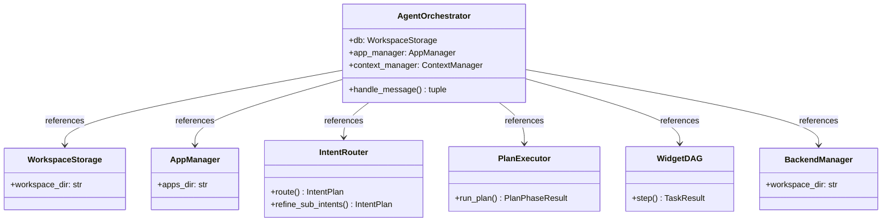
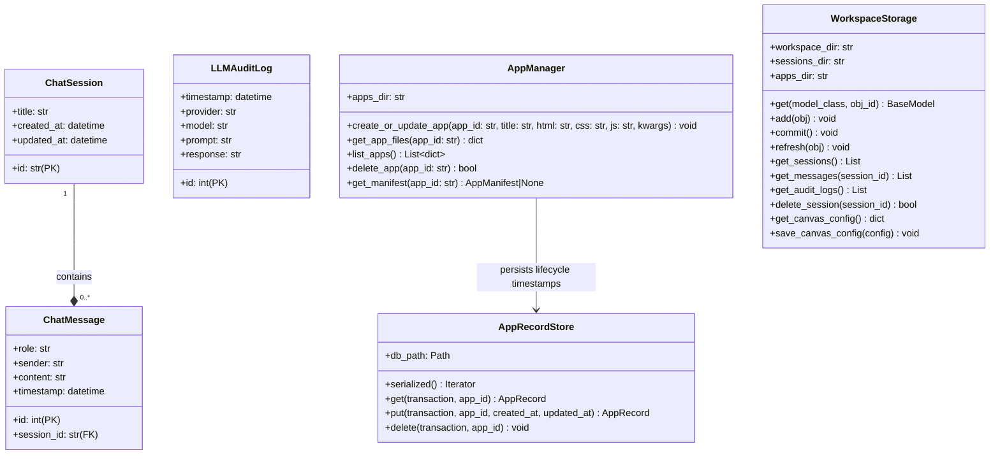
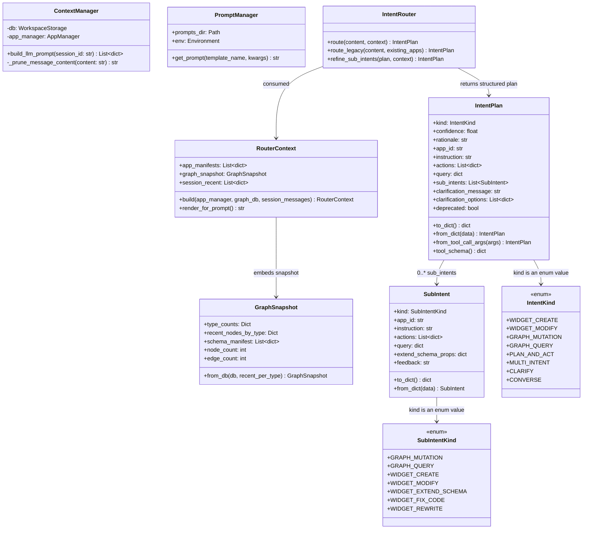
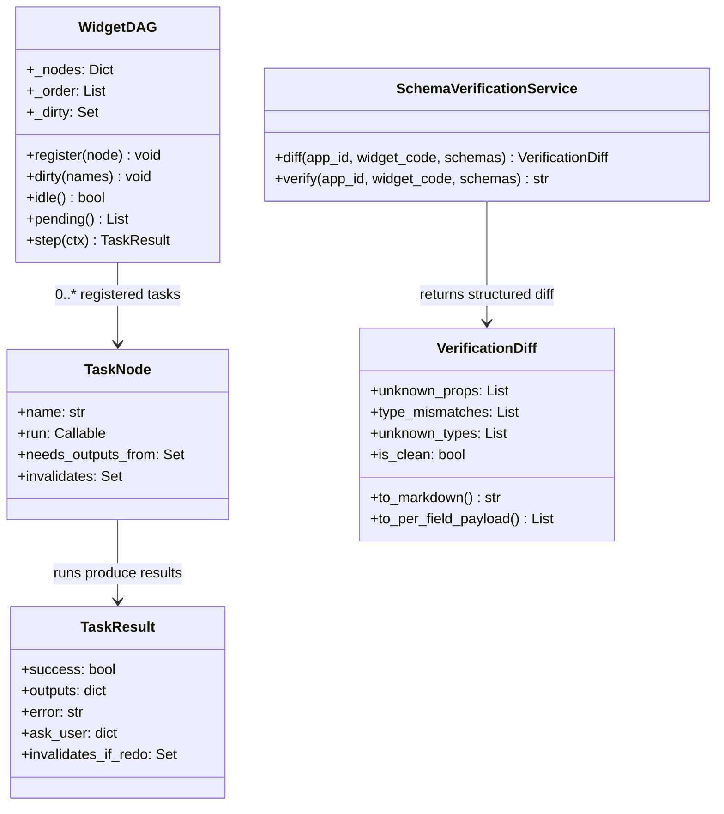
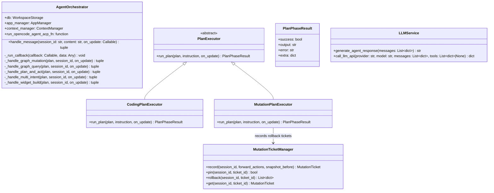
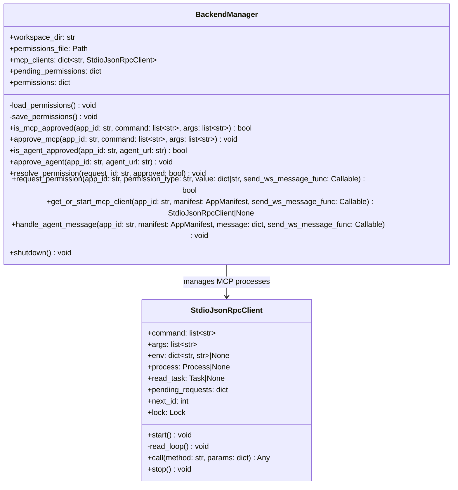

# Backend Class Diagram & Architecture

The backend of Ambient Agent is built on FastAPI + SQLModel (SQLite), supporting multi-client WebSocket synchronization, dynamic widget execution sandboxing, and LLM query audits.

## 1. Class Diagram

## 1. Backend Class Diagrams (Summary-Detail Structure)

To improve readability on web views, the comprehensive class diagram has been split into a high-level system relationship diagram and 5 focused modular class diagrams.

### 1.1 Macro Class Diagram (Summary)

Shows the macro dependencies and relationships between all core backend services and managers:

### 1.2 Storage & Session Module (Detail - Storage & Session)

Manages multi-client chat sessions, persistent Widget App source code storage, and SQLite graph CRUD operations:

### 1.3 Intent Routing & Context Module (Detail - Intent Routing & Context)

Handles LLM prompt compilation/pruning, user message intent classification, and function routing:

### 1.4 Widget DAG & Schema Verification Module (Detail - Widget DAG & Verification)

Drives the Widget lifecycle compilation process using a Directed Acyclic Graph (DAG) runtime, and verifies code data schemas:

### 1.5 Execution & Orchestration Module (Detail - Execution & Orchestration)

Coordinates overall orchestration, schedules plan execution, registers database mutation rollback tickets, and integrates LLM clients:

### 1.6 External Integration & MCP Module (Detail - MCP & Integration)

Launches, caches, and routes JSON-RPC 2.0 requests to local Model Context Protocol (MCP) CLI processes:

## 2. Core Modules Description

### 2.1 Database Entity Layer (`models.py`)
*   **ChatSession**: Manages chat sessions across multiple devices.
*   **ChatMessage**: Stores dialog history supporting multiple sender roles (`user`, `agent`, `code`, `system`).
*   **LLMAuditLog**: Records raw payloads and responses exchanged with LLM providers for the audit log dashboard.

### 2.2 Service & Control Logic
*   **AppManager**: Coordinates dynamically compiled widget files (index.html, style.css, controller.js) in the local filesystem.
*   **ContextManager**: Prunes redundant message content and injects active widget source codes as prompts.
*   **AgentParser**: Extracts `<ambient-widget>` XML blocks from LLM stream responses using regex.
*   **IntentRouter**: Evaluates user prompts to output a structured `IntentPlan` indicating intended system actions.
*   **WidgetDAG**: Coordinates widget build cycles utilizing collapsible, linear task nodes with target invalidations.
