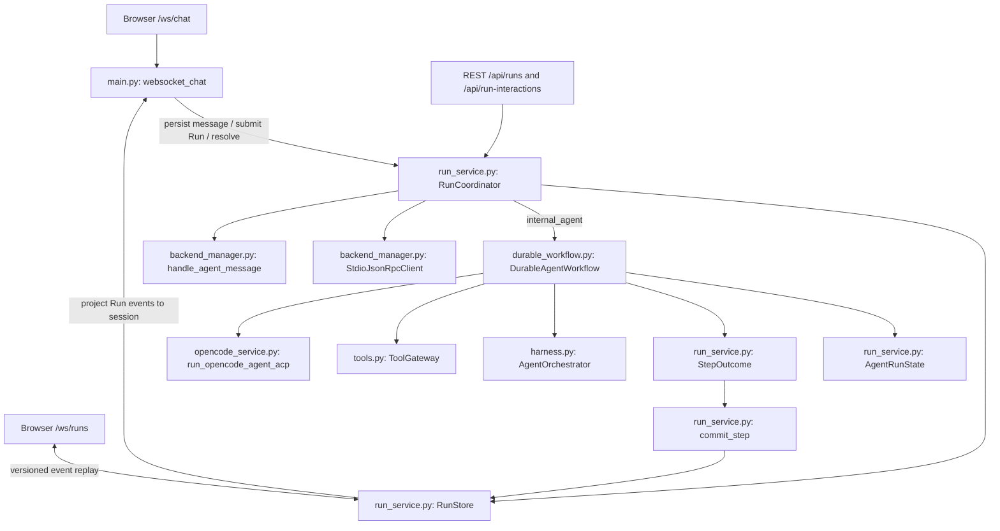
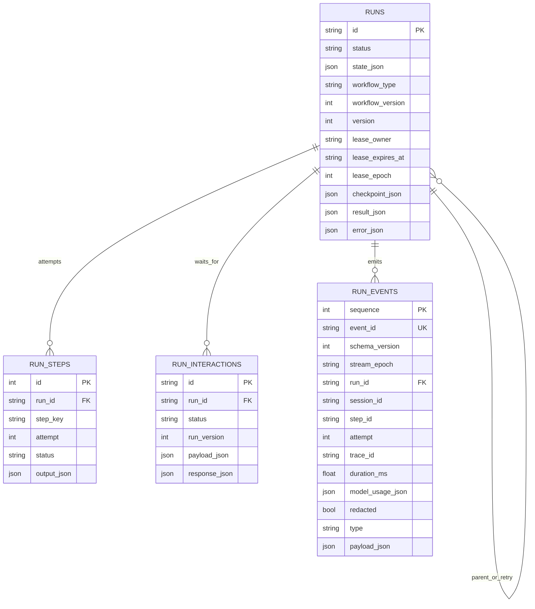
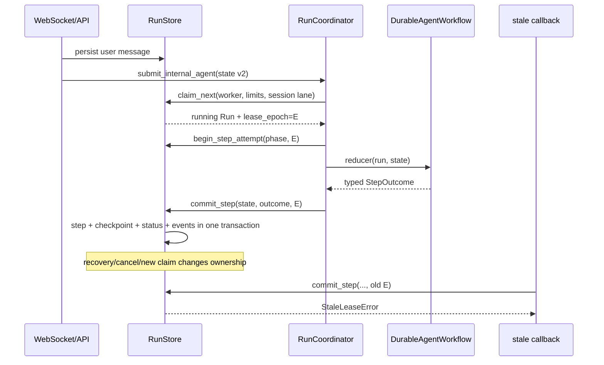
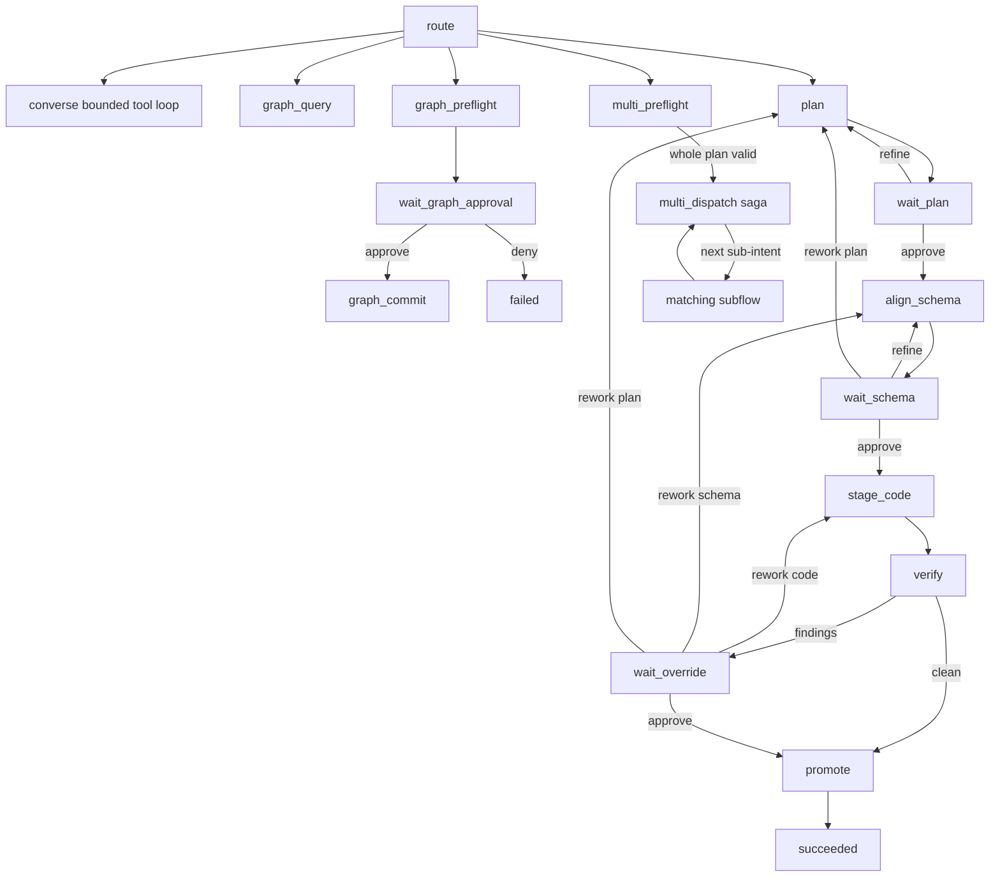
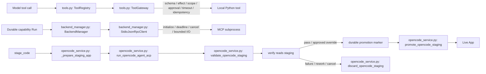
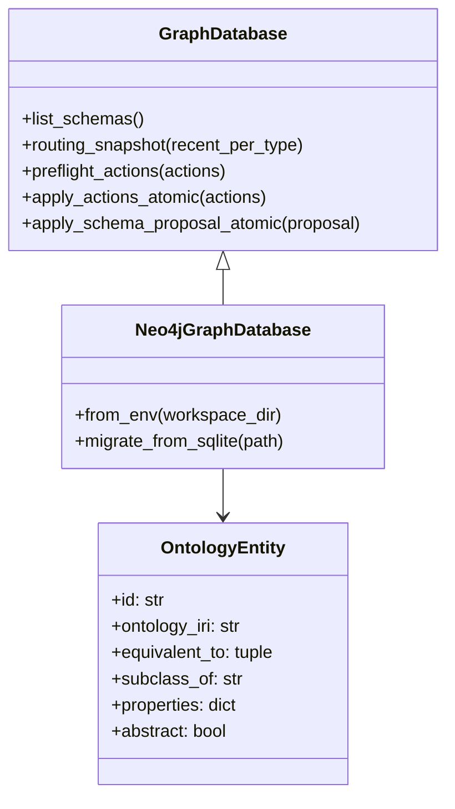
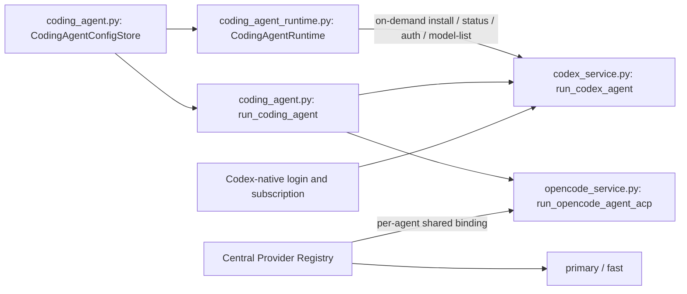

# Backend Runtime UML

This page documents scheduler-owned chat, the durable reducer, and unified side-effect execution boundaries. Python references in flowcharts are checked by `scripts/verify_uml.py`.

## 1. One control plane

The WebSocket creates only lightweight submission/response-projection bridges; it does not execute agent, MCP, or remote-Agent effects in the connection task. The reducer reuses `AgentOrchestrator` as a domain helper, while `RunCoordinator` owns execution. Browser disconnection does not change authoritative Run state.

## 2. Persistent data model

## 3. Claim, execution, and fencing

A later same-session Run cannot be claimed while an earlier one is `running`, `waiting_user`, `cancel_requested`, or `needs_attention`. `waiting_user` releases a worker slot but retains the session lane.

## 4. Version 2 workflow states

Every wait phase persists its interaction before returning `Wait`. Resolution checks `expected_run_version` and atomically stores the response, closes sibling pending interactions, requeues the Run, and appends events.

## 5. Tool, MCP, and OpenCode boundaries

`ToolGateway` currently unifies model-requested local Python tools. Capability, MCP, remote-Agent, and ACP execution retain separate adapter/permission policies. OpenCode now has path, argv, environment, output, process-group, and staging controls, but not an OS-level filesystem/network sandbox.

The backend image must include both Node.js and the `@babel/standalone` version pinned by the frontend lockfile. `validate_opencode_staging` applies Babel parsing, host/network-global rejection, and a restricted-VM smoke test to the staging shared by OpenCode and Codex. A missing or failed verifier must never be promoted to a live App.

## 6. Event and recovery boundaries

Run event payloads are redacted and bounded before insertion, while the envelope records duration, model usage, and `redacted` metadata; terminal events are retained for 30 days by default. A Graph effect ledger closes the checkpoint window against duplicate writes, and an App promotion marker distinguishes published artifacts from staging awaiting publication. Only saga steps with complete compensation data are rolled back automatically.

## 7. Canonical ontology and KG storage boundary

`create_graph_database()` is the runtime factory: deployments select Neo4j, while the SQLite `GraphDatabase` remains a test and migration compatibility adapter. Both adapters enforce the same `ambient-context` ontology contract; unknown entities, abstract entities, and unknown properties cannot be written as records.

## 8. Coding Agent Runtime and model ownership

Built-in adapters form a trusted capability catalog, while each CLI is downloaded to a dedicated persistent volume only after the user requests installation. Installation, authentication, dynamic model discovery, and execution share an agent-specific state directory; Ambient Provider credentials never enter a native-mode Codex process. The Codex model catalog comes from app-server `model/list` rather than an Ambient-maintained hard-coded list. Provider connections remain centralized, but consumer model roles are bound independently: Ambient uses `primary/fast`, OpenCode uses an inherited or dedicated `shared_binding`, and Codex uses a `native` binding. Submission snapshots the agent, its model configuration, and any resolved shared model so recovery cannot drift after later settings changes.

Docker's default seccomp profile blocks the unprivileged user namespace required by Codex bubblewrap. Compose relaxes that syscall layer so Codex can keep its `workspace-write` sandbox inside the outer container boundary; it does not use `SYS_ADMIN` or `danger-full-access`.
