# Backend Runtime UML

This page documents scheduler-owned chat, the durable reducer, and unified side-effect execution boundaries. Python references in flowcharts are checked by `scripts/verify_uml.py`.

Manifest V2 optionally stores an `app_spec` with versioned purpose types and author-declared functionality. AppManager validates creation and property updates; AppStoreService projects declarations and the shared vocabulary. These are product metadata, separate from the context ontology and authorization. See [App Types and Features](/en/architecture/app-types.md).

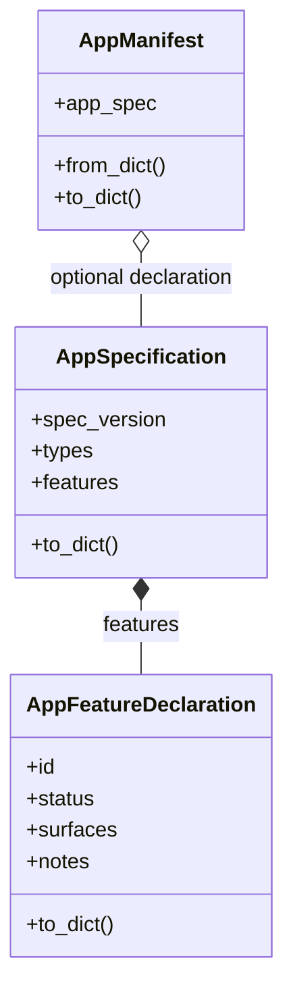
```mermaid
classDiagram
    class AppManifest {
        +app_spec
        +from_dict()
        +to_dict()
    }
    class AppSpecification {
        +spec_version
        +types
        +features
        +to_dict()
    }
    class AppFeatureDeclaration {
        +id
        +status
        +surfaces
        +notes
        +to_dict()
    }
    AppManifest o-- AppSpecification : optional declaration
    AppSpecification *-- AppFeatureDeclaration : features
```

## 1. One control plane

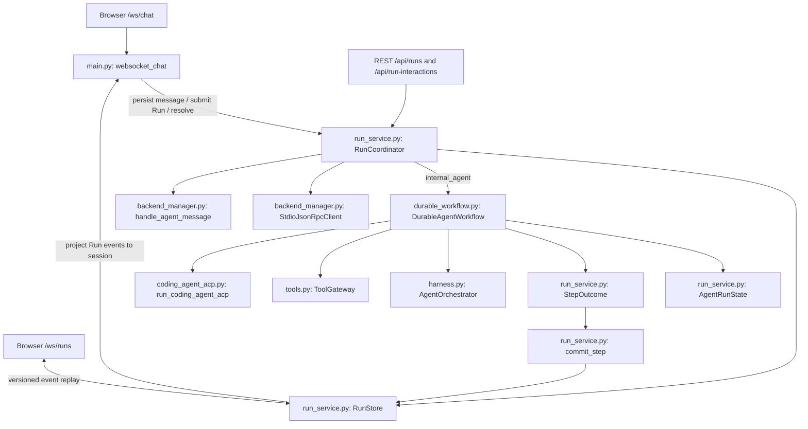
```mermaid
flowchart TB
    Chat[Browser /ws/chat] --> Main[main.py: websocket_chat]
    RunAPI[REST /api/runs and /api/run-interactions] --> Coordinator[run_service.py: RunCoordinator]
    RunWS[Browser /ws/runs] <-->|versioned event replay| Store[run_service.py: RunStore]

    Main -->|persist message / submit Run / resolve| Coordinator
    Coordinator --> Store
    Coordinator -->|internal_agent| Workflow[durable_workflow.py: DurableAgentWorkflow]
    Workflow --> State[run_service.py: AgentRunState]
    Workflow --> Outcome[run_service.py: StepOutcome]
    Outcome --> Commit[run_service.py: commit_step]
    Commit --> Store

    Workflow --> Domain[harness.py: AgentOrchestrator]
    Workflow --> Tools[tools.py: ToolGateway]
    Workflow --> ACP[coding_agent_acp.py: run_coding_agent_acp]
    Coordinator --> MCP[backend_manager.py: StdioJsonRpcClient]
    Coordinator --> Remote[backend_manager.py: handle_agent_message]

    Store -->|project Run events to session| Main
```

The WebSocket creates only lightweight submission/response-projection bridges; it does not execute agent, MCP, or remote-Agent effects in the connection task. The reducer reuses `AgentOrchestrator` as a domain helper, while `RunCoordinator` owns execution. Browser disconnection does not change authoritative Run state.

`RunCoordinator.shutdown()` closes scheduling before cancelling background tasks; a wake/cancellation race cannot leave the scheduler looping or claiming Runs. The stop boundary lasts until every worker finishes cleanup and its lease is released, without abandoning cleanup on timeout. The next lifespan can restart scheduling after that boundary completes.

`RunStore` persists a permission-grant intent in the same transaction that accepts a valid approval;
unfinished intents prevent scheduler claims. `RunCoordinator` applies grants idempotently and completes
the intent, recovering interrupted grants on startup. Stale or cancelled approvals have no grant effect.
Graph compensation requires matching post-effect state, and schema rollback validates the effect ledger;
conflicts require reconciliation and preserve concurrent commits.

## 2. Persistent data model

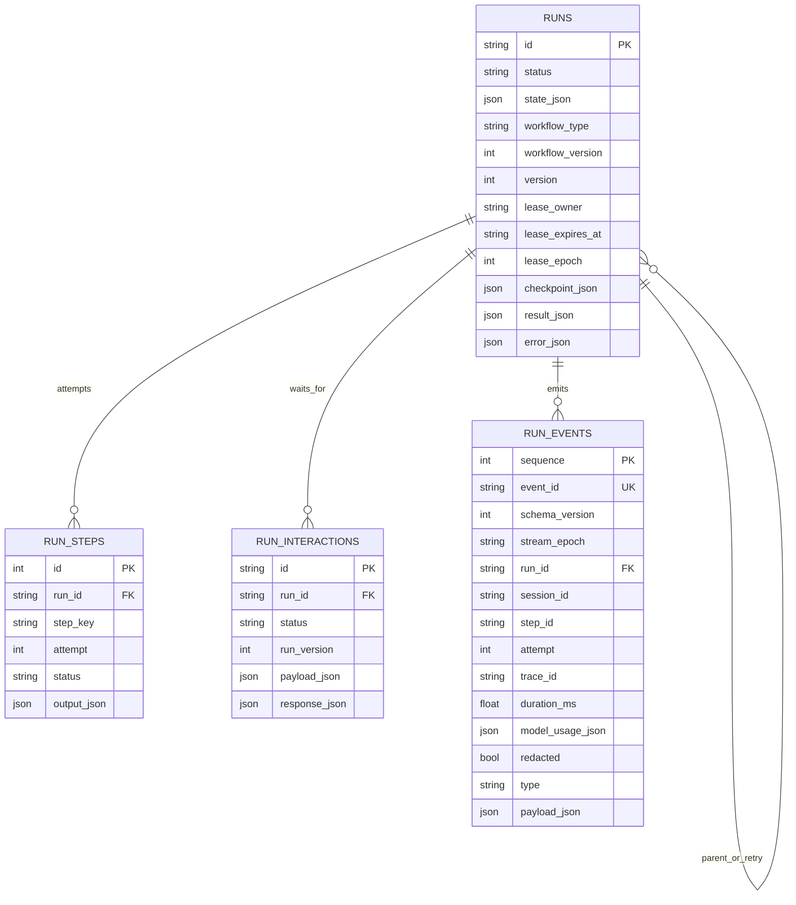
```mermaid
erDiagram
    RUNS ||--o{ RUN_STEPS : attempts
    RUNS ||--o{ RUN_INTERACTIONS : waits_for
    RUNS ||--o{ RUN_EVENTS : emits
    RUNS ||--o{ RUNS : parent_or_retry

    RUNS {
        string id PK
        string status
        json state_json
        string workflow_type
        int workflow_version
        int version
        string lease_owner
        string lease_expires_at
        int lease_epoch
        json checkpoint_json
        json result_json
        json error_json
    }
    RUN_STEPS {
        int id PK
        string run_id FK
        string step_key
        int attempt
        string status
        json output_json
    }
    RUN_INTERACTIONS {
        string id PK
        string run_id FK
        string status
        int run_version
        json payload_json
        json response_json
    }
    RUN_EVENTS {
        int sequence PK
        string event_id UK
        int schema_version
        string stream_epoch
        string run_id FK
        string session_id
        string step_id
        int attempt
        string trace_id
        float duration_ms
        json model_usage_json
        bool redacted
        string type
        json payload_json
    }
```

## 3. Claim, execution, and fencing

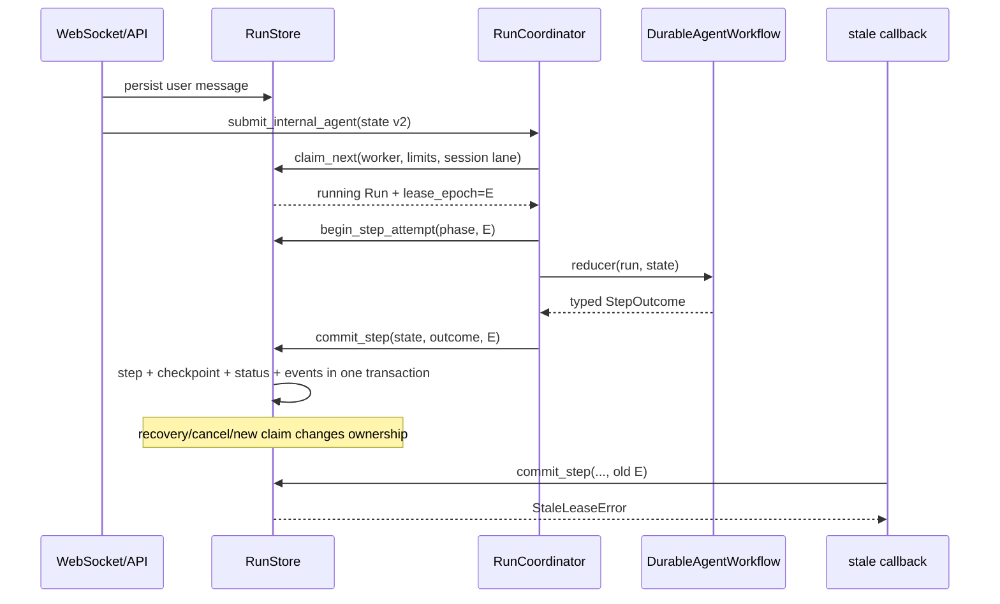
```mermaid
sequenceDiagram
    participant WS as WebSocket/API
    participant S as RunStore
    participant C as RunCoordinator
    participant W as DurableAgentWorkflow
    participant X as stale callback

    WS->>S: persist user message
    WS->>C: submit_internal_agent(state v2)
    C->>S: claim_next(worker, limits, session lane)
    S-->>C: running Run + lease_epoch=E
    C->>S: begin_step_attempt(phase, E)
    C->>W: reducer(run, state)
    W-->>C: typed StepOutcome
    C->>S: commit_step(state, outcome, E)
    S->>S: step + checkpoint + status + events in one transaction

    Note over S: recovery/cancel/new claim changes ownership
    X->>S: commit_step(..., old E)
    S-->>X: StaleLeaseError
```

A later same-session Run cannot be claimed while an earlier one is `running`, `waiting_user`, `cancel_requested`, or `needs_attention`. `waiting_user` releases a worker slot but retains the session lane.

## 4. Version 2 workflow states

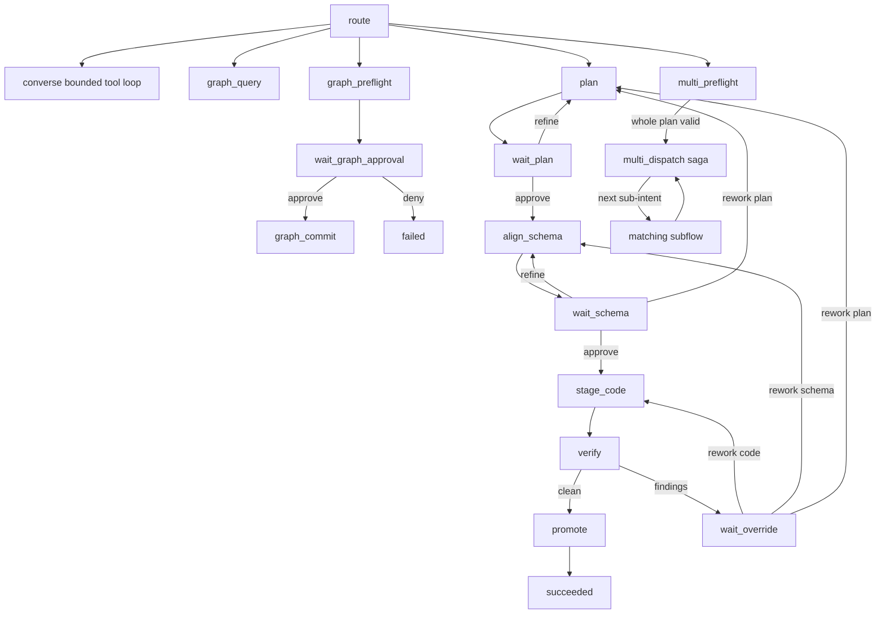
```mermaid
flowchart TB
    Route[route] --> Converse[converse bounded tool loop]
    Route --> Query[graph_query]
    Route --> GPre[graph_preflight]
    GPre --> GWait[wait_graph_approval]
    GWait -->|approve| GCommit[graph_commit]
    GWait -->|deny| Failed[failed]

    Route --> Plan[plan]
    Plan --> WPlan[wait_plan]
    WPlan -->|approve| Align[align_schema]
    WPlan -->|refine| Plan
    Align --> WSchema[wait_schema]
    WSchema -->|approve| Stage[stage_code]
    WSchema -->|refine| Align
    WSchema -->|rework plan| Plan
    Stage --> Verify[verify]
    Verify -->|clean| Promote[promote]
    Verify -->|findings| Override[wait_override]
    Override -->|rework code| Stage
    Override -->|rework schema| Align
    Override -->|rework plan| Plan
    Promote --> Success[succeeded]

    Route --> Multi[multi_preflight]
    Multi -->|whole plan valid| Saga[multi_dispatch saga]
    Saga -->|next sub-intent| RouteSub[matching subflow]
    RouteSub --> Saga
```

Every wait phase persists its interaction before returning `Wait`. Resolution checks `expected_run_version` and atomically stores the response, closes sibling pending interactions, requeues the Run, and appends events.

## 5. Tool, MCP, and Coding Agent ACP boundaries

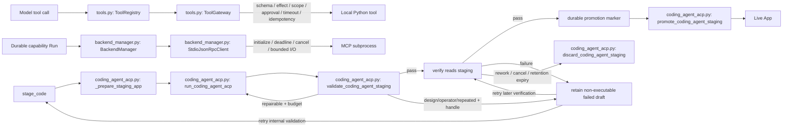
```mermaid
flowchart LR
    Model[Model tool call] --> Registry[tools.py: ToolRegistry]
    Registry --> Gateway[tools.py: ToolGateway]
    Gateway -->|schema / effect / scope / approval / timeout / idempotency| LocalTool[Local Python tool]

    Run[Durable capability Run] --> Backend[backend_manager.py: BackendManager]
    Backend --> MCP[backend_manager.py: StdioJsonRpcClient]
    MCP -->|initialize / deadline / cancel / bounded I/O| Process[MCP subprocess]

    Stage[stage_code] --> Prepare[coding_agent_acp.py: _prepare_staging_app]
    Prepare --> ACP[coding_agent_acp.py: run_coding_agent_acp]
    ACP --> Validate[coding_agent_acp.py: validate_coding_agent_staging]
    Validate -->|repairable + budget| ACP
    Validate -->|pass| Verify[verify reads staging]
    Validate -->|design/operator/repeated + handle| Retain[retain non-executable failed draft]
    Verify -->|pass| Marker[durable promotion marker]
    Marker --> Promote[coding_agent_acp.py: promote_coding_agent_staging]
    Verify -->|failure| Retain
    Retain -->|retry internal validation| Stage
    Retain -->|retry later verification| Verify
    Verify -->|rework / cancel / retention expiry| Discard[coding_agent_acp.py: discard_coding_agent_staging]
    Promote --> Live[Live App]
```

`ToolGateway` currently unifies model-requested local Python tools. Capability, MCP, remote-Agent, and ACP execution retain separate adapter/permission policies. Every Coding Agent runs through the same ACP client, session, file/terminal permissions, output bounds, process group, staging, verification, and repair state machine. These controls are not an OS-level filesystem/network sandbox.

The backend image must include both Node.js and the `@babel/standalone` version pinned by the frontend lockfile. `validate_coding_agent_staging` applies Babel parsing, host/network-global rejection, and a restricted-VM smoke test to staging shared by every Coding Agent. A missing or failed verifier must never be promoted to a live App.

### 5.1 Widget isolation runtime

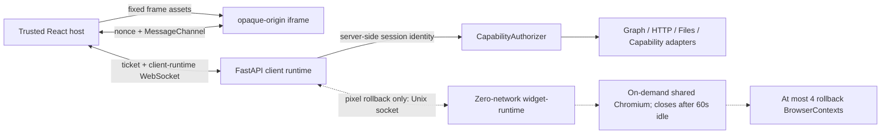
```mermaid
flowchart LR
    Host[Trusted React host] -->|fixed frame assets| Frame[opaque-origin iframe]
    Host <-->|nonce + MessageChannel| Frame
    Host <-->|ticket + client-runtime WebSocket| Gateway[FastAPI client runtime]
    Gateway -->|server-side session identity| Authorizer[CapabilityAuthorizer]
    Authorizer --> Adapters[Graph / HTTP / Files / Capability adapters]
    Gateway <-.->|pixel rollback only: Unix socket| Supervisor[Zero-network widget-runtime]
    Supervisor -.-> Chromium["On-demand shared Chromium; closes after 60s idle"]
    Chromium -.-> Contexts[At most 4 rollback BrowserContexts]
```

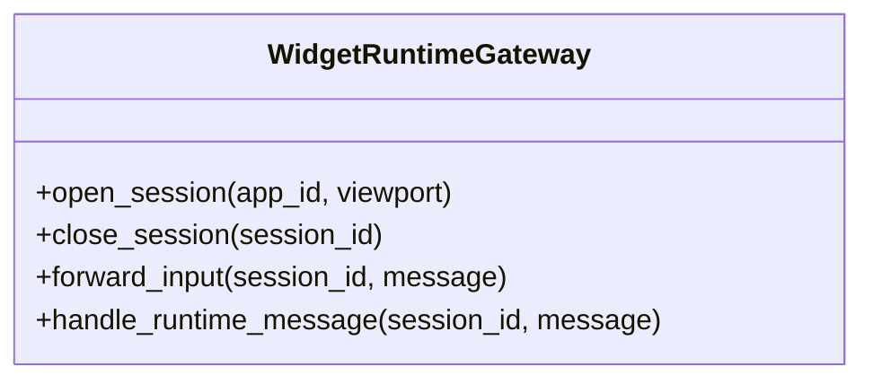
```mermaid
classDiagram
    class WidgetRuntimeGateway {
        +open_session(app_id, viewport)
        +close_session(session_id)
        +forward_input(session_id, message)
        +handle_runtime_message(session_id, message)
    }
```

On the default path, the ticket-authenticated client-runtime Gateway binds
`session_id -> app_id/revision/grants_digest/artifact_digest` in memory; all
Controller-supplied identity fields are ignored. The Controller executes only
inside the opaque-origin frame and sends RPC through the MessageChannel to the
trusted host and Backend authorizer. At steady state the Workspace retains at
most the Active and Warm Widgets, plus one temporary Suspending Widget during a
transition.

`WidgetRuntimeGateway`, the Unix socket, shared Chromium, and independent
BrowserContexts belong only to the explicit pixel rollback path. The Runtime
has no workspace mount and uses `network_mode: none`; Chromium starts on
demand, closes 60 seconds after the last session, and allows at most four
Contexts by default.

### 5.2 Skill Catalog discovery and authorization boundary

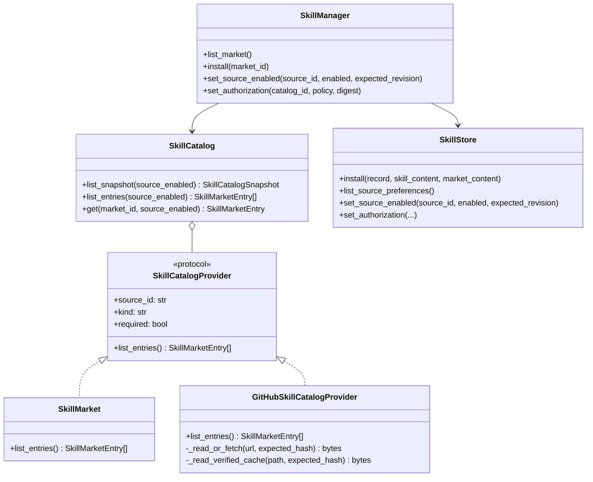
```mermaid
classDiagram
    class SkillCatalogProvider {
        <<protocol>>
        +source_id: str
        +kind: str
        +required: bool
        +list_entries() SkillMarketEntry[]
    }
    class SkillCatalog {
        +list_snapshot(source_enabled) SkillCatalogSnapshot
        +list_entries(source_enabled) SkillMarketEntry[]
        +get(market_id, source_enabled) SkillMarketEntry
    }
    class SkillMarket {
        +list_entries() SkillMarketEntry[]
    }
    class GitHubSkillCatalogProvider {
        +list_entries() SkillMarketEntry[]
        -_read_or_fetch(url, expected_hash) bytes
        -_read_verified_cache(path, expected_hash) bytes
    }
    class SkillManager {
        +list_market()
        +install(market_id)
        +set_source_enabled(source_id, enabled, expected_revision)
        +set_authorization(catalog_id, policy, digest)
    }
    class SkillStore {
        +install(record, skill_content, market_content)
        +list_source_preferences()
        +set_source_enabled(source_id, enabled, expected_revision)
        +set_authorization(...)
    }

    SkillCatalogProvider <|.. SkillMarket
    SkillCatalogProvider <|.. GitHubSkillCatalogProvider
    SkillCatalog o-- SkillCatalogProvider
    SkillManager --> SkillCatalog
    SkillManager --> SkillStore
```

A Provider owns discovery, immutable source pins, download, and
normalization only. The Catalog owns cross-source uniqueness, deterministic
ordering, and optional-source failure isolation. Manager and Store remain the
only installation and authorization control plane. A GitHub commit/hash,
registry badge, or upstream scan never creates Ambient trust. A remote
standalone Skill installs as `quarantined + disabled`, exactly like a local
external Skill, and reuses digest/revision-bound `agent.context.inject`.
`scripts/`, `references/`, `assets/`, and dependencies do not enter this
Runtime. A future executable extension must become a Capability, Plugin, or
Widget and pass its own sandbox, grant, approval, and audit path.

A source toggle is a workspace control-plane preference in `SkillStore`,
defaults to enabled, and shares the Skill-registry CAS revision. When disabled,
`SkillCatalog` does not invoke that Provider but keeps it in source status so
the UI can re-enable it. Installed snapshots and approvals do not change. The
toggle is neither Provider trust nor a Skill grant and never enters the
ontology/KG.

## 6. Event and recovery boundaries

Run event payloads are redacted and bounded before insertion, while the envelope records duration, model usage, and `redacted` metadata; terminal events are retained for 30 days by default. A Graph effect ledger closes the checkpoint window against duplicate writes, and an App promotion marker distinguishes published artifacts from staging awaiting publication. Only saga steps with complete compensation data are rolled back automatically.

## 7. Canonical ontology and KG storage boundary

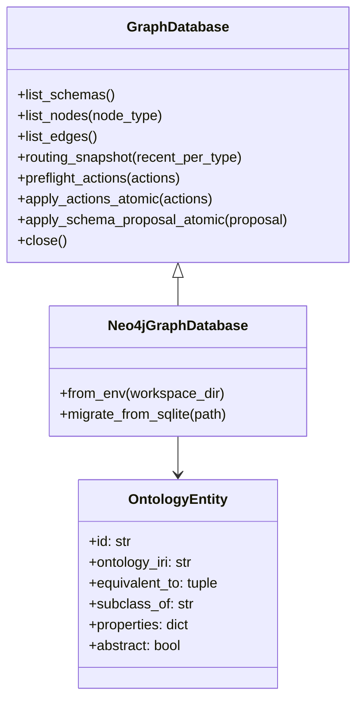
```mermaid
classDiagram
    class GraphDatabase {
        +list_schemas()
        +list_nodes(node_type)
        +list_edges()
        +routing_snapshot(recent_per_type)
        +preflight_actions(actions)
        +apply_actions_atomic(actions)
        +apply_schema_proposal_atomic(proposal)
        +close()
    }
    class Neo4jGraphDatabase {
        +from_env(workspace_dir)
        +migrate_from_sqlite(path)
    }
    class OntologyEntity {
        +id: str
        +ontology_iri: str
        +equivalent_to: tuple
        +subclass_of: str
        +properties: dict
        +abstract: bool
    }

    GraphDatabase <|-- Neo4jGraphDatabase
    Neo4jGraphDatabase --> OntologyEntity
```

`create_graph_database()` is a runtime factory called only by the composition root: deployments select Neo4j, while the SQLite `GraphDatabase` remains a test and migration compatibility adapter. The same created adapter is injected into Workflows, Agent routing, and tools; requests and reducer steps must not create a second Driver. Both adapters enforce the same `ambient-context` ontology contract and are explicitly `close()`d by the composition root during shutdown; unknown entities, abstract entities, and unknown properties cannot be written as records. A bounded trusted-Host graph snapshot is assembled only through `list_schemas()`, `list_nodes()`, and one `list_edges()` call; it cannot depend on a private SQLite connection or issue an N+1 relationship query per node.

## 8. Coding Agent Runtime and model ownership

```mermaid
flowchart LR
    Settings[coding_agent.py: CodingAgentConfigStore] --> Runtime[coding_agent_runtime.py: CodingAgentRuntime]
    Runtime -->|ACP launch descriptor| ACP[coding_agent_acp.py: run_coding_agent_acp]
    Settings --> Dispatch[coding_agent.py: run_coding_agent]
    Dispatch --> ACP
    Runtime --> OpenCode[OpenCode native ACP server]
    Runtime --> Bridge[@agentclientprotocol/codex-acp]
    Bridge --> AppServer[Codex app-server]

    Provider[Central Provider Registry] --> Ambient[primary / fast]
    Provider -->|per-agent shared binding| OpenCode
    Native[Codex-native login and subscription] --> AppServer
```

ACP is the only code-generation orchestration boundary. A built-in adapter declares only a trusted launch descriptor: ACP server command, underlying CLI, environment, model configuration, and version source. It cannot implement another prompt loop, permission model, or repair behavior. OpenCode starts native `opencode acp`. Codex uses the image-pinned `@agentclientprotocol/codex-acp`, points it at the Ambient-managed Codex CLI through `CODEX_PATH`, and that CLI starts the official app-server. A future non-native Agent must prefer an auditable, pinned, actively maintained bridge from the ACP Registry; the bridge only maps protocols while Ambient's ACP client owns permission and lifecycle behavior.

The system image supplies the OpenCode CLI. Codex is downloaded to a dedicated persistent volume only after the user requests installation. Codex installation, authentication, dynamic model discovery, and execution share an agent-specific state directory; Ambient Provider credentials never enter a native-mode Codex process. The Codex model catalog still comes from app-server `model/list` rather than an Ambient-maintained hard-coded list. Provider connections remain centralized, but consumer model roles are bound independently: Ambient uses `primary/fast`, OpenCode uses an inherited or dedicated `shared_binding`, and Codex uses a `native` binding. Submission snapshots the agent, its model configuration, and any resolved shared model so recovery cannot drift after later settings changes.

Docker's default seccomp profile blocks the unprivileged user namespace required by Codex bubblewrap. Compose relaxes that syscall layer so Codex can keep its `workspace-write` sandbox inside the outer container boundary; it does not use `SYS_ADMIN` or `danger-full-access`.

### 8.1 Native Codex primary-model transport (pending implementation)

This diagram defines a public subset before implementation. The currently API-only `LLMService` must select native transport by `ResolvedModel.api_mode`; see the [Provider contract](/en/integrations/llm-providers.md). The diagram does not claim deployment. Implementation must map and verify `NativeCodexTransport` in `verify_uml.py`, without weakening verification by omitting the class.

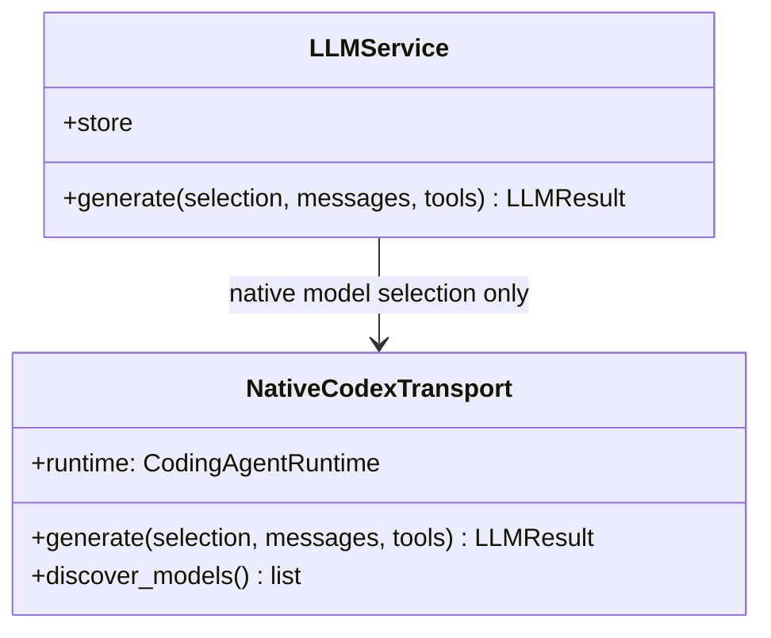
```mermaid
classDiagram
    class LLMService {
        +store
        +generate(selection, messages, tools) LLMResult
    }
    class NativeCodexTransport {
        +runtime: CodingAgentRuntime
        +generate(selection, messages, tools) LLMResult
        +discover_models() list
    }
    LLMService --> NativeCodexTransport : native model selection only
```

`runtime` reuses trusted commands and managed native login. `generate` accepts a `ResolvedModel` snapshot, complete history, and tool declarations, returning `LLMResult` without executing tools. `discover_models` reads actual app-server catalogs without proving entitlement. Ephemeral native inference permits only in-memory Plan and Plan-only CodeMode; effects still pass through Ambient tools, Capabilities, and Runs. Cancellation/timeouts await owned process-group closure and temporary-directory removal without implicit repair, fallback, or replay.

## Remote entry to the local workspace
The cloud entry manages accounts, nodes, and grants. The Connector connects outbound to the Gateway and checks the locally approved account, grant, scopes, and expiry for each request before forwarding bounded HTTP / WebSocket traffic to fixed loopback services. Revocation closes local forwarding and connections first. Runs, Apps, Graph, and Widgets still execute and store data in the local workspace.

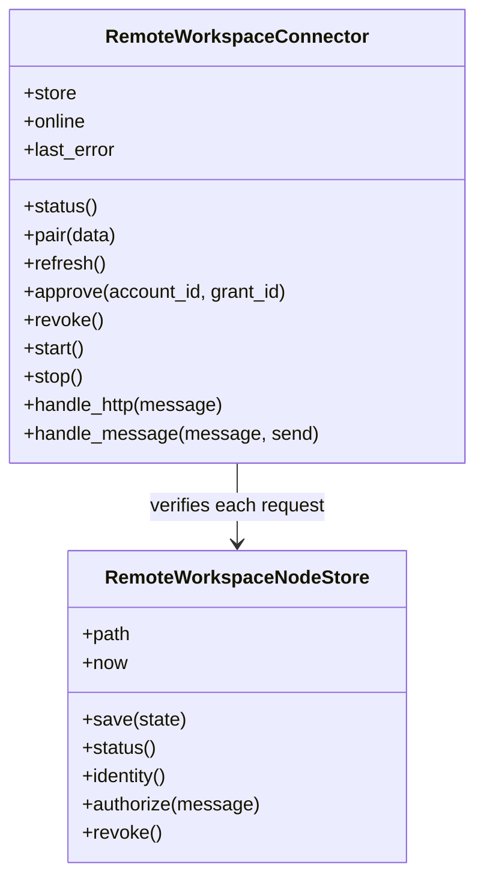
```mermaid
classDiagram
    class RemoteWorkspaceNodeStore {
        +path
        +now
        +save(state)
        +status()
        +identity()
        +authorize(message)
        +revoke()
    }
    class RemoteWorkspaceConnector {
        +store
        +online
        +last_error
        +status()
        +pair(data)
        +refresh()
        +approve(account_id, grant_id)
        +revoke()
        +start()
        +stop()
        +handle_http(message)
        +handle_message(message, send)
    }
    RemoteWorkspaceConnector --> RemoteWorkspaceNodeStore : verifies each request
```
